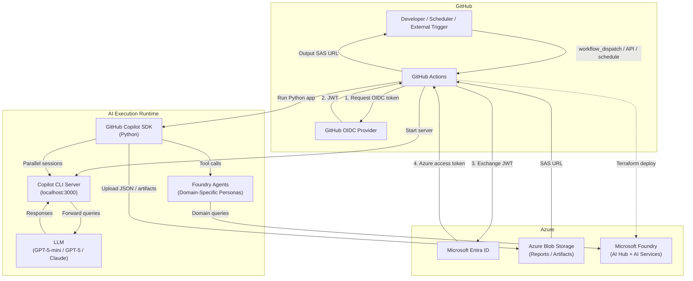

[](https://github.com/ks6088ts/template-github-copilot/actions/workflows/test.yaml?query=branch%3Amain)
[](https://github.com/ks6088ts/template-github-copilot/actions/workflows/docker.yaml?query=branch%3Amain)
[](https://github.com/ks6088ts/template-github-copilot/actions/workflows/infra.yaml?query=branch%3Amain)

# CopilotReportForge

**An extensible AI automation platform that transforms the GitHub Copilot SDK into a general-purpose engine for parallel LLM query execution, structured report generation, and agentic AI workflows — deployable across any industry and any use case.**

---

## What Is CopilotReportForge?

CopilotReportForge is a production-ready, open-source template that combines the **GitHub Copilot SDK**, **Azure AI Foundry**, and **GitHub Actions** into a single, composable platform for automating AI-driven tasks at scale. At its core, the platform:

1. **Executes multiple LLM queries in parallel** via `asyncio.gather`, collecting structured JSON results.
2. **Uploads artifacts to Azure Blob Storage** with time-limited SAS URLs for secure, auditable sharing.
3. **Integrates with Microsoft Foundry Agents** for agentic workflows — enabling domain-specific AI personas to reference external data sources (images, layouts, documents) and produce expert-level evaluations.
4. **Runs entirely within GitHub Actions** with passwordless OIDC authentication — no API keys, no GPU clusters, no custom inference infrastructure.

Infrastructure is fully codified in Terraform, covering Azure service principal creation, GitHub secrets registration, and Microsoft Foundry (AI Hub + AI Services) deployment.

> **This is not just a report generator.** The architecture is intentionally designed as a **domain-agnostic AI execution platform** that can be adapted to product development, real estate, healthcare, education, creative industries, and beyond.

---

## Architecture



> For a detailed breakdown of each component and data flow, see [Architecture](docs/copilot_report_forge/architecture.md).

---

## Key Features

| Feature | Description |
|---|---|
| **Parallel LLM Execution** | Send N queries concurrently via `asyncio.gather`; results aggregated into a typed `ReportOutput` Pydantic model |
| **Foundry Agent Integration** | Create, list, and invoke domain-specific AI agents on Azure AI Foundry — with tool-calling support via the Copilot SDK |
| **Passwordless OIDC Auth** | GitHub Actions ↔ Azure authentication with zero stored secrets; federated identity credentials via Entra ID |
| **Secure Artifact Sharing** | JSON reports uploaded to Azure Blob Storage with user-delegation-key SAS URLs (no account keys) |
| **Infrastructure as Code** | Terraform modules for OIDC setup, GitHub secrets, Microsoft Foundry (AI Hub + model deployments) |
| **Extensible CLI Tooling** | Typer-based CLIs for chat, reports, Blob Storage, Foundry agents, and Slack notifications |
| **Multi-Persona AI Queries** | System prompts are first-class parameters — swap personas per query for multi-perspective analysis |

---

## Industry Use Cases

CopilotReportForge is **not limited to software engineering**. The composable architecture — parallel LLM queries, swappable system prompts, Foundry Agent tool-calling, and Blob Storage artifact management — enables powerful applications across industries:

### 🏭 Product Development & Sensory Evaluation

Deploy **multiple AI personas** (e.g., "Quality Engineer", "Consumer Researcher", "Regulatory Specialist") to evaluate a product specification in parallel. Each persona applies its own evaluation criteria and returns structured JSON feedback. Aggregate the results into a **multi-perspective sensory evaluation report** — ideal for food & beverage, cosmetics, automotive, and consumer electronics.

```
system_prompt = "You are a sensory evaluation panelist specializing in texture and mouthfeel..."
queries = ["Evaluate product X for texture", "Evaluate product X for aroma", "Evaluate product X for visual appeal"]
```

### 🏢 Real Estate & Facility Management

Upload **floor plans and layout maps** to Azure Blob Storage and configure a **Foundry Agent** with the `call_foundry_agent` tool to reference these images during evaluation. The agent can assess room layouts for accessibility compliance, feng shui scoring, energy efficiency, or tenant suitability — generating structured evaluation reports with SAS-secured sharing.

### 🏥 Healthcare & Clinical Research

Run parallel queries against clinical guidelines, drug interaction databases, or patient education materials. Each query can be scoped with a domain-specific system prompt (e.g., "You are a board-certified pharmacist") to produce expert-level summaries. Output reports can be distributed to review boards via time-limited SAS URLs.

### 📚 Education & Curriculum Design

Generate multi-subject lesson plans, assessment rubrics, or student feedback reports by defining teacher personas with different specializations. The parallel execution model enables an entire subject catalog to be processed in a single workflow dispatch.

### 🏦 Financial Services & Risk Analysis

Configure AI personas as "Credit Analyst", "Market Risk Specialist", and "Compliance Officer" to independently evaluate a deal memo or portfolio summary. The structured `ReportOutput` with `succeeded`/`failed` counters provides auditability for regulated environments.

### 🎨 Creative & Marketing

Run parallel creative briefs through personas like "Brand Strategist", "Copywriter", and "Cultural Sensitivity Reviewer" to generate and critique campaign concepts simultaneously. Integrate with Foundry Agents to reference brand guidelines stored in Blob Storage.

### 🏗️ Construction & Architecture

Upload BIM model summaries or site photos to Blob Storage, then use Foundry Agents to perform code-compliance checks, material cost estimation, or sustainability scoring — all orchestrated from a single GitHub Actions dispatch.

### 🔬 R&D & Patent Analysis

Simultaneously query multiple AI personas (patent attorney, domain scientist, competitive analyst) against a patent abstract or research paper to produce a 360-degree prior art analysis, novelty assessment, and commercial potential report.

> **The core insight:** by treating the system prompt as a **persona configuration** and queries as **evaluation dimensions**, any domain expert's judgment can be parallelized, structured, and audited at scale.

---

## Business Value

| Dimension | Value |
|---|---|
| **Zero Infrastructure** | No GPU clusters, no model hosting — leverage GitHub-hosted Copilot models and Azure AI Foundry with pay-per-use pricing |
| **Minutes to Production** | From `git clone` to production-ready AI pipeline in under an hour with Terraform + GitHub Actions |
| **Enterprise Security** | Passwordless OIDC, zero long-lived secrets, RBAC-scoped access, time-bounded SAS URLs |
| **Domain Agnostic** | Swap system prompts and queries to adapt to any industry — no code changes required |
| **Auditability** | Structured `ReportOutput` with success/failure counters; immutable Blob Storage artifacts; full GitHub Actions audit logs |
| **Scalability** | Async parallel execution scales horizontally; Blob Storage handles arbitrary artifact volumes |
| **Extensibility** | Custom Copilot tools, Foundry Agent integration, Slack notifications — compose the pipeline you need |

> See [Responsible AI Notes](docs/copilot_report_forge/responsible_ai.md) for guidelines on ethical and responsible use of AI in this project.

---

## Quick Start

```shell
# 1. Clone and install
git clone https://github.com/ks6088ts/template-github-copilot.git
cd template-github-copilot/src/python
make install-deps-dev

# 2. Configure environment
cp .env.template .env
# Edit .env with your Azure Blob Storage and Foundry settings

# 3. Start the Copilot CLI server
export COPILOT_GITHUB_TOKEN="your-github-pat"
make copilot

# 4. In another terminal — run the interactive chat
make copilot-app

# 5. Generate a multi-query report
uv run python scripts/report_service.py generate \
  --system-prompt "You are a product evaluation specialist." \
  --queries "Evaluate durability,Evaluate usability,Evaluate aesthetics" \
  --account-url "https://<account>.blob.core.windows.net" \
  --container-name "reports"

# 6. Manage Foundry Agents
uv run python scripts/agents.py create --name "quality-reviewer" \
  --instructions "You are a quality assurance engineer." --model gpt-4o
uv run python scripts/agents.py run --agent-name "quality-reviewer" \
  --prompt "Review the test results for product X"
```

> For full prerequisites, infrastructure setup, and CLI reference, see [Getting Started](docs/copilot_report_forge/getting_started.md).

---

## Scenarios

| Scenario | Description | Documentation |
|---|---|---|
| [CopilotReportForge](docs/copilot_report_forge/) | AI automation platform for parallel LLM query execution, structured report generation, and agentic AI workflows | [Getting Started](docs/copilot_report_forge/getting_started.md) · [Architecture](docs/copilot_report_forge/architecture.md) · [Deployment](docs/copilot_report_forge/deployment.md) |

## Documentation

| Document | Description |
|---|---|
| [Getting Started](docs/copilot_report_forge/getting_started.md) | Prerequisites, quick start, infrastructure setup, workflows, and CLI reference |
| [Problem & Solution](docs/copilot_report_forge/problem_and_solution.md) | Problem definition, solution design, and cross-industry applicability |
| [Architecture](docs/copilot_report_forge/architecture.md) | System architecture, component details, data flows, and extensibility points |
| [Deployment](docs/copilot_report_forge/deployment.md) | Prerequisites, environment setup, and step-by-step deployment instructions |
| [Responsible AI](docs/copilot_report_forge/responsible_ai.md) | Fairness, transparency, safety, privacy, and deployment checklist |
| [References](docs/copilot_report_forge/references.md) | External links and resources |

## Infrastructure (Terraform Scenarios)

| Scenario | Description |
|---|---|
| [Azure GitHub OIDC](infra/scenarios/azure_github_oidc/README.md) | Create Azure Service Principal with OIDC for GitHub Actions |
| [GitHub Secrets](infra/scenarios/github_secrets/README.md) | Register secrets into GitHub repository environment |
| [Azure Microsoft Foundry](infra/scenarios/azure_microsoft_foundry/README.md) | Deploy Microsoft Foundry (AI Hub + AI Services) on Azure |

## License

[MIT](LICENSE)
