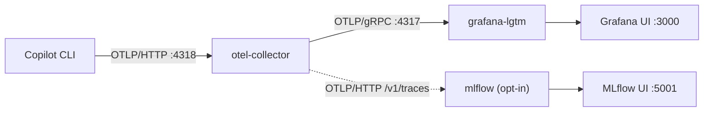

# Observability stack (OpenTelemetry Collector + Grafana LGTM)

A minimal, two-service Docker Compose stack for verifying the OpenTelemetry
traces emitted by the GitHub Copilot SDK tutorials (Go and Python). An optional
MLflow tracking server can be added as a second trace sink (see
[Forwarding traces to MLflow](#forwarding-traces-to-mlflow)).



| Service | Image | Purpose | Host ports |
|---------|-------|---------|------------|
| `otel-collector` | `otel/opentelemetry-collector-contrib` | Single OTLP ingest endpoint; forwards to Grafana LGTM | `4317` (gRPC), `4318` (HTTP) |
| `grafana-lgtm` | `grafana/otel-lgtm` | All-in-one Loki + Grafana + Tempo + Prometheus backend | `3000` (Grafana UI) |
| `mlflow` (opt-in) | `ghcr.io/mlflow/mlflow` | OTLP/HTTP trace sink; renders CLI spans as MLflow traces | `5001` (MLflow UI) |

## Quick start

```bash
# 1. Start the stack (from the repository root)
docker compose -f docker/compose.yaml up -d

# 2. Point the tutorials at the collector (standard OTel env var)
export OTEL_EXPORTER_OTLP_ENDPOINT=http://localhost:4318
# Flush spans quickly: the SDK kills the CLI after a single prompt, so the
# default 5s batch interval would lose spans. Keep this low.
export OTEL_BSP_SCHEDULE_DELAY=500
# Optional: capture prompt/response content in spans
export OTEL_INSTRUMENTATION_GENAI_CAPTURE_MESSAGE_CONTENT=true

# 3a. Run a Python tutorial
cd src/python && uv run python scripts/tutorials/01_chat_bot.py --prompt "Hello!"

# 3b. ...or a Go tutorial
cd src/go && make build && ./dist/template-github-copilot-go tutorial chat-bot --prompt "Hello!"

# 4. Explore traces in Grafana → Explore → Tempo data source
open http://localhost:3000   # login: admin / admin

# 5. Tear down
docker compose -f docker/compose.yaml down
```

## How telemetry is wired

Both tutorial suites enable telemetry only when `OTEL_EXPORTER_OTLP_ENDPOINT`
is set, so they behave exactly as before when the stack is not running.

- **Python**: `src/python/scripts/tutorials/_telemetry.py` builds a
  `TelemetryConfig` and is used by every `NN_*.py` script via `make_client()`.
- **Go**: `src/go/cmd/tutorial/telemetry.go` builds a `copilot.TelemetryConfig`
  and is wired into every `tutorial` subcommand via `newClientOptions()`.

The SDK passes the endpoint to the Copilot CLI process, which exports its
spans over OTLP. The collector then fans them out to Grafana LGTM.

## Forwarding traces to MLflow

[MLflow](https://mlflow.org/) can ingest OpenTelemetry traces through its
OTLP/HTTP endpoint at `/v1/traces`, rendering the Copilot CLI spans as MLflow
traces alongside Grafana. MLflow accepts **traces only** (no metrics or logs)
and supports OTLP/HTTP but not OTLP/gRPC.

Enabling MLflow forwarding uses two independent opt-in switches, both off by
default: the `mlflow` Compose profile (which creates the tracking-server
container) and the `otlphttp/mlflow` exporter in the collector config (which
routes traces to it). You need both.

### 1. Start the stack with the `mlflow` profile

The `mlflow` service declares `profiles: [mlflow]`, so a plain
`docker compose up` skips it:

```bash
docker compose -f docker/compose.yaml --profile mlflow up -d
```

Keep `--profile mlflow` on every later `up`, `down`, `ps`, and `logs` that
should include the server.

### 2. Enable the exporter in `otel-collector-config.yaml`

Apply both edits below; the collector refuses to start if an exporter is defined
but unused, or listed in a pipeline but undefined. First, uncomment the
`otlphttp/mlflow` block in the `exporters:` section (remove the leading `# `
from each line) so it reads:

```yaml
  otlphttp/mlflow:
    endpoint: ${env:MLFLOW_TRACKING_URI:-http://mlflow:5000}
    headers:
      x-mlflow-experiment-id: ${env:MLFLOW_EXPERIMENT_ID:-0}
    compression: gzip
```

Then add `otlphttp/mlflow` to the `traces` pipeline exporters only (leave
`metrics` and `logs` unchanged, since MLflow ingests traces only):

```yaml
    traces:
      receivers: [otlp]
      processors: [batch]
      exporters: [otlp/lgtm, debug, otlphttp/mlflow]
```

### 3. Reload the collector and confirm it started

```bash
docker compose -f docker/compose.yaml up -d --force-recreate otel-collector
docker compose -f docker/compose.yaml logs --tail 20 otel-collector
# expect "Everything is ready. Begin running and processing data." and no errors
```

### 4. Run a tutorial, then browse the traces

```bash
open http://localhost:5001   # MLflow UI → Traces tab (Default experiment)
```

The collector reaches MLflow at `http://mlflow:5000` inside the Compose network
and tags every trace with the destination experiment via the
`x-mlflow-experiment-id` header. Override the defaults (experiment id `0`, the
`Default` experiment) with `MLFLOW_TRACKING_URI` and `MLFLOW_EXPERIMENT_ID`,
for example in `../.env`. The bundled server uses a SQLite backend store on a
named volume, which OTLP ingestion requires.

> The UI is published on host port `5001` to avoid clashing with a local MLflow
> instance or macOS AirPlay on `5000`. The `mlflow` service sets
> `--allowed-hosts=*` because it is a local-only dev sink; restrict that list
> if you expose the server beyond localhost.

See [Observability with OpenTelemetry](../docs/copilot_sdk_tutorial/observability.md#forwarding-traces-to-mlflow)
for the tutorial walkthrough.

## VS Code Copilot Chat metrics

The same collector also accepts traces/metrics/logs from **GitHub Copilot Chat
in VS Code** — no extra services. This repo's [`.vscode/settings.json`](../.vscode/settings.json)
points Copilot at `http://localhost:4318`, so once the stack is up you can
explore agent traces (Tempo) and metrics like `github_copilot_agent_turn_count`
(Prometheus) in Grafana. See
[Observability with OpenTelemetry](../docs/copilot_sdk_tutorial/observability.md#visualizing-vs-code-copilot-chat-metrics).

## Verifying without Grafana

The collector also logs a summary via its `debug` exporter:

```bash
docker compose -f docker/compose.yaml logs -f otel-collector
```

You should see `TracesExporter` / spans activity once a tutorial runs.

## Troubleshooting: "no spans arrive"

When the SDK launches the CLI over **stdio** (the tutorial default), it
terminates the CLI with `SIGKILL` (`client.Stop()` → `process.Kill()`) as soon
as a single-shot prompt finishes. The CLI's OTLP exporter batches spans and
flushes on an interval whose **default is 5 seconds**, so a short prompt is
killed long before the first flush and **no spans are ever sent**.

Fixes (either works):

- **Lower the flush interval** (simplest) — set the standard OTel env var so the
  CLI flushes before it is killed:

  ```bash
  export OTEL_BSP_SCHEDULE_DELAY=500   # milliseconds
  ```

- **Use server mode** — run the CLI as a persistent server and connect the
  tutorial with `--cli-url`. The process stays alive and flushes normally. See
  [CLI Server Mode](../docs/copilot_sdk_tutorial/server_mode.md).

A direct `copilot -p "..."` run always works because that process exits
gracefully and flushes on shutdown.

## References

- [OpenTelemetry instrumentation for Copilot SDK](https://docs.github.com/en/copilot/how-tos/copilot-sdk/observability/opentelemetry)
- [Collect OpenTelemetry Traces into MLflow](https://mlflow.org/docs/latest/genai/tracing/opentelemetry/ingest/)
- [grafana/otel-lgtm](https://github.com/grafana/docker-otel-lgtm)
- [OpenTelemetry Collector](https://opentelemetry.io/docs/collector/)
