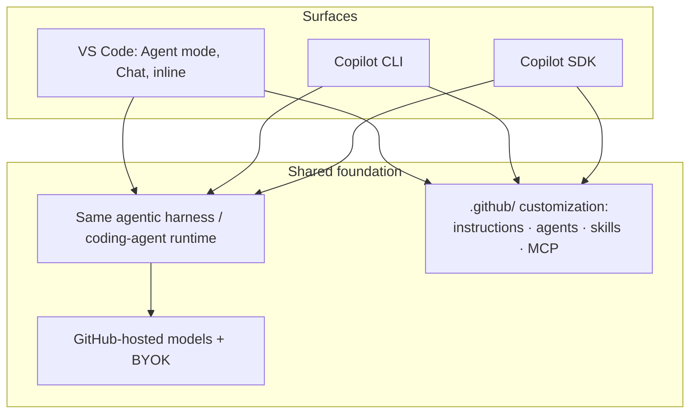
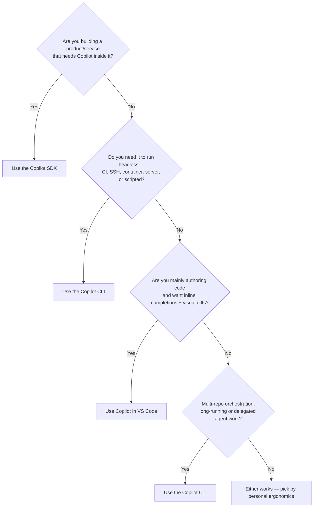

# Access Methods: VS Code vs SDK vs CLI

**ワークショップの Part 1。** GitHub Copilot は単一の製品ではなく、共有のエージェントランタイムと共有のカスタマイズ層の上に立つ *サーフェスの集合* です。本章では、経験豊富な開発者が最もよく問う 3 つのサーフェス、**VS Code の Copilot**、**Copilot SDK**、**Copilot CLI** を選び分けるための、説明可能なフレームワークを提供します。

> GitHub は Copilot の機能を **assistive（入力中に同期的に支援）**、**agentic（承認を伴い自律的に作業）**、**customization** の各層に分類しています（[Copilot features](https://docs.github.com/en/copilot/get-started/features)）。この分類を念頭に置くと比較が腑に落ちます。

---

## 共有された基盤

対比の前に、3 つのサーフェスが **共通** に持つものを理解しましょう。投資の考え方が変わります。

- CLI は「GitHub の Copilot coding agent と同じエージェントハーネスを基盤とする」ものです（[github/copilot-cli README](https://github.com/github/copilot-cli)）。
- SDK は「GitHub Copilot CLI を動かすのと同じエージェントランタイムへのプログラマブルなインタフェース」です（[Copilot SDK チュートリアル](../copilot_sdk_tutorial/index.md)）。
- **カスタム指示・カスタムエージェント・スキルは共有資産です。** 同じ `.github/copilot-instructions.md`、`.github/agents/*.agent.md`、`.github/skills/*/SKILL.md` がサーフェス横断で尊重されます（[Copilot features](https://docs.github.com/en/copilot/get-started/features)、[Adding custom instructions](https://docs.github.com/en/copilot/how-tos/copilot-cli/add-custom-instructions)）。

**含意:** 良い指示／エージェント／スキルを書く時間はポータブルです。単一のサーフェスに賭けているわけではありません。

---

## 横並び比較

| 観点 | VS Code の Copilot | Copilot CLI | Copilot SDK |
|------|--------------------|-------------|-------------|
| **主な形態** | エディタ内の GUI | 対話＋スクリプタブルなターミナルエージェント | 自分のプログラムから呼ぶライブラリ |
| **カテゴリ** | assistive **かつ** agentic（Agent mode） | agentic | agentic、組み込み |
| **得意領域** | リッチな差分・インラインレビュー・エディタコンテキストを伴うコード作成 | ヘッドレス／SSH／CI 作業、マルチリポのオーケストレーション、自動化 | エージェントを組み込んだプロダクト／サービスの構築 |
| **人間の関与** | 視覚的な差分承認、ハンク単位の採用 | ツールごとの承認プロンプト、または `--allow-*`／サンドボックス | 承認 UX を自分で設計 |
| **実行環境** | IDE（通常はデスクトップ）が必要 | シェルが動く場所ならどこでも | アプリが動く場所ならどこでも |
| **自動化／CI** | 限定的 | 適している（`copilot -p`、終了コード） | 適している（完全なプログラム制御） |
| **GitHub.com 操作** | IDE 機能経由 | 組み込みの GitHub MCP サーバー（Issue／PR／Actions） | 自分で配線したツール次第 |
| **インラインのゴーストテキスト補完** | ✅ | ❌（補完機ではなくエージェント） | ❌ |
| **カスタマイズ（指示／エージェント／スキル）** | ✅ 共有 | ✅ 共有 | ✅ 共有 |
| **MCP で拡張** | ✅ エディタ／ワークスペースの MCP 設定 | ✅（`/mcp add`、ユーザー `mcp-config.json`、`.github/mcp.json` などのワークスペース設定） | ✅（プログラム的に） |
| **学習コスト** | 低 | 中 | 高（コードを書く） |

出典: [Copilot features](https://docs.github.com/en/copilot/get-started/features)、[About Copilot CLI](https://docs.github.com/en/copilot/concepts/agents/about-copilot-cli)、[Copilot SDK チュートリアル](../copilot_sdk_tutorial/index.md)。

---

## Pros & Cons

### VS Code の Copilot

**Pros**

- 最もリッチな *作成* 体験: インライン補完、次の編集の予測、視覚的な複数ファイル差分、タスク完了まで反復する Agent mode（[Copilot features](https://docs.github.com/en/copilot/get-started/features)）。
- 日々の編集での摩擦が最小。エディタの完全なコンテキスト（開いているファイル、選択範囲、Problems パネル）。
- AI の変更を *視覚的に* レビューしてから採用するのに最適。

**Cons／避けるべきとき**

- GUI とデスクトップセッションに依存 — 素の SSH やヘッドレスのビルドエージェントでは扱いにくい。
- CI ステップやスクリプタブルな自動化の構成要素としては設計されていない。
- 一度に 1 つのエディタ。多数のリポジトリのオーケストレーションや長時間の無人実行は不得手。

### Copilot CLI

**Pros**

- **IDE 非依存**: SSH 越し、コンテナ内、サーバー上、CI 内で同一の体験（[About Copilot CLI](https://docs.github.com/en/copilot/concepts/agents/about-copilot-cli)）。
- **スクリプタブル**: `copilot -p "…"` はプロンプトを 1 回実行して終了するため、スクリプト、リリースジョブ、CI チェックに組み込みやすい（[About Copilot CLI](https://docs.github.com/en/copilot/concepts/agents/about-copilot-cli)）。
- **GitHub ネイティブ**: GitHub MCP サーバーを同梱し、Issue／PR／Actions を自然言語から扱える（[Using Copilot CLI](https://docs.github.com/en/copilot/how-tos/use-copilot-agents/use-copilot-cli)）。
- **マルチリポ** ワークフロー: 親ディレクトリから起動するか `/add-dir` を使う（[Best practices](https://docs.github.com/en/copilot/how-tos/copilot-cli/cli-best-practices)）。
- **長時間・再開可能** な「無限セッション」と自動コンテキスト圧縮（[Best practices](https://docs.github.com/en/copilot/how-tos/copilot-cli/cli-best-practices)）。
- クラウドエージェントへの **委譲**（`/delegate`）や `/fleet` による並列化が可能。

**Cons／避けるべきとき**

- 視覚的な差分レビューがない。変更はターミナルで読む（Plan モードと Git で緩和）。
- ターミナル中心の操作性。入力しながらインライン補完が主目的なら不向き。
- 自律性はリスクを増やす。`--allow-all-tools`／`--yolo` をサンドボックス外で使うと破壊的になりうる（[Security considerations](https://docs.github.com/en/copilot/concepts/agents/about-copilot-cli#security-considerations)）。

### Copilot SDK

**Pros**

- **エージェントを自分のプロダクトに組み込む**: 独自 UX、カスタムツール、ストリーミング、フック、BYOK（[Copilot SDK チュートリアル](../copilot_sdk_tutorial/index.md)）。
- セッション・権限・ツール実行を完全にプログラム制御。
- 同じランタイムなので、挙動は CLI と一致。

**Cons／避けるべきとき**

- もはや *ソフトウェアを書き、保守する* ことになる — 工数とオーナーシップが最大。
- 個人の生産性や単発の自動化には過剰（その場合は CLI）。
- 既製のチャット UI や補完エンジンではない。体験は自分で作る。

---

## 意思決定ガイド { #decision-guide }

コンパクトなヒューリスティック。

- **「今コードを書いている」** → VS Code。
- **「GUI がない／CI 内／スクリプト化している」** → CLI。
- **「この機能を *他者に* 自分のアプリで提供する」** → SDK。
- **「一晩で 5 つのリポジトリを連携させたい」** → CLI（`/delegate` と `/fleet`）。

> 実務では、3 つを役割で使い分けることが多いです。VS Code は編集中の作業、CLI はターミナル作業と自動化、SDK はプロダクトとして提供する体験に向いています。`.github/` のカスタマイズを一度標準化すれば、すべてのサーフェスが恩恵を受けます。

---

## クラウドエージェントについての補足

CLI は `/delegate` で **Copilot cloud agent** に作業を引き渡せます。非同期で実行され、プルリクエストを開き、その間ローカルで作業を続けられます（[Best practices](https://docs.github.com/en/copilot/how-tos/copilot-cli/cli-best-practices)）。CLI でタスクを開始し、GitHub.com やモバイルで続けることもできます（[Copilot features](https://docs.github.com/en/copilot/get-started/features)）。クラウドエージェントは、CLI が到達できる第 4 のサーフェスと捉えてください。[Demo 1](demos/01_issue_to_pr.md) で扱います。

---

## 次へ

フレームワークを手にしたら、[Feature Deep Dive](features.md) で CLI 自体を深掘りし、[Demo Scenarios](demos/index.md) で実践しましょう。
