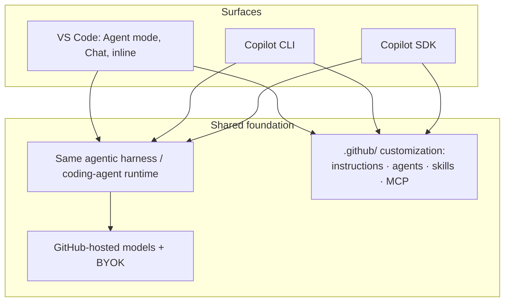
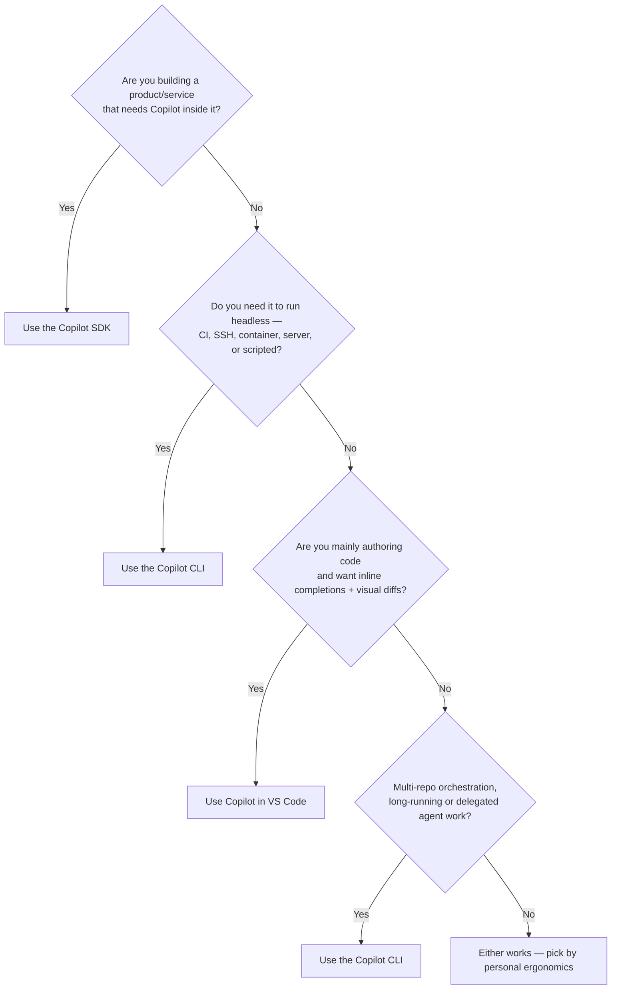

# Access Methods: VS Code vs SDK vs CLI

**Part 1 of the workshop.** GitHub Copilot is not one product — it is a *family of surfaces* over a shared agent runtime and a shared customization layer. This chapter gives you a defensible framework for choosing among the three surfaces experienced developers ask about most: **Copilot in VS Code**, the **Copilot SDK**, and the **Copilot CLI**.

> GitHub groups Copilot features into **assistive** (synchronous help while you type), **agentic** (work autonomously with approvals), and **customization** layers ([Copilot features](https://docs.github.com/en/copilot/get-started/features)). Keeping that taxonomy in mind makes the comparison click.

---

## The shared foundation

Before contrasting them, internalize what the three surfaces have in **common** — because it changes how you invest.

- The CLI is "powered by the same agentic harness as GitHub's Copilot coding agent" ([github/copilot-cli README](https://github.com/github/copilot-cli)).
- The SDK is "a programmable interface to the same agent runtime that powers GitHub Copilot CLI" ([Copilot SDK Tutorial](../copilot_sdk_tutorial/index.md)).
- **Custom instructions, custom agents, and skills are shared assets.** The same `.github/copilot-instructions.md`, `.github/agents/*.agent.md`, and `.github/skills/*/SKILL.md` are honored across surfaces ([Copilot features](https://docs.github.com/en/copilot/get-started/features); [Adding custom instructions](https://docs.github.com/en/copilot/how-tos/copilot-cli/add-custom-instructions)).

**Implication:** time spent writing good instructions/agents/skills is portable. You are not betting on a single surface.

---

## Side-by-side comparison

| Dimension | Copilot in VS Code | Copilot CLI | Copilot SDK |
|-----------|--------------------|-------------|-------------|
| **Primary shape** | GUI inside the editor | Interactive + scriptable terminal agent | Library you call from your own program |
| **Category** | Assistive **and** agentic (Agent mode) | Agentic | Agentic, embedded |
| **Best at** | Authoring code with rich diffs, inline review, editor context | Headless/SSH/CI work, multi-repo orchestration, automation | Building products/services that embed the agent |
| **Human-in-the-loop** | Visual diff approval, hunk-level accept | Per-tool approval prompts, or `--allow-*`/sandbox | You design the approval UX |
| **Environment** | Needs the IDE (and usually a desktop) | Runs anywhere a shell runs | Runs wherever your app runs |
| **Automation / CI** | Limited | First-class (`copilot -p`, exit codes) | First-class (full programmatic control) |
| **GitHub.com actions** | Via IDE features | Built-in GitHub MCP server (issues/PRs/Actions) | Whatever tools you wire up |
| **Inline ghost-text completions** | ✅ | ❌ (it is an agent, not a completer) | ❌ |
| **Customization (instructions/agents/skills)** | ✅ shared | ✅ shared | ✅ shared |
| **Extend with MCP** | ✅ editor/workspace MCP config | ✅ (`/mcp add`, user `mcp-config.json`, workspace config such as `.github/mcp.json`) | ✅ (programmatic) |
| **Learning curve** | Low | Medium | High (you write code) |

Sources: [Copilot features](https://docs.github.com/en/copilot/get-started/features), [About Copilot CLI](https://docs.github.com/en/copilot/concepts/agents/about-copilot-cli), [Copilot SDK Tutorial](../copilot_sdk_tutorial/index.md).

---

## Pros & Cons

### Copilot in VS Code

**Pros**

- Richest *authoring* experience: inline suggestions, next-edit suggestions, visual multi-file diffs, and Agent mode that iterates until a task is done ([Copilot features](https://docs.github.com/en/copilot/get-started/features)).
- Lowest friction for day-to-day editing; full editor context (open files, selection, problems panel).
- Great for reviewing AI changes *visually* before accepting.

**Cons / when to avoid**

- Tied to the GUI and a desktop session — awkward over plain SSH or on a headless build agent.
- Not designed to be a CI step or a scriptable automation primitive.
- One editor at a time; orchestrating many repos or long unattended runs is not its strength.

### Copilot CLI

**Pros**

- **IDE-independent**: identical experience over SSH, in containers, on servers, and in CI ([About Copilot CLI](https://docs.github.com/en/copilot/concepts/agents/about-copilot-cli)).
- **Scriptable**: `copilot -p "…"` runs a single prompt and exits, which makes it suitable for scripts, release jobs, and CI checks ([About Copilot CLI](https://docs.github.com/en/copilot/concepts/agents/about-copilot-cli)).
- **GitHub-native**: ships with the GitHub MCP server, so issues/PRs/Actions are first-class ([Using Copilot CLI](https://docs.github.com/en/copilot/how-tos/use-copilot-agents/use-copilot-cli)).
- **Multi-repo** workflows by launching from a parent directory or using `/add-dir` ([Best practices](https://docs.github.com/en/copilot/how-tos/copilot-cli/cli-best-practices)).
- **Long-running & resumable** "infinite sessions" with automatic context compaction ([Best practices](https://docs.github.com/en/copilot/how-tos/copilot-cli/cli-best-practices)).
- Can **delegate** to the cloud agent (`/delegate`) and parallelize with `/fleet`.

**Cons / when to avoid**

- No visual diff review; you read changes in the terminal (mitigate with plan mode and Git).
- Terminal-only ergonomics; not ideal when you mostly want inline completions while typing.
- Autonomy increases risk — running with `--allow-all-tools`/`--yolo` outside a sandbox can be destructive ([Security considerations](https://docs.github.com/en/copilot/concepts/agents/about-copilot-cli#security-considerations)).

### Copilot SDK

**Pros**

- **Embed the agent in your own product**: custom UX, custom tools, streaming, hooks, BYOK ([Copilot SDK Tutorial](../copilot_sdk_tutorial/index.md)).
- Full programmatic control over sessions, permissions, and tool execution.
- Same runtime, so behavior matches the CLI.

**Cons / when to avoid**

- You are now *writing and maintaining software* — highest effort and ownership.
- Overkill for personal productivity or one-off automation (use the CLI instead).
- Not a chat UI or completion engine out of the box; you build the experience.

---

## Decision guide { #decision-guide }

A compact heuristic:

- **"I'm typing code right now."** → VS Code.
- **"There's no GUI / I'm in CI / I'm scripting it."** → CLI.
- **"I'm shipping this capability *to others* in my own app."** → SDK.
- **"I need to coordinate five repos overnight."** → CLI (with `/delegate` and `/fleet`).

> In practice, teams often use all three: VS Code for active editing, CLI for terminal and automation work, and SDK when they are building a product surface. Standardize your `.github/` customization once and every surface benefits.

---

## A note on the cloud agent

The CLI can hand work to the **Copilot cloud agent** with `/delegate` — it runs asynchronously and opens a pull request, letting you keep working locally ([Best practices](https://docs.github.com/en/copilot/how-tos/copilot-cli/cli-best-practices)). You can also start a task in the CLI and continue it on GitHub.com or mobile ([Copilot features](https://docs.github.com/en/copilot/get-started/features)). Think of the cloud agent as a fourth surface that the CLI can reach into — covered in [Demo 1](demos/01_issue_to_pr.md).

---

## Next

With the framework in hand, go deep on the CLI itself in the [Feature Deep Dive](features.md), then put it to work in the [Demo Scenarios](demos/index.md).
