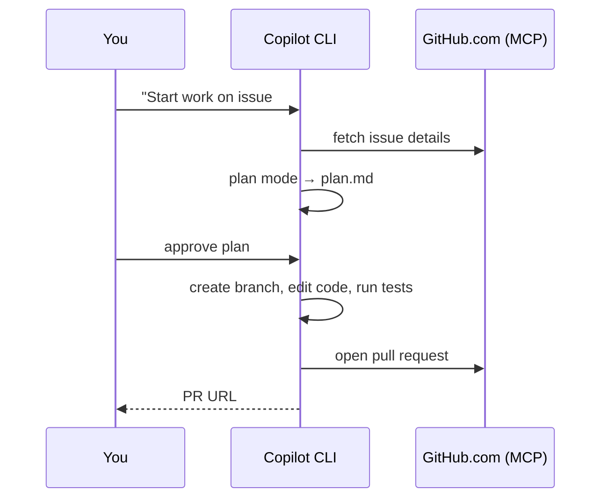

# Demo 1 · Issue → Branch → PR 自動化

**テーマ:** 日々の開発ループ。**時間:** 約 25 分。
**機能:** GitHub MCP サーバー、Plan モード、ツール承認、`/delegate`。

GitHub の Issue を、ターミナルから離れずにレビュー済みのプルリクエストへと変えます。GitHub MCP サーバーが既定で配線されているため、Issue・ブランチ・PR がすべて自然言語で扱えます。このワークフローは CLI の価値を早く体験できるため、最初に練習する価値があります（[Using Copilot CLI](https://docs.github.com/en/copilot/how-tos/use-copilot-agents/use-copilot-cli)）。



---

## 前提条件

- 少なくとも 1 つの **オープン Issue** がある、自分が所有するリポジトリ（例: *「CLI に `--version` フラグを追加する」* のような使い捨て Issue を作成）。
- そのリポジトリにアクセスできる認証済み CLI（`/login`）。

---

## 手順

### 1. リポジトリ内で起動し、GitHub アクセスを確認する

```bash
cd ~/projects/your-repo
copilot
```

```text
> /mcp
```

**GitHub** MCP サーバーが一覧に表示されるはずです。これが Copilot に Issue の読み取りと PR の作成を可能にします（[Using Copilot CLI](https://docs.github.com/en/copilot/how-tos/use-copilot-agents/use-copilot-cli)）。

### 2. Issue をコンテキストに取り込む

```text
> List open issues assigned to me in OWNER/REPO
> Summarize issue #123 and what "done" looks like
```

GitHub.com の Issue の取得と要約は、公式ドキュメントで紹介されている CLI のユースケースです（[About Copilot CLI](https://docs.github.com/en/copilot/concepts/agents/about-copilot-cli)）。

### 3. コーディング前に計画する

Plan モード（++shift+tab++）または `/plan` に切り替え、Copilot が確認の質問をし、コードを書く前にあなたが承認する `plan.md` を書くようにします（[Best practices](https://docs.github.com/en/copilot/how-tos/copilot-cli/cli-best-practices)）。

```text
> /plan Implement issue #123 on a new feature branch
```

計画をレビューし、必要なら ++ctrl+y++ で編集します。スコープを調整してから承認します。

### 4. ブランチで実装する

```text
> Proceed with the plan. Create a suitably named feature branch first.
```

Copilot はファイルを変更・実行するツールを使う前に許可を求めます。このデモでは各ステップを見るために対話的に承認してください（[Using Copilot CLI](https://docs.github.com/en/copilot/how-tos/use-copilot-agents/use-copilot-cli)）。安全なコマンドの確認を減らすには、次のように起動することもできます。

```bash
copilot --allow-tool='shell(git:*)' --deny-tool='shell(git push)'
```

### 5. 検証する

```text
> Run the test suite and fix any failures
> !git diff --stat
```

`!` プレフィックスは、モデルを呼ばずにシェルコマンドを直接実行します（[Using Copilot CLI](https://docs.github.com/en/copilot/how-tos/use-copilot-agents/use-copilot-cli)）。

### 6. プルリクエストを開く

```text
> Push the branch and open a pull request that closes #123, with a clear description of the changes
```

Copilot はあなたの代わりに GitHub.com で PR を作成し、あなたが作成者として記録されます（[About Copilot CLI](https://docs.github.com/en/copilot/concepts/agents/about-copilot-cli)）。

---

## バリエーション: クラウドエージェントへの委譲

付随的・長時間で見守りたくない作業は、引き渡してローカル作業を続けます。クラウドエージェントは完了時に PR を開きます（[Best practices](https://docs.github.com/en/copilot/how-tos/copilot-cli/cli-best-practices)）。

```text
> /delegate Implement issue #123 and open a PR
```

CLI でタスクを開始し、同じセッションを GitHub.com やモバイルで続けることもできます（[Copilot features](https://docs.github.com/en/copilot/get-started/features)）。

---

## 学んだこと

- GitHub MCP サーバーにより、Issue／ブランチ／PR をターミナルから扱える。
- Plan モードは曖昧な Issue を、コードを書く前の承認済み・チェック可能な計画に変える。
- `/delegate` はあなたをブロックせずにクラウドエージェントへ作業を委譲する。

## さらに進める

- ブランチ命名やコミット規約を記した `.github/copilot-instructions.md` を追加し、再実行してみてください。Copilot がそれに従うのが分かります（[Best practices](https://docs.github.com/en/copilot/how-tos/copilot-cli/cli-best-practices)）。
- 公式の GitHub Skills 演習 [Creating applications with Copilot CLI](https://github.com/skills/create-applications-with-the-copilot-cli) で Issue → PR のウォークスルーを試してください。

次へ: [Demo 2 · AI コードレビュー](02_code_review.md)。
