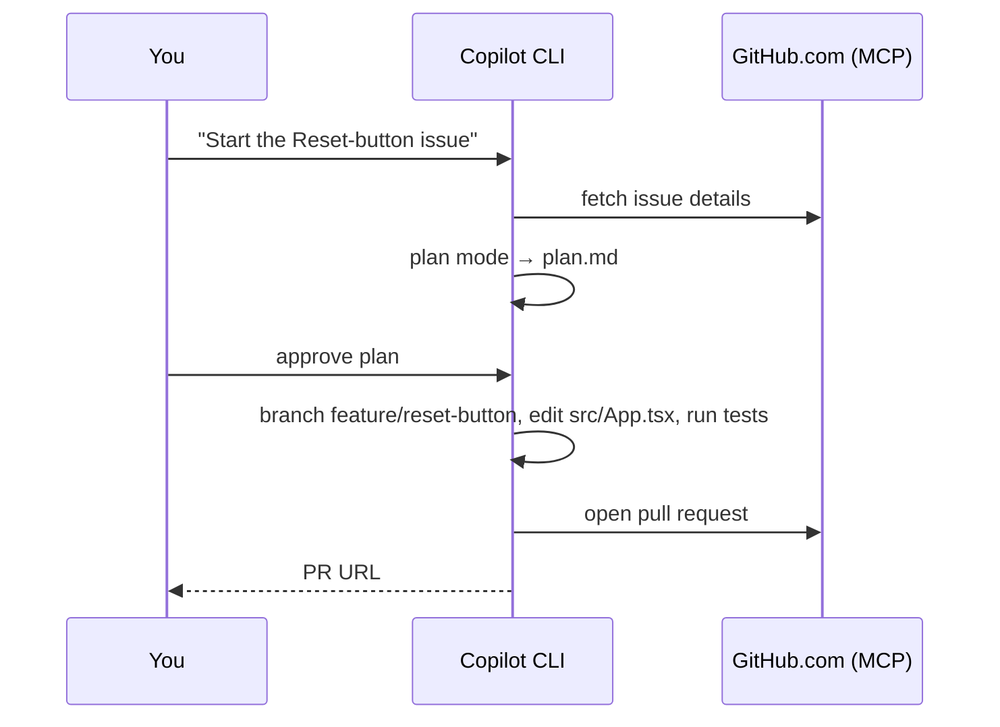

# Demo 1 · Issue → Branch → PR 自動化

**テーマ:** 日々の開発ループ。**時間:** 約 25 分。
**機能:** GitHub MCP サーバー、Plan モード、ツール承認、`/delegate`。

> **このストーリーでは:** あなたは **template-typescript-react** に参加したばかりです。最初のタスクは、*「カウンターに Reset ボタンを追加する」* という Issue を、ターミナルから離れずにレビュー済みのプルリクエストへと変えることです。GitHub MCP サーバーが既定で配線されているため、Issue・ブランチ・PR がすべて自然言語で扱えます（[Using Copilot CLI](https://docs.github.com/en/copilot/how-tos/use-copilot-agents/use-copilot-cli)）。



---

## 前提条件

- [template-typescript-react](https://github.com/ks6088ts/template-typescript-react) の **フォーク** をローカルにクローンし、`pnpm install` 済みであること（[共通の前提条件](index.md#shared-prerequisites)を参照）。
- そのフォークにアクセスできる認証済み CLI（`/login`）。

---

## 手順

### 1. リポジトリ内で起動し、GitHub アクセスを確認する

```bash
cd template-typescript-react   # 自分のフォーク
copilot
```

```text
> /mcp
```

**GitHub** MCP サーバーが一覧に表示されるはずです。これが Copilot に Issue の読み取りと PR の作成を可能にします（[Using Copilot CLI](https://docs.github.com/en/copilot/how-tos/use-copilot-agents/use-copilot-cli)）。

### 2. Issue を作成し、コンテキストに取り込む

まだ Issue がない場合は、GitHub MCP サーバー経由で Copilot に自分のフォークへ作成してもらいます。

```text
> Open an issue in <your-username>/template-typescript-react titled "Add a Reset button to the counter". Body: the counter in src/App.tsx can only increment; add a Reset button that returns it to 0 and emits a telemetry event, covered by an E2E test.
```

次に要約し、「完了」が何を意味するかを定義します（[About Copilot CLI](https://docs.github.com/en/copilot/concepts/agents/about-copilot-cli)）。

```text
> Summarize the newest open issue in <your-username>/template-typescript-react and what "done" looks like for this codebase
```

### 3. コーディング前に計画する

Plan モード（++shift+tab++）または `/plan` に切り替え、Copilot が確認の質問をし、コードを書く前にあなたが承認する `plan.md` を書くようにします（[Best practices](https://docs.github.com/en/copilot/how-tos/copilot-cli/cli-best-practices)）。

```text
> /plan Implement the Reset-button issue on a new feature branch. This is a React 19 + TypeScript (Vite) app — follow the existing telemetry pattern in @src/App.tsx and add an E2E test.
```

計画をレビューし、必要なら ++ctrl+y++ で編集します。スコープを調整してから承認します。

### 4. ブランチで実装する

```text
> Proceed with the plan. First create a branch named `feature/reset-button`. Then in @src/App.tsx add a Reset button next to the counter that sets `count` back to 0 and emits a `counter_reset_clicked` event via the existing `useTrackEvent()` hook — mirroring how the counter button tracks `counter_button_clicked`.
```

Copilot はファイルを変更・実行するツールを使う前に許可を求めます。このデモでは各ステップを見るために対話的に承認してください（[Using Copilot CLI](https://docs.github.com/en/copilot/how-tos/use-copilot-agents/use-copilot-cli)）。安全なコマンドの確認を減らすには、次のように起動することもできます。

```bash
copilot --allow-tool='shell(git:*)' --allow-tool='shell(pnpm:*)' --deny-tool='shell(git push)'
```

### 5. 検証する

```text
> Run `pnpm check`, `pnpm build`, and the Vitest browser tests (`pnpm test:e2e`), and fix any failures.
> !git diff --stat
```

`!` プレフィックスは、モデルを呼ばずにシェルコマンドを直接実行します（[Using Copilot CLI](https://docs.github.com/en/copilot/how-tos/use-copilot-agents/use-copilot-cli)）。`pnpm check` は Biome の lint／format チェックを、`pnpm test:e2e` はカウンターのテレメトリイベントを既に検証している Vitest ブラウザスイートを実行します。

### 6. プルリクエストを開く

```text
> Push the branch and open a pull request that closes the Reset-button issue, with a clear description of the change and how it was tested
```

Copilot はあなたの代わりに GitHub.com で PR を作成し、あなたが作成者として記録されます（[About Copilot CLI](https://docs.github.com/en/copilot/concepts/agents/about-copilot-cli)）。**この PR と `feature/reset-button` ブランチは残しておいてください。[Demo 2](02_code_review.md) でレビューします。**

---

## バリエーション: クラウドエージェントへの委譲

付随的・長時間で見守りたくない作業は、引き渡してローカル作業を続けます。クラウドエージェントは完了時に PR を開きます（[Best practices](https://docs.github.com/en/copilot/how-tos/copilot-cli/cli-best-practices)）。

```text
> /delegate Implement the Reset-button issue and open a PR
```

CLI でタスクを開始し、同じセッションを GitHub.com やモバイルで続けることもできます（[Copilot features](https://docs.github.com/en/copilot/get-started/features)）。

---

## 学んだこと

- GitHub MCP サーバーにより、Issue／ブランチ／PR をターミナルから扱える。
- Plan モードは曖昧な Issue を、コードを書く前の承認済み・チェック可能な計画に変える。
- `/delegate` はあなたをブロックせずにクラウドエージェントへ作業を委譲する。

## さらに進める

- ブランチ命名・Conventional Commits・「UI 変更には必ず Vitest/Playwright テストを追加」といったルールを記した `.github/copilot-instructions.md` を自分のフォークに追加し、再実行してみてください。Copilot がそれに従うのが分かります（[Best practices](https://docs.github.com/en/copilot/how-tos/copilot-cli/cli-best-practices)）。
- 公式の GitHub Skills 演習 [Creating applications with Copilot CLI](https://github.com/skills/create-applications-with-the-copilot-cli) で Issue → PR のウォークスルーを試してください。

次へ: [Demo 2 · AI コードレビュー](02_code_review.md)。
