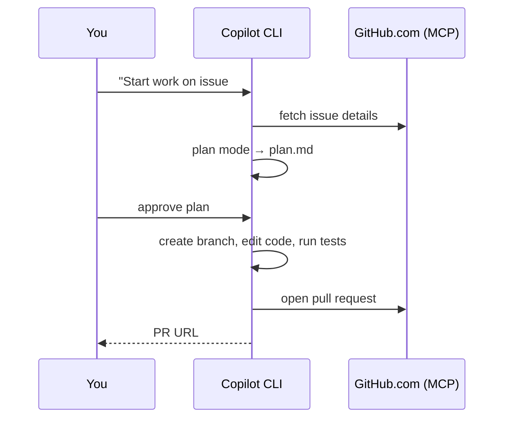

# Demo 1 · Issue → Branch → PR automation

**Theme:** the daily developer loop. **Time:** ~25 min.
**Features:** GitHub MCP server, plan mode, tool approvals, `/delegate`.

Turn a GitHub issue into a reviewed pull request without leaving the terminal. This workflow is worth practicing early because the GitHub MCP server is wired in by default — issues, branches, and PRs are all reachable in natural language ([Using Copilot CLI](https://docs.github.com/en/copilot/how-tos/use-copilot-agents/use-copilot-cli)).



---

## Prerequisites

- A repository you own with at least one **open issue** (create a throwaway one like *"Add a `--version` flag to the CLI"*).
- Authenticated CLI (`/login`) with access to that repo.

---

## Steps

### 1. Launch in the repo and confirm GitHub access

```bash
cd ~/projects/your-repo
copilot
```

```text
> /mcp
```

You should see the **GitHub** MCP server listed — that is what lets Copilot read issues and open PRs ([Using Copilot CLI](https://docs.github.com/en/copilot/how-tos/use-copilot-agents/use-copilot-cli)).

### 2. Pull the issue into context

```text
> List open issues assigned to me in OWNER/REPO
> Summarize issue #123 and what "done" looks like
```

Fetching and summarizing issues from GitHub.com is a documented first-class use case ([About Copilot CLI](https://docs.github.com/en/copilot/concepts/agents/about-copilot-cli)).

### 3. Plan before coding

Switch to plan mode (++shift+tab++) or use `/plan` so Copilot asks clarifying questions and writes a `plan.md` you approve before any code is written ([Best practices](https://docs.github.com/en/copilot/how-tos/copilot-cli/cli-best-practices)):

```text
> /plan Implement issue #123 on a new feature branch
```

Review the plan; press ++ctrl+y++ to edit it if needed. Adjust scope, then approve.

### 4. Implement on a branch

```text
> Proceed with the plan. Create a suitably named feature branch first.
```

Copilot will ask permission before running tools that modify or execute files. For this demo, approve interactively so you see each step ([Using Copilot CLI](https://docs.github.com/en/copilot/how-tos/use-copilot-agents/use-copilot-cli)). To reduce prompting for safe commands, you could have launched with:

```bash
copilot --allow-tool='shell(git:*)' --deny-tool='shell(git push)'
```

### 5. Verify

```text
> Run the test suite and fix any failures
> !git diff --stat
```

The `!` prefix runs a shell command directly without calling the model ([Using Copilot CLI](https://docs.github.com/en/copilot/how-tos/use-copilot-agents/use-copilot-cli)).

### 6. Open the pull request

```text
> Push the branch and open a pull request that closes #123, with a clear description of the changes
```

Copilot creates the PR on GitHub.com on your behalf; you are recorded as the author ([About Copilot CLI](https://docs.github.com/en/copilot/concepts/agents/about-copilot-cli)).

---

## Variation: delegate to the cloud agent

For tangential or long-running work you don't want to babysit, hand it off and keep working locally — the cloud agent opens a PR when done ([Best practices](https://docs.github.com/en/copilot/how-tos/copilot-cli/cli-best-practices)):

```text
> /delegate Implement issue #123 and open a PR
```

You can also kick a task off in the CLI and continue it on GitHub.com or mobile in the same session ([Copilot features](https://docs.github.com/en/copilot/get-started/features)).

---

## What you learned

- The GitHub MCP server makes issues/branches/PRs first-class in the terminal.
- Plan mode turns a vague issue into an approved, checkable plan before code is written.
- `/delegate` offloads work to the cloud agent without blocking you.

## Take it further

- Add a `.github/copilot-instructions.md` with your branch-naming and commit conventions, then re-run — notice Copilot follows them ([Best practices](https://docs.github.com/en/copilot/how-tos/copilot-cli/cli-best-practices)).
- Try the official GitHub Skills exercise [Creating applications with Copilot CLI](https://github.com/skills/create-applications-with-the-copilot-cli) for an issue-to-PR walkthrough.

Next: [Demo 2 · AI code review](02_code_review.md).
