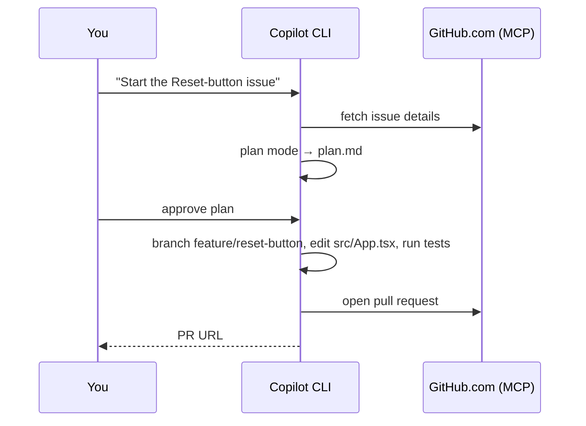

# Demo 1 · Issue → Branch → PR automation

**Theme:** the daily developer loop. **Time:** ~25 min.
**Features:** GitHub MCP server, plan mode, tool approvals, `/delegate`.

> **In this story:** You've just joined **template-typescript-react**. Your first task: turn an issue — *"Add a Reset button to the counter"* — into a reviewed pull request without leaving the terminal. The GitHub MCP server is wired in by default, so issues, branches, and PRs are all reachable in natural language ([Using Copilot CLI](https://docs.github.com/en/copilot/how-tos/use-copilot-agents/use-copilot-cli)).



---

## Prerequisites

- Your **fork** of [template-typescript-react](https://github.com/ks6088ts/template-typescript-react), cloned locally with `pnpm install` already run (see [shared prerequisites](index.md#shared-prerequisites)).
- Authenticated CLI (`/login`) with access to your fork.

---

## Steps

### 1. Launch in the repo and confirm GitHub access

```bash
cd template-typescript-react   # your fork
copilot
```

```text
> /mcp
```

You should see the **GitHub** MCP server listed — that is what lets Copilot read issues and open PRs ([Using Copilot CLI](https://docs.github.com/en/copilot/how-tos/use-copilot-agents/use-copilot-cli)).

### 2. Create the issue, then pull it into context

If you don't have an issue yet, let Copilot open one in your fork via the GitHub MCP server:

```text
> Open an issue in <your-username>/template-typescript-react titled "Add a Reset button to the counter". Body: the counter in src/App.tsx can only increment; add a Reset button that returns it to 0 and emits a telemetry event, covered by an E2E test.
```

Then summarize it and define what "done" means ([About Copilot CLI](https://docs.github.com/en/copilot/concepts/agents/about-copilot-cli)):

```text
> Summarize the newest open issue in <your-username>/template-typescript-react and what "done" looks like for this codebase
```

### 3. Plan before coding

Switch to plan mode (++shift+tab++) or use `/plan` so Copilot asks clarifying questions and writes a `plan.md` you approve before any code is written ([Best practices](https://docs.github.com/en/copilot/how-tos/copilot-cli/cli-best-practices)):

```text
> /plan Implement the Reset-button issue on a new feature branch. This is a React 19 + TypeScript (Vite) app — follow the existing telemetry pattern in @src/App.tsx and add an E2E test.
```

Review the plan; press ++ctrl+y++ to edit it if needed. Adjust scope, then approve.

### 4. Implement on a branch

```text
> Proceed with the plan. First create a branch named `feature/reset-button`. Then in @src/App.tsx add a Reset button next to the counter that sets `count` back to 0 and emits a `counter_reset_clicked` event via the existing `useTrackEvent()` hook — mirroring how the counter button tracks `counter_button_clicked`.
```

Copilot will ask permission before running tools that modify or execute files. For this demo, approve interactively so you see each step ([Using Copilot CLI](https://docs.github.com/en/copilot/how-tos/use-copilot-agents/use-copilot-cli)). To reduce prompting for safe commands, you could have launched with:

```bash
copilot --allow-tool='shell(git:*)' --allow-tool='shell(pnpm:*)' --deny-tool='shell(git push)'
```

### 5. Verify

```text
> Run `pnpm check`, `pnpm build`, and the Vitest browser tests (`pnpm test:e2e`), and fix any failures.
> !git diff --stat
```

The `!` prefix runs a shell command directly without calling the model ([Using Copilot CLI](https://docs.github.com/en/copilot/how-tos/use-copilot-agents/use-copilot-cli)). `pnpm check` runs Biome lint + format checks; `pnpm test:e2e` runs the Vitest browser suite that already asserts the counter's telemetry event.

### 6. Open the pull request

```text
> Push the branch and open a pull request that closes the Reset-button issue, with a clear description of the change and how it was tested
```

Copilot creates the PR on GitHub.com on your behalf; you are recorded as the author ([About Copilot CLI](https://docs.github.com/en/copilot/concepts/agents/about-copilot-cli)). **Keep this PR and the `feature/reset-button` branch — [Demo 2](02_code_review.md) reviews them.**

---

## Variation: delegate to the cloud agent

For tangential or long-running work you don't want to babysit, hand it off and keep working locally — the cloud agent opens a PR when done ([Best practices](https://docs.github.com/en/copilot/how-tos/copilot-cli/cli-best-practices)):

```text
> /delegate Implement the Reset-button issue and open a PR
```

You can also kick a task off in the CLI and continue it on GitHub.com or mobile in the same session ([Copilot features](https://docs.github.com/en/copilot/get-started/features)).

---

## What you learned

- The GitHub MCP server makes issues/branches/PRs first-class in the terminal.
- Plan mode turns a vague issue into an approved, checkable plan before code is written.
- `/delegate` offloads work to the cloud agent without blocking you.

## Take it further

- Add a `.github/copilot-instructions.md` to your fork with branch-naming, conventional-commit, and "always add a Vitest/Playwright test" rules, then re-run — notice Copilot follows them ([Best practices](https://docs.github.com/en/copilot/how-tos/copilot-cli/cli-best-practices)).
- Try the official GitHub Skills exercise [Creating applications with Copilot CLI](https://github.com/skills/create-applications-with-the-copilot-cli) for an issue-to-PR walkthrough.

Next: [Demo 2 · AI code review](02_code_review.md).
