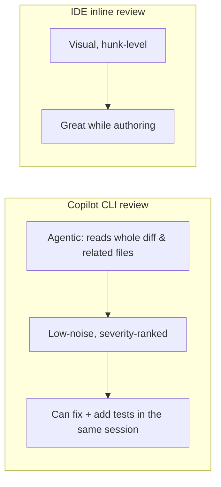

# Demo 2 · AI コードレビュー

**テーマ:** 品質。**時間:** 約 20 分。
**機能:** 組み込みの **Code review** エージェント、`@` ファイル参照、ローカル変更とリモート PR のレビュー。

人間のレビュアーが見る前に、変更に対するレビューを得ます。このワークショップでいう「ノイズが少ない」とは、スタイルの好みを避け、バグの可能性、セキュリティリスク、テスト不足、危険な API 利用に絞るという意味です（[Using Copilot CLI](https://docs.github.com/en/copilot/how-tos/use-copilot-agents/use-copilot-cli)）。

---

## 前提条件

- 未コミットまたは未プッシュの変更があるブランチ（あるいはアクセスできる任意の PR URL）。
- 認証済み CLI。

---

## 手順

### 1. 現在のブランチを `main` と比較してレビューする

ベストプラクティスガイドは、クロスチェックのために複数モデルを要求できることを示しています。モデル名は短期間で変わるため、スライドや古いメモの名前をコピーするのではなく、`/model` で現在使えるモデルを 2 つ選んでください（[Best practices](https://docs.github.com/en/copilot/how-tos/copilot-cli/cli-best-practices)、[GPT-5.2 and GPT-5.2-Codex deprecated](https://github.blog/changelog/2026-06-05-gpt-5-2-and-gpt-5-2-codex-deprecated)）。

```text
> /review Use two currently available models from /model to review the changes in my current branch against `main`. Focus on potential bugs and security issues.
```

お使いのビルドで `/review` が使えない場合は、自然言語でエージェントを呼び出します。自動的に Code review エージェントへ委譲されます。

```text
> Review the changes in my current branch against main. Surface only real bugs, security issues, and risky patterns. Skip style nitpicks.
```

### 2. レビューを特定のファイルに絞る

`@` でファイルをプロンプトに追加すると、Copilot はその正確な内容に基づいてレビューします（[Using Copilot CLI](https://docs.github.com/en/copilot/how-tos/use-copilot-agents/use-copilot-cli)）。

```text
> Review @src/auth/session.ts and @src/auth/tokens.ts for security issues. Check for missing input validation and unsafe defaults.
```

### 3. リモートのプルリクエストをレビューする

Copilot は GitHub.com 上の PR の変更を確認し、重大な問題を報告できます（[About Copilot CLI](https://docs.github.com/en/copilot/concepts/agents/about-copilot-cli)）。

```text
> Check the changes made in PR https://github.com/OWNER/REPO/pull/57. Report any serious errors you find in these changes.
```

### 4. 指摘を修正に変える

これはエージェントなので、同じセッションでレビュー結果に対処できます。

```text
> Fix the highest-severity issue you found, add a regression test, and show me the diff
```

### 5. 専用のセキュリティレビューコマンドを使う

セキュリティに絞った確認には、最近の CLI に experimental public preview として `/security-review` が追加されています。ローカル変更を分析し、深刻度と信頼度付きの高確度な指摘を返します。コマンドが見えない場合は experimental mode を有効にします（[Dedicated security review command](https://github.blog/changelog/2026-06-10-dedicated-security-review-command-now-available-in-copilot-cli)）。

```text
> /experimental on
> /security-review
```

---

## IDE のインラインレビューとの違い



CLI のレビューは **ゲート**（PR 前、または CI 内）として、IDE は **対話的な作成** に使います。両者は補完関係です。[Access Methods](../access_methods.md) を参照してください。

---

## 学んだこと

- Code review エージェントは、バグ、セキュリティ、テスト不足、危険な API 利用に絞るなど、明確なレビュー方針と組み合わせると使いやすい。
- `@` ファイル参照でレビュー範囲を正確に絞れる。
- *リモート PR* をレビューし、その結果に即座に対処できる。

## さらに進める

- 同じプロンプトを CI の非対話ステップとして組み込む（[Demo 4](04_cicd_automation.md) を参照）。
- チームのレビュー観点を [カスタムエージェント](06_custom_agents_skills.md) に符号化し、すべてのレビューに同じレンズを適用する。
- GitHub は GitHub.com 上の自動 PR レビューも提供しています — [About GitHub Copilot code review](https://docs.github.com/en/copilot/concepts/agents/code-review)。

次へ: [Demo 3 · コードベースのオンボーディング](03_onboarding.md)。
