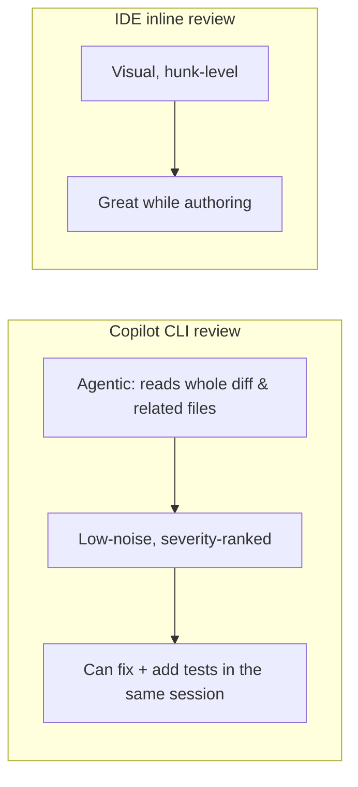

# Demo 2 · AI code review

**Theme:** quality. **Time:** ~20 min.
**Features:** built-in **Code review** agent, `@` file references, reviewing local changes and remote PRs.

Get a review of your changes before a human reviewer sees them. In this workshop, "low-noise" means skipping style preferences and focusing on likely bugs, security risks, missing tests, and risky API usage ([Using Copilot CLI](https://docs.github.com/en/copilot/how-tos/use-copilot-agents/use-copilot-cli)).

---

## Prerequisites

- A branch with uncommitted or unpushed changes (or any PR URL you can access).
- Authenticated CLI.

---

## Steps

### 1. Review your current branch against `main`

The best-practices guide shows you can request multiple models for a cross-check. Model names change quickly, so pick two currently available models from `/model` rather than copying a stale name from slides or older notes ([Best practices](https://docs.github.com/en/copilot/how-tos/copilot-cli/cli-best-practices); [GPT-5.2 and GPT-5.2-Codex deprecated](https://github.blog/changelog/2026-06-05-gpt-5-2-and-gpt-5-2-codex-deprecated)):

```text
> /review Use two currently available models from /model to review the changes in my current branch against `main`. Focus on potential bugs and security issues.
```

If `/review` isn't available in your build, invoke the agent in natural language — it delegates to the Code review agent automatically:

```text
> Review the changes in my current branch against main. Surface only real bugs, security issues, and risky patterns. Skip style nitpicks.
```

### 2. Scope the review to specific files

Add files to the prompt with `@` so Copilot grounds its review in their exact contents ([Using Copilot CLI](https://docs.github.com/en/copilot/how-tos/use-copilot-agents/use-copilot-cli)):

```text
> Review @src/auth/session.ts and @src/auth/tokens.ts for security issues. Check for missing input validation and unsafe defaults.
```

### 3. Review a remote pull request

Copilot can check the changes in a PR on GitHub.com and report serious problems ([About Copilot CLI](https://docs.github.com/en/copilot/concepts/agents/about-copilot-cli)):

```text
> Check the changes made in PR https://github.com/OWNER/REPO/pull/57. Report any serious errors you find in these changes.
```

### 4. Turn findings into fixes

Because this is an agent, you can act on the review in the same session:

```text
> Fix the highest-severity issue you found, add a regression test, and show me the diff
```

### 5. Run the dedicated security review command

For security-specific checks, recent CLI builds include `/security-review` as an experimental public-preview command. It analyzes local changes and reports high-confidence findings with severity and confidence; enable experimental mode first if the command is not visible ([Dedicated security review command](https://github.blog/changelog/2026-06-10-dedicated-security-review-command-now-available-in-copilot-cli)).

```text
> /experimental on
> /security-review
```

---

## Why this is different from inline IDE review



Use the CLI review as a **gate** (pre-PR, or in CI), and the IDE for **interactive authoring**. They complement each other — see [Access Methods](../access_methods.md).

---

## What you learned

- The Code review agent is best used with an explicit review policy: bugs, security, missing tests, and risky APIs; no style opinions.
- `@` file references scope a review precisely.
- You can review a *remote PR* and act on the findings immediately.

## Take it further

- Wire the same prompt into CI as a non-interactive step (see [Demo 4](04_cicd_automation.md)).
- Encode your team's review checklist into a [custom agent](06_custom_agents_skills.md) so every review applies the same lens.
- GitHub also offers automated PR review on GitHub.com — [About GitHub Copilot code review](https://docs.github.com/en/copilot/concepts/agents/code-review).

Next: [Demo 3 · Codebase onboarding](03_onboarding.md).
