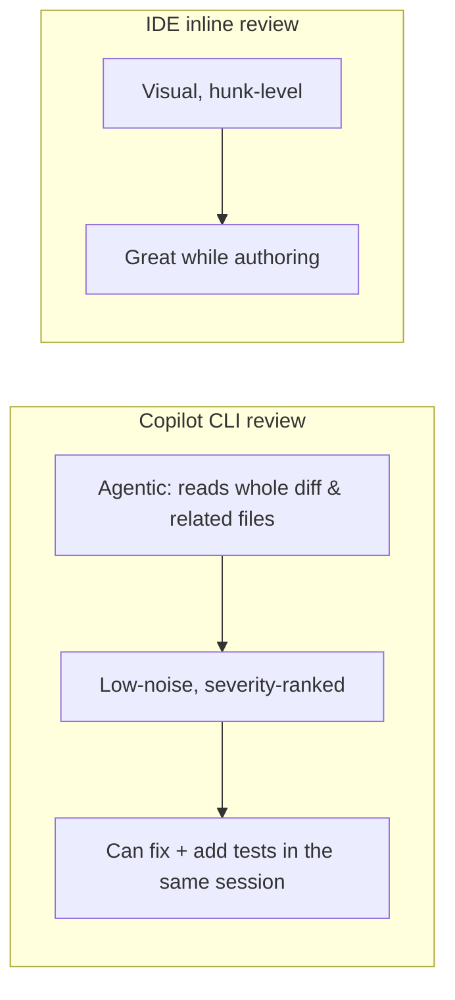

# Demo 2 · AI code review

**Theme:** quality. **Time:** ~20 min.
**Features:** built-in **Code review** agent, `@` file references, reviewing local changes and remote PRs.

> **Story so far:** [Demo 1](01_issue_to_pr.md) opened a PR adding a **Reset button** on the `feature/reset-button` branch. **This demo:** get that change reviewed — and hardened with a test — before a human sees it.

Get a review of your changes before a human reviewer does. In this workshop, "low-noise" means skipping style preferences and focusing on likely bugs, security risks, missing tests, and risky API usage ([Using Copilot CLI](https://docs.github.com/en/copilot/how-tos/use-copilot-agents/use-copilot-cli)).

---

## Prerequisites

- The `feature/reset-button` branch and its PR from [Demo 1](01_issue_to_pr.md) (or any branch with uncommitted/unpushed changes).
- Authenticated CLI.

---

## Steps

### 1. Review your branch against `main`

Make sure you're on the feature branch, then ask for a cross-check. The best-practices guide shows you can request multiple models. Model names change quickly, so pick two currently available models from `/model` rather than copying a stale name from slides or older notes ([Best practices](https://docs.github.com/en/copilot/how-tos/copilot-cli/cli-best-practices); [GPT-5.2 and GPT-5.2-Codex deprecated](https://github.blog/changelog/2026-06-05-gpt-5-2-and-gpt-5-2-codex-deprecated)):

```text
> !git switch feature/reset-button
> /review Use two currently available models from /model to review the changes on this branch against `main`. Focus on real bugs, missing tests, and risky React/telemetry patterns — not style.
```

If `/review` isn't available in your build, invoke the agent in natural language — it delegates to the Code review agent automatically:

```text
> Review the Reset-button changes on this branch against main. Surface only real bugs, missing tests, and risky patterns. Skip style nitpicks.
```

### 2. Scope the review to specific files

Add files to the prompt with `@` so Copilot grounds its review in their exact contents ([Using Copilot CLI](https://docs.github.com/en/copilot/how-tos/use-copilot-agents/use-copilot-cli)):

```text
> Review @src/App.tsx and @src/telemetry/react/hooks.ts for the Reset-button change. Check for missing telemetry properties, unguarded state updates, and an accessible name/label on the new button.
```

### 3. Review the remote pull request

Copilot can check the changes in a PR on GitHub.com and report serious problems ([About Copilot CLI](https://docs.github.com/en/copilot/concepts/agents/about-copilot-cli)):

```text
> Check the changes in my Reset-button PR on <your-username>/template-typescript-react. Report any serious errors you find in these changes.
```

### 4. Turn findings into fixes

Because this is an agent, you can act on the review in the same session — and close the loop with a regression test using the repo's existing Playwright pattern in `playwright/app.spec.ts`:

```text
> Fix the highest-severity issue you found. Then add a Playwright assertion in @playwright/app.spec.ts that clicks the Reset button and verifies the counter returns to "Count is 0". Run `pnpm test:e2e:playwright` and show me the diff.
```

### 5. Run the dedicated security review command

For security-specific checks, the CLI includes `/security-review`, now available to all users without enabling experimental mode. It analyzes local changes and reports high-confidence findings with severity and confidence ([copilot-cli changelog 1.0.64](https://github.com/github/copilot-cli/blob/main/changelog.md#1064---2026-06-23), [Dedicated security review command](https://github.blog/changelog/2026-06-10-dedicated-security-review-command-now-available-in-copilot-cli)).

```text
> /security-review
```

!!! note "Code review now reuses the CLI/SDK file tools"
    Copilot code review on GitHub.com now explores source with the same `grep`, `rg`, `glob`, and `view` tools built into the Copilot CLI and SDK, which trimmed review cost by about 20% with no workflow change. Organizations in the Medium analysis-depth preview can also set an organization-level default review level ([Copilot code review: Analysis depth and efficiency updates](https://github.blog/changelog/2026-06-25-copilot-code-review-analysis-depth-and-efficiency-updates)).

---

## Why this is different from inline IDE review



Use the CLI review as a **gate** (pre-PR, or in CI), and the IDE for **interactive authoring**. They complement each other — see [Access Methods](../access_methods.md).

---

## What you learned

- The Code review agent is best used with an explicit review policy: bugs, security, missing tests, and risky APIs; no style opinions.
- `@` file references scope a review precisely to the files the Reset feature touched.
- You can review a *remote PR* and act on the findings immediately, adding a regression test in the same session.

## Take it further

- Wire the same prompt into CI as a non-interactive step so every PR to this app is reviewed (see [Demo 4](04_cicd_automation.md)).
- Encode this review policy into a [custom agent](06_custom_agents_skills.md) so every review applies the same lens.
- GitHub also offers automated PR review on GitHub.com — [About GitHub Copilot code review](https://docs.github.com/en/copilot/concepts/agents/code-review).

Next: [Demo 3 · Codebase onboarding](03_onboarding.md).
