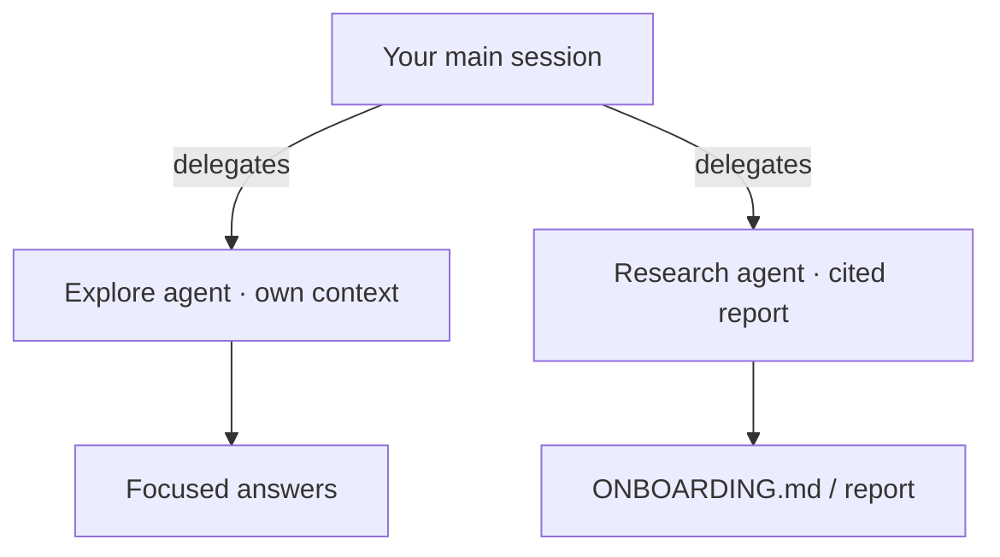

# Demo 3 · コードベースのオンボーディング

**テーマ:** 理解。**時間:** 約 20 分。
**機能:** 組み込みの **Explore**・**Research** エージェント、`@` 参照、マルチリポアクセス。

不慣れなリポジトリで素早く生産的になるには、まずコードベースに具体的な質問を投げかけます。Copilot CLI の **Explore** エージェントはメインのコンテキストを増やさずにコードに関する質問へ答え、**Research** はコード・関連リポジトリ・Web を横断する深い調査を引用付きで行います（[Using Copilot CLI](https://docs.github.com/en/copilot/how-tos/use-copilot-agents/use-copilot-cli)）。

---

## 前提条件

- 理解したいリポジトリ（自分が書いたものでないと理想的）。
- 認証済み CLI。

---

## 手順

### 1. オリエンテーションの質問をする

これらのオンボーディング用プロンプトは GitHub のベストプラクティスガイドそのままです（[Best practices](https://docs.github.com/en/copilot/how-tos/copilot-cli/cli-best-practices)）。

```text
> How is logging configured in this project?
> What's the pattern for adding a new API endpoint?
> Explain the authentication flow
> Where are the database migrations?
```

### 2. Explore エージェントでコンテキストをきれいに保つ

大きめの質問では、Explore エージェントに自分のコンテキストウィンドウで掘らせ、メインのセッションを集中させます（[Using Copilot CLI](https://docs.github.com/en/copilot/how-tos/use-copilot-agents/use-copilot-cli)）。

```text
> Use the Explore agent to map the request lifecycle from HTTP entry point to database, and list the key files involved.
```

### 3. Research で引用付きの深掘りを作る

```text
> Research how this project handles configuration and secrets. Compare it to common best practices and cite the files and any external references.
```

Research エージェントは **引用付き** の詳細なレポートを生成します（[Using Copilot CLI](https://docs.github.com/en/copilot/how-tos/use-copilot-agents/use-copilot-cli)）。

### 4. オンボーディング成果物を生成する

理解をチーム全体が再利用できるものに変えます。

```text
> Create ONBOARDING.md: architecture overview, how to build/test/run, key directories, and the 5 files a newcomer should read first. Cite real paths.
```

### 5. マイクロサービスではマルチリポへ

オンボーディングはしばしば複数サービスにまたがります。親ディレクトリから起動するか `/add-dir` でリポジトリを追加し、Copilot に横断推論させます（[Best practices](https://docs.github.com/en/copilot/how-tos/copilot-cli/cli-best-practices)）。

```bash
cd ~/projects        # parent of several repos
copilot
```

```text
> /add-dir /Users/me/projects/auth-service
> /add-dir /Users/me/projects/api-gateway
> /list-dirs
> Show me the current auth flow across @auth-service and @api-gateway, and where they could drift.
```

---



---

## 学んだこと

- Explore はメインのコンテキストを膨らませずにコードの質問に答える。
- Research は引用付きの詳細なレポートを生成する。
- マルチリポアクセス（`/add-dir`、親ディレクトリ起動）でマイクロサービスのオンボーディングが扱いやすくなる。

## さらに進める

- 生成した `ONBOARDING.md` と良い質問を [スキル](06_custom_agents_skills.md) として保存し、新メンバー全員が同じガイドツアーを受けられるようにする。
- このリポジトリで同じ探索を実行: [template-github-copilot](https://github.com/ks6088ts/template-github-copilot) をクローンし、`src/python` と `src/go` をマップするよう Copilot に依頼する。

次へ: [Demo 4 · CI/CD 非対話自動化](04_cicd_automation.md)。
