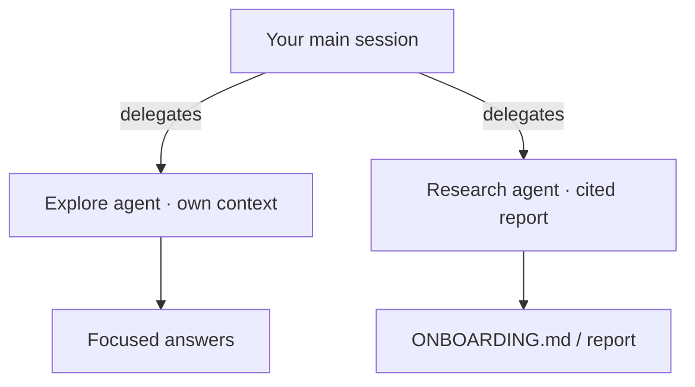

# Demo 3 · コードベースのオンボーディング

**テーマ:** 理解。**時間:** 約 20 分。
**機能:** 組み込みの **Explore**・**Research** エージェント、`@` 参照、マルチリポアクセス。

> **これまで:** 小さな変更を出荷・レビューしました。**このデモ:** 続くデモのより大きな作業に取りかかる前に、**template-typescript-react** の **テレメトリ**・**E2E**・**CI** サブシステムを深く理解します。

不慣れなリポジトリで素早く生産的になるには、まずコードベースに具体的な質問を投げかけます。Copilot CLI の **Explore** エージェントはメインのコンテキストを増やさずにコードに関する質問へ答え、**Research** はコード・関連リポジトリ・Web を横断する深い調査を引用付きで行います（[Using Copilot CLI](https://docs.github.com/en/copilot/how-tos/use-copilot-agents/use-copilot-cli)）。

---

## 前提条件

- [template-typescript-react](https://github.com/ks6088ts/template-typescript-react) のクローン。
- 認証済み CLI。

---

## 手順

### 1. オリエンテーションの質問をする

同じベストプラクティスのオンボーディング用プロンプトを、このアプリの実際のサブシステムに向けます（[Best practices](https://docs.github.com/en/copilot/how-tos/copilot-cli/cli-best-practices)）。

```text
> How is frontend telemetry configured in this project, and which provider is used by default?
> What's the pattern for tracking a user interaction? Show an example from src/App.tsx.
> Where are the E2E tests, and what's the difference between the Vitest browser suite and the Playwright suite?
> What does `make ci-test` run, and how is it wired into GitHub Actions?
```

### 2. Explore エージェントでコンテキストをきれいに保つ

大きめの質問では、Explore エージェントに自分のコンテキストウィンドウで掘らせ、メインのセッションを集中させます（[Using Copilot CLI](https://docs.github.com/en/copilot/how-tos/use-copilot-agents/use-copilot-cli)）。

```text
> Use the Explore agent to map the telemetry flow from a button click in src/App.tsx through src/telemetry/ to the configured provider, and list the key files involved.
```

### 3. Research で引用付きの深掘りを作る

```text
> Research how this project handles frontend telemetry and observability (src/telemetry/ and docker/). Compare it to common best practices and cite the files and any external references.
```

Research エージェントは **引用付き** の詳細なレポートを生成します（[Using Copilot CLI](https://docs.github.com/en/copilot/how-tos/use-copilot-agents/use-copilot-cli)）。

### 4. オンボーディング成果物を生成する

理解をチーム全体が再利用できるものに変えます。

```text
> Create ONBOARDING.md: architecture overview, how to install/dev/build/test (the pnpm scripts and `make` targets), key directories, and the 5 files a newcomer should read first. Cite real paths like src/App.tsx, src/telemetry/, and playwright/.
```

### 5. スタックを横断してテレメトリをコレクターまで追う

このアプリは OpenTelemetry データを `docker/` のローカルスタック（OTel Collector + Grafana LGTM）へエクスポートできます。`@` 参照でその経路を端から端まで辿ります。

```text
> Explain how a trackEvent call in @src/App.tsx reaches the OTel Collector and Grafana. Reference @src/telemetry/providers/OtelProvider.ts, @docker/otel-collector/config.yaml, and @docker/compose.yaml.
```

オンボーディングが複数リポジトリにまたがる場合（たとえばこのテレメトリを受け取るバックエンド）は、`/add-dir` で追加して Copilot に横断推論させます（[Best practices](https://docs.github.com/en/copilot/how-tos/copilot-cli/cli-best-practices)）。

```text
> /add-dir /path/to/your-backend
> /list-dirs
> Compare the OTLP export config in this app with what the backend collector expects, and flag any mismatch.
```

---



---

## 学んだこと

- Explore はメインのコンテキストを膨らませずにコードの質問に答える。
- Research は `src/telemetry/` のような実際のサブシステムについて引用付きの詳細なレポートを生成する。
- マルチリポアクセス（`/add-dir`、親ディレクトリ起動）でスタック横断のオンボーディングが扱いやすくなる。

## さらに進める

- 生成した `ONBOARDING.md` と良い質問を [スキル](06_custom_agents_skills.md) として保存し、新メンバー全員が同じガイドツアーを受けられるようにする。
- `src/telemetry/providers/` 配下のテレメトリプロバイダー階層（`Noop`、`AppInsights`、`Otel`、`Composite`）を Mermaid グラフとして図示するよう Copilot に依頼し、ドキュメントに加える。

次へ: [Demo 4 · CI/CD 非対話自動化](04_cicd_automation.md)。
