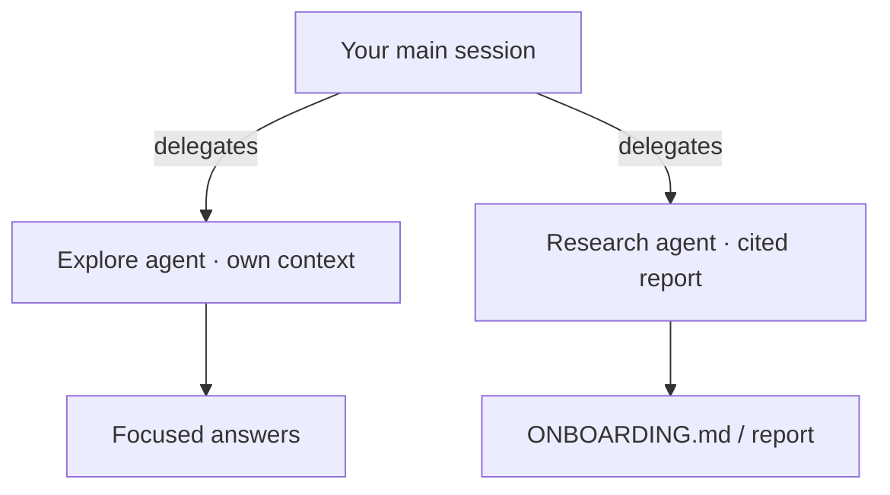

# Demo 3 · Codebase onboarding

**Theme:** understanding. **Time:** ~20 min.
**Features:** built-in **Explore** and **Research** agents, `@` references, multi-repo access.

The fastest way to get productive in an unfamiliar repository is to interrogate it. Copilot CLI's **Explore** agent answers questions about your code *without* adding to your main context, and **Research** does deep, cited investigation across code, related repos, and the web ([Using Copilot CLI](https://docs.github.com/en/copilot/how-tos/use-copilot-agents/use-copilot-cli)).

---

## Prerequisites

- A repository you want to understand (ideally one you didn't write).
- Authenticated CLI.

---

## Steps

### 1. Ask orientation questions

These onboarding prompts are straight from GitHub's best-practices guide ([Best practices](https://docs.github.com/en/copilot/how-tos/copilot-cli/cli-best-practices)):

```text
> How is logging configured in this project?
> What's the pattern for adding a new API endpoint?
> Explain the authentication flow
> Where are the database migrations?
```

### 2. Use the Explore agent to keep context clean

For larger questions, let the Explore agent do the digging in its own context window so your main session stays focused ([Using Copilot CLI](https://docs.github.com/en/copilot/how-tos/use-copilot-agents/use-copilot-cli)):

```text
> Use the Explore agent to map the request lifecycle from HTTP entry point to database, and list the key files involved.
```

### 3. Produce a cited deep-dive with Research

```text
> Research how this project handles configuration and secrets. Compare it to common best practices and cite the files and any external references.
```

The Research agent produces a detailed report **with citations** ([Using Copilot CLI](https://docs.github.com/en/copilot/how-tos/use-copilot-agents/use-copilot-cli)).

### 4. Generate onboarding artifacts

Turn understanding into something the whole team reuses:

```text
> Create ONBOARDING.md: architecture overview, how to build/test/run, key directories, and the 5 files a newcomer should read first. Cite real paths.
```

### 5. Go multi-repo for microservices

Onboarding often spans services. Launch from a parent directory, or add repos with `/add-dir`, to let Copilot reason across them ([Best practices](https://docs.github.com/en/copilot/how-tos/copilot-cli/cli-best-practices)):

```bash
cd ~/projects        # parent of several repos
copilot
```

```text
> /add-dir /Users/me/projects/auth-service
> /add-dir /Users/me/projects/api-gateway
> /list-dirs
> Show me the current auth flow across @auth-service and @api-gateway, and where they could drift.
```

---



---

## What you learned

- Explore answers code questions without bloating your main context.
- Research produces cited, in-depth reports.
- Multi-repo access (`/add-dir`, parent-dir launch) makes microservice onboarding tractable.

## Take it further

- Save the generated `ONBOARDING.md` and your best questions as a [skill](06_custom_agents_skills.md) so every new hire gets the same guided tour.
- Run the same exploration in this repo: clone [template-github-copilot](https://github.com/ks6088ts/template-github-copilot) and ask Copilot to map `src/python` and `src/go`.

Next: [Demo 4 · CI/CD non-interactive automation](04_cicd_automation.md).
