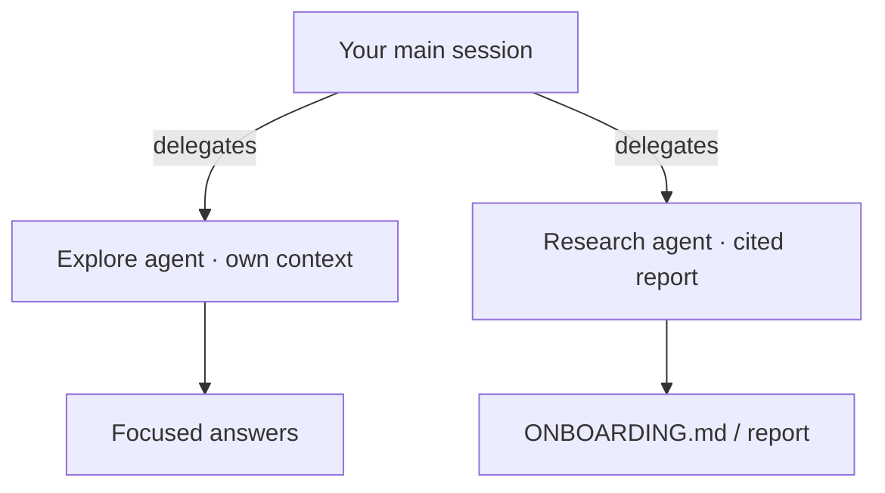

# Demo 3 · Codebase onboarding

**Theme:** understanding. **Time:** ~20 min.
**Features:** built-in **Explore** and **Research** agents, `@` references, multi-repo access.

> **Story so far:** You've shipped and reviewed a small change. **This demo:** go deeper — understand the **telemetry**, **E2E**, and **CI** subsystems of **template-typescript-react** before you take on the bigger work in the demos that follow.

The fastest way to get productive in an unfamiliar repository is to interrogate it. Copilot CLI's **Explore** agent answers questions about your code *without* adding to your main context, and **Research** does deep, cited investigation across code, related repos, and the web ([Using Copilot CLI](https://docs.github.com/en/copilot/how-tos/use-copilot-agents/use-copilot-cli)).

---

## Prerequisites

- Your clone of [template-typescript-react](https://github.com/ks6088ts/template-typescript-react).
- Authenticated CLI.

---

## Steps

### 1. Ask orientation questions

Point the same best-practice onboarding prompts at this app's real subsystems ([Best practices](https://docs.github.com/en/copilot/how-tos/copilot-cli/cli-best-practices)):

```text
> How is frontend telemetry configured in this project, and which provider is used by default?
> What's the pattern for tracking a user interaction? Show an example from src/App.tsx.
> Where are the E2E tests, and what's the difference between the Vitest browser suite and the Playwright suite?
> What does `make ci-test` run, and how is it wired into GitHub Actions?
```

### 2. Use the Explore agent to keep context clean

For larger questions, let the Explore agent do the digging in its own context window so your main session stays focused ([Using Copilot CLI](https://docs.github.com/en/copilot/how-tos/use-copilot-agents/use-copilot-cli)):

```text
> Use the Explore agent to map the telemetry flow from a button click in src/App.tsx through src/telemetry/ to the configured provider, and list the key files involved.
```

### 3. Produce a cited deep-dive with Research

```text
> Research how this project handles frontend telemetry and observability (src/telemetry/ and docker/). Compare it to common best practices and cite the files and any external references.
```

The Research agent produces a detailed report **with citations** ([Using Copilot CLI](https://docs.github.com/en/copilot/how-tos/use-copilot-agents/use-copilot-cli)).

### 4. Generate onboarding artifacts

Turn understanding into something the whole team reuses:

```text
> Create ONBOARDING.md: architecture overview, how to install/dev/build/test (the pnpm scripts and `make` targets), key directories, and the 5 files a newcomer should read first. Cite real paths like src/App.tsx, src/telemetry/, and playwright/.
```

### 5. Cross-stack: follow telemetry to the collector

The app can export OpenTelemetry data to the local stack in `docker/` (OTel Collector + Grafana LGTM). Trace the path end to end with `@` references:

```text
> Explain how a trackEvent call in @src/App.tsx reaches the OTel Collector and Grafana. Reference @src/telemetry/providers/OtelProvider.ts, @docker/otel-collector/config.yaml, and @docker/compose.yaml.
```

When onboarding spans repos — say a backend that receives this telemetry — add them with `/add-dir` and let Copilot reason across them ([Best practices](https://docs.github.com/en/copilot/how-tos/copilot-cli/cli-best-practices)):

```text
> /add-dir /path/to/your-backend
> /list-dirs
> Compare the OTLP export config in this app with what the backend collector expects, and flag any mismatch.
```

---



---

## What you learned

- Explore answers code questions without bloating your main context.
- Research produces cited, in-depth reports on real subsystems like `src/telemetry/`.
- Multi-repo access (`/add-dir`, parent-dir launch) makes cross-stack onboarding tractable.

## Take it further

- Save the generated `ONBOARDING.md` and your best questions as a [skill](06_custom_agents_skills.md) so every new hire gets the same guided tour.
- Ask Copilot to diagram the telemetry provider hierarchy (`Noop`, `AppInsights`, `Otel`, `Composite`) under `src/telemetry/providers/` as a Mermaid graph for the docs.

Next: [Demo 4 · CI/CD non-interactive automation](04_cicd_automation.md).
