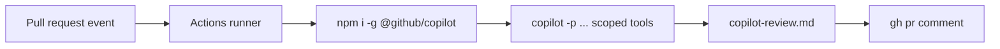

# Demo 4 · CI/CD 非対話自動化

**テーマ:** 自動化。**時間:** 約 30 分。
**機能:** プログラマティックモード（`copilot -p`）、PAT 認証、スコープ付きツール権限、GitHub Actions。

CLI のプログラマティックモード（`-p`／`--prompt`）は、プロンプトを 1 回実行して終了します。そのため、スクリプトや CI/CD パイプラインに組み込みやすい形式です（[About Copilot CLI](https://docs.github.com/en/copilot/concepts/agents/about-copilot-cli)）。

!!! danger "自動化では最小権限を"
    自動承認は Copilot にあなたと同じアクセスを与えます。CI では `--allow-all-tools` を **無闇に** 使ってはいけません。`--allow-tool`／`--deny-tool` でツールをスコープし、読み取り中心のタスクにとどめ、[サンドボックス](../features.md#sandboxing) を優先してください（[Security considerations](https://docs.github.com/en/copilot/concepts/agents/about-copilot-cli#security-implications-of-automatic-tool-approval)）。

---

## 前提条件

- **Copilot Requests** 権限を付与した fine-grained **PAT**（[Getting Started → 認証](../getting_started.md#authenticate) を参照）。`COPILOT_CLI_TOKEN` として保存し、CLI には `COPILOT_GITHUB_TOKEN` として渡します。
- GitHub Actions ワークフローを追加できるリポジトリ。

---

## Part A — ローカルのスクリプト実行

まずは手元から。対話なしの単一コマンドです（[About Copilot CLI](https://docs.github.com/en/copilot/concepts/agents/about-copilot-cli)）。

```bash
copilot -p "Show me this week's commits and summarize them" --allow-tool='shell(git)'
```

別のプログラムからオプション／プロンプトを `copilot` にパイプすることもできます（[About Copilot CLI](https://docs.github.com/en/copilot/concepts/agents/about-copilot-cli)）。

```bash
./generate-prompt.sh | copilot
```

レポートファイルだけを書き、それ以外は何も変更しない、読み取り中心のトリアージ例です。

```bash
copilot -p "Review the diff of HEAD against origin/main for security issues. \
Write findings to review.md as a checklist. Do not modify source files." \
  --allow-tool='shell(git:*)' \
  --allow-tool='write' \
  --deny-tool='shell(git push)' \
  --deny-tool='shell(rm)'
```

---

## Part B — GitHub Actions ワークフロー

同じ考え方を CI に組み込みます。この例は、すべてのプルリクエストで自動レビューを実行し、結果をコメントとして投稿します。**読み取り中心** で、Copilot は `git` の実行とレポートファイルの書き込みはできますが、push や破壊的コマンドは禁止されています。

```yaml
# .github/workflows/copilot-review.yml
name: Copilot CLI review
on:
  pull_request:
    types: [opened, synchronize]

permissions:
  contents: read
  pull-requests: write

jobs:
  review:
    runs-on: ubuntu-latest
    steps:
      - uses: actions/checkout@v4
        with:
          fetch-depth: 0   # need history to diff against the base

      - uses: actions/setup-node@v4
        with:
          node-version: 20

      - name: Install Copilot CLI
        run: npm install -g @github/copilot

      - name: Run Copilot review
        env:
          # PAT with "Copilot Requests" permission
          COPILOT_GITHUB_TOKEN: ${{ secrets.COPILOT_CLI_TOKEN }}
        run: |
          copilot -p "Review the changes in this PR (diff ${{ github.event.pull_request.base.sha }}..${{ github.sha }}). \
          Focus on bugs and security. Write a concise markdown summary to copilot-review.md." \
            --allow-tool='shell(git:*)' \
            --allow-tool='write' \
            --deny-tool='shell(git push)' \
            --deny-tool='shell(rm)'

      - name: Post review as a comment
        env:
          GH_TOKEN: ${{ secrets.GITHUB_TOKEN }}
        run: gh pr comment "${{ github.event.pull_request.number }}" --body-file copilot-review.md
```

要点。

- **インストール** は公式の npm パッケージ `@github/copilot` を使用（[README](https://github.com/github/copilot-cli)）。
- **認証** は `COPILOT_GITHUB_TOKEN` で公開した PAT を使います。`GH_TOKEN` や `GITHUB_TOKEN` は `gh` や Actions でも使われるため、曖昧さを避けられます。古い例のように `GH_TOKEN` を使う場合は、`copilot help environment` と changelog で現在の優先順位を確認してください（[copilot-cli changelog 0.0.354](https://github.com/github/copilot-cli/blob/main/changelog.md#00354---2025-11-03)）。
- **権限** は明示的にスコープ。Copilot は履歴の読み取りと 1 ファイルの書き込みのみ可能で、それ以外は不可（[Security considerations](https://docs.github.com/en/copilot/concepts/agents/about-copilot-cli#using-the-approval-options)）。
- PAT は `COPILOT_CLI_TOKEN` リポジトリシークレットとして保存します。プロンプトごとにプレミアムリクエストを消費します（[README](https://github.com/github/copilot-cli)）。

!!! tip "prompt mode のジョブは冪等にする"
  CI は再実行されます。2 回目の実行でも安全に既存出力を検出できるプロンプトにしてください。たとえば「`copilot-review.md` を update or create」する方が、「findings を append」するより安全です。ワークフローが明示的に公開を目的としていない限り、`git push`、デプロイコマンド、破壊的なファイル操作は deny します。prompt mode の repo hooks や workspace MCP の読み込み挙動は過去に変わっているため、CI ジョブでは必要なツールと設定を明示してください（[copilot-cli changelog](https://github.com/github/copilot-cli/blob/main/changelog.md)）。



---

## Part C — ローカルのスケジュール自動化

対話セッション内では、`/every` で繰り返しプロンプトを、`/after` で遅延付きの単発プロンプトをスケジュールできます（[Using Copilot CLI](https://docs.github.com/en/copilot/how-tos/use-copilot-agents/use-copilot-cli)）。

```text
> /every 1h Run frontend tests and report any failures
```

---

## 学んだこと

- `copilot -p` はプロンプトを 1 回実行して終了するため、レポート生成、チェック、リリースジョブに向く。
- PAT ＋ `COPILOT_GITHUB_TOKEN` で CI 内のヘッドレス認証が可能。
- スコープ付きの `--allow-tool`／`--deny-tool` フラグでパイプラインに最小権限を強制できる。

## さらに進める

- Copilot が高深刻度の問題を見つけたらチェックを **失敗させる** ようにする（`copilot-review.md` を解析）。
- [Demo 8](08_release_notes.md) と組み合わせ、タグ push 時にリリースノートを自動ドラフトする。
- GitHub の [Best practices → Team guidelines](https://docs.github.com/en/copilot/how-tos/copilot-cli/cli-best-practices) のチーム向けガイダンスを読む。

次へ: [Demo 5 · MCP サーバー連携](05_mcp_integration.md)。
