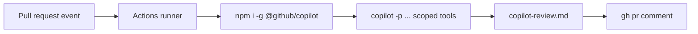

# Demo 4 · CI/CD non-interactive automation

**Theme:** automation. **Time:** ~30 min.
**Features:** programmatic mode (`copilot -p`), PAT auth, scoped tool permissions, GitHub Actions.

> **Story so far:** You can build and review changes by hand. **This demo:** automate that review in CI so **every** pull request to **template-typescript-react** gets a Copilot pass — right next to the repo's existing `test.yaml` and `e2e-test.yaml` workflows.

The CLI's programmatic mode (`-p`/`--prompt`) runs one prompt and exits, which makes it practical for scripts and CI/CD pipelines ([About Copilot CLI](https://docs.github.com/en/copilot/concepts/agents/about-copilot-cli)).

!!! danger "Least privilege in automation"
    Automatic approval gives Copilot the same access you have. In CI, **never** reach for `--allow-all-tools` blindly. Scope tools with `--allow-tool`/`--deny-tool`, run read-mostly tasks, and prefer a [sandbox](../features.md#sandboxing) ([Security considerations](https://docs.github.com/en/copilot/concepts/agents/about-copilot-cli#security-implications-of-automatic-tool-approval)).

---

## Prerequisites

- A fine-grained **PAT** with the **Copilot Requests** permission (see [Getting Started → Authenticate](../getting_started.md#authenticate)). Store it as `COPILOT_CLI_TOKEN` and expose it to the CLI as `COPILOT_GITHUB_TOKEN`.
- Your fork of template-typescript-react, where you can add a GitHub Actions workflow.

---

## Part A — local scripted run

Start with your laptop. A single command, no interaction ([About Copilot CLI](https://docs.github.com/en/copilot/concepts/agents/about-copilot-cli)):

```bash
copilot -p "Show me this week's commits on this repo and summarize them by area (src, telemetry, tests, ci)" --allow-tool='shell(git)'
```

You can also feed options/prompt from another program by piping into `copilot` ([About Copilot CLI](https://docs.github.com/en/copilot/concepts/agents/about-copilot-cli)):

```bash
./generate-prompt.sh | copilot
```

A read-mostly triage example that writes a report file but nothing else:

```bash
copilot -p "Review the diff of HEAD against origin/main for bugs and security issues. \
Write findings to review.md as a checklist. Do not modify source files." \
  --allow-tool='shell(git:*)' \
  --allow-tool='write' \
  --deny-tool='shell(git push)' \
  --deny-tool='shell(rm)'
```

---

## Part B — GitHub Actions workflow

Wire the same idea into CI. This example runs an automated review on every pull request and posts the result as a comment. It is **read-mostly**: Copilot may run `git` and write a report file, but is denied push/destructive commands. It sits alongside the app's existing `test.yaml` (which runs `make ci-test`) and `e2e-test.yaml` workflows.

```yaml
# .github/workflows/copilot-review.yml
name: Copilot CLI review
on:
  pull_request:
    types: [opened, synchronize]

permissions:
  contents: read
  pull-requests: write

jobs:
  review:
    runs-on: ubuntu-latest
    steps:
      - uses: actions/checkout@v4
        with:
          fetch-depth: 0   # need history to diff against the base

      - uses: actions/setup-node@v4
        with:
          node-version: 24   # matches the app's CI (see test.yaml)

      - name: Install Copilot CLI
        run: npm install -g @github/copilot

      - name: Run Copilot review
        env:
          # PAT with "Copilot Requests" permission
          COPILOT_GITHUB_TOKEN: ${{ secrets.COPILOT_CLI_TOKEN }}
        run: |
          copilot -p "Review the changes in this PR (diff ${{ github.event.pull_request.base.sha }}..${{ github.sha }}). \
          Focus on bugs, security, and missing tests in this React + TypeScript app. Write a concise markdown summary to copilot-review.md." \
            --allow-tool='shell(git:*)' \
            --allow-tool='write' \
            --deny-tool='shell(git push)' \
            --deny-tool='shell(rm)'

      - name: Post review as a comment
        env:
          GH_TOKEN: ${{ secrets.GITHUB_TOKEN }}
        run: gh pr comment "${{ github.event.pull_request.number }}" --body-file copilot-review.md
```

Key points:

- **Install** uses the official npm package `@github/copilot` ([README](https://github.com/github/copilot-cli)).
- **Auth** uses a PAT exposed as `COPILOT_GITHUB_TOKEN`, which avoids ambiguity with `GH_TOKEN` and `GITHUB_TOKEN` used by `gh` and Actions. If you use older examples with `GH_TOKEN`, confirm current precedence with `copilot help environment` and the changelog ([copilot-cli changelog 0.0.354](https://github.com/github/copilot-cli/blob/main/changelog.md#00354---2025-11-03)).
- **Permissions** are explicitly scoped — Copilot can read history and write one file, nothing else ([Security considerations](https://docs.github.com/en/copilot/concepts/agents/about-copilot-cli#using-the-approval-options)).
- Store the PAT as the `COPILOT_CLI_TOKEN` repository secret. Each prompt consumes a premium request ([README](https://github.com/github/copilot-cli)).

!!! note "If your workflow opens a pull request"
    This example posts a comment, so the built-in `GITHUB_TOKEN` is enough. If you instead let a workflow **open a pull request** with `GITHUB_TOKEN` (for example `gh pr create`), first enable **Settings → Actions → General → Workflow permissions → Allow GitHub Actions to create and approve pull requests** for the repository (or its organization). New personal-account repositories have this **off by default**, so the job fails with `GitHub Actions is not permitted to create or approve pull requests (createPullRequest)`. A user PAT used in place of `GITHUB_TOKEN` is not subject to this guard ([Preventing GitHub Actions from creating or approving pull requests](https://docs.github.com/en/repositories/managing-your-repositorys-settings-and-features/enabling-features-for-your-repository/managing-github-actions-settings-for-a-repository#preventing-github-actions-from-creating-or-approving-pull-requests)).

!!! tip "Make prompt-mode jobs idempotent"
  CI reruns happen. Write prompts so a second run can safely detect existing output: "update or create `copilot-review.md`" is safer than "append findings." Keep `git push`, deployment commands, and destructive file operations denied unless the workflow is explicitly designed to publish changes. The CLI changelog also notes that prompt mode has changed over time for repo hooks and workspace MCP loading, so keep CI jobs explicit about required tools and config ([copilot-cli changelog](https://github.com/github/copilot-cli/blob/main/changelog.md)).



---

## Part C — scheduled local automation

Inside an interactive session you can also schedule recurring prompts with `/every` and one-shot delayed prompts with `/after` ([Using Copilot CLI](https://docs.github.com/en/copilot/how-tos/use-copilot-agents/use-copilot-cli)):

```text
> /every 1h Run `pnpm test:e2e` and report any failures
```

---

## What you learned

- `copilot -p` runs one prompt and exits, which fits report generation, checks, and release jobs.
- PAT + `COPILOT_GITHUB_TOKEN` enables headless auth in CI.
- Scoped `--allow-tool`/`--deny-tool` flags enforce least privilege in pipelines.

## Take it further

- Make the workflow **fail the check** when Copilot finds a high-severity issue (parse `copilot-review.md`).
- Combine with [Demo 8](08_release_notes.md) to auto-draft release notes on tag pushes.
- Read the team guidance in GitHub's [Best practices → Team guidelines](https://docs.github.com/en/copilot/how-tos/copilot-cli/cli-best-practices).

Next: [Demo 5 · MCP server integration](05_mcp_integration.md).
