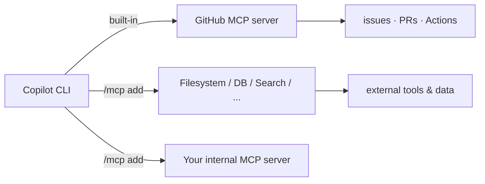

# Demo 5 · MCP サーバー連携

**テーマ:** 拡張性。**時間:** 約 25 分。
**機能:** `/mcp`、`/mcp add`、ユーザー／ワークスペース MCP 設定、サーバー単位のツール権限。

**Model Context Protocol（MCP）** は、Copilot が外部ツールやデータソースに到達するためのオープン標準です。CLI は **GitHub MCP サーバーをあらかじめ構成** して同梱しており、さらにサーバーを追加して Copilot にできることを拡張できます（[Using Copilot CLI](https://docs.github.com/en/copilot/how-tos/use-copilot-agents/use-copilot-cli)、[About MCP](https://docs.github.com/en/copilot/concepts/context/mcp)）。



---

## 前提条件

- 認証済み CLI。
- 追加する MCP サーバー。信頼できるサーバーを使ってください。以下の手順は汎用です。

---

## 手順

### 1. すでに配線済みのものを一覧する

```text
> /mcp
```

**GitHub** サーバーが既定で表示されます。これが Demo 1〜2 を支えていました（[Using Copilot CLI](https://docs.github.com/en/copilot/how-tos/use-copilot-agents/use-copilot-cli)）。

### 2. サーバーを対話的に追加する

```text
> /mcp add
```

各フィールドを入力し、++tab++ で移動し、++ctrl+s++ で保存します（[Using Copilot CLI](https://docs.github.com/en/copilot/how-tos/use-copilot-agents/use-copilot-cli)）。

### 3. または設定ファイルを直接編集する

ユーザーレベルのサーバー定義は、既定で `~/.copilot` 配下の `mcp-config.json` に保存されます（場所は `COPILOT_HOME` で上書き可能）（[Using Copilot CLI](https://docs.github.com/en/copilot/how-tos/use-copilot-agents/use-copilot-cli)）。最近の CLI では `.github/mcp.json` のようなワークスペース MCP 設定も読み込みます。固定の設定レイアウトを教える前に changelog を確認してください（[copilot-cli changelog 1.0.61](https://github.com/github/copilot-cli/blob/main/changelog.md#1061---2026-06-09)）。ローカル（stdio）サーバーのエントリは次のようになります。正式な JSON 構造は [MCP 設定リファレンス](https://docs.github.com/en/copilot/how-tos/use-copilot-agents/cloud-agent/extend-cloud-agent-with-mcp#writing-a-json-configuration-for-mcp-servers) を参照してください。

```json
{
  "mcpServers": {
    "my-tools": {
      "command": "npx",
      "args": ["-y", "@modelcontextprotocol/server-everything"],
      "env": {}
    }
  }
}
```

!!! warning "信頼できるサーバーだけを追加する"
    MCP サーバーはエージェントに強力なツールを公開しうるものです。提供元を精査し、バージョンを固定し、シークレットは環境変数で渡してください。ハードコードしないこと。

### MCP 起動時のトラブルシューティング

Copilot がサーバーを使えない場合、プロンプトを変える前にサーバー側を診断します。

1. `/mcp` を実行し、サーバーが有効化され、認証済みで、期待するツールを公開しているか確認する。
2. サーバーの起動コマンドを Copilot の外で実行し、起動時間と stderr を確認する。
3. 環境変数と OAuth 資格情報がサーバープロセスに渡っているか確認する。config にハードコードしない。
4. 使っていないサーバーは無効化する。ツール一覧が大きいとトークンと起動時間の負荷になります。CLI 1.0.63 で追加された `deferTools` は、tool search 有効時でも特定 MCP ツールを常に利用可能に保つ設定です（[copilot-cli changelog 1.0.63](https://github.com/github/copilot-cli/blob/main/changelog.md#1063---2026-06-15)）。

### 4. 新しいツールを使う

プロンプトでサーバー名を挙げると、Copilot が正しいツールを選びやすくなります（[About Copilot CLI](https://docs.github.com/en/copilot/concepts/agents/about-copilot-cli)）。

```text
> Use the GitHub MCP server to find good first issues for a new team member in OWNER/REPO
> Use my-tools to <do the thing that server provides>
```

### 5. 権限で MCP ツールを統制する

ツールはサーバー単位またはツール単位で許可／禁止します（[About Copilot CLI](https://docs.github.com/en/copilot/concepts/agents/about-copilot-cli#using-the-approval-options)）。

```bash
# Allow everything from my-tools EXCEPT one risky tool
copilot --allow-tool='my-tools' --deny-tool='my-tools(dangerous_tool)'
```

サーバーの正確な名前とツールは、`/mcp` を実行して選択すると分かります（[About Copilot CLI](https://docs.github.com/en/copilot/concepts/agents/about-copilot-cli)）。

!!! note "組織ポリシーの制限"
    一部の組織レベル MCP ポリシー（例: *MCP servers in Copilot*、*MCP Registry URL*）は CLI で **まだ強制されません**。ガバナンスで頼る前に把握しておいてください（[Security considerations](https://docs.github.com/en/copilot/concepts/agents/about-copilot-cli#known-mcp-server-policy-limitations)）。

---

## 学んだこと

- GitHub MCP サーバーは組み込み。`/mcp add`、ユーザー設定、ワークスペース設定でエージェントを拡張できる。
- サーバー単位／ツール単位の許可・禁止フラグで MCP アクセスを統制できる。
- 一部の組織 MCP ポリシーはまだ CLI で強制されない。

## さらに進める

- ドメイン固有のサーバー（データベース、可観測性、社内 API）を追加し、Copilot が本来答えられない質問に答えられるようにする。
- [Copilot SDK](../../copilot_sdk_tutorial/index.md) がツールをプログラム的に配線する方法と比較する。

次へ: [Demo 6 · カスタムエージェントとスキル](06_custom_agents_skills.md)。
