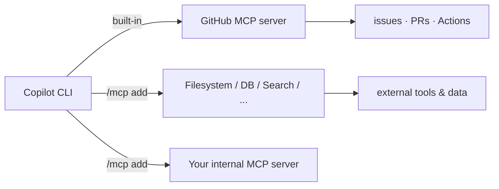

# Demo 5 · MCP server integration

**Theme:** extensibility. **Time:** ~25 min.
**Features:** `/mcp`, `/mcp add`, user/workspace MCP config, per-server tool permissions.

The **Model Context Protocol (MCP)** is the open standard that lets Copilot reach external tools and data sources. The CLI ships with the **GitHub MCP server pre-configured**, and you can add more to extend what Copilot can do ([Using Copilot CLI](https://docs.github.com/en/copilot/how-tos/use-copilot-agents/use-copilot-cli); [About MCP](https://docs.github.com/en/copilot/concepts/context/mcp)).



---

## Prerequisites

- Authenticated CLI.
- An MCP server to add. Use any server you trust; the steps below are generic.

---

## Steps

### 1. List what's already wired up

```text
> /mcp
```

The **GitHub** server appears by default — that is what powered Demos 1–2 ([Using Copilot CLI](https://docs.github.com/en/copilot/how-tos/use-copilot-agents/use-copilot-cli)).

### 2. Add a server interactively

```text
> /mcp add
```

Fill in the fields, moving between them with ++tab++, then press ++ctrl+s++ to save ([Using Copilot CLI](https://docs.github.com/en/copilot/how-tos/use-copilot-agents/use-copilot-cli)).

### 3. Or edit the config file directly

User-level server definitions are stored in `mcp-config.json`, by default under `~/.copilot` (override the location with `COPILOT_HOME`) ([Using Copilot CLI](https://docs.github.com/en/copilot/how-tos/use-copilot-agents/use-copilot-cli)). Recent CLI releases also load workspace MCP config such as `.github/mcp.json`; check the changelog before teaching a fixed config layout ([copilot-cli changelog 1.0.61](https://github.com/github/copilot-cli/blob/main/changelog.md#1061---2026-06-09)). A local (stdio) server entry looks like this — see the canonical JSON structure in the [MCP configuration reference](https://docs.github.com/en/copilot/how-tos/use-copilot-agents/cloud-agent/extend-cloud-agent-with-mcp#writing-a-json-configuration-for-mcp-servers):

```json
{
  "mcpServers": {
    "my-tools": {
      "command": "npx",
      "args": ["-y", "@modelcontextprotocol/server-everything"],
      "env": {}
    }
  }
}
```

!!! warning "Only add servers you trust"
    An MCP server can expose powerful tools to the agent. Vet the source, pin versions, and pass secrets via environment variables — never hard-code them.

### Troubleshooting MCP startup

If Copilot cannot use a server, diagnose the server before changing your prompt:

1. Run `/mcp` and inspect whether the server is enabled, authenticated, and exposing the expected tools.
2. Run the server command outside Copilot to verify startup time and stderr output.
3. Confirm environment variables and OAuth credentials are passed to the server process, not hard-coded into config.
4. Disable unused servers; large tool lists add token and startup overhead. The `deferTools` option added in CLI 1.0.63 keeps selected MCP tools available even when tool search is enabled ([copilot-cli changelog 1.0.63](https://github.com/github/copilot-cli/blob/main/changelog.md#1063---2026-06-15)).

### 4. Use the new tools

Naming the server in your prompt helps Copilot pick the right tool ([About Copilot CLI](https://docs.github.com/en/copilot/concepts/agents/about-copilot-cli)):

```text
> Use the GitHub MCP server to find good first issues for a new team member in OWNER/REPO
> Use my-tools to <do the thing that server provides>
```

### 5. Govern MCP tools with permissions

Allow or deny tools at the server or tool level ([About Copilot CLI](https://docs.github.com/en/copilot/concepts/agents/about-copilot-cli#using-the-approval-options)):

```bash
# Allow everything from my-tools EXCEPT one risky tool
copilot --allow-tool='my-tools' --deny-tool='my-tools(dangerous_tool)'
```

Find a server's exact name and tools by running `/mcp` and selecting it ([About Copilot CLI](https://docs.github.com/en/copilot/concepts/agents/about-copilot-cli)).

!!! note "Org policy limitations"
    Some organization-level MCP policies (e.g. *MCP servers in Copilot*, *MCP Registry URL*) are **not yet enforced** by the CLI. Know this before relying on them for governance ([Security considerations](https://docs.github.com/en/copilot/concepts/agents/about-copilot-cli#known-mcp-server-policy-limitations)).

---

## What you learned

- The GitHub MCP server is built in; `/mcp add`, user config, and workspace config extend the agent.
- Per-server/per-tool allow/deny flags govern MCP access.
- Some org MCP policies aren't enforced by the CLI yet.

## Take it further

- Add a domain-specific server (database, observability, internal API) and have Copilot answer questions it otherwise couldn't.
- Compare with how the [Copilot SDK](../../copilot_sdk_tutorial/index.md) wires tools programmatically.

Next: [Demo 6 · Custom agents & skills](06_custom_agents_skills.md).
