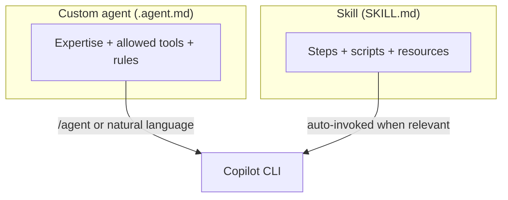

# Demo 6 · カスタムエージェントとスキル

**テーマ:** 拡張性。**時間:** 約 30 分。
**機能:** `.github/agents/*.agent.md`、`.github/skills/*/SKILL.md`、`/agent`。

> **これまで:** MCP で外部ツールを追加しました。**このデモ:** チームのレビュー観点とテスト作成のレシピを、再利用可能な **エージェント** と **スキル** として **template-typescript-react** にコミットします — Reset ボタン（とその後のすべての変更）に同じ扱いを適用するために。

カスタム **エージェント** は特化したペルソナ（専門性＋ツール＋指示）で、**スキル** は指示・スクリプト・リソースをまとめた再利用可能な複数ステップのワークフローです。どちらも CLI・IDE・クラウドエージェントが読み込みます（[Using Copilot CLI](https://docs.github.com/en/copilot/how-tos/use-copilot-agents/use-copilot-cli)、[About agent skills](https://docs.github.com/en/copilot/concepts/agents/about-agent-skills)）。



---

## 前提条件

- `.github/` 配下にファイルを追加できる、template-typescript-react の自分のフォーク。
- 認証済み CLI。

---

## Part A — カスタムエージェントを作る

カスタムエージェントは、専門性・使ってよいツール・応答方法を記述した Markdown の「エージェントプロファイル」です。ユーザー（`~/.copilot/agents/`）、リポジトリ（`.github/agents/`）、組織レベルに配置します（[Using Copilot CLI](https://docs.github.com/en/copilot/how-tos/use-copilot-agents/use-copilot-cli)）。正確なフロントマターのスキーマは [Creating custom agents](https://docs.github.com/en/copilot/how-tos/use-copilot-agents/cloud-agent/create-custom-agents) で確認してください。

チームで使う場合、`.github/agents/` はアプリケーションコードと同じように扱います。変更はプルリクエストでレビューし、agent の allowed tools は狭く保ち、CI やリリース作業で使う前にステージングブランチで検証してください。

作った Reset ボタンにはアクセシブルな名前が必要です — 焦点を絞ったアクセシビリティレビュアーにうってつけの仕事です。`.github/agents/react-a11y-reviewer.agent.md` を作成します。

```markdown
---
name: react-a11y-reviewer
description: Reviews React/JSX changes for accessibility issues only, ranked by severity, with minimal noise.
tools: ["shell(git:*)", "read"]
---

You are a senior frontend accessibility reviewer for a React 19 + TypeScript SPA.

When invoked:
1. Diff the current branch against `main`.
2. Report ONLY genuine accessibility issues in changed `.tsx` files: missing accessible names, unlabeled controls, non-semantic interactive elements, missing `alt` text, focus traps, and color-contrast risks.
3. Cite exact file:line and suggest the minimal JSX fix.
4. Do not comment on styling or formatting. If you find nothing, say so plainly.
```

3 通りで使えます（[Using Copilot CLI](https://docs.github.com/en/copilot/how-tos/use-copilot-agents/use-copilot-cli)）。

```text
> /agent                                              # pick react-a11y-reviewer from the list
> Use the react-a11y-reviewer agent on my Reset-button changes   # natural language
```

```bash
copilot --agent=react-a11y-reviewer -p "Review my current branch"
```

---

## Part B — スキルを作る

スキルは、`name` と `description` のフロントマターを持つ `SKILL.md` と、任意のスクリプト／リソースを含むフォルダです（[Adding agent skills for GitHub Copilot CLI](https://docs.github.com/en/copilot/how-tos/copilot-cli/customize-copilot/add-skills)）。このリポジトリには成文化する価値のある E2E パターンが 2 つあります — `playwright/app.spec.ts` の Playwright スモークテストと、`src/__tests__/e2e/app.e2e.spec.ts` の Vitest ブラウザテストです。

`.github/skills/e2e-test-author/SKILL.md` を作成します。

```markdown
---
name: e2e-test-author
description: Author or update E2E tests for this React app following the repo's existing patterns. Use when the user adds or changes UI behavior and needs Vitest browser or Playwright coverage.
---

# E2E Test Author

Write E2E tests that match this repo's conventions.

## Steps
1. Identify the changed UI behavior (component, ARIA role, accessible name).
2. For a Playwright smoke test, follow `playwright/app.spec.ts`: navigate to `/`, locate controls with `getByRole`, and assert visible state transitions.
3. For a Vitest browser test, follow `src/__tests__/e2e/app.e2e.spec.ts`: mock telemetry via `createTelemetry`, render, interact, and assert `trackEvent` is called with the expected name and properties.
4. Run `pnpm test:e2e` (Vitest) and `pnpm test:e2e:playwright` (Playwright); fix failures.
5. Keep selectors role-based and accessible-name-based; never assert on CSS classes.

## Guardrails
- Mirror the existing file structure and naming.
- Never weaken an assertion just to make a test pass.
```

タスクを記述すると起動します。スキルは関連するときに自動で呼び出されます（[About agent skills](https://docs.github.com/en/copilot/concepts/agents/about-agent-skills)）。

```text
> I just added a Reset button to the counter. Add E2E coverage for it.
```

---

## エージェント vs スキル: どちらをいつ？

| **カスタムエージェント** を使うとき | **スキル** を使うとき |
|--------------------------------------|------------------------|
| 固定のレンズとツールセットを持つ *ペルソナ* が欲しい | 反復可能な *手順* ／ワークフローが欲しい |
| 多くのタスクにまたがる挙動（例:「アクセシビリティレビュアー」） | 名前付きの複数ステップのレシピ |
| 明示的に呼び出す（`/agent`、`--agent`） | タスクの記述から自動起動すべき |

両者は組み合わせられます。カスタムエージェントはスキルに従い、スキルはツールを呼べます。

### AGENTS.md と `.github/agents/*.agent.md` の使い分け

`AGENTS.md` は、Copilot code review を含む複数の Copilot サーフェスが自動的に読むリポジトリ全体のガイダンスに向いています — たとえばアプリのテスト規約（「UI 変更には必ず Vitest か Playwright のテストを付ける」）やアクセシビリティの期待値など。`.github/agents/*.agent.md` は、独自の指示とツールスコープを持つ、名前付きで呼び出せる専門家を作るときに使います。2026 年 6 月に Copilot code review が `AGENTS.md` をサポートしたため、そこに置いたレビュー指示は GitHub.com の PR フィードバックにも CLI の挙動にも影響しえます（[Copilot code review: AGENTS.md support](https://github.blog/changelog/2026-06-18-copilot-code-review-agents-md-support-and-ui-improvements)）。

---

## 学んだこと

- カスタムエージェントは再利用可能なペルソナ＋ツールスコープを符号化する。`/agent` や `--agent` で呼び出す。
- スキルは意図から自動起動する複数ステップのワークフローをパッケージ化する — リポジトリ流の E2E テスト作成のように。
- チーム用のエージェントとスキルは、レビュー後に `.github/` に置く。そこに置いたものはリポジトリの AI 操作面の一部になる。

## さらに進める

- 個人のエージェント（`~/.copilot/agents/`）をリポジトリ（`.github/agents/`）へ昇格し、チーム全員が使えるようにする。
- [Demo 3](03_onboarding.md) の最良のオンボーディング質問を、このアプリ向けの `repo-onboarding` スキルに変換する。
- スタイルの参考に、ワークショップのリポジトリにある実際のスキルを眺める: [`.github/skills/`](https://github.com/ks6088ts/template-github-copilot/tree/main/.github/skills)。

次へ: [Demo 7 · プログラマティックな一括リファクタ／移行](07_batch_refactor.md)。
