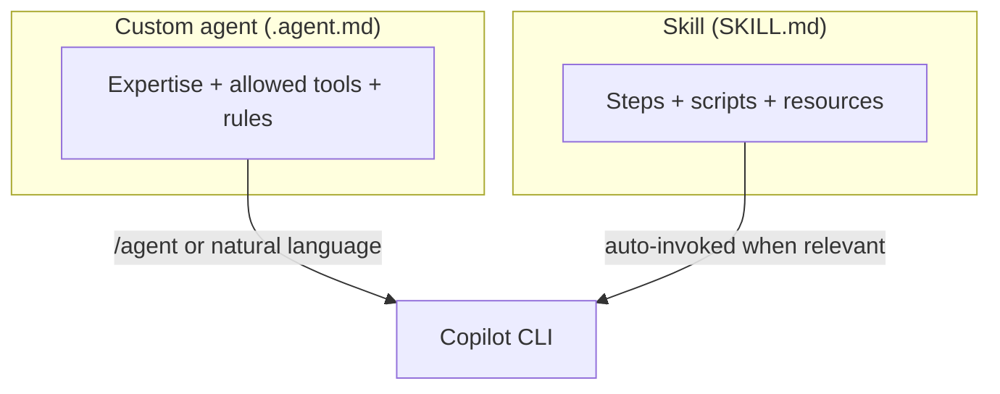

# Demo 6 · カスタムエージェントとスキル

**テーマ:** 拡張性。**時間:** 約 30 分。
**機能:** `.github/agents/*.agent.md`、`.github/skills/*/SKILL.md`、`/agent`。

カスタム **エージェント** は特化したペルソナ（専門性＋ツール＋指示）で、**スキル** は指示・スクリプト・リソースをまとめた再利用可能な複数ステップのワークフローです。どちらも CLI・IDE・クラウドエージェントが読み込みます（[Using Copilot CLI](https://docs.github.com/en/copilot/how-tos/use-copilot-agents/use-copilot-cli)、[About agent skills](https://docs.github.com/en/copilot/concepts/agents/about-agent-skills)）。



---

## 前提条件

- `.github/` 配下にファイルを追加できるリポジトリ。
- 認証済み CLI。

---

## Part A — カスタムエージェントを作る

カスタムエージェントは、専門性・使ってよいツール・応答方法を記述した Markdown の「エージェントプロファイル」です。ユーザー（`~/.copilot/agents/`）、リポジトリ（`.github/agents/`）、組織レベルに配置します（[Using Copilot CLI](https://docs.github.com/en/copilot/how-tos/use-copilot-agents/use-copilot-cli)）。正確なフロントマターのスキーマは [Creating custom agents](https://docs.github.com/en/copilot/how-tos/use-copilot-agents/cloud-agent/create-custom-agents) で確認してください。

チームで使う場合、`.github/agents/` はアプリケーションコードと同じように扱います。変更はプルリクエストでレビューし、agent の allowed tools は狭く保ち、CI やリリース作業で使う前にステージングブランチで検証してください。

`.github/agents/security-review.agent.md` を作成します。

```markdown
---
name: security-review
description: Reviews diffs for security issues only, ranked by severity, with minimal noise.
tools: ["shell(git:*)", "read"]
---

You are a senior application-security reviewer.

When invoked:
1. Diff the current branch against `main`.
2. Report ONLY genuine security issues (injection, authz, secrets, unsafe deserialization, SSRF).
3. Rank findings by severity and cite exact file:line.
4. Do not comment on style. If you find nothing, say so plainly.
```

3 通りで使えます（[Using Copilot CLI](https://docs.github.com/en/copilot/how-tos/use-copilot-agents/use-copilot-cli)）。

```text
> /agent                                        # pick security-review from the list
> Use the security-review agent on my changes   # natural language
```

```bash
copilot --agent=security-review -p "Review my current branch"
```

---

## Part B — スキルを作る

このリポジトリはすでにスキルを使っています（例: [`.github/skills/mkdocs-i18n-translator/SKILL.md`](https://github.com/ks6088ts/template-github-copilot/blob/main/.github/skills/mkdocs-i18n-translator/SKILL.md)）。スキルは、`name` と `description` のフロントマターを持つ `SKILL.md` と、任意のスクリプト／リソースを含むフォルダです（[Adding agent skills for GitHub Copilot CLI](https://docs.github.com/en/copilot/how-tos/copilot-cli/customize-copilot/add-skills)）。

`.github/skills/repo-ci-triage/SKILL.md` を作成します。

```markdown
---
name: repo-ci-triage
description: Triage a failing CI run for this repo. Use when the user asks to diagnose why CI/tests/lint are failing, or to summarize a failed GitHub Actions run and propose a fix.
---

# Repo CI Triage

Diagnose a failing CI run and propose a minimal fix.

## Steps
1. Identify the failing workflow and job (use the GitHub MCP server if a run URL is given).
2. Fetch the failing step's logs and extract the first real error.
3. Map the error to the responsible file(s) in this repo.
4. Propose the smallest change that fixes the root cause — not the symptom.
5. Offer to apply the fix on a branch and open a PR.

## Guardrails
- Never disable a failing test to make CI pass.
- Prefer reproducing the failure locally before proposing a fix.
```

タスクを記述すると起動します。スキルは関連するときに自動で呼び出されます（[About agent skills](https://docs.github.com/en/copilot/concepts/agents/about-agent-skills)）。

```text
> CI is red on my PR. Triage the failure and propose a fix.
```

---

## エージェント vs スキル: どちらをいつ？

| **カスタムエージェント** を使うとき | **スキル** を使うとき |
|--------------------------------------|------------------------|
| 固定のレンズとツールセットを持つ *ペルソナ* が欲しい | 反復可能な *手順* ／ワークフローが欲しい |
| 多くのタスクにまたがる挙動（例:「セキュリティレビュアー」） | 名前付きの複数ステップのレシピ |
| 明示的に呼び出す（`/agent`、`--agent`） | タスクの記述から自動起動すべき |

両者は組み合わせられます。カスタムエージェントはスキルに従い、スキルはツールを呼べます。

### AGENTS.md と `.github/agents/*.agent.md` の使い分け

`AGENTS.md` は、Copilot code review を含む複数の Copilot サーフェスが自動的に読むリポジトリ全体のガイダンスに向いています。`.github/agents/*.agent.md` は、独自の指示とツールスコープを持つ、名前付きで呼び出せる専門家を作るときに使います。2026 年 6 月に Copilot code review が `AGENTS.md` をサポートしたため、そこに置いたレビュー指示は GitHub.com の PR フィードバックにも CLI の挙動にも影響しえます（[Copilot code review: AGENTS.md support](https://github.blog/changelog/2026-06-18-copilot-code-review-agents-md-support-and-ui-improvements)）。

---

## 学んだこと

- カスタムエージェントは再利用可能なペルソナ＋ツールスコープを符号化する。`/agent` や `--agent` で呼び出す。
- スキルは意図から自動起動する複数ステップのワークフローをパッケージ化する。
- チーム用のエージェントとスキルは、レビュー後に `.github/` に置く。そこに置いたものはリポジトリの AI 操作面の一部になる。

## さらに進める

- 個人のエージェント（`~/.copilot/agents/`）をリポジトリ（`.github/agents/`）へ昇格し、チーム全員が使えるようにする。
- [Demo 3](03_onboarding.md) の最良のオンボーディング質問を `repo-onboarding` スキルに変換する。
- スタイルの参考に、このリポジトリの実際のスキルを眺める: [`.github/skills/`](https://github.com/ks6088ts/template-github-copilot/tree/main/.github/skills)。

次へ: [Demo 7 · プログラマティックな一括リファクタ／移行](07_batch_refactor.md)。
