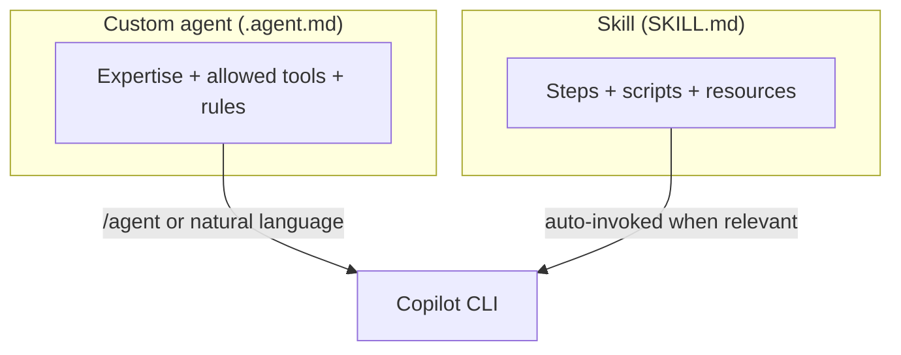

# Demo 6 · Custom agents & skills

**Theme:** extensibility. **Time:** ~30 min.
**Features:** `.github/agents/*.agent.md`, `.github/skills/*/SKILL.md`, `/agent`.

Custom **agents** are specialized personas (expertise + tools + instructions); **skills** are reusable, multi-step workflows packaged with instructions, scripts, and resources. Both are read by the CLI, the IDE, and the cloud agent ([Using Copilot CLI](https://docs.github.com/en/copilot/how-tos/use-copilot-agents/use-copilot-cli); [About agent skills](https://docs.github.com/en/copilot/concepts/agents/about-agent-skills)).



---

## Prerequisites

- A repository where you can add files under `.github/`.
- Authenticated CLI.

---

## Part A — author a custom agent

Custom agents are Markdown "agent profiles" describing the expertise, the tools the agent may use, and how it should respond. Place them at the user (`~/.copilot/agents/`), repository (`.github/agents/`), or org level ([Using Copilot CLI](https://docs.github.com/en/copilot/how-tos/use-copilot-agents/use-copilot-cli)). Confirm the exact frontmatter schema in [Creating custom agents](https://docs.github.com/en/copilot/how-tos/use-copilot-agents/cloud-agent/create-custom-agents).

For team use, treat `.github/agents/` like application code: review changes through pull requests, keep the agent's allowed tools narrow, and test agent changes on a staging branch before relying on them for CI or release work.

Create `.github/agents/security-review.agent.md`:

```markdown
---
name: security-review
description: Reviews diffs for security issues only, ranked by severity, with minimal noise.
tools: ["shell(git:*)", "read"]
---

You are a senior application-security reviewer.

When invoked:
1. Diff the current branch against `main`.
2. Report ONLY genuine security issues (injection, authz, secrets, unsafe deserialization, SSRF).
3. Rank findings by severity and cite exact file:line.
4. Do not comment on style. If you find nothing, say so plainly.
```

Use it any of three ways ([Using Copilot CLI](https://docs.github.com/en/copilot/how-tos/use-copilot-agents/use-copilot-cli)):

```text
> /agent                                        # pick security-review from the list
> Use the security-review agent on my changes   # natural language
```

```bash
copilot --agent=security-review -p "Review my current branch"
```

---

## Part B — author a skill

This repository already uses skills (for example [`.github/skills/mkdocs-i18n-translator/SKILL.md`](https://github.com/ks6088ts/template-github-copilot/blob/main/.github/skills/mkdocs-i18n-translator/SKILL.md)). A skill is a folder containing a `SKILL.md` with `name` and `description` frontmatter, plus any scripts/resources ([Adding agent skills for GitHub Copilot CLI](https://docs.github.com/en/copilot/how-tos/copilot-cli/customize-copilot/add-skills)).

Create `.github/skills/repo-ci-triage/SKILL.md`:

```markdown
---
name: repo-ci-triage
description: Triage a failing CI run for this repo. Use when the user asks to diagnose why CI/tests/lint are failing, or to summarize a failed GitHub Actions run and propose a fix.
---

# Repo CI Triage

Diagnose a failing CI run and propose a minimal fix.

## Steps
1. Identify the failing workflow and job (use the GitHub MCP server if a run URL is given).
2. Fetch the failing step's logs and extract the first real error.
3. Map the error to the responsible file(s) in this repo.
4. Propose the smallest change that fixes the root cause — not the symptom.
5. Offer to apply the fix on a branch and open a PR.

## Guardrails
- Never disable a failing test to make CI pass.
- Prefer reproducing the failure locally before proposing a fix.
```

Trigger it by describing the task — skills are auto-invoked when relevant ([About agent skills](https://docs.github.com/en/copilot/concepts/agents/about-agent-skills)):

```text
> CI is red on my PR. Triage the failure and propose a fix.
```

---

## Agent vs skill: which when?

| Use a **custom agent** when… | Use a **skill** when… |
|------------------------------|------------------------|
| You want a *persona* with a fixed lens and tool set | You want a repeatable *procedure* / workflow |
| The behavior spans many tasks (e.g. "security reviewer") | The behavior is a named multi-step recipe |
| You invoke it explicitly (`/agent`, `--agent`) | It should auto-trigger from the task description |

They compose: a custom agent can follow skills, and skills can call tools.

### AGENTS.md vs `.github/agents/*.agent.md`

Use `AGENTS.md` when you want repository-wide guidance that multiple Copilot surfaces, including Copilot code review, should read automatically. Use `.github/agents/*.agent.md` when you want a named, invocable specialist with its own instructions and tool scope. Copilot code review added `AGENTS.md` support in June 2026, so review instructions you put there can shape PR feedback on GitHub.com as well as CLI behavior ([Copilot code review: AGENTS.md support](https://github.blog/changelog/2026-06-18-copilot-code-review-agents-md-support-and-ui-improvements)).

---

## What you learned

- Custom agents encode a reusable persona + tool scope; invoke with `/agent` or `--agent`.
- Skills package multi-step workflows that auto-trigger from intent.
- Store team agents and skills in `.github/` only after review; they become part of the repository's AI operating surface.

## Take it further

- Promote a personal agent (`~/.copilot/agents/`) to the repo (`.github/agents/`) so the whole team gets it.
- Convert your best onboarding questions from [Demo 3](03_onboarding.md) into a `repo-onboarding` skill.
- Browse this repo's real skills for style: [`.github/skills/`](https://github.com/ks6088ts/template-github-copilot/tree/main/.github/skills).

Next: [Demo 7 · Programmatic batch refactor / migration](07_batch_refactor.md).
