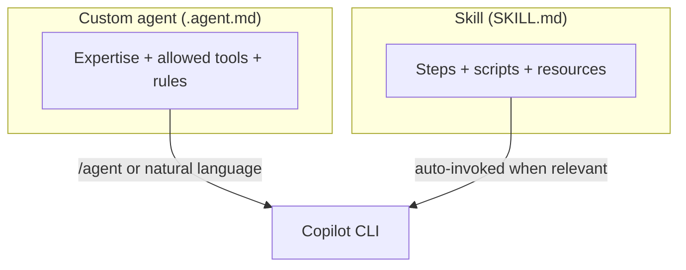

# Demo 6 · Custom agents & skills

**Theme:** extensibility. **Time:** ~30 min.
**Features:** `.github/agents/*.agent.md`, `.github/skills/*/SKILL.md`, `/agent`.

> **Story so far:** You added external tools via MCP. **This demo:** encode your team's review lens and test-writing recipe as a reusable **agent** and **skill** committed to **template-typescript-react** — so the Reset button (and every change after it) gets the same treatment.

Custom **agents** are specialized personas (expertise + tools + instructions); **skills** are reusable, multi-step workflows packaged with instructions, scripts, and resources. Both are read by the CLI, the IDE, and the cloud agent ([Using Copilot CLI](https://docs.github.com/en/copilot/how-tos/use-copilot-agents/use-copilot-cli); [About agent skills](https://docs.github.com/en/copilot/concepts/agents/about-agent-skills)).



---

## Prerequisites

- Your fork of template-typescript-react, where you can add files under `.github/`.
- Authenticated CLI.

---

## Part A — author a custom agent

Custom agents are Markdown "agent profiles" describing the expertise, the tools the agent may use, and how it should respond. Place them at the user (`~/.copilot/agents/`), repository (`.github/agents/`), or org level ([Using Copilot CLI](https://docs.github.com/en/copilot/how-tos/use-copilot-agents/use-copilot-cli)). Confirm the exact frontmatter schema in [Creating custom agents](https://docs.github.com/en/copilot/how-tos/use-copilot-agents/cloud-agent/create-custom-agents).

For team use, treat `.github/agents/` like application code: review changes through pull requests, keep the agent's allowed tools narrow, and test agent changes on a staging branch before relying on them for CI or release work.

The Reset button you built needs an accessible name — a perfect job for a focused accessibility reviewer. Create `.github/agents/react-a11y-reviewer.agent.md`:

```markdown
---
name: react-a11y-reviewer
description: Reviews React/JSX changes for accessibility issues only, ranked by severity, with minimal noise.
tools: ["shell(git:*)", "read"]
---

You are a senior frontend accessibility reviewer for a React 19 + TypeScript SPA.

When invoked:
1. Diff the current branch against `main`.
2. Report ONLY genuine accessibility issues in changed `.tsx` files: missing accessible names, unlabeled controls, non-semantic interactive elements, missing `alt` text, focus traps, and color-contrast risks.
3. Cite exact file:line and suggest the minimal JSX fix.
4. Do not comment on styling or formatting. If you find nothing, say so plainly.
```

Use it any of three ways ([Using Copilot CLI](https://docs.github.com/en/copilot/how-tos/use-copilot-agents/use-copilot-cli)):

```text
> /agent                                              # pick react-a11y-reviewer from the list
> Use the react-a11y-reviewer agent on my Reset-button changes   # natural language
```

```bash
copilot --agent=react-a11y-reviewer -p "Review my current branch"
```

---

## Part B — author a skill

A skill is a folder containing a `SKILL.md` with `name` and `description` frontmatter, plus any scripts/resources ([Adding agent skills for GitHub Copilot CLI](https://docs.github.com/en/copilot/how-tos/copilot-cli/customize-copilot/add-skills)). This repo already has two E2E patterns worth codifying — the Playwright smoke test in `playwright/app.spec.ts` and the Vitest browser test in `src/__tests__/e2e/app.e2e.spec.ts`.

Create `.github/skills/e2e-test-author/SKILL.md`:

```markdown
---
name: e2e-test-author
description: Author or update E2E tests for this React app following the repo's existing patterns. Use when the user adds or changes UI behavior and needs Vitest browser or Playwright coverage.
---

# E2E Test Author

Write E2E tests that match this repo's conventions.

## Steps
1. Identify the changed UI behavior (component, ARIA role, accessible name).
2. For a Playwright smoke test, follow `playwright/app.spec.ts`: navigate to `/`, locate controls with `getByRole`, and assert visible state transitions.
3. For a Vitest browser test, follow `src/__tests__/e2e/app.e2e.spec.ts`: mock telemetry via `createTelemetry`, render, interact, and assert `trackEvent` is called with the expected name and properties.
4. Run `pnpm test:e2e` (Vitest) and `pnpm test:e2e:playwright` (Playwright); fix failures.
5. Keep selectors role-based and accessible-name-based; never assert on CSS classes.

## Guardrails
- Mirror the existing file structure and naming.
- Never weaken an assertion just to make a test pass.
```

Trigger it by describing the task — skills are auto-invoked when relevant ([About agent skills](https://docs.github.com/en/copilot/concepts/agents/about-agent-skills)):

```text
> I just added a Reset button to the counter. Add E2E coverage for it.
```

---

## Agent vs skill: which when?

| Use a **custom agent** when… | Use a **skill** when… |
|------------------------------|------------------------|
| You want a *persona* with a fixed lens and tool set | You want a repeatable *procedure* / workflow |
| The behavior spans many tasks (e.g. "accessibility reviewer") | The behavior is a named multi-step recipe |
| You invoke it explicitly (`/agent`, `--agent`) | It should auto-trigger from the task description |

They compose: a custom agent can follow skills, and skills can call tools.

### AGENTS.md vs `.github/agents/*.agent.md`

Use `AGENTS.md` when you want repository-wide guidance that multiple Copilot surfaces, including Copilot code review, should read automatically — for example, the app's testing rules ("every UI change ships with a Vitest or Playwright test") and accessibility expectations. Use `.github/agents/*.agent.md` when you want a named, invocable specialist with its own instructions and tool scope. Copilot code review added `AGENTS.md` support in June 2026, so review instructions you put there can shape PR feedback on GitHub.com as well as CLI behavior ([Copilot code review: AGENTS.md support](https://github.blog/changelog/2026-06-18-copilot-code-review-agents-md-support-and-ui-improvements)).

---

## What you learned

- Custom agents encode a reusable persona + tool scope; invoke with `/agent` or `--agent`.
- Skills package multi-step workflows that auto-trigger from intent — like authoring E2E tests the repo's way.
- Store team agents and skills in `.github/` only after review; they become part of the repository's AI operating surface.

## Take it further

- Promote a personal agent (`~/.copilot/agents/`) to the repo (`.github/agents/`) so the whole team gets it.
- Convert your best onboarding questions from [Demo 3](03_onboarding.md) into a `repo-onboarding` skill for this app.
- Study real-world skills for style in the workshop repo: [`.github/skills/`](https://github.com/ks6088ts/template-github-copilot/tree/main/.github/skills).

Next: [Demo 7 · Programmatic batch refactor / migration](07_batch_refactor.md).
