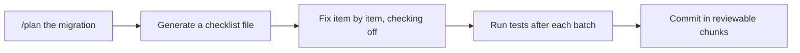

# Demo 7 · プログラマティックな一括リファクタ／移行

**テーマ:** スケールする自動化。**時間:** 約 30 分。
**機能:** Plan モード、チェックリスト、`/fleet` 並列サブエージェント、スコープ付き権限。

> **これまで:** アプリに合わせたエージェントとスキルを用意しました。**このデモ:** 反復可能な変更をスケールします — **template-typescript-react** とそのテスト全体に、一貫したテレメトリイベント命名規約（`app.<area>.<action>`）を採用し、まだ追跡されていないリンクにトラッキングを追加します。

大規模で反復的な変更（フレームワーク移行、API リネーム、依存関係のアップグレード）は、作業をレビュー可能に保てる場合に CLI が向く領域です。パターンは **計画 → チェックリスト → 段階的に実行 → 検証** です。



---

## 前提条件

- template-typescript-react の自分のフォーク。**専用ブランチ**（例: `chore/telemetry-naming`）で作業すること。
- 認証済み CLI。

---

## 手順

### 1. 移行を計画する

Plan モードでは、コードに触れる前にエージェントが確認の質問をし、承認済みの `plan.md` を作成します（[Best practices](https://docs.github.com/en/copilot/how-tos/copilot-cli/cli-best-practices)）。

```text
> /plan Adopt a telemetry event-naming convention `app.<area>.<action>` across the app. Rename the existing counter events and add click tracking to the external links in @src/App.tsx, then update the E2E tests to match.
```

質問に答え、計画をレビューし、必要なら ++ctrl+y++ で編集してから承認します。

### 2. 作業を持続的なチェックリストにする

大規模な変更では、タスク一覧を外部化して、圧縮を越えて進捗が残り、レビュー可能な状態にします（[Best practices](https://docs.github.com/en/copilot/how-tos/copilot-cli/cli-best-practices)）。

```text
> List every telemetry event name in the codebase (grep for `trackEvent(` across src/ and the E2E tests) and write migration-checklist.md mapping each old name to its new `app.<area>.<action>` name.
> Then fix each occurrence one by one, checking them off as you go.
```

### 3. 検証しながら段階的に実行する

```text
> Implement the plan in small batches. After each batch, run `pnpm test:e2e` and only continue if it passes.
> Commit each passing batch with a conventional-commit message.
```

権限をスコープし、エージェントがすべてのファイルで確認を求めることなく、安全を保ちつつ反復作業を行えるようにします。

```bash
copilot --allow-tool='shell(git:*)' \
        --allow-tool='write' \
        --allow-tool='shell(pnpm:*)' \
        --deny-tool='shell(git push)' \
        --deny-tool='shell(rm)'
```

バッチがテストに失敗したら、その時点で止めます。Copilot にチェックリスト項目を `NEEDS REWORK` としてマークさせ、失敗したバッチだけを revert または分離し、失敗出力を読み直して修正版を提案させてから続行します。次のバッチに進むために、テストをスキップしたり項目を完了扱いにさせてはいけません。

### 4. 大きなジョブは `/fleet` で並列化する

独立したサブタスクには `/fleet` を先頭に付け、Copilot がそれぞれ自分のコンテキストウィンドウを管理するサブエージェントへ作業を分割します（[Best practices](https://docs.github.com/en/copilot/how-tos/copilot-cli/cli-best-practices)）。

```text
> /fleet Apply the renames `counter_button_clicked` → `app.counter.incremented` and `counter_reset_clicked` → `app.counter.reset` across src/ and the E2E tests, updating every call site and assertion.
```

### 5. 下流の利用者も同期させる

このようなリネームはソースの外まで波及しえます。アプリはイベント名を参照しうる Grafana ダッシュボードを同梱しているため、同じ変更でまとめて連れていきます。

```text
> Also update @docker/grafana/dashboards/frontend-telemetry.json if it references any renamed event names, so the dashboards keep working.
```

変更が複数リポジトリにまたがるとき（たとえばバックエンドや別リポジトリの共有ダッシュボード）は、それらを追加して Copilot に連携させます（[Best practices](https://docs.github.com/en/copilot/how-tos/copilot-cli/cli-best-practices)）。

```text
> /add-dir /path/to/your-dashboards
> Update any references to the old event names across @your-dashboards, keeping them consistent with the app.
```

### 6. サンドボックスでの Autopilot を検討する

長時間の無人実行では、[サンドボックス](../features.md#sandboxing) 内で Autopilot（++shift+tab++、experimental）に切り替え、完了まで安全に作業を続けさせます（[README](https://github.com/github/copilot-cli)）。

---

## ガードレール

!!! danger "移行はレビュー可能に保つ"
    - 必ずブランチで作業し、小さく検証可能なバッチでコミットする。
    - 「通すため」に失敗したテストをエージェントに無効化させない。
    - 本当にそうしたいのでない限り、`git push` と `rm` を禁止する。
    - マージ前に差分をレビューする。自律ツールは正しいパターンと同じ速さで、誤ったパターンも多数のファイルに繰り返せる（[Security considerations](https://docs.github.com/en/copilot/concepts/agents/about-copilot-cli#security-considerations)）。

---

## 学んだこと

- 計画＋チェックリスト＋段階的検証が、大きなリファクタを安全かつレビュー可能に保つ。
- `/fleet` は独立したサブタスクをサブエージェント間で並列化する。
- スコープ付き権限が、制御を手放さずにハンズオフの反復を可能にする — ダッシュボードのような下流の利用者もリネームと一緒に動く。

## さらに進める

- 機械的な移行は CI で非対話実行する（[Demo 4](04_cicd_automation.md) と組み合わせる）。
- 変更と並行して、Copilot に `MIGRATION.md` のロールバック計画を生成させる。

次へ: [Demo 8 · リリースノート／変更履歴の自動生成](08_release_notes.md)。
