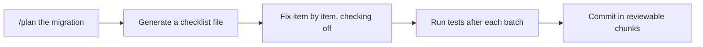

# Demo 7 · プログラマティックな一括リファクタ／移行

**テーマ:** スケールする自動化。**時間:** 約 30 分。
**機能:** Plan モード、チェックリスト、`/fleet` 並列サブエージェント、スコープ付き権限。

大規模で反復的な変更（フレームワーク移行、API リネーム、依存関係のアップグレード）は、作業をレビュー可能に保てる場合に CLI が向く領域です。パターンは **計画 → チェックリスト → 段階的に実行 → 検証** です。



---

## 前提条件

- 反復的な変更を加えるリポジトリ（例: API のリネーム、パターンの移行、コード変更を伴う依存関係のバンプ）。
- 認証済み CLI。**専用ブランチ** で作業すること。

---

## 手順

### 1. 移行を計画する

Plan モードでは、コードに触れる前にエージェントが確認の質問をし、承認済みの `plan.md` を作成します（[Best practices](https://docs.github.com/en/copilot/how-tos/copilot-cli/cli-best-practices)）。

```text
> /plan Migrate all class components to functional components with hooks
```

質問に答え、計画をレビューし、必要なら ++ctrl+y++ で編集してから承認します。

### 2. 作業を持続的なチェックリストにする

大規模な変更では、タスク一覧を外部化して、圧縮を越えて進捗が残り、レビュー可能な状態にします（[Best practices](https://docs.github.com/en/copilot/how-tos/copilot-cli/cli-best-practices)）。

```text
> Run the linter and write all errors to migration-checklist.md as a checklist.
> Then fix each issue one by one, checking them off as you go.
```

### 3. 検証しながら段階的に実行する

```text
> Implement the plan in small batches. After each batch, run the tests and only continue if they pass.
> Commit each passing batch with a conventional-commit message.
```

権限をスコープし、エージェントがすべてのファイルで確認を求めることなく、安全を保ちつつ反復作業を行えるようにします。

```bash
copilot --allow-tool='shell(git:*)' \
        --allow-tool='write' \
        --allow-tool='shell(npm run test:*)' \
        --deny-tool='shell(git push)' \
        --deny-tool='shell(rm)'
```

バッチがテストに失敗したら、その時点で止めます。Copilot にチェックリスト項目を `NEEDS REWORK` としてマークさせ、失敗したバッチだけを revert または分離し、失敗出力を読み直して修正版を提案させてから続行します。次のバッチに進むために、テストをスキップしたり項目を完了扱いにさせてはいけません。

### 4. 大きなジョブは `/fleet` で並列化する

独立したサブタスクには `/fleet` を先頭に付け、Copilot がそれぞれ自分のコンテキストウィンドウを管理するサブエージェントへ作業を分割します（[Best practices](https://docs.github.com/en/copilot/how-tos/copilot-cli/cli-best-practices)）。

```text
> /fleet Apply the rename `getUser` → `fetchUser` across all packages, updating call sites and tests.
```

### 5. マルチリポの移行

変更が複数サービスにまたがるときは、リポジトリを追加して Copilot に連携させます（[Best practices](https://docs.github.com/en/copilot/how-tos/copilot-cli/cli-best-practices)）。

```text
> /add-dir /Users/me/projects/api-gateway
> /add-dir /Users/me/projects/auth-service
> Update the user-auth API contract across @api-gateway and @auth-service, keeping callers in sync.
```

### 6. サンドボックスでの Autopilot を検討する

長時間の無人実行では、[サンドボックス](../features.md#sandboxing) 内で Autopilot（++shift+tab++、experimental）に切り替え、完了まで安全に作業を続けさせます（[README](https://github.com/github/copilot-cli)）。

---

## ガードレール

!!! danger "移行はレビュー可能に保つ"
    - 必ずブランチで作業し、小さく検証可能なバッチでコミットする。
    - 「通すため」に失敗したテストをエージェントに無効化させない。
    - 本当にそうしたいのでない限り、`git push` と `rm` を禁止する。
    - マージ前に差分をレビューする。自律ツールは正しいパターンと同じ速さで、誤ったパターンも多数のファイルに繰り返せる（[Security considerations](https://docs.github.com/en/copilot/concepts/agents/about-copilot-cli#security-considerations)）。

---

## 学んだこと

- 計画＋チェックリスト＋段階的検証が、大きなリファクタを安全かつレビュー可能に保つ。
- `/fleet` は独立したサブタスクをサブエージェント間で並列化する。
- スコープ付き権限が、制御を手放さずにハンズオフの反復を可能にする。

## さらに進める

- 機械的な移行は CI で非対話実行する（[Demo 4](04_cicd_automation.md) と組み合わせる）。
- 変更と並行して、Copilot に `MIGRATION.md` のロールバック計画を生成させる。

次へ: [Demo 8 · リリースノート／変更履歴の自動生成](08_release_notes.md)。
