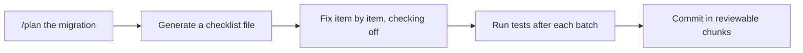

# Demo 7 · Programmatic batch refactor / migration

**Theme:** automation at scale. **Time:** ~30 min.
**Features:** plan mode, checklists, `/fleet` parallel subagents, scoped permissions.

Large, repetitive changes — framework migrations, API renames, dependency upgrades — are good CLI candidates only when you keep the work reviewable. The pattern is **plan → checklist → execute incrementally → verify**.



---

## Prerequisites

- A repo with a repetitive change to make (e.g. rename an API, migrate a pattern, bump a dependency with code changes).
- Authenticated CLI. Work on a **dedicated branch**.

---

## Steps

### 1. Plan the migration

Plan mode makes the agent ask clarifying questions and produce an approved `plan.md` before touching code ([Best practices](https://docs.github.com/en/copilot/how-tos/copilot-cli/cli-best-practices)):

```text
> /plan Migrate all class components to functional components with hooks
```

Answer its questions, review the plan, press ++ctrl+y++ to edit if needed, then approve.

### 2. Turn the work into a durable checklist

For large-scale changes, externalize the task list so progress survives compaction and is reviewable ([Best practices](https://docs.github.com/en/copilot/how-tos/copilot-cli/cli-best-practices)):

```text
> Run the linter and write all errors to migration-checklist.md as a checklist.
> Then fix each issue one by one, checking them off as you go.
```

### 3. Execute incrementally with verification

```text
> Implement the plan in small batches. After each batch, run the tests and only continue if they pass.
> Commit each passing batch with a conventional-commit message.
```

Scope permissions so the agent can do the repetitive work without prompting on every file, while staying safe:

```bash
copilot --allow-tool='shell(git:*)' \
        --allow-tool='write' \
        --allow-tool='shell(npm run test:*)' \
        --deny-tool='shell(git push)' \
        --deny-tool='shell(rm)'
```

If a batch fails tests, stop the sequence. Ask Copilot to mark the checklist item as `NEEDS REWORK`, revert or isolate only the failed batch, read the failing output, and propose a revised fix before continuing. Do not let the agent skip tests or mark an item done because the next batch depends on it.

### 4. Parallelize big jobs with `/fleet`

For independent sub-tasks, prefix with `/fleet` so Copilot splits the work across subagents that each manage their own context window ([Best practices](https://docs.github.com/en/copilot/how-tos/copilot-cli/cli-best-practices)):

```text
> /fleet Apply the rename `getUser` → `fetchUser` across all packages, updating call sites and tests.
```

### 5. Multi-repo migrations

When a change spans services, add the repos and let Copilot coordinate ([Best practices](https://docs.github.com/en/copilot/how-tos/copilot-cli/cli-best-practices)):

```text
> /add-dir /Users/me/projects/api-gateway
> /add-dir /Users/me/projects/auth-service
> Update the user-auth API contract across @api-gateway and @auth-service, keeping callers in sync.
```

### 6. Consider autopilot in a sandbox

For long unattended runs, switch to autopilot (++shift+tab++, experimental) inside a [sandbox](../features.md#sandboxing) so the agent can keep going safely until done ([README](https://github.com/github/copilot-cli)).

---

## Guardrails

!!! danger "Keep migrations reviewable"
    - Always work on a branch; commit in small, verifiable batches.
    - Never let the agent disable failing tests to "make it pass."
    - Deny `git push` and `rm` unless you truly intend otherwise.
    - Review the diff before merging; autonomous tools can repeat a wrong pattern across many files just as quickly as a correct one ([Security considerations](https://docs.github.com/en/copilot/concepts/agents/about-copilot-cli#security-considerations)).

---

## What you learned

- Plan + checklist + incremental verification keeps big refactors safe and reviewable.
- `/fleet` parallelizes independent sub-tasks across subagents.
- Scoped permissions enable hands-off repetition without surrendering control.

## Take it further

- Run this non-interactively in CI for mechanical migrations (combine with [Demo 4](04_cicd_automation.md)).
- Have Copilot generate a `MIGRATION.md` rollback plan alongside the change.

Next: [Demo 8 · Release notes & changelog automation](08_release_notes.md).
