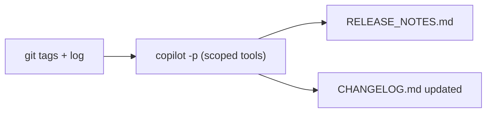

# Demo 8 · リリースノート／変更履歴の自動生成

**テーマ:** 自動化。**時間:** 約 25 分。
**機能:** Git 履歴の推論、`@` 参照、`copilot -p`。

> **これまで:** **template-typescript-react** にいくつもの改善が入りました — Reset ボタン、CI レビュージョブ、テレメトリ命名の移行。**このデモ:** プロジェクトの Git 履歴をリリースノートと変更履歴に変え、それを反復可能なパイプラインにします。

このアプリは実際のタグ（`v0.0.1`、`v0.0.2`）と `release.yaml` ワークフローをすでに同梱しているので、まったく同じに再現できます。Copilot は Git 履歴を要約し、バージョンを比較し、実際のコミットから説明文をドラフトできます（[Best practices](https://docs.github.com/en/copilot/how-tos/copilot-cli/cli-best-practices)）。

---

## 前提条件

- アプリのローカルクローン（自分のフォーク、または上流）。

  ```bash
  git clone https://github.com/ks6088ts/template-typescript-react
  cd template-typescript-react
  ```

- 認証済み CLI。起動してディレクトリを信頼します。

  ```bash
  copilot
  ```

---

## 手順

### 1. 履歴を把握する

```text
> !git tag --sort=-creatordate | head
> !git log --oneline -20
```

`!` プレフィックスはシェルコマンドを直接実行し、その出力をモデル呼び出しなしでコンテキストに追加します（[Using Copilot CLI](https://docs.github.com/en/copilot/how-tos/use-copilot-agents/use-copilot-cli)）。

### 2. 2 点間で何が変わったかを尋ねる

```text
> What changed between the two most recent tags? Group the changes by area (src, src/telemetry, tests, .github/workflows, docker, docs) and by type (feat, fix, chore).
```

バージョンに何が入ったかを尋ねるのは、文書化された Git のユースケースです（[Best practices](https://docs.github.com/en/copilot/how-tos/copilot-cli/cli-best-practices)）。

### 3. ユーザー向けリリースノートをドラフトする

```text
> Draft release notes in Markdown for the next release. Audience: developers using this React + TypeScript template. Sections: Highlights, Breaking changes, Features, Fixes, Docs. Base it strictly on the commits between the last tag and HEAD — do not invent entries.
```

!!! tip "推測させず、根拠に基づかせる"
    Copilot を実際のコミット範囲に明示的に制約し、エントリを捏造しないよう指示します。これで出力が履歴に忠実になります。

### 4. 変更履歴をその場で更新する

`@` で既存ファイルを参照させ、Copilot にその形式を踏襲させます（[Using Copilot CLI](https://docs.github.com/en/copilot/how-tos/use-copilot-agents/use-copilot-cli)）。

```text
> Update @CHANGELOG.md by prepending a new section for the upcoming version, following the existing format. If no CHANGELOG.md exists, create one using the "Keep a Changelog" style.
```

### 5. Copilot-authored pull request を考慮する

GitHub の自動生成リリースノートは、Copilot cloud agent が作成してマージされた pull request について、`@copilot` と並んで Copilot に PR 作成を依頼した開発者にもクレジットするようになりました（[Generated release notes credit you for Copilot pull requests](https://github.blog/changelog/2026-06-18-generated-release-notes-credit-you-for-copilot-pull-requests)）。プロジェクトで Copilot cloud agent を使っている場合は、agent-assisted な変更が分かるように PR メタデータをドラフトに含めます。

```text
> For each release-note entry, include the PR number and whether the PR was Copilot-authored, Copilot-assisted, or human-authored when that information is available from GitHub.
```

### 6. 反復可能なジョブにする

プログラマティックモードで全体を包み、スクリプトやリリースパイプラインから実行できるようにします（[About Copilot CLI](https://docs.github.com/en/copilot/concepts/agents/about-copilot-cli)）。

```bash
copilot -p "Generate release notes for the commit range \$(git describe --tags --abbrev=0)..HEAD. \
Group by area and type, base strictly on real commits, and write the result to RELEASE_NOTES.md." \
  --allow-tool='shell(git:*)' \
  --allow-tool='write' \
  --deny-tool='shell(git push)'
```



### 7. （任意）CI でタグ push をトリガーにする

[Demo 4](04_cicd_automation.md) と組み合わせます。`push: tags` でトリガーされるワークフローで上記コマンドを実行し（アプリ既存の `release.yaml` のすぐ隣で）、`gh release create` で `RELEASE_NOTES.md` を GitHub Release に添付します。

---

## 学んだこと

- Copilot は Git 履歴を読み取り、領域や変更種別で整理したアプリのリリースノートを下書きできる。
- `@CHANGELOG.md` で生成物を既存の形式に揃えられる。
- Copilot-authored PR のメタデータは、透明性と GitHub の生成リリースノートでのクレジット表示に関係する。
- 同じプロンプトが対話実行でも `copilot -p` のパイプラインステップでも動く。

## さらに進める

- Copilot に GitHub Release のタイトルと、SNS 投稿用の一段落の要約もドラフトさせる。
- パスでフィルタした `git log`（例: `-- src/telemetry/`）を渡し、領域別の変更履歴を作る。
- リリースノートのハウススタイルを [スキル](06_custom_agents_skills.md) に符号化し、どのリリースも同じ読み味にする。

---

これで 8 つのシナリオはすべて完了です — 1 つの機能を、Issue から **template-typescript-react** のリリースまで通しで扱いました。[Decision Guide](../access_methods.md#decision-guide) で総まとめするか、[References](../appendix/references.md) 全体を眺めてください。
