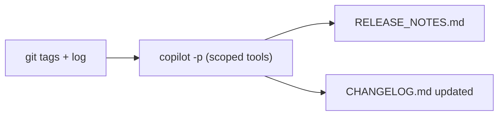

# Demo 8 · Release notes & changelog automation

**Theme:** automation. **Time:** ~25 min.
**Features:** Git history reasoning, `@` references, `copilot -p`.

> **Story so far:** Several improvements have landed on **template-typescript-react** — a Reset button, a CI review job, a telemetry-naming migration. **This demo:** turn the project's Git history into release notes and a changelog, then make it a repeatable pipeline.

The app already ships real tags (`v0.0.1`, `v0.0.2`) and a `release.yaml` workflow, so you can reproduce this exactly. The CLI can summarize Git history, compare versions, and draft release descriptions from actual commits ([Best practices](https://docs.github.com/en/copilot/how-tos/copilot-cli/cli-best-practices)).

---

## Prerequisites

- A local clone of the app (your fork, or upstream):

  ```bash
  git clone https://github.com/ks6088ts/template-typescript-react
  cd template-typescript-react
  ```

- Authenticated CLI. Launch and trust the directory:

  ```bash
  copilot
  ```

---

## Steps

### 1. Orient on the history

```text
> !git tag --sort=-creatordate | head
> !git log --oneline -20
```

The `!` prefix runs shell commands directly, appending their output to context without a model call ([Using Copilot CLI](https://docs.github.com/en/copilot/how-tos/use-copilot-agents/use-copilot-cli)).

### 2. Ask what changed between two points

```text
> What changed between the two most recent tags? Group the changes by area (src, src/telemetry, tests, .github/workflows, docker, docs) and by type (feat, fix, chore).
```

Asking what went into a version is a documented Git use case ([Best practices](https://docs.github.com/en/copilot/how-tos/copilot-cli/cli-best-practices)).

### 3. Draft user-facing release notes

```text
> Draft release notes in Markdown for the next release. Audience: developers using this React + TypeScript template. Sections: Highlights, Breaking changes, Features, Fixes, Docs. Base it strictly on the commits between the last tag and HEAD — do not invent entries.
```

!!! tip "Ground it, don't let it guess"
    Explicitly constrain Copilot to the actual commit range and tell it not to fabricate entries. This keeps the output faithful to history.

### 4. Update the changelog in place

Reference the existing file with `@` so Copilot matches its format ([Using Copilot CLI](https://docs.github.com/en/copilot/how-tos/use-copilot-agents/use-copilot-cli)):

```text
> Update @CHANGELOG.md by prepending a new section for the upcoming version, following the existing format. If no CHANGELOG.md exists, create one using the "Keep a Changelog" style.
```

### 5. Account for Copilot-authored pull requests

GitHub's automatically generated release notes now credit the developer who asked Copilot cloud agent to open a merged pull request alongside `@copilot` ([Generated release notes credit you for Copilot pull requests](https://github.blog/changelog/2026-06-18-generated-release-notes-credit-you-for-copilot-pull-requests)). If your project uses Copilot cloud agent, include PR metadata in the draft so reviewers can see which changes were agent-assisted:

```text
> For each release-note entry, include the PR number and whether the PR was Copilot-authored, Copilot-assisted, or human-authored when that information is available from GitHub.
```

### 6. Make it a repeatable job

Wrap the whole thing in programmatic mode so it runs from a script or release pipeline ([About Copilot CLI](https://docs.github.com/en/copilot/concepts/agents/about-copilot-cli)):

```bash
copilot -p "Generate release notes for the commit range \$(git describe --tags --abbrev=0)..HEAD. \
Group by area and type, base strictly on real commits, and write the result to RELEASE_NOTES.md." \
  --allow-tool='shell(git:*)' \
  --allow-tool='write' \
  --deny-tool='shell(git push)'
```



### 7. (Optional) Trigger on tag push in CI

Combine with [Demo 4](04_cicd_automation.md): run the command above in a workflow triggered by `push: tags` — right alongside the app's existing `release.yaml` — then attach `RELEASE_NOTES.md` to the GitHub Release with `gh release create`.

---

## What you learned

- Copilot turns raw Git history into grouped, audience-appropriate release notes for the app.
- `@CHANGELOG.md` keeps generated output consistent with your existing format.
- Copilot-authored PR metadata matters for transparency and GitHub's generated release-note crediting behavior.
- The same prompt works interactively and as a `copilot -p` pipeline step.

## Take it further

- Have Copilot also draft the GitHub Release title and a one-paragraph summary for social posts.
- Feed it `git log` filtered by path (e.g. `-- src/telemetry/`) to produce per-area changelogs.
- Encode your release-notes house style as a [skill](06_custom_agents_skills.md) so every release reads the same.

---

That's all eight scenarios — one feature, taken from issue to release on **template-typescript-react**. Head to the [Decision Guide](../access_methods.md#decision-guide) to consolidate, or browse the full [References](../appendix/references.md).
