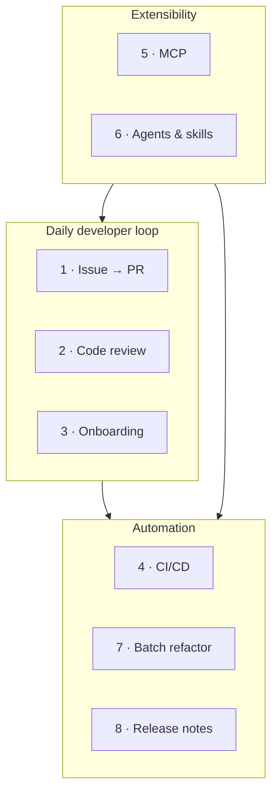

# Demo Scenarios

**ワークショップの Part 3 — 一日の中核です。** 自己完結した実務的なシナリオが 8 つ。いずれも再現可能で、前提条件を記載し、コピー＆ペースト可能なコマンド列と各ステップの *理由* を示します。

> 7 つのシナリオは意図的に **汎用** で、どのリポジトリでも再現できます。**Demo 8** は **このリポジトリ**（[template-github-copilot](https://github.com/ks6088ts/template-github-copilot)）を題材コードベースとして使います。

---

## 共通の前提条件

まず [Getting Started](../getting_started.md) を完了してください。次に確認します。

```bash
copilot --version          # CLI installed
```

```text
> /login                   # authenticated (or COPILOT_GITHUB_TOKEN set for headless)
> /mcp                     # GitHub MCP server present
```

!!! warning "安全な場所で実行する"
    いくつかのデモは Copilot にファイル編集・シェルコマンド実行・GitHub.com の操作を許可します。**使い捨てのリポジトリやブランチ** を使い、提案されたアクションをレビューし、自律性を与えるときは [サンドボックス](../features.md#sandboxing) を優先してください。破壊的な自動化を `main` に向けてはいけません。

---

## 8 つのシナリオ

| # | シナリオ | テーマ | 主に使う機能 |
|---|----------|--------|--------------|
| 1 | [Issue → Branch → PR 自動化](01_issue_to_pr.md) | 日々の開発ループ | GitHub MCP、Plan モード、`/delegate` |
| 2 | [AI コードレビュー](02_code_review.md) | 品質 | Code review エージェント、`@` ファイル参照、`/review` |
| 3 | [コードベースのオンボーディング](03_onboarding.md) | 理解 | Explore・Research エージェント、マルチリポ |
| 4 | [CI/CD 非対話自動化](04_cicd_automation.md) | 自動化 | `copilot -p`、PAT 認証、ツール許可／禁止 |
| 5 | [MCP サーバー連携](05_mcp_integration.md) | 拡張性 | `/mcp add`、外部ツール／データ |
| 6 | [カスタムエージェントとスキル](06_custom_agents_skills.md) | 拡張性 | `.github/agents`、`SKILL.md` |
| 7 | [プログラマティックな一括リファクタ／移行](07_batch_refactor.md) | 自動化 | Plan モード、`/fleet`、チェックリスト |
| 8 | [リリースノート／変更履歴の自動生成](08_release_notes.md) | 自動化 | Git 履歴、`@` 参照、本リポジトリ |



---

## 推奨する実施順序

- **時間がない場合は？** 1、2、4 を。最も即効性のある価値を提供します。
- **フルデーなら？** 順番に進めます。5・6（拡張性）が 7・8 をより強力にします。
- **ファシリテーションする場合は？** いくつかのオープン Issue と進行中ブランチを用意したデモリポジトリを事前に作っておくと、1・2・8 に題材ができます。

各ページは **「学んだこと」** と、自習用の **「さらに進める」** プロンプトで締めくくります。

[Demo 1 · Issue → Branch → PR 自動化](01_issue_to_pr.md) から始めましょう。
