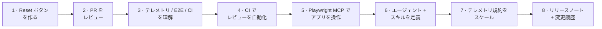
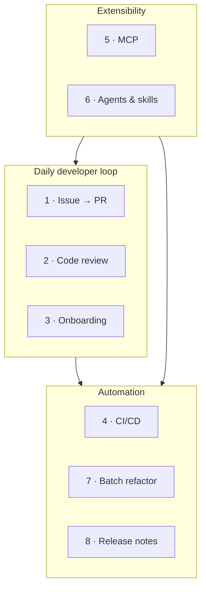

# Demo Scenarios

**ワークショップの Part 3 — 一日の中核です。** 自己完結した実務的なシナリオが 8 つ。これらは **1 つの連続したストーリー** を描きます。あなたは [template-typescript-react](https://github.com/ks6088ts/template-typescript-react) プロジェクト（React 19 + TypeScript + Vite のシングルページアプリ）に参加し、Copilot CLI を使って実際の機能を作り・レビューし・自動化し・拡張し・スケールし・リリースします。各ページは再現可能で、前提条件を記載し、コピー＆ペースト可能なコマンド列と各ステップの *理由* を示します。

> すべてのシナリオは **同じアプリ** を題材にし、前のデモを土台に積み上がります。とはいえ、途中から始めたい場合は各ページ単体でも成立します。

---

## 通底する題材

8 つのデモを通じて、1 つの小さく現実的な機能 — `src/App.tsx` のカウンターに付ける **Reset ボタン** — と、それを取り巻くエンジニアリングの実践を育てます。



- **題材アプリ:** [`ks6088ts/template-typescript-react`](https://github.com/ks6088ts/template-typescript-react) — React 19、TypeScript、Vite、Biome、Vitest（ブラウザモード）、Playwright、任意の OpenTelemetry / Application Insights、GitHub Actions CI。
- **機能の縦糸:** カウンターに（テレメトリイベント付きの）Reset ボタンを追加し、レビュー・テスト・自動化・拡張・リファクタ・リリースしていきます。

---

## 共通の前提条件 { #shared-prerequisites }

まず [Getting Started](../getting_started.md) を完了してください。次に [template-typescript-react](https://github.com/ks6088ts/template-typescript-react) を **フォーク**（または *Use this template* を押下）して、プッシュできる自分のコピーを用意し、クローンします。

```bash
# 自分のフォークをクローン（<your-username> を置き換え）
git clone https://github.com/<your-username>/template-typescript-react
cd template-typescript-react

# Node.js + pnpm が必要（リポジトリの README を参照）
pnpm install
```

CLI の準備を確認します。

```bash
copilot --version          # CLI installed
```

```text
> /login                   # authenticated (or COPILOT_GITHUB_TOKEN set for headless)
> /mcp                     # GitHub MCP server present
```

!!! warning "自分のフォークに対して実行する"
    いくつかのデモは Copilot にファイル編集・シェルコマンド実行・GitHub.com の操作を許可します。**自分のフォーク** と **フィーチャーブランチ** に向けて実行し、上流リポジトリや `main` には向けないでください。提案されたアクションをレビューし、自律性を与えるときは [サンドボックス](../features.md#sandboxing) を優先してください。

---

## 8 つのシナリオ

| # | シナリオ | テーマ | 主に使う機能 |
|---|----------|--------|--------------|
| 1 | [Issue → Branch → PR 自動化](01_issue_to_pr.md) | 日々の開発ループ | GitHub MCP、Plan モード、`/delegate` |
| 2 | [AI コードレビュー](02_code_review.md) | 品質 | Code review エージェント、`@` ファイル参照、`/review` |
| 3 | [コードベースのオンボーディング](03_onboarding.md) | 理解 | Explore・Research エージェント、マルチリポ |
| 4 | [CI/CD 非対話自動化](04_cicd_automation.md) | 自動化 | `copilot -p`、PAT 認証、ツール許可／禁止 |
| 5 | [MCP サーバー連携](05_mcp_integration.md) | 拡張性 | `/mcp add`、外部ツール／データ |
| 6 | [カスタムエージェントとスキル](06_custom_agents_skills.md) | 拡張性 | `.github/agents`、`SKILL.md` |
| 7 | [プログラマティックな一括リファクタ／移行](07_batch_refactor.md) | 自動化 | Plan モード、`/fleet`、チェックリスト |
| 8 | [リリースノート／変更履歴の自動生成](08_release_notes.md) | 自動化 | Git 履歴、`@` 参照、`copilot -p` |



---

## 推奨する実施順序

- **時間がない場合は？** 1、2、4 を。最も即効性のある価値を提供します。
- **フルデーなら？** 順番に進めます。ストーリーが積み上がり、5・6（拡張性）が 7・8 の再利用可能な部品になります。
- **ファシリテーションする場合は？** 参加者に事前に [template-typescript-react](https://github.com/ks6088ts/template-typescript-react) をフォークして `pnpm install` してもらうと、Demo 1 で各自のコピーに最初の Issue を立てられます。

各ページは冒頭の短い **「このストーリーでは」** の振り返りで始まり、**「学んだこと」** と、自習用の **「さらに進める」** プロンプトで締めくくります。

[Demo 1 · Issue → Branch → PR 自動化](01_issue_to_pr.md) から始めましょう。
