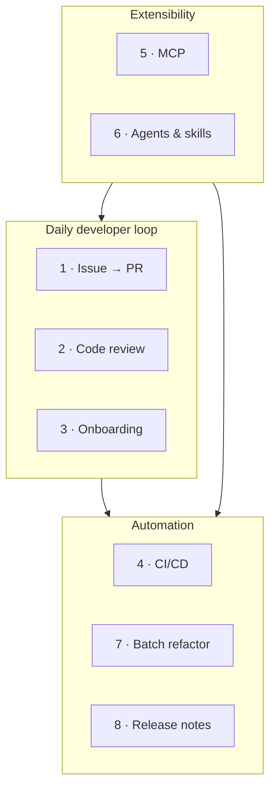

# Demo Scenarios

**Part 3 of the workshop — the heart of the day.** Eight self-contained, production-grade scenarios. Each one is reproducible, lists its prerequisites, and gives you a copy-pasteable command sequence plus the *why* behind each step.

> Seven scenarios are intentionally **generic** so they reproduce in any repository. **Demo 8** uses **this repository** ([template-github-copilot](https://github.com/ks6088ts/template-github-copilot)) as its working codebase.

---

## Shared prerequisites

Complete [Getting Started](../getting_started.md) first. Then confirm:

```bash
copilot --version          # CLI installed
```

```text
> /login                   # authenticated (or COPILOT_GITHUB_TOKEN set for headless)
> /mcp                     # GitHub MCP server present
```

!!! warning "Run in a safe place"
    Several demos let Copilot edit files, run shell commands, and act on GitHub.com. Use a **throwaway repo or branch**, review proposed actions, and prefer a [sandbox](../features.md#sandboxing) when granting autonomy. Never point destructive automation at `main`.

---

## The eight scenarios

| # | Scenario | Theme | Key features exercised |
|---|----------|-------|------------------------|
| 1 | [Issue → Branch → PR automation](01_issue_to_pr.md) | Daily dev loop | GitHub MCP, plan mode, `/delegate` |
| 2 | [AI code review](02_code_review.md) | Quality | Code review agent, `@` file refs, `/review` |
| 3 | [Codebase onboarding](03_onboarding.md) | Understanding | Explore & Research agents, multi-repo |
| 4 | [CI/CD non-interactive automation](04_cicd_automation.md) | Automation | `copilot -p`, PAT auth, allow/deny tools |
| 5 | [MCP server integration](05_mcp_integration.md) | Extensibility | `/mcp add`, external tools/data |
| 6 | [Custom agents & skills](06_custom_agents_skills.md) | Extensibility | `.github/agents`, `SKILL.md` |
| 7 | [Programmatic batch refactor / migration](07_batch_refactor.md) | Automation | plan mode, `/fleet`, checklists |
| 8 | [Release notes & changelog automation](08_release_notes.md) | Automation | Git history, `@` refs, this repo |



---

## Suggested running order

- **Short on time?** Do 1, 2, and 4 — they deliver the most immediate value.
- **Full day?** Run them in order; 5 and 6 (extensibility) give 7 and 8 reusable building blocks.
- **Facilitating?** Pre-create a demo repo with a couple of open issues and an in-progress branch so 1, 2, and 8 have material to work with.

Each page ends with **"What you learned"** and **"Take it further"** prompts for self-paced exploration.

Start with [Demo 1 · Issue → Branch → PR automation](01_issue_to_pr.md).
