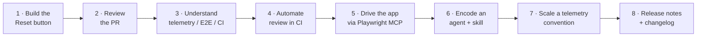
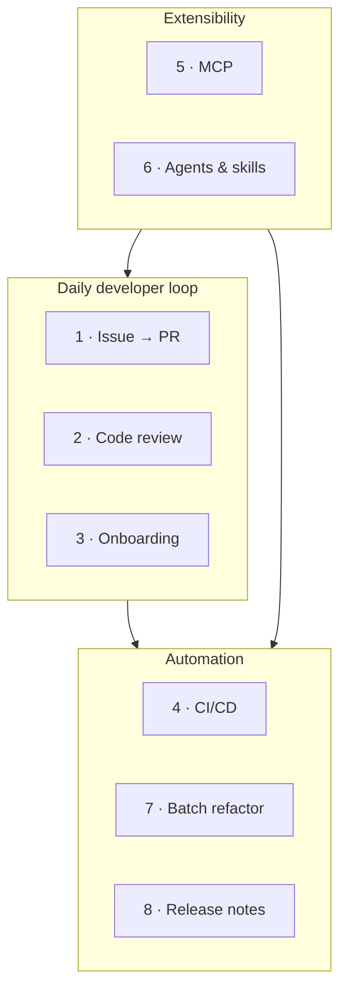

# Demo Scenarios

**Part 3 of the workshop — the heart of the day.** Eight self-contained, production-grade scenarios that tell **one connected story**. You join the [template-typescript-react](https://github.com/ks6088ts/template-typescript-react) project — a React 19 + TypeScript + Vite single-page app — and use Copilot CLI to build, review, automate, extend, scale, and release a real feature. Each page is reproducible, lists its prerequisites, and gives you a copy-pasteable command sequence plus the *why* behind each step.

> Every scenario uses the **same app** as its subject and builds on the previous one — but each page also stands alone if you want to jump straight in.

!!! tip "Want a narrated, build-from-scratch companion?"
    GitHub's *Dev Days* workshop [Build with the Copilot CLI — Mona Mayhem](https://www.youtube.com/watch?v=c2QeGuWPnSw) builds a different app (a retro-arcade "contribution battle") using the same techniques you practice here: `/init` context engineering, plan mode, autopilot vs. YOLO, screenshot-driven UI debugging, `/plugin` + [awesome-copilot](https://github.com/github/awesome-copilot), `/fleet`, and `/delegate`. It pairs especially well with Demos 1, 6, and 7. See [References → Talks & demos](../appendix/references.md#talks--demos).

---

## The running example

Across the eight demos you grow one small, realistic feature — a **Reset button** for the counter in `src/App.tsx` — and the engineering practices around it:



- **Subject app:** [`ks6088ts/template-typescript-react`](https://github.com/ks6088ts/template-typescript-react) — React 19, TypeScript, Vite, Biome, Vitest (browser mode), Playwright, optional OpenTelemetry / Application Insights, and GitHub Actions CI.
- **The feature thread:** add a Reset button (with a telemetry event) to the counter, then review, test, automate, extend, refactor, and release it.

---

## Shared prerequisites { #shared-prerequisites }

Complete [Getting Started](../getting_started.md) first. Then **fork** (or press *Use this template* on) [template-typescript-react](https://github.com/ks6088ts/template-typescript-react) so you have a copy you can push to, and clone it:

```bash
# Clone YOUR fork (replace <your-username>)
git clone https://github.com/<your-username>/template-typescript-react
cd template-typescript-react

# Node.js + pnpm are required (see the repo README)
pnpm install
```

Confirm the CLI is ready:

```bash
copilot --version          # CLI installed
```

```text
> /login                   # authenticated (or COPILOT_GITHUB_TOKEN set for headless)
> /mcp                     # GitHub MCP server present
```

!!! warning "Run against your fork"
    Several demos let Copilot edit files, run shell commands, and act on GitHub.com. Point them at **your fork** and a **feature branch** — never the upstream repo or `main`. Review proposed actions and prefer a [sandbox](../features.md#sandboxing) when granting autonomy.

---

## The eight scenarios

| # | Scenario | Theme | Key features exercised |
|---|----------|-------|------------------------|
| 1 | [Issue → Branch → PR automation](01_issue_to_pr.md) | Daily dev loop | GitHub MCP, plan mode, `/delegate` |
| 2 | [AI code review](02_code_review.md) | Quality | Code review agent, `@` file refs, `/review` |
| 3 | [Codebase onboarding](03_onboarding.md) | Understanding | Explore & Research agents, multi-repo |
| 4 | [CI/CD non-interactive automation](04_cicd_automation.md) | Automation | `copilot -p`, PAT auth, allow/deny tools |
| 5 | [MCP server integration](05_mcp_integration.md) | Extensibility | `/mcp add`, external tools/data |
| 6 | [Custom agents & skills](06_custom_agents_skills.md) | Extensibility | `.github/agents`, `SKILL.md` |
| 7 | [Programmatic batch refactor / migration](07_batch_refactor.md) | Automation | plan mode, `/fleet`, checklists |
| 8 | [Release notes & changelog automation](08_release_notes.md) | Automation | Git history, `@` refs, `copilot -p` |



---

## Suggested running order

- **Short on time?** Do 1, 2, and 4 — they deliver the most immediate value.
- **Full day?** Run them in order; the story compounds, and 5 and 6 (extensibility) give 7 and 8 reusable building blocks.
- **Facilitating?** Have attendees fork [template-typescript-react](https://github.com/ks6088ts/template-typescript-react) and run `pnpm install` beforehand, so Demo 1 can open the first issue against their own copy.

Each page opens with a short **"In this story"** recap and ends with **"What you learned"** and **"Take it further"** prompts for self-paced exploration.

Start with [Demo 1 · Issue → Branch → PR automation](01_issue_to_pr.md).
