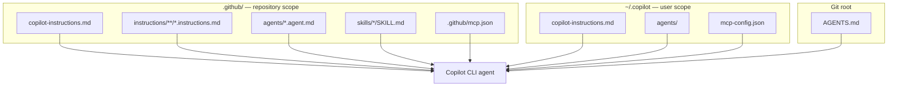

# Feature Deep Dive

**ワークショップの Part 2。** 本章はデモ中に何度も戻ってくるリファレンスです。モデル、エージェントモード、コンテキスト管理、カスタマイズ全般（指示・エージェント・スキル・フック・MCP・メモリ）、権限、サンドボックス、Bring-Your-Own-Key を扱います。所要時間は約 75 分です。

> CLI は毎週進化します。ここに記載した具体値は「執筆時点で GitHub ドキュメントに照らして検証済み」として扱い、`/help`、`/model`、`copilot help <topic>` でライブに確認してください（[Best practices](https://docs.github.com/en/copilot/how-tos/copilot-cli/cli-best-practices)）。

---

## モデルとモデル選択

`/model`（または `--model` フラグ）でいつでも、セッション途中でもモデルを切り替えられます（[About Copilot CLI](https://docs.github.com/en/copilot/concepts/agents/about-copilot-cli)）。ただし、ワークショップ資料を 1 つの固定モデル名に依存させないでください。モデルカタログ、既定値、プランごとの利用可否、Enterprise のポリシー制御は頻繁に変わります。

代わりに次の判断表を使います。

| ニーズ | CLI での選び方 | 注意点 |
|--------|----------------|--------|
| 安定した日常的なワークショップ進行 | **Auto** または `/model` に表示される既定モデルから開始 | Auto は明示的なモデル制御よりも、可用性を見たルーティングを優先する |
| 複雑なアーキテクチャ、難しいデバッグ、大きなリファクタ | `/model` に表示される推論対応のプレミアムモデルを選ぶ | 高い reasoning や extended context は AI クレジット消費を増やす |
| 高速な機械的編集や大量チェック | プランで表示される高速／小型の coding model を選ぶ | 出力はテストで検証する。高速さは品質保証ではない |
| Enterprise 管理のモデル戦略 | 組織／Enterprise ポリシーで `/model` に公開されたモデルを使う | 管理者が代替モデルや外部プロバイダーモデルを有効化する必要がある場合がある |
| ローカル／外部プロバイダー検証 | BYOK 設定を使う（[BYOK](#byok) を参照） | モデルはツール呼び出しとストリーミングをサポートする必要がある |

!!! warning "モデルのライフサイクルは短い"
  最近の changelog だけでも、GPT-4.1 は 2026-06-01 に deprecated、GPT-5.2 と GPT-5.2-Codex は 2026-06-05 に多くの Copilot 体験で deprecated、Opus 4.6 (fast) は 2026-06-29 に deprecated 予定です（[GPT-4.1 deprecated](https://github.blog/changelog/2026-06-02-gpt-4-1-deprecated)、[GPT-5.2 and GPT-5.2-Codex deprecated](https://github.blog/changelog/2026-06-05-gpt-5-2-and-gpt-5-2-codex-deprecated)、[Upcoming deprecation of Opus 4.6 fast](https://github.blog/changelog/2026-06-18-upcoming-deprecation-of-opus-4-6-fast)）。ワークショップ実施前に `/model`、[supported models](https://docs.github.com/copilot/reference/ai-models/supported-models)、[GitHub Blog Copilot changelog](https://github.blog/changelog/label/copilot/) を確認してください。

固定の演習手順にしない範囲で、最近の追加として押さえるべき点は次のとおりです。

- Gemini 3.1 Pro (Preview) と Gemini 3.5 Flash は、プランとポリシーが許せば Copilot CLI で利用できます。Business／Enterprise 管理者はモデルポリシーで opt in する必要があります（[Gemini models in Copilot CLI](https://github.blog/changelog/2026-06-02-gemini-models-in-copilot-cli-cloud-agent-and-the-copilot-app)）。
- MAI-Code-1-Flash は Copilot CLI を含む複数サーフェスへ展開中で、プランごとに段階的に提供されます（[MAI-Code-1-Flash available on more Copilot surfaces](https://github.blog/changelog/2026-06-18-mai-code-1-flash-available-on-more-copilot-surfaces)）。
- Enterprise 管理者が構成した外部プロバイダーモデルは Copilot CLI の model picker に表示されます。一方で個人ユーザーはクライアント側 BYOK プロバイダーも構成できます（[Copilot CLI supports enterprise BYOK models](https://github.blog/changelog/2026-06-17-copilot-cli-supports-enterprise-bring-your-own-key-byok-models)）。
- 対応モデルでは **拡張（100 万トークン）コンテキスト** と **調整可能な推論レベル** が使えます。GitHub は、日常タスクでは既定設定を使い、複雑な複数ファイル作業でのみ extended context や higher reasoning を使うことを推奨しています。どちらも AI クレジット消費を増やします（[Larger context windows and configurable reasoning levels](https://github.blog/changelog/2026-06-04-larger-context-windows-and-configurable-reasoning-levels-for-github-copilot)）。

---

## エージェントモードの詳細

### Plan モード

誤解のコストが高いときに Plan モードを使います。複数ファイル変更、移行、新機能、セキュリティに関わるコード変更などです。++shift+tab++ または `/plan <prompt>` で Plan モードに入ると、Copilot は次を行います（[Best practices](https://docs.github.com/en/copilot/how-tos/copilot-cli/cli-best-practices)）。

1. リクエストとコードベースを分析する。
2. スコープを合わせるために **確認の質問** をする。
3. セッションフォルダに、チェックボックス付きの構造化された `plan.md` を書く。
4. コードを書く前に **承認を待つ**。

++ctrl+y++ で計画を Markdown エディタで開いて編集できます。難しいタスクで推奨されるループは次のとおりです。

```text
explore → plan → review → implement → verify → commit
```

```text
> Read the authentication files but don't write code yet
> /plan Implement password reset flow
> Proceed with the plan
> Run the tests and fix any failures
> Commit these changes with a descriptive message
```

### Autopilot

Autopilot はタスクが完了するまで自律的に作業を続けます。++shift+tab++ で切り替えます。利用中のビルドで experimental と表示される場合は、`--experimental` または `/experimental` で有効化します（[README](https://github.com/github/copilot-cli)）。CLI 1.0.63 では、エージェントモードがセッション単位で追跡されるようになり、新規作成・clear・切り替え時に持ち越されなくなりました（[copilot-cli changelog 1.0.63](https://github.com/github/copilot-cli/blob/main/changelog.md#1063---2026-06-15)）。無人実行では [サンドボックス](#sandboxing) と併用しましょう。

### 並列化: `/fleet` とサブエージェント

大きなタスクでは、プロンプトの先頭に `/fleet` を付けると、Copilot が作業をサブエージェントが実行する並列サブタスクに分割します（[Best practices](https://docs.github.com/en/copilot/how-tos/copilot-cli/cli-best-practices)）。サブエージェントの作業コンテキストはメインスレッドにすべて流れ込まず、結果の要約を見る形になります。広範な探索には有効ですが、最後に統合結果をテスト・検証するステップは必要です。

---

## コンテキスト管理と無限セッション

Copilot CLI には **無限セッション** があります。会話がトークン上限の約 95% に近づくと、作業を中断せずバックグラウンドで履歴を自動圧縮します（[About Copilot CLI](https://docs.github.com/en/copilot/concepts/agents/about-copilot-cli#automatic-context-management)）。

| コマンド | 目的 |
|----------|------|
| `/context` | トークン使用量の視覚的な内訳（システム／ツール、履歴、空き、バッファ） |
| `/compact` | 履歴を手動で圧縮（通常は不要） |
| `/usage` | セッション統計: 使用した AI クレジット、所要時間、編集行数、モデル別トークン内訳 |
| `/session` | 現在のセッションの情報 |
| `/session checkpoints [N]` | 圧縮チェックポイントの一覧／表示 |
| `/session files` | このセッションで作成された一時成果物 |
| `/session plan` | 現在の計画（あれば） |
| `/clear` または `/new` | 無関係なタスクの間でリセット（品質が向上） |

セッション状態はディスクに永続化されます（[Best practices](https://docs.github.com/en/copilot/how-tos/copilot-cli/cli-best-practices)）。

```text
~/.copilot/session-state/{session-id}/
├── events.jsonl      # full session history
├── workspace.yaml    # metadata
├── plan.md           # implementation plan (if created)
├── checkpoints/      # compaction history
└── files/            # persistent artifacts
```

作業は `--resume`／`/resume` で再開でき、`copilot --continue` で直近のセッションに戻れます（[Using Copilot CLI](https://docs.github.com/en/copilot/how-tos/use-copilot-agents/use-copilot-cli)）。

!!! tip "セッションは集中させる"
    無限 ≠ 無限に有用、です。無関係なタスクの間では `/clear` や `/new` を使いましょう。同僚との会話を新しく始めるのと同じです（[Best practices](https://docs.github.com/en/copilot/how-tos/copilot-cli/cli-best-practices)）。

管理者にとって、`/usage` はローカル／セッション単位の表示にすぎません。組織／Enterprise の所有者は Copilot usage metrics API も監視します。2026-06-19 時点で、ユーザーレベルのレポートに `ai_credits_used` が追加され、ユーザーごとの Copilot 活動全体の AI クレジット消費を把握できるようになりました（[AI credits consumed per user now in the Copilot usage metrics API](https://github.blog/changelog/2026-06-19-ai-credits-consumed-per-user-now-in-the-copilot-usage-metrics-api)）。

---

## カスタマイズのサーフェス

これらのファイルと設定により、CLI をチームのワークフローに沿って動かせます。多くは IDE・SDK サーフェスとも共有されます。



### カスタム指示

プロンプトに自動的に含まれる自然言語の Markdown です。Copilot CLI は複数の場所から読み込み、**それらは結合されます**（優先フォールバックではない）。競合時はリポジトリの指示がグローバルより優先されます（[Best practices](https://docs.github.com/en/copilot/how-tos/copilot-cli/cli-best-practices)、[Adding custom instructions](https://docs.github.com/en/copilot/how-tos/copilot-cli/add-custom-instructions)）。

| 場所 | スコープ |
|------|----------|
| `~/.copilot/copilot-instructions.md` | 全セッション（グローバル） |
| `.github/copilot-instructions.md` | リポジトリ |
| `.github/instructions/**/*.instructions.md` | リポジトリ（モジュラー、パススコープ） |
| `AGENTS.md`（Git ルートまたは cwd） | リポジトリ |
| `Copilot.md`、`GEMINI.md`、`CODEX.md` | リポジトリ |

> 簡潔かつ実行可能に保ちましょう。冗長な指示は効果を薄め、矛盾する指示は非決定的な挙動を招きます（[Best practices](https://docs.github.com/en/copilot/how-tos/copilot-cli/cli-best-practices)）。

### カスタムエージェント

カスタムエージェントは、独自の専門性・ツール・指示を持つ Copilot の特化版です。Copilot CLI は組み込みエージェントを同梱し、独自に定義することもできます（[Using Copilot CLI](https://docs.github.com/en/copilot/how-tos/use-copilot-agents/use-copilot-cli)）。

**組み込みエージェント:**

| エージェント | 役割 |
|--------------|------|
| **Explore** | メインのコンテキストを汚さずにコードベースを素早く分析 |
| **Task** | テスト／ビルドを実行。成功時は短い要約、失敗時は全出力 |
| **General purpose** | 複雑な複数ステップのタスクを別コンテキストで実行 |
| **Code review** | 本当に重要な問題だけを浮かび上がらせ、ノイズを最小化 |
| **Research** | コード・リポジトリ・Web を横断する深い調査を、引用付きで実施 |
| **Rubber duck** | 建設的な批評役。`/rubber-duck` で呼び出せ、メインエージェントがセカンドオピニオンとして使うこともある |

**独自に定義** するには Markdown の「エージェントプロファイル」を使います。

| 種別 | 場所 | スコープ |
|------|------|----------|
| ユーザー | `~/.copilot/agents/` | すべてのプロジェクト |
| リポジトリ | `.github/agents/` | 現在のプロジェクト |
| 組織／Enterprise | `.github-private` リポジトリ内の `/agents` | 組織／Enterprise 配下の全プロジェクト |

エージェントは 3 通りで呼び出します（[Using Copilot CLI](https://docs.github.com/en/copilot/how-tos/use-copilot-agents/use-copilot-cli)）。

```text
> /agent                                   # pick from a list
> Use the refactoring agent to clean this up   # natural language
$ copilot --agent=refactor-agent -p "Refactor this block"
```

[Demo 6](demos/06_custom_agents_skills.md) で 1 つ作成します。

GitHub は **Agent finder** も展開しています。これは許可されたレジストリから MCP サーバー、スキル、キャンバス、エージェント、ツールを検索し、ランキングされた候補を返します。リソースを勝手にインストールするものではなく、managed settings と registry policy の範囲内で、何を配線すべきかを発見するための仕組みです（[Agent finder for GitHub Copilot](https://github.blog/changelog/2026-06-17-agent-finder-for-github-copilot-now-available)）。

### スキル

スキルは、特化したタスク向けに指示・スクリプト・リソースで Copilot を強化するもので、`SKILL.md` フォルダとしてパッケージ化します（[Adding agent skills](https://docs.github.com/en/copilot/how-tos/copilot-cli/customize-copilot/add-skills)、[About agent skills](https://docs.github.com/en/copilot/concepts/agents/about-agent-skills)）。[Demo 6](demos/06_custom_agents_skills.md) でも扱います。

### フック

フックは、エージェントのライフサイクルの要所でカスタムシェルコマンドを実行できます。検証・権限チェック・ロギング・セキュリティスキャンなどに使えます（[About hooks for GitHub Copilot](https://docs.github.com/en/copilot/concepts/agents/hooks)）。フックは CLI・IDE・クラウドエージェントでサポートされます。

### Copilot Memory

Copilot は、リポジトリの規約やパターンに関する持続的な「メモリ」を推論して保存でき、プロンプトでの繰り返しの説明を減らせます（[About GitHub Copilot Memory](https://docs.github.com/en/copilot/concepts/agents/copilot-memory)）。

### MCP サーバー

CLI は **GitHub MCP サーバーをあらかじめ構成** して同梱しているため、GitHub.com の操作がすぐに使えます。他のツール／データに到達するにはサーバーを追加します（[Using Copilot CLI](https://docs.github.com/en/copilot/how-tos/use-copilot-agents/use-copilot-cli)）。

```text
> /mcp           # list configured servers
> /mcp add       # add a server (Tab between fields, Ctrl+S to save)
```

ユーザーレベルのサーバー定義は `~/.copilot` 配下の `mcp-config.json` に保存されます（`COPILOT_HOME` で上書き可）。最近の CLI では `.github/mcp.json` からワークスペース MCP 設定も自動ロードされます。また、`deferTools` のような新しい MCP 設定キーも changelog で追加されています（[copilot-cli changelog 1.0.61](https://github.com/github/copilot-cli/blob/main/changelog.md#1061---2026-06-09)、[copilot-cli changelog 1.0.63](https://github.com/github/copilot-cli/blob/main/changelog.md#1063---2026-06-15)）。[Demo 5](demos/05_mcp_integration.md) でカスタムサーバーを配線します。

---

## 権限と許可ツール

Copilot がファイルを変更・実行しうるツール（例: `touch`、`chmod`、`node`、`sed`）を初めて使うとき、確認します（[About Copilot CLI](https://docs.github.com/en/copilot/concepts/agents/about-copilot-cli#security-considerations)）。

```text
1. Yes
2. Yes, and approve TOOL for the rest of the running session
3. No, and tell Copilot what to do differently (Esc)
```

ツールはフラグやスラッシュコマンドで事前に許可（または禁止）します。

| 仕組み | 効果 |
|--------|------|
| `--allow-all-tools` | 確認なしで任意のツールを許可（危険） |
| `--allow-tool='shell(git:*)'` | すべての `git` コマンドを許可 |
| `--allow-tool='write'` | ファイル書き込みを許可 |
| `--deny-tool='shell(git push)'` | `git push` を禁止（deny が **優先**） |
| `--allow-tool='MyServer'` / `--deny-tool='MyServer(tool)'` | MCP サーバーのツールを許可／禁止 |
| `/allow-all` または `/yolo` | セッション内ですべての権限を有効化 |
| `/reset-allowed-tools` | 以前に許可したツールをリセット |

```bash
# Allow all git EXCEPT push; deny destructive rm
copilot --allow-tool='shell(git:*)' --deny-tool='shell(git push)' --deny-tool='shell(rm)'
```

チーム向けの最小権限パターン。

| ワークフロー | 安全な開始点 |
|--------------|--------------|
| 読み取り中心のレビュー／レポート | `shell(git:*)` を許可。レポートファイルを書く場合だけ `write` を許可 |
| CI の prompt mode | `git push`、`git reset`、`rm`、デプロイコマンドを禁止。プロンプトは冪等にする |
| 移行／リファクタ | テストコマンドとファイル書き込みを許可。ブランチ作業と人間の差分レビューを必須にする |
| 信頼できないリポジトリや生成コード | 広い権限を与える前にローカルまたはクラウドサンドボックスを使う |

!!! danger "自動承認 = あなたの全権限"
    `--allow-all-tools`／`--yolo` を使うと、Copilot はレビューなしであなたと同じコマンドを実行できます。破壊的なものも含みます。サンドボックスや使い捨て環境に限定してください（[Security considerations](https://docs.github.com/en/copilot/concepts/agents/about-copilot-cli#security-implications-of-automatic-tool-approval)）。

---

## サンドボックス { #sandboxing }

より大きな自律性を安全に与えるには、サンドボックス内で実行します（[About Copilot CLI](https://docs.github.com/en/copilot/concepts/agents/about-copilot-cli#running-in-a-sandbox-with-cloud-and-local-sandboxes-for-github-copilot)、public preview）。

| 種別 | 方法 | 使うとき |
|------|------|----------|
| **ローカルサンドボックス** | セッション内で `/sandbox enable` | Copilot が開始するシェルコマンド実行をローカルマシン上で制限。Microsoft MXC ベースで、標準の Copilot seat に含まれる |
| **クラウドサンドボックス** | `copilot --cloud` | GitHub がホストする一時的な Linux 環境を起動。強い隔離、別デバイスからの継続、計算量の多い作業、並列タスクに使う |

クラウドサンドボックスのポリシーは Copilot cloud agent のポリシーを継承するため、既存のファイアウォールルールが自動的に拡張されます。長時間のワークショップでクラウドサンドボックスに依存する場合は、事前に pricing を確認してください（[Cloud and local sandboxes for GitHub Copilot now in public preview](https://github.blog/changelog/2026-06-02-cloud-and-local-sandboxes-for-github-copilot-now-in-public-preview)）。

---

## Bring Your Own Key（BYOK） { #byok }

環境変数で、GitHub ホスト型モデルの代わりに独自のモデルプロバイダーを CLI に向けられます（[About Copilot CLI](https://docs.github.com/en/copilot/concepts/agents/about-copilot-cli#using-your-own-model-provider)）。

BYOK には 2 つの経路があります。

- **Enterprise 管理のプロバイダーモデル**: 管理者が外部プロバイダーモデルを構成し、対象ユーザーの `/model` に表示されます（[Copilot CLI supports enterprise BYOK models](https://github.blog/changelog/2026-06-17-copilot-cli-supports-enterprise-bring-your-own-key-byok-models)）。
- **クライアント側 BYOK**: 個人ユーザーが、環境変数でローカル CLI を OpenAI 互換、Azure OpenAI、Anthropic、ローカルプロバイダーに向けます。

| 変数 | 意味 |
|------|------|
| `COPILOT_PROVIDER_BASE_URL` | プロバイダー API のベース URL |
| `COPILOT_PROVIDER_TYPE` | `openai`（既定。Ollama／vLLM を含む OpenAI 互換）、`azure`、`anthropic` |
| `COPILOT_PROVIDER_API_KEY` | API キー（キー不要のローカルプロバイダーでは省略） |
| `COPILOT_MODEL` | 使用するモデル（または `--model`） |

要件と注意点。

- モデルは **ツール呼び出しとストリーミングをサポート** する必要があります。コンテキストは 128k 以上を目安に（[About Copilot CLI](https://docs.github.com/en/copilot/concepts/agents/about-copilot-cli#using-your-own-model-provider)）。
- 組み込みサブエージェントはプロバイダー設定を継承します。コスト見積もりは非表示ですが、トークン数は表示されます（[Best practices](https://docs.github.com/en/copilot/how-tos/copilot-cli/cli-best-practices)）。
- `/delegate` は依然として GitHub サインインが必要です。プロバイダーではなく GitHub のサーバーサイド Copilot に転送されます（[Best practices](https://docs.github.com/en/copilot/how-tos/copilot-cli/cli-best-practices)）。
- 完全なセットアップは `copilot help providers` を実行してください。

> 本リポジトリの [Copilot SDK チュートリアル — BYOK レシピ](../copilot_sdk_tutorial/python/index.md) にプログラム的な等価例があります。

---

## インタフェースと相互運用

| 機能 | 方法 | 出典 |
|------|------|------|
| **モデルを介さずにシェルコマンドを実行** | 先頭に `!`、例: `!git status` | [Using Copilot CLI](https://docs.github.com/en/copilot/how-tos/use-copilot-agents/use-copilot-cli) |
| **プロンプトにファイルを追加** | `@path/to/file` | [Using Copilot CLI](https://docs.github.com/en/copilot/how-tos/use-copilot-agents/use-copilot-cli) |
| **別ディレクトリで作業** | `/add-dir`、`/cwd`、`/cd`、`/list-dirs` | [Using Copilot CLI](https://docs.github.com/en/copilot/how-tos/use-copilot-agents/use-copilot-cli) |
| **プロンプトをスケジュール** | `/every <interval>`、`/after <delay>` | [Using Copilot CLI](https://docs.github.com/en/copilot/how-tos/use-copilot-agents/use-copilot-cli) |
| **UI 作業のための画像** | ドラッグ＆ドロップ、++ctrl+v++、または `@mockup.png` | [Best practices](https://docs.github.com/en/copilot/how-tos/copilot-cli/cli-best-practices) |
| **ローカル音声入力** | Space を長押し、または ++ctrl+x++ のあと `V` | [Copilot CLI improved UI, rubber duck, scheduling, and voice input](https://github.blog/changelog/2026-06-02-copilot-cli-improved-ui-rubber-duck-prompt-scheduling-and-voice-input) |
| **推論の可視化を切り替え** | ++ctrl+t++ | [Using Copilot CLI](https://docs.github.com/en/copilot/how-tos/use-copilot-agents/use-copilot-cli) |
| **セカンドオピニオンを得る** | `/rubber-duck` | [Copilot CLI improved UI, rubber duck, scheduling, and voice input](https://github.blog/changelog/2026-06-02-copilot-cli-improved-ui-rubber-duck-prompt-scheduling-and-voice-input) |
| **セキュリティに絞ったローカルレビュー** | `/security-review`（experimental） | [Dedicated security review command](https://github.blog/changelog/2026-06-10-dedicated-security-review-command-now-available-in-copilot-cli) |
| **worktree を作成／切り替え** | `/worktree`（alias `/move`） | [copilot-cli changelog 1.0.61](https://github.com/github/copilot-cli/blob/main/changelog.md#1061---2026-06-09) |
| **セッションの変更をレビュー** | `/diff` | [copilot-cli changelog](https://github.com/github/copilot-cli/blob/main/changelog.md) |
| **他ツールのエージェントとして使う（ACP）** | Agent Client Protocol サーバー | [About Copilot CLI](https://docs.github.com/en/copilot/concepts/agents/about-copilot-cli#use-copilot-cli-via-acp) |
| **クラウドエージェントに委譲** | `/delegate <prompt>` | [Best practices](https://docs.github.com/en/copilot/how-tos/copilot-cli/cli-best-practices) |

---

## 次へ

これで機能の全体像が手に入りました。[Demo Scenarios](demos/index.md) で実践しましょう。まずは [Issue → Branch → PR 自動化](demos/01_issue_to_pr.md) から。
