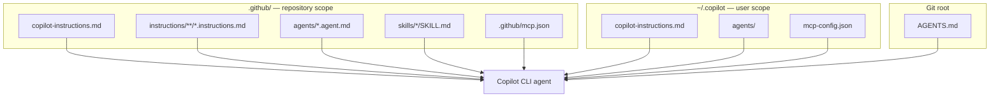

# Feature Deep Dive

**Part 2 of the workshop.** This chapter is the reference you will return to during the demos. It covers models, the agentic modes, context management, the full customization surface (instructions, agents, skills, hooks, MCP, memory), permissions, sandboxing, and bring-your-own-key. Budget ~75 minutes.

> The CLI evolves weekly. Treat specific values here as "true at time of writing, verified against GitHub docs" and confirm live with `/help`, `/model`, and `copilot help <topic>` ([Best practices](https://docs.github.com/en/copilot/how-tos/copilot-cli/cli-best-practices)).

---

## Models & model selection

Switch models any time — even mid-session — with `/model` (or the `--model` flag) ([About Copilot CLI](https://docs.github.com/en/copilot/concepts/agents/about-copilot-cli)). Do **not** build workshop instructions around one fixed model name: the model catalog, defaults, plan eligibility, and enterprise policy controls change frequently.

Use this decision table instead:

| Need | How to choose in the CLI | Watch-outs |
|------|--------------------------|------------|
| Stable day-to-day workshop flow | Start with **Auto** or the default shown by `/model` | Auto trades explicit model control for availability-aware routing |
| Complex architecture, hard debugging, large refactors | Pick a premium reasoning-capable model from `/model` | Higher reasoning or extended context consumes more AI credits |
| Fast mechanical edits or high-volume checks | Pick a fast/small coding model if your plan exposes one | Verify output with tests; speed is not a quality guarantee |
| Enterprise-controlled model strategy | Use models exposed by org/enterprise policy in `/model` | Admins may need to enable alternative models or external-provider models |
| Local or external-provider experiments | Use BYOK settings (see [BYOK](#byok)) | Model must support tool calling and streaming |

!!! warning "Model lifecycle changes quickly"
  Recent changelog examples show why fixed model lists go stale: GPT-4.1 was deprecated on 2026-06-01, GPT-5.2 and GPT-5.2-Codex were deprecated across most Copilot experiences on 2026-06-05, and Opus 4.6 (fast) is scheduled for deprecation on 2026-06-29 ([GPT-4.1 deprecated](https://github.blog/changelog/2026-06-02-gpt-4-1-deprecated), [GPT-5.2 and GPT-5.2-Codex deprecated](https://github.blog/changelog/2026-06-05-gpt-5-2-and-gpt-5-2-codex-deprecated), [Upcoming deprecation of Opus 4.6 fast](https://github.blog/changelog/2026-06-18-upcoming-deprecation-of-opus-4-6-fast)). Before running a workshop, check `/model`, [supported models](https://docs.github.com/copilot/reference/ai-models/supported-models), and the [GitHub Blog Copilot changelog](https://github.blog/changelog/label/copilot/).

Recent additions worth knowing, without hard-coding them into exercises:

- Gemini 3.1 Pro (Preview) and Gemini 3.5 Flash are available on Copilot CLI when plan and policy allow them; Business/Enterprise admins must opt in via model policy ([Gemini models in Copilot CLI](https://github.blog/changelog/2026-06-02-gemini-models-in-copilot-cli-cloud-agent-and-the-copilot-app)).
- MAI-Code-1-Flash is rolling out to more Copilot surfaces, including Copilot CLI, with staged availability by plan ([MAI-Code-1-Flash available on more Copilot surfaces](https://github.blog/changelog/2026-06-18-mai-code-1-flash-available-on-more-copilot-surfaces)).
- Enterprise-admin configured external-provider models now appear in the Copilot CLI model picker, while individual users can still configure client-side BYOK providers ([Copilot CLI supports enterprise BYOK models](https://github.blog/changelog/2026-06-17-copilot-cli-supports-enterprise-bring-your-own-key-byok-models)).
- Supported models offer an **extended (1M-token) context** option and **configurable reasoning levels**; GitHub recommends using defaults for everyday tasks and reserving extended context or higher reasoning for complex, multi-file work because they consume more AI credits ([Larger context windows and configurable reasoning levels](https://github.blog/changelog/2026-06-04-larger-context-windows-and-configurable-reasoning-levels-for-github-copilot)).

---

## Agentic modes in depth

### Plan mode

Use plan mode when the cost of a misunderstanding is high: multi-file changes, migrations, new features, or changes that touch security-sensitive code. Enter plan mode with ++shift+tab++ or `/plan <prompt>`. Copilot then ([Best practices](https://docs.github.com/en/copilot/how-tos/copilot-cli/cli-best-practices)):

1. Analyzes your request and the codebase.
2. **Asks clarifying questions** to align on scope.
3. Writes a structured `plan.md` (with checkboxes) into the session folder.
4. **Waits for your approval** before writing code.

Press ++ctrl+y++ to open and edit the plan in your Markdown editor. The recommended loop for hard tasks:

```text
explore → plan → review → implement → verify → commit
```

```text
> Read the authentication files but don't write code yet
> /plan Implement password reset flow
> Proceed with the plan
> Run the tests and fix any failures
> Commit these changes with a descriptive message
```

### Autopilot

Autopilot keeps working autonomously until the task is complete. Toggle it with ++shift+tab++; if a feature is still marked experimental in your build, enable experimental features with `--experimental` or `/experimental` ([README](https://github.com/github/copilot-cli)). As of CLI 1.0.63, agent mode is tracked per session, so it no longer carries over when you create, clear, or switch sessions ([copilot-cli changelog 1.0.63](https://github.com/github/copilot-cli/blob/main/changelog.md#1063---2026-06-15)). Pair autopilot with a [sandbox](#sandboxing) for unattended runs.

### Parallelism: `/fleet` and subagents

For large tasks, prefix your prompt with `/fleet` to let Copilot split the work into parallel subtasks run by subagents ([Best practices](https://docs.github.com/en/copilot/how-tos/copilot-cli/cli-best-practices)). Subagents keep their working context out of your main thread; you see the summarized results instead of every intermediate read/search/tool call. This is useful for broad exploration, but you still need a verification step that merges and tests the final output.

---

## Context management & infinite sessions

Copilot CLI features **infinite sessions**: when a conversation approaches ~95% of the token limit, it automatically compacts history in the background without interrupting you ([About Copilot CLI](https://docs.github.com/en/copilot/concepts/agents/about-copilot-cli#automatic-context-management)).

| Command | Purpose |
|---------|---------|
| `/context` | Visual breakdown of token usage (system/tools, history, free space, buffer) |
| `/compact` | Manually compress history (rarely needed) |
| `/usage` | Session stats: AI credits used, duration, lines edited, per-model token breakdown |
| `/session` | Info about the current session |
| `/session checkpoints [N]` | List or view compaction checkpoints |
| `/session files` | Temporary artifacts created this session |
| `/session plan` | The current plan, if any |
| `/clear` or `/new` | Start fresh between unrelated tasks (improves quality) |

Session state is persisted on disk ([Best practices](https://docs.github.com/en/copilot/how-tos/copilot-cli/cli-best-practices)):

```text
~/.copilot/session-state/{session-id}/
├── events.jsonl      # full session history
├── workspace.yaml    # metadata
├── plan.md           # implementation plan (if created)
├── checkpoints/      # compaction history
└── files/            # persistent artifacts
```

Resume work with `--resume`/`/resume`, or jump back into the most recent session with `copilot --continue` ([Using Copilot CLI](https://docs.github.com/en/copilot/how-tos/use-copilot-agents/use-copilot-cli)).

!!! tip "Keep sessions focused"
    Infinite ≠ infinitely useful. Use `/clear` or `/new` between unrelated tasks — like starting a fresh conversation with a colleague ([Best practices](https://docs.github.com/en/copilot/how-tos/copilot-cli/cli-best-practices)).

For administrators, `/usage` is only the local/session view. Organization and enterprise owners should also watch the Copilot usage metrics API: as of 2026-06-19, user-level reports include `ai_credits_used`, an overall per-user AI credit total across Copilot activity ([AI credits consumed per user now in the Copilot usage metrics API](https://github.blog/changelog/2026-06-19-ai-credits-consumed-per-user-now-in-the-copilot-usage-metrics-api)).

---

## The customization surface

These files and settings are how you make the CLI follow your team's workflow. Most of them are shared with the IDE and SDK surfaces.



### Custom instructions

Natural-language Markdown that is automatically included in your prompts. Copilot CLI reads from multiple locations, and **they now combine** (rather than priority fallback); repository instructions take precedence over global on conflict ([Best practices](https://docs.github.com/en/copilot/how-tos/copilot-cli/cli-best-practices); [Adding custom instructions](https://docs.github.com/en/copilot/how-tos/copilot-cli/add-custom-instructions)).

| Location | Scope |
|----------|-------|
| `~/.copilot/copilot-instructions.md` | All sessions (global) |
| `.github/copilot-instructions.md` | Repository |
| `.github/instructions/**/*.instructions.md` | Repository (modular, path-scoped) |
| `AGENTS.md` (Git root or cwd) | Repository |
| `Copilot.md`, `GEMINI.md`, `CODEX.md` | Repository |

> Keep them concise and actionable — lengthy instructions dilute effectiveness, and conflicting instructions cause non-deterministic behavior ([Best practices](https://docs.github.com/en/copilot/how-tos/copilot-cli/cli-best-practices)).

### Custom agents

A custom agent is a specialized version of Copilot with its own expertise, tools, and instructions. Copilot CLI ships with built-in agents and lets you define your own ([Using Copilot CLI](https://docs.github.com/en/copilot/how-tos/use-copilot-agents/use-copilot-cli)).

**Built-in agents:**

| Agent | Role |
|-------|------|
| **Explore** | Quick codebase analysis without polluting your main context |
| **Task** | Runs tests/builds; brief summary on success, full output on failure |
| **General purpose** | Complex multi-step tasks in a separate context |
| **Code review** | Surfaces only genuine issues, minimizing noise |
| **Research** | Deep research across code, repos, and the web, with citations |
| **Rubber duck** | Constructive critic; can be invoked with `/rubber-duck` and may be used by the main agent for a second opinion |

**Define your own** as Markdown "agent profiles":

| Type | Location | Scope |
|------|----------|-------|
| User | `~/.copilot/agents/` | All projects |
| Repository | `.github/agents/` | Current project |
| Org / Enterprise | `/agents` in the `.github-private` repo | All projects in the org/enterprise |

Invoke an agent three ways ([Using Copilot CLI](https://docs.github.com/en/copilot/how-tos/use-copilot-agents/use-copilot-cli)):

```text
> /agent                                   # pick from a list
> Use the refactoring agent to clean this up   # natural language
$ copilot --agent=refactor-agent -p "Refactor this block"
```

We author one in [Demo 6](demos/06_custom_agents_skills.md).

GitHub is also rolling out **Agent finder**, which searches an allowed registry of MCP servers, skills, canvases, agents, and tools and returns ranked matches. It does not silently install resources; it helps you discover what to wire in, subject to managed settings and registry policy ([Agent finder for GitHub Copilot](https://github.blog/changelog/2026-06-17-agent-finder-for-github-copilot-now-available)).

### Skills

Skills enhance Copilot with instructions, scripts, and resources for specialized tasks, packaged as `SKILL.md` folders ([Adding agent skills](https://docs.github.com/en/copilot/how-tos/copilot-cli/customize-copilot/add-skills); [About agent skills](https://docs.github.com/en/copilot/concepts/agents/about-agent-skills)). Also covered in [Demo 6](demos/06_custom_agents_skills.md).

### Hooks

Hooks let you run custom shell commands at key points in the agent's lifecycle — for validation, permission checks, logging, or security scanning ([About hooks for GitHub Copilot](https://docs.github.com/en/copilot/concepts/agents/hooks)). Hooks are supported by the CLI, the IDE, and the cloud agent.

### Copilot Memory

Copilot can deduce and store durable "memories" about a repository's conventions and patterns, reducing repeated context in prompts ([About GitHub Copilot Memory](https://docs.github.com/en/copilot/concepts/agents/copilot-memory)).

### MCP servers

The CLI ships with the **GitHub MCP server pre-configured**, so GitHub.com operations work out of the box. Add more servers to reach other tools/data ([Using Copilot CLI](https://docs.github.com/en/copilot/how-tos/use-copilot-agents/use-copilot-cli)):

```text
> /mcp           # list configured servers
> /mcp add       # add a server (Tab between fields, Ctrl+S to save)
```

User-level server definitions live in `mcp-config.json` under `~/.copilot` (override with `COPILOT_HOME`). Recent CLI versions also auto-load workspace MCP config from `.github/mcp.json`, and the changelog is the best source for newly supported MCP config locations and keys such as `deferTools` ([copilot-cli changelog 1.0.61](https://github.com/github/copilot-cli/blob/main/changelog.md#1061---2026-06-09), [copilot-cli changelog 1.0.63](https://github.com/github/copilot-cli/blob/main/changelog.md#1063---2026-06-15)). We wire up a custom server in [Demo 5](demos/05_mcp_integration.md).

---

## Permissions & allowed tools

The first time Copilot wants to use a tool that can modify or execute files (e.g. `touch`, `chmod`, `node`, `sed`), it asks ([About Copilot CLI](https://docs.github.com/en/copilot/concepts/agents/about-copilot-cli#security-considerations)):

```text
1. Yes
2. Yes, and approve TOOL for the rest of the running session
3. No, and tell Copilot what to do differently (Esc)
```

Pre-authorize (or forbid) tools with flags or slash commands:

| Mechanism | Effect |
|-----------|--------|
| `--allow-all-tools` | Allow any tool without prompting (dangerous) |
| `--allow-tool='shell(git:*)'` | Allow all `git` commands |
| `--allow-tool='write'` | Allow file writes |
| `--deny-tool='shell(git push)'` | Forbid `git push` (deny **takes precedence**) |
| `--allow-tool='MyServer'` / `--deny-tool='MyServer(tool)'` | Allow/deny MCP server tools |
| `/allow-all` or `/yolo` | Enable all permissions in-session |
| `/reset-allowed-tools` | Reset previously approved tools |

```bash
# Allow all git EXCEPT push; deny destructive rm
copilot --allow-tool='shell(git:*)' --deny-tool='shell(git push)' --deny-tool='shell(rm)'
```

Least-privilege patterns for teams:

| Workflow | Safer starting point |
|----------|----------------------|
| Read-only review/report | Allow `shell(git:*)`; allow `write` only if writing a report file |
| CI prompt mode | Deny `git push`, `git reset`, `rm`, and deployment commands; make prompts idempotent |
| Migrations/refactors | Allow test commands and file writes; require branch-only work and human diff review |
| Untrusted repos or generated code | Use local or cloud sandbox before enabling broad permissions |

!!! danger "Automatic approval = your full access"
    With `--allow-all-tools`/`--yolo`, Copilot can run any command you can, without review — including destructive ones. Reserve this for sandboxed or disposable environments ([Security considerations](https://docs.github.com/en/copilot/concepts/agents/about-copilot-cli#security-implications-of-automatic-tool-approval)).

---

## Sandboxing { #sandboxing }

To safely grant more autonomy, run inside a sandbox ([About Copilot CLI](https://docs.github.com/en/copilot/concepts/agents/about-copilot-cli#running-in-a-sandbox-with-cloud-and-local-sandboxes-for-github-copilot); public preview):

| Type | How | Use when |
|------|-----|----------|
| **Local sandbox** | `/sandbox enable` in-session | Restrict Copilot-initiated shell command execution on your machine; local sandboxes are built on Microsoft MXC and included in the standard Copilot seat |
| **Cloud sandbox** | `copilot --cloud` | Launch an ephemeral Linux environment hosted by GitHub; use for stronger isolation, cross-device continuation, compute-heavy work, or parallel tasks |

Cloud sandbox policies inherit from Copilot cloud-agent policies, so existing firewall rules extend automatically. Check pricing before relying on cloud sandboxes for long-running workshops ([Cloud and local sandboxes for GitHub Copilot now in public preview](https://github.blog/changelog/2026-06-02-cloud-and-local-sandboxes-for-github-copilot-now-in-public-preview)).

---

## Bring your own key (BYOK) { #byok }

Point the CLI at your own model provider instead of GitHub-hosted models via environment variables ([About Copilot CLI](https://docs.github.com/en/copilot/concepts/agents/about-copilot-cli#using-your-own-model-provider)):

There are two BYOK paths to distinguish:

- **Enterprise-managed provider models**: admins configure external-provider models, and eligible users see them in `/model` ([Copilot CLI supports enterprise BYOK models](https://github.blog/changelog/2026-06-17-copilot-cli-supports-enterprise-bring-your-own-key-byok-models)).
- **Client-side BYOK**: individual users point their local CLI at an OpenAI-compatible, Azure OpenAI, Anthropic, or local provider using environment variables.

| Variable | Meaning |
|----------|---------|
| `COPILOT_PROVIDER_BASE_URL` | Provider API base URL |
| `COPILOT_PROVIDER_TYPE` | `openai` (default; any OpenAI-compatible, incl. Ollama/vLLM), `azure`, or `anthropic` |
| `COPILOT_PROVIDER_API_KEY` | API key (omit for keyless local providers) |
| `COPILOT_MODEL` | Model to use (or `--model`) |

Requirements and caveats:

- The model **must support tool calling and streaming**; aim for ≥128k context ([About Copilot CLI](https://docs.github.com/en/copilot/concepts/agents/about-copilot-cli#using-your-own-model-provider)).
- Built-in sub-agents inherit your provider; cost estimates are hidden but token counts still display ([Best practices](https://docs.github.com/en/copilot/how-tos/copilot-cli/cli-best-practices)).
- `/delegate` still requires GitHub sign-in — it transfers to GitHub's server-side Copilot, not your provider ([Best practices](https://docs.github.com/en/copilot/how-tos/copilot-cli/cli-best-practices)).
- Run `copilot help providers` for full setup.

> The repo's [Copilot SDK Tutorial — BYOK recipes](../copilot_sdk_tutorial/python/index.md) show the programmatic equivalent.

---

## Interfacing & interop

| Capability | How | Source |
|------------|-----|--------|
| **Run a shell command without the model** | prefix with `!`, e.g. `!git status` | [Using Copilot CLI](https://docs.github.com/en/copilot/how-tos/use-copilot-agents/use-copilot-cli) |
| **Add a file to your prompt** | `@path/to/file` | [Using Copilot CLI](https://docs.github.com/en/copilot/how-tos/use-copilot-agents/use-copilot-cli) |
| **Work in another directory** | `/add-dir`, `/cwd`, `/cd`, `/list-dirs` | [Using Copilot CLI](https://docs.github.com/en/copilot/how-tos/use-copilot-agents/use-copilot-cli) |
| **Schedule prompts** | `/every <interval>`, `/after <delay>` | [Using Copilot CLI](https://docs.github.com/en/copilot/how-tos/use-copilot-agents/use-copilot-cli) |
| **Images for UI work** | drag-drop, ++ctrl+v++, or `@mockup.png` | [Best practices](https://docs.github.com/en/copilot/how-tos/copilot-cli/cli-best-practices) |
| **Dictate prompts locally** | hold Space, or press ++ctrl+x++ then `V` | [Copilot CLI improved UI, rubber duck, scheduling, and voice input](https://github.blog/changelog/2026-06-02-copilot-cli-improved-ui-rubber-duck-prompt-scheduling-and-voice-input) |
| **Toggle reasoning visibility** | ++ctrl+t++ | [Using Copilot CLI](https://docs.github.com/en/copilot/how-tos/use-copilot-agents/use-copilot-cli) |
| **Get a second opinion** | `/rubber-duck` | [Copilot CLI improved UI, rubber duck, scheduling, and voice input](https://github.blog/changelog/2026-06-02-copilot-cli-improved-ui-rubber-duck-prompt-scheduling-and-voice-input) |
| **Security-focused local review** | `/security-review` (experimental) | [Dedicated security review command](https://github.blog/changelog/2026-06-10-dedicated-security-review-command-now-available-in-copilot-cli) |
| **Create/switch to a worktree** | `/worktree` (alias `/move`) | [copilot-cli changelog 1.0.61](https://github.com/github/copilot-cli/blob/main/changelog.md#1061---2026-06-09) |
| **Review session changes** | `/diff` | [copilot-cli changelog](https://github.com/github/copilot-cli/blob/main/changelog.md) |
| **Use as an agent in other tools (ACP)** | Agent Client Protocol server | [About Copilot CLI](https://docs.github.com/en/copilot/concepts/agents/about-copilot-cli#use-copilot-cli-via-acp) |
| **Delegate to the cloud agent** | `/delegate <prompt>` | [Best practices](https://docs.github.com/en/copilot/how-tos/copilot-cli/cli-best-practices) |

---

## Next

You now have the full feature map. Apply it in the [Demo Scenarios](demos/index.md), starting with [Issue → Branch → PR automation](demos/01_issue_to_pr.md).
