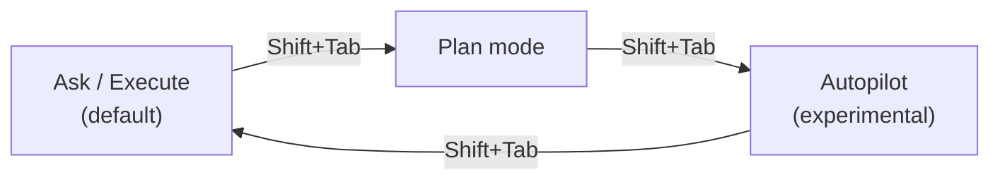
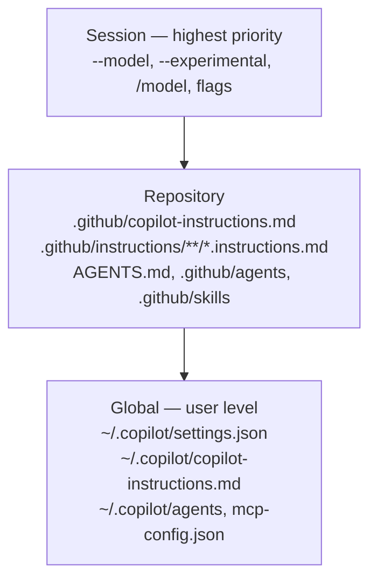

# Getting Started

**ワークショップの Part 0。** この章を終えると、Copilot CLI のインストールと認証が完了し、4 つの対話モードを理解し、設定がどこにあるかを把握できます。所要時間は約 45 分です。

!!! tip "まず動画で見たい方へ"
    公式動画 [Ultimate GitHub Copilot CLI tutorial for beginners](https://www.youtube.com/watch?v=rheqk-L7Yes)（GitHub）は、本章の内容（インストール、`/login`、フォルダの信頼、最初の対話プロンプトと `-p` プロンプト）を数分でデモし、続けてこのあと出てくるモードやスラッシュコマンドまで紹介します。各コンパニオン動画の内容は [References → トーク・デモ](appendix/references.md#talks--demos) を参照してください。

---

## 前提条件

| 要件 | 補足 |
|------|------|
| **有効な GitHub Copilot サブスクリプション** | API アクセスに必須。組織／Enterprise 管理者はポリシーで CLI を無効化できます（[README](https://github.com/github/copilot-cli)） |
| **対応 OS** | Linux、macOS、Windows（PowerShell v6+ および WSL）（[About Copilot CLI](https://docs.github.com/en/copilot/concepts/agents/about-copilot-cli)） |
| **ターミナルと Git** | どちらも使い慣れていること |
| **（任意）Node.js** | `npm` でインストールする場合のみ必要 |

---

## Copilot CLI のインストール

以下の **いずれか** を選びます。4 つともすべて公式です（[README](https://github.com/github/copilot-cli)、[Installing GitHub Copilot CLI](https://docs.github.com/en/copilot/how-tos/set-up/install-copilot-cli)）。

```bash
# Install script (macOS / Linux)
curl -fsSL https://gh.io/copilot-install | bash

# Homebrew (macOS / Linux)
brew install copilot-cli

# WinGet (Windows)
winget install GitHub.Copilot

# npm (any platform; requires Node.js)
npm install -g @github/copilot
```

> **プレリリース機能を検証する必要がある場合は？** 各チャネルにプレリリース版があります: `@github/copilot@prerelease`、`brew install copilot-cli@prerelease`、`winget install GitHub.Copilot.Prerelease`（[README](https://github.com/github/copilot-cli)）。プレリリースは、それを明示的に必要とする検証やデモに限定して使ってください。

インストールを確認します。

```bash
copilot --version
```

---

## 初回起動と信頼

CLI は **作業対象のコードが入ったフォルダの中** から起動します。ホームディレクトリからは起動しないでください（[Security considerations](https://docs.github.com/en/copilot/concepts/agents/about-copilot-cli#security-considerations)）。

```bash
cd ~/projects/my-repo
copilot
```

初回起動ではアニメーションバナー（`--banner` でいつでも再表示）と、**信頼ディレクトリの確認** が表示されます（[Using Copilot CLI](https://docs.github.com/en/copilot/how-tos/use-copilot-agents/use-copilot-cli)）。

```text
1. Yes, proceed
2. Yes, and remember this folder for future sessions
3. No, exit (Esc)
```

!!! warning "信頼確認が重要な理由"
    セッション中、Copilot は起動ディレクトリ配下のファイルを読み取り・変更・実行する可能性があります。中身を信頼できる場所だけを信頼してください。ホームディレクトリや、信頼できない実行ファイル・機密情報を含むフォルダから **起動しないでください**（[Security considerations](https://docs.github.com/en/copilot/concepts/agents/about-copilot-cli#trusted-directories)）。

---

## 認証 { #authenticate }

まだサインインしていない場合、CLI は `/login` の実行を促します。

### 対話: デバイスフロー（推奨）

```text
> /login
```

ブラウザのフローに従います。トークンは自動的に保存され、セッションをまたいで再利用されます（[README](https://github.com/github/copilot-cli)）。サインイン中の GitHub アカウントは `/user` でいつでも確認できます（[CLI command reference](https://docs.github.com/en/copilot/reference/copilot-cli-reference/cli-command-reference)）。

### ヘッドレス／CI: Personal Access Token

非対話環境では、**「Copilot Requests」** 権限を付与した **fine-grained PAT** を使います（[README](https://github.com/github/copilot-cli)）。

1. <https://github.com/settings/personal-access-tokens/new> でトークンを作成します。
2. **Permissions** で **Copilot Requests** を追加します。
3. 環境変数で公開します。最近の CLI では、`GH_TOKEN` や `GITHUB_TOKEN` を使う他ツールとの衝突を避けるために `COPILOT_GITHUB_TOKEN` もサポートされています（[copilot-cli changelog 0.0.354](https://github.com/github/copilot-cli/blob/main/changelog.md#00354---2025-11-03)）。CI では `COPILOT_GITHUB_TOKEN` を優先してください。複数のトークン変数を同時に設定する場合は、`copilot help environment` で挙動を確認します。

```bash
export COPILOT_GITHUB_TOKEN="github_pat_xxxxxxxx"
```

このしくみは [Demo 4 · CI/CD 自動化](demos/04_cicd_automation.md) でそのまま使います。

---

## 主な対話モード

ワークショップで必要になるモードは次のとおりです。対話セッション内では ++shift+tab++ で ask/execute、plan、autopilot などのエージェントモードを切り替えます。programmatic モードはシェルから `-p`／`--prompt` で起動します（[About Copilot CLI](https://docs.github.com/en/copilot/concepts/agents/about-copilot-cli)、[Best practices](https://docs.github.com/en/copilot/how-tos/copilot-cli/cli-best-practices)）。



| モード | 内容 | 適した用途 |
|--------|------|------------|
| **Ask / Execute**（既定） | 対話的。ファイルを変更・実行するツールごとに承認を求める | 学習、慎重を要する変更 |
| **Plan** | リクエストを分析し、**確認の質問** をして、構造化された `plan.md` を書き、承認を待ってからコーディングする | 複雑な複数ファイルの作業 |
| **Autopilot**（experimental） | タスクが完了するまで自律的に作業を続ける | 定型的でスコープが明確なタスク |
| **Programmatic** | `copilot -p "…"` でプロンプトを 1 回実行して終了する | スクリプト、CI/CD、自動化 |

experimental 機能（autopilot を含む）は `--experimental` または `/experimental` スラッシュコマンドで有効化します。設定は以後 config に永続化されます（[README](https://github.com/github/copilot-cli)）。

```bash
# Programmatic example — summarize this week's commits
copilot -p "Show me this week's commits and summarize them" --allow-tool='shell(git)'
```

> 送信したプロンプトごとにプレミアムリクエストを 1 つ消費します（[README](https://github.com/github/copilot-cli)）。

---

## 設定のレイヤーと優先順位

Copilot CLI は **グローバル**（あなた）と **リポジトリ**（プロジェクト）のソースから設定を合成し、その上に **セッション** フラグを重ねます。この階層の理解はデモの前提として重要です。



押さえておくべき要点（[Best practices](https://docs.github.com/en/copilot/how-tos/copilot-cli/cli-best-practices)、[Using Copilot CLI](https://docs.github.com/en/copilot/how-tos/use-copilot-agents/use-copilot-cli)）。

- **カスタム指示ファイルは優先フォールバックではなく *結合* されるようになりました**。競合時はリポジトリの指示がグローバルより優先されます。
- グローバル設定ディレクトリは **`~/.copilot/`** です（`COPILOT_HOME` 環境変数で上書き可能）。ユーザー設定は `settings.json` に保存され、MCP、LSP、エージェント、指示、セッション状態のファイルがその周辺に置かれます。`.github/mcp.json` のような新しいワークスペース設定ファイルは changelog で確認するのが確実です（[copilot-cli changelog](https://github.com/github/copilot-cli/blob/main/changelog.md)）。
- 設定は `/settings` で編集します。検索可能なダイアログを開くほか、`/settings autoUpdate true` のようなインライン設定や、既定値へのリセットに対応します（[GitHub Blog Changelog: `/settings`](https://github.blog/changelog/2026-06-11-copilot-cli-configure-everything-from-one-place-with-settings)）。

各レイヤーは [Feature Deep Dive](features.md) で詳しく解説します。

---

## セットアップの検証

信頼済みのリポジトリ内で次のチェックリストを実行します。すべて動けばデモの準備完了です。

```text
# 1. Confirm version & auth
copilot --version

# 2. Inside a session, list everything available
> /help

# 3. Confirm which GitHub account is signed in
> /user

# 4. See and switch models
> /model

# 5. Inspect context usage
> /context

# 6. Confirm the GitHub MCP server is wired up
> /mcp
```

!!! tip "コマンドはライブで発見する"
    製品は毎週変わります。コマンド一覧を暗記する代わりに、`/help`（セッション内）と `copilot help <topic>`（`<topic>` は `config`、`commands`、`environment`、`logging`、`permissions` のいずれか）を使いましょう（[Best practices](https://docs.github.com/en/copilot/how-tos/copilot-cli/cli-best-practices)）。

---

## 次へ

意思決定フレームワークを作る [Access Methods: VS Code vs SDK vs CLI](access_methods.md) へ進むか、[Feature Deep Dive](features.md) へジャンプしてください。
