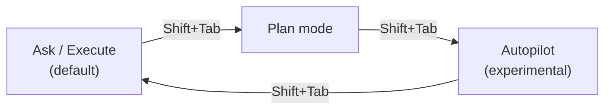
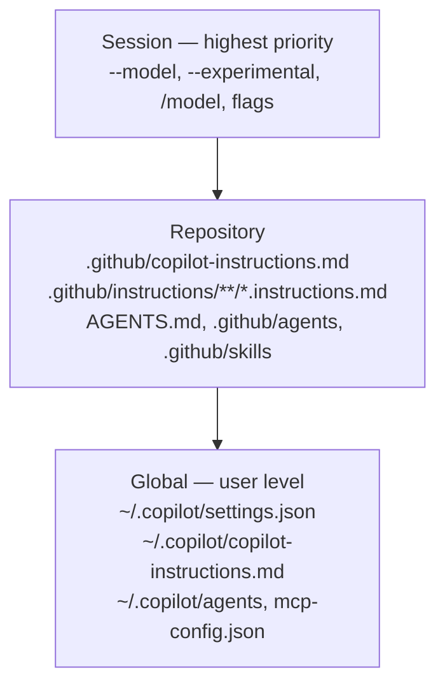

# Getting Started

**Part 0 of the workshop.** By the end of this chapter you will have Copilot CLI installed and authenticated, understand the four interaction modes, and know where its configuration lives. Budget ~45 minutes.

!!! tip "Prefer to watch first?"
    The official [Ultimate GitHub Copilot CLI tutorial for beginners](https://www.youtube.com/watch?v=rheqk-L7Yes) (GitHub) demonstrates everything in this chapter — install, `/login`, folder trust, and your first interactive and `-p` prompts — in a few minutes, then continues into the modes and slash commands you will meet next. See [References → Talks & demos](appendix/references.md#talks--demos) for what each companion video covers.

---

## Prerequisites

| Requirement | Notes |
|-------------|-------|
| **Active GitHub Copilot subscription** | Required for API access. An org/enterprise admin can disable the CLI by policy ([README](https://github.com/github/copilot-cli)) |
| **Supported OS** | Linux, macOS, or Windows (PowerShell v6+ and WSL) ([About Copilot CLI](https://docs.github.com/en/copilot/concepts/agents/about-copilot-cli)) |
| **A terminal & Git** | You should be comfortable with both |
| **(Optional) Node.js** | Only needed for the `npm` install path |

---

## Install the Copilot CLI

Pick **one** of the following. All four are official ([README](https://github.com/github/copilot-cli), [Installing GitHub Copilot CLI](https://docs.github.com/en/copilot/how-tos/set-up/install-copilot-cli)):

```bash
# Install script (macOS / Linux)
curl -fsSL https://gh.io/copilot-install | bash

# Homebrew (macOS / Linux)
brew install copilot-cli

# WinGet (Windows)
winget install GitHub.Copilot

# npm (any platform; requires Node.js)
npm install -g @github/copilot
```

> **Need to test prerelease features?** Each channel has a prerelease variant: `@github/copilot@prerelease`, `brew install copilot-cli@prerelease`, or `winget install GitHub.Copilot.Prerelease` ([README](https://github.com/github/copilot-cli)). Use prerelease builds only for validation or demos that explicitly require them.

Verify the install:

```bash
copilot --version
```

---

## First launch & trust

Launch the CLI from **inside a folder that contains code you want to work with** — not your home directory ([Security considerations](https://docs.github.com/en/copilot/concepts/agents/about-copilot-cli#security-considerations)):

```bash
cd ~/projects/my-repo
copilot
```

On first launch you will see an animated banner (re-show it any time with `--banner`) and a **trusted-directory prompt** ([Using Copilot CLI](https://docs.github.com/en/copilot/how-tos/use-copilot-agents/use-copilot-cli)):

```text
1. Yes, proceed
2. Yes, and remember this folder for future sessions
3. No, exit (Esc)
```

!!! warning "Why the trust prompt matters"
    During a session, Copilot may read, modify, and execute files in and below the launch directory. Only trust locations whose contents you trust. **Do not** launch from your home directory or any folder with untrusted executables or secrets ([Security considerations](https://docs.github.com/en/copilot/concepts/agents/about-copilot-cli#trusted-directories)).

---

## Authenticate { #authenticate }

If you are not already signed in, the CLI prompts you to run `/login`.

### Interactive: device flow (recommended)

```text
> /login
```

Follow the browser flow. Your token is stored automatically and reused across sessions ([README](https://github.com/github/copilot-cli)). Confirm which GitHub account is active at any time with `/user` ([CLI command reference](https://docs.github.com/en/copilot/reference/copilot-cli-reference/cli-command-reference)).

### Headless / CI: Personal Access Token

For non-interactive environments, use a **fine-grained PAT** with the **"Copilot Requests"** permission ([README](https://github.com/github/copilot-cli)):

1. Create a token at <https://github.com/settings/personal-access-tokens/new>.
2. Under **Permissions**, add **Copilot Requests**.
3. Expose it via an environment variable. Recent CLI builds also support `COPILOT_GITHUB_TOKEN`, which was added to avoid collisions with tools that already use `GH_TOKEN` or `GITHUB_TOKEN` ([copilot-cli changelog 0.0.354](https://github.com/github/copilot-cli/blob/main/changelog.md#00354---2025-11-03)). In CI, prefer `COPILOT_GITHUB_TOKEN`; if you set more than one token variable, confirm behavior with `copilot help environment`.

```bash
export COPILOT_GITHUB_TOKEN="github_pat_xxxxxxxx"
```

We use exactly this mechanism in [Demo 4 · CI/CD automation](demos/04_cicd_automation.md).

---

## The main interaction modes

These are the modes you need for the workshop. In interactive sessions, ++shift+tab++ cycles between agent modes such as ask/execute, plan, and autopilot; programmatic mode is started from the shell with `-p`/`--prompt` ([About Copilot CLI](https://docs.github.com/en/copilot/concepts/agents/about-copilot-cli); [Best practices](https://docs.github.com/en/copilot/how-tos/copilot-cli/cli-best-practices)).



| Mode | What it does | Best for |
|------|--------------|----------|
| **Ask / Execute** (default) | Conversational; asks approval before each tool that modifies or runs files | Learning, sensitive changes |
| **Plan** | Analyzes the request, **asks clarifying questions**, writes a structured `plan.md`, and waits for your approval before coding | Complex, multi-file work |
| **Autopilot** (experimental) | Keeps working autonomously until the task is complete | Routine, well-scoped tasks |
| **Programmatic** | `copilot -p "…"` runs one prompt and exits | Scripts, CI/CD, automation |

Enable experimental features (including autopilot) with `--experimental` or the `/experimental` slash command; the setting is then persisted in your config ([README](https://github.com/github/copilot-cli)).

```bash
# Programmatic example — summarize this week's commits
copilot -p "Show me this week's commits and summarize them" --allow-tool='shell(git)'
```

> Each prompt you submit consumes one premium request ([README](https://github.com/github/copilot-cli)).

---

## Configuration layers & precedence

Copilot CLI composes configuration from **global** (you) and **repository** (project) sources, with **session** flags on top. Understanding this hierarchy is essential before the demos.



Key facts to internalize ([Best practices](https://docs.github.com/en/copilot/how-tos/copilot-cli/cli-best-practices), [Using Copilot CLI](https://docs.github.com/en/copilot/how-tos/use-copilot-agents/use-copilot-cli)):

- **Custom-instruction files now *combine*** rather than using priority-based fallback. Repository instructions take precedence over global ones on conflict.
- The global config directory is **`~/.copilot/`** (override with the `COPILOT_HOME` environment variable). User settings are stored in `settings.json`; MCP, LSP, agent, instruction, and session-state files live alongside it. The changelog is the best source for new workspace-level config files such as `.github/mcp.json` ([copilot-cli changelog](https://github.com/github/copilot-cli/blob/main/changelog.md)).
- Edit settings with `/settings`. It opens a searchable dialog, supports inline values such as `/settings autoUpdate true`, and can reset a key to its default ([GitHub Blog Changelog: `/settings`](https://github.blog/changelog/2026-06-11-copilot-cli-configure-everything-from-one-place-with-settings)).

We dissect each layer in the [Feature Deep Dive](features.md).

---

## Verify your setup

Run this checklist inside a trusted repo. If every step works, you are ready for the demos.

```text
# 1. Confirm version & auth
copilot --version

# 2. Inside a session, list everything available
> /help

# 3. Confirm which GitHub account is signed in
> /user

# 4. See and switch models
> /model

# 5. Inspect context usage
> /context

# 6. Confirm the GitHub MCP server is wired up
> /mcp
```

!!! tip "Discover commands live"
    The product changes weekly. Instead of memorizing a command list, use `/help` (in session) and `copilot help <topic>` where `<topic>` is one of `config`, `commands`, `environment`, `logging`, or `permissions` ([Best practices](https://docs.github.com/en/copilot/how-tos/copilot-cli/cli-best-practices)).

---

## Next

Continue to [Access Methods: VS Code vs SDK vs CLI](access_methods.md) to build your decision framework, or jump to the [Feature Deep Dive](features.md).
