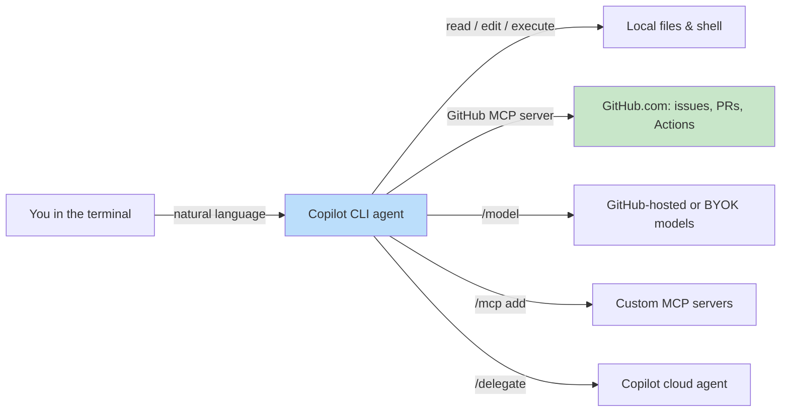
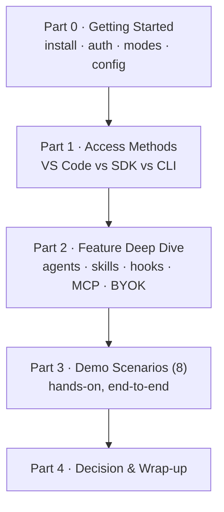

# GitHub Copilot CLI ワークショップ

「エディタで Copilot を使ったことがある」段階から、「ターミナルから Copilot を自律エージェントとして駆動し、CI で自動化し、どの状況でどの Copilot サーフェスを選ぶべきかを判断できる」段階へと、中上級の開発者を一日で引き上げるハンズオン・ワークショップです。

> 本ワークショップは全面的に **GitHub 公式の一次情報**（本文中にリンクし、[References](appendix/references.md) にまとめています）に基づいています。製品が急速に進化している箇所では、その旨を明記し、変わりうる値を固定するのではなく、ライブのコマンド（例: `/help` や `/model`）を参照するよう案内します。

> 最終確認日は **2026-06-22** で、`github/copilot-cli` changelog の **1.0.63（2026-06-15）** と、**2026-06-19** までの GitHub Blog Changelog に基づいています。ワークショップ実施前に確認すべき情報源は [References](appendix/references.md#change-watchlist) を参照してください。

---

## 対象読者

| 項目 | 内容 |
|------|------|
| **対象者** | すでに IDE で GitHub Copilot を使っている開発者・テックリード・プラットフォームエンジニア |
| **前提知識** | ターミナル、Git、GitHub のプルリクエスト、基本的な CI の概念に慣れていること |
| **ゴール** | Copilot CLI を深く理解し、VS Code・SDK サーフェスと比較し、8 つの実務的なデモシナリオをエンドツーエンドで実行できるようになる |
| **形式** | フルデー（約 6 時間）、講義＋ハンズオン、自習にも対応 |

これは「AI コーディングアシスタント入門」コースでは **ありません**。LLM やエージェントが何かは理解している前提です。その基礎が必要なら、同じサイトの [Copilot SDK チュートリアル](../copilot_sdk_tutorial/index.md) から始めてください。

---

## GitHub Copilot CLI とは？

GitHub Copilot CLI は、**GitHub の Copilot coding agent と同じエージェントハーネス**をターミナルに直接持ち込みます。コードと GitHub のコンテキストを理解する AI エージェントと、ローカルかつ同期的に作業できます。自然言語を通じて、ファイルの読み取り・編集・シェルコマンドの実行を行い、GitHub.com（Issue、プルリクエスト、Actions）も操作します（[About GitHub Copilot CLI](https://docs.github.com/en/copilot/concepts/agents/about-copilot-cli)、[github/copilot-cli README](https://github.com/github/copilot-cli)）。

### Copilot CLI であるもの

- 計画・編集・コマンド実行・反復を行う **ターミナルネイティブな AI エージェント**。単なるチャットボックスではありません（[Best practices](https://docs.github.com/en/copilot/how-tos/copilot-cli/cli-best-practices)）。
- **IDE 非依存**: SSH 越し、コンテナ内、サーバー上、CI 内でも同じように動作します。
- **GitHub をすぐ扱える**: GitHub MCP サーバーがあらかじめ構成されており、Issue・PR・Actions を自然言語で操作できます（[Using Copilot CLI](https://docs.github.com/en/copilot/how-tos/use-copilot-agents/use-copilot-cli)）。
- **スクリプタブル**: 非対話の単発コマンド（`copilot -p "…"`）により、自動化や CI/CD の構成要素になります（[About GitHub Copilot CLI](https://docs.github.com/en/copilot/concepts/agents/about-copilot-cli)）。
- **カスタマイズ・ガバナンス可能**: カスタム指示、カスタムエージェント、スキル、フック、MCP サーバー、ツール権限の制御。

### Copilot CLI でないもの

- **オートコンプリート／インライン補完ツールではありません** — それは IDE 内の Copilot です。CLI は *エージェント* であり、ゴーストテキスト補完エンジンではありません（[Copilot features](https://docs.github.com/en/copilot/get-started/features)）。
- **VS Code 体験の置き換えではありません** — 補完関係にあります。多くのチームが両方を併用します（[Access Methods](access_methods.md) を参照）。
- **ホスト型 REST API でも、ファインチューニングするモデルでもありません** — Copilot を *自分のプログラム* に組み込むなら [Copilot SDK](../copilot_sdk_tutorial/index.md) を使います。
- **既定では無人実行ではありません** — 明示的にオプトアウトしない限り、ファイルを変更・実行しうるツールを使う前に承認を求めます（[Security considerations](https://docs.github.com/en/copilot/concepts/agents/about-copilot-cli#security-considerations)）。

---

## 3 つのアクセスサーフェス（概観）

経験豊富な開発者から最もよく出る質問は *「VS Code にもう Copilot があるのに、なぜ CLI を使うのか？」* です。本ワークショップは専用の [Access Methods](access_methods.md) 章でこれに答えます。要点は次のとおりです。

| サーフェス | 形態 | こういうときに選ぶ |
|------------|------|--------------------|
| **VS Code の Copilot**（Agent mode・Chat・インライン） | GUI、IDE 統合 | コードを能動的に書いていて、リッチな差分・インラインレビュー・エディタコンテキストが欲しいとき（[Copilot features](https://docs.github.com/en/copilot/get-started/features)） |
| **Copilot CLI** | ターミナルエージェント | サーバー／SSH／コンテナ上、CI 内での自動化、マルチリポや長時間のエージェント作業のオーケストレーション（[About Copilot CLI](https://docs.github.com/en/copilot/concepts/agents/about-copilot-cli)） |
| **Copilot SDK** | ライブラリ／API | エージェントランタイムを組み込んだ **プロダクトを構築する** とき（[Copilot SDK チュートリアル](../copilot_sdk_tutorial/index.md)） |

> これらは排他的ではありません。CLI、IDE エージェント、SDK はすべて **同じ** `.github/` カスタマイズ（指示・エージェント・スキル）を読み込むため、ひとつへの投資が他にも効きます（[Copilot features](https://docs.github.com/en/copilot/get-started/features)）。

---

## プランとライセンス

Copilot CLI は各 Copilot プランで利用できますが、一部の制御はプランに依存します。プランは変わるため、必ず公式ページで最新のマトリクスを確認してください。

- CLI の利用には **有効な Copilot サブスクリプション** が必要で、組織／Enterprise の管理者はポリシーで無効化できます（[github/copilot-cli README](https://github.com/github/copilot-cli)）。
- 送信したプロンプトごとに **プレミアムリクエスト** のクォータを消費します（[github/copilot-cli README](https://github.com/github/copilot-cli)）。
- 組織／Enterprise の制御（CLI の可否、モデル制限、コンテンツ除外、監査ログ）は **Business / Enterprise** の機能です（[Copilot features → Features for administrators](https://docs.github.com/en/copilot/get-started/features)）。

正式なプラン比較と価格は [Plans for GitHub Copilot](https://github.com/features/copilot/plans) と [Models and pricing](https://docs.github.com/en/copilot/reference/copilot-billing/models-and-pricing) を参照してください。

---

## ワークショップのアジェンダ（フルデー）

| Part | 章 | 時間 | 到達点 |
|------|----|------|--------|
| 0 | [Getting Started](getting_started.md) | 45 分 | CLI のインストール・認証完了、4 つの対話モードを理解 |
| 1 | [Access Methods: VS Code vs SDK vs CLI](access_methods.md) | 45 分 | Pros/Cons を伴う、説明可能な意思決定フレームワーク |
| 2 | [Feature Deep Dive](features.md) | 75 分 | カスタマイズ・エージェント・スキル・フック・MCP・サンドボックス・BYOK の習得 |
| 3 | [Demo Scenarios](demos/index.md) | 3 時間 | 価値の高い 8 つの再現可能なワークフローをハンズオンで実行 |
| 4 | [Decision Guide](access_methods.md#decision-guide) + [References](appendix/references.md) | 30 分 | 持ち帰り用チェックリストと一次情報ライブラリ |

> 時間はファシリテーション前提の目安です。本資料は自習用にも設計されています。

---

## このサイトの使い方

- **ファシリテーター**: 各章は独立しています。ページを投影し、コマンドをライブで実行し、参加者は各自のクローンで追従できます。
- **自習者**: 上から順に進めてください。各デモは前提条件と、コピー＆ペースト可能なコマンド列を記載しています。
- **8 つのデモはすべて同じ題材アプリ**（[template-typescript-react](https://github.com/ks6088ts/template-typescript-react)）を共有し、連続したストーリーを描きます。各ステップを自分のコピーで再現できるよう、最初にフォークしてください。

準備はいいですか？ [Getting Started](getting_started.md) から始めましょう。
