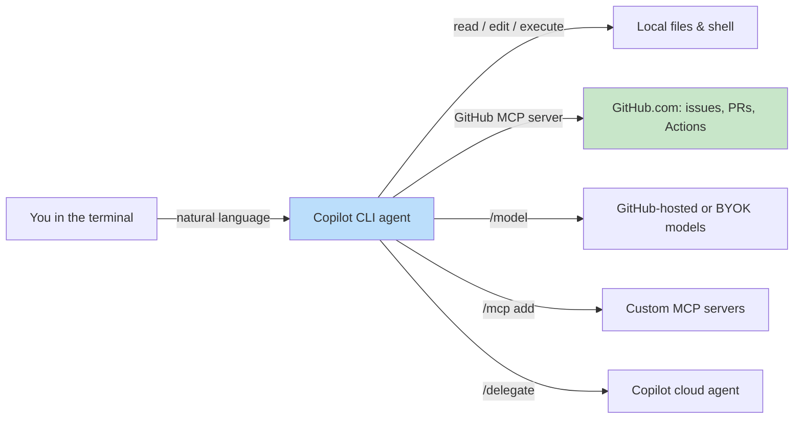
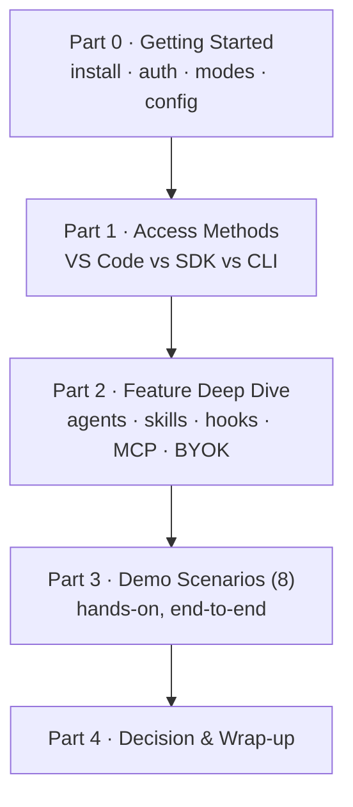

# GitHub Copilot CLI Workshop

A full-day, hands-on workshop that takes intermediate-to-advanced developers from "I have used Copilot in my editor" to "I can drive Copilot as an autonomous agent from my terminal, automate it in CI, and decide *which* Copilot surface to reach for in any situation."

> This workshop is built entirely on **GitHub's official primary sources** (linked inline and collected in [References](appendix/references.md)). Where the product is evolving quickly, we say so and point you to the live command (for example `/help` or `/model`) rather than freezing a value that may change.

> Last reviewed on **2026-06-22** against `github/copilot-cli` changelog version **1.0.63 (2026-06-15)** and GitHub Blog Changelog entries through **2026-06-19**. See [References](appendix/references.md#change-watchlist) for the sources to monitor before running the workshop.

---

## Who this is for

| Aspect | Detail |
|--------|--------|
| **Audience** | Developers, tech leads, and platform engineers who already use GitHub Copilot in an IDE |
| **Assumed knowledge** | Comfortable in a terminal, Git, GitHub pull requests, and basic CI concepts |
| **Goal** | Understand the Copilot CLI deeply, compare it against the VS Code and SDK surfaces, and run eight production-grade demo scenarios end to end |
| **Format** | Full day (~6 hours), lecture + hands-on, self-paced friendly |

This is **not** an "intro to AI coding assistants" course. We assume you know what an LLM and an agent are. If you want that foundation, start with the [Copilot SDK Tutorial](../copilot_sdk_tutorial/index.md) in this same site.

---

## What is GitHub Copilot CLI?

GitHub Copilot CLI exposes the **same agentic harness as GitHub's Copilot coding agent** in your terminal. In a local, synchronous session, it can read files, edit them, run shell commands, and operate on GitHub.com resources such as issues, pull requests, and Actions through natural language ([About GitHub Copilot CLI](https://docs.github.com/en/copilot/concepts/agents/about-copilot-cli); [github/copilot-cli README](https://github.com/github/copilot-cli)).

### What it IS

- A **terminal-native agent** that plans, edits, runs commands, and iterates — not just a chat box ([Best practices](https://docs.github.com/en/copilot/how-tos/copilot-cli/cli-best-practices)).
- **IDE-independent**: works the same over SSH, in a container, on a server, or in CI.
- **GitHub-aware out of the box**: ships with the GitHub MCP server pre-configured, so issues, PRs, and Actions are reachable in natural language ([Using Copilot CLI](https://docs.github.com/en/copilot/how-tos/use-copilot-agents/use-copilot-cli)).
- **Scriptable**: a single non-interactive command (`copilot -p "…"`) makes it a building block for automation and CI/CD ([About GitHub Copilot CLI](https://docs.github.com/en/copilot/concepts/agents/about-copilot-cli)).
- **Customizable and governable**: custom instructions, custom agents, skills, hooks, MCP servers, and tool-permission controls.

### What it is NOT

- **Not an autocomplete / inline-suggestion tool** — that is Copilot in your IDE. The CLI is an *agent*, not a ghost-text completion engine ([Copilot features](https://docs.github.com/en/copilot/get-started/features)).
- **Not a replacement for the VS Code experience** — it complements it. Many teams use both (see [Access Methods](access_methods.md)).
- **Not a hosted REST API or a model you fine-tune** — to embed Copilot in your *own program*, use the [Copilot SDK](../copilot_sdk_tutorial/index.md).
- **Not unattended by default** — it asks for approval before running tools that can modify or execute files, unless you explicitly opt out ([Security considerations](https://docs.github.com/en/copilot/concepts/agents/about-copilot-cli#security-considerations)).

---

## The three access surfaces at a glance

The single most common question from experienced developers is *"I already have Copilot in VS Code — why would I use the CLI?"* This workshop answers that with a dedicated [Access Methods](access_methods.md) chapter. The short version:

| Surface | Shape | Reach for it when… |
|---------|-------|--------------------|
| **Copilot in VS Code** (Agent mode, Chat, inline) | GUI, IDE-integrated | You are actively authoring code and want rich diffs, inline review, and editor context ([Copilot features](https://docs.github.com/en/copilot/get-started/features)) |
| **Copilot CLI** | Terminal agent | You are on a server / SSH / container, automating in CI, or orchestrating multi-repo and long-running agentic tasks ([About Copilot CLI](https://docs.github.com/en/copilot/concepts/agents/about-copilot-cli)) |
| **Copilot SDK** | Library / API | You are **building a product** that embeds the agent runtime ([Copilot SDK Tutorial](../copilot_sdk_tutorial/index.md)) |

> These are not mutually exclusive. The CLI, the IDE agent, and the SDK all read the **same** `.github/` customization (instructions, agents, skills) — so investment in one pays off in the others ([Copilot features](https://docs.github.com/en/copilot/get-started/features)).

---

## Plans & licensing

Copilot CLI is available across Copilot plans, but some controls are plan-gated. Always confirm the current matrix on the official pages, since plans change.

- Using the CLI requires an **active Copilot subscription**, and an org/enterprise admin can disable it via policy ([github/copilot-cli README](https://github.com/github/copilot-cli)).
- Each prompt you submit consumes from your **premium request** quota ([github/copilot-cli README](https://github.com/github/copilot-cli)).
- Organization/enterprise controls (CLI availability, model restrictions, content exclusion, audit logs) are **Business / Enterprise** capabilities ([Copilot features → Features for administrators](https://docs.github.com/en/copilot/get-started/features)).

For the authoritative plan comparison and pricing, see [Plans for GitHub Copilot](https://github.com/features/copilot/plans) and [Models and pricing](https://docs.github.com/en/copilot/reference/copilot-billing/models-and-pricing).

---

## Workshop agenda (full day)

| Part | Chapter | Time | Outcome |
|------|---------|------|---------|
| 0 | [Getting Started](getting_started.md) | 45 min | CLI installed, authenticated, all four interaction modes understood |
| 1 | [Access Methods: VS Code vs SDK vs CLI](access_methods.md) | 45 min | A defensible decision framework with Pros/Cons |
| 2 | [Feature Deep Dive](features.md) | 75 min | Mastery of customization, agents, skills, hooks, MCP, sandboxing, BYOK |
| 3 | [Demo Scenarios](demos/index.md) | 3 hr | Eight repeatable, high-value workflows executed hands-on |
| 4 | [Decision Guide](access_methods.md#decision-guide) + [References](appendix/references.md) | 30 min | Take-home checklist and primary-source library |

> Times are guidance for a facilitated session; the material is also designed for self-paced study.

---

## How to use this site

- **Facilitators**: each chapter is standalone. Project the page, run the commands live, and let attendees follow along in their own clone.
- **Self-paced learners**: work top to bottom. Every demo lists its prerequisites and a copy-pasteable command sequence.
- **All eight demos share one subject app** — [template-typescript-react](https://github.com/ks6088ts/template-typescript-react) — and tell a connected story. Fork it first so you can reproduce each step against your own copy.

Ready? Start with [Getting Started](getting_started.md).
