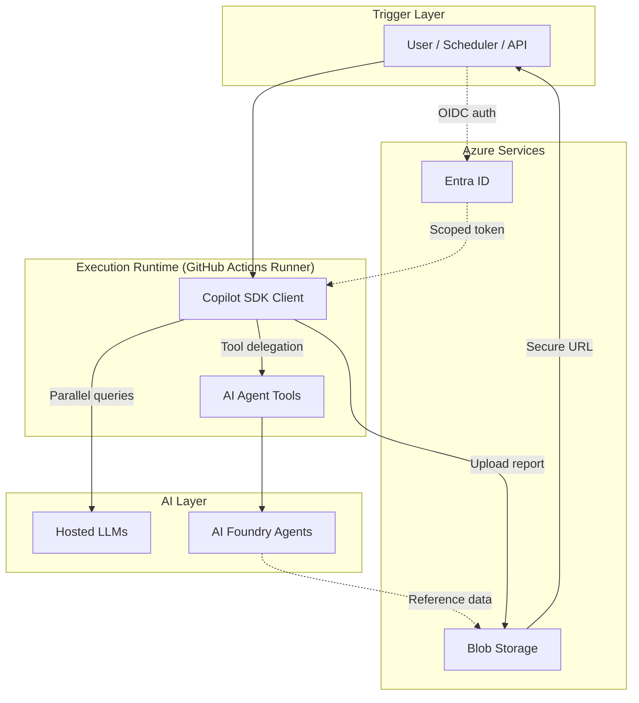
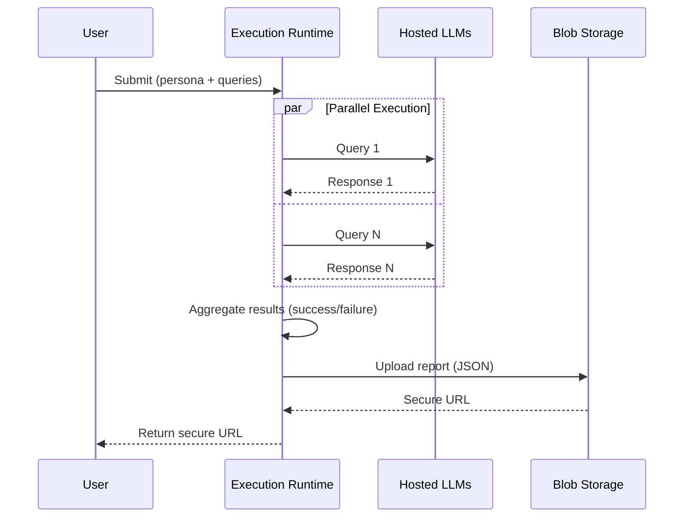
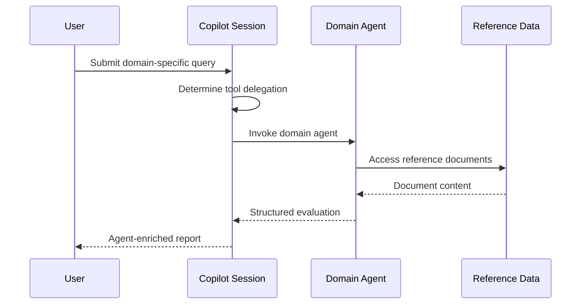
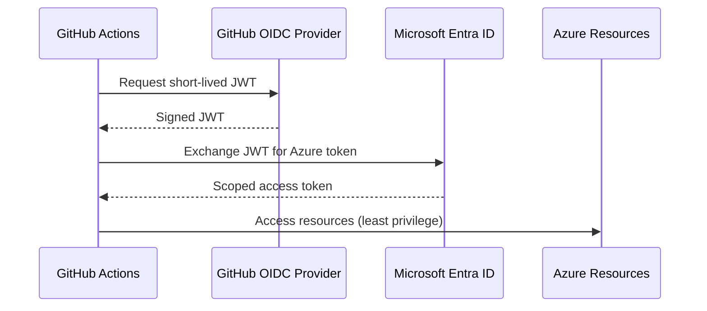
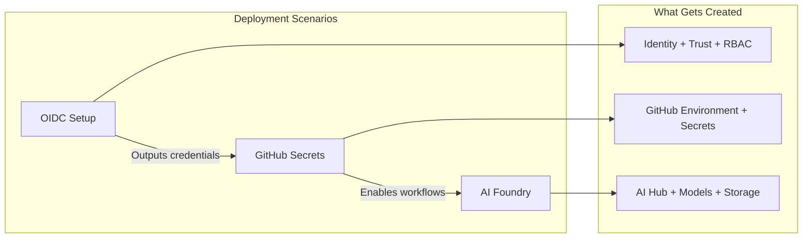

# Architecture

> **Navigation:** [CopilotReportForge](index.md) > **Architecture**
>
> **See also:** [Problem & Solution](problem_and_solution.md) · [Deployment](deployment.md) · [Responsible AI](responsible_ai.md)

---

## Design Philosophy

CopilotReportForge is built on four principles that directly address the [problems identified in enterprise AI adoption](problem_and_solution.md):

| Principle | What It Means |
|---|---|
| **Composability** | Every building block (LLM query, AI agent, storage, notification) is independent. Swap a system prompt to change domains; add a tool to add capabilities. |
| **Zero-Infrastructure AI** | Consume hosted LLMs through the Copilot SDK. No GPU provisioning, no model management, no inference servers. |
| **Security by Default** | OIDC federation, scoped RBAC, time-limited sharing URLs, and ephemeral execution environments. No long-lived secrets anywhere. |
| **Auditable Execution** | Every run is recorded with full input/output context, execution metadata, and provenance — by default, not by configuration. |

---

## Execution Model: Why GitHub Actions?

A key architectural decision is that **all AI agent execution runs within GitHub Actions runners** rather than on developers' local machines. This choice solves three problems simultaneously:

### Ephemeral Isolation

Each workflow execution spins up a fresh, sandboxed environment and discards it upon completion. Secrets, intermediate files, and model outputs exist only for the duration of the run. This is fundamentally more secure than running AI agents on developer workstations, where credentials can leak through shell history, file system artifacts, or malware.

### Environment Consistency

Every team member, every workflow, and every domain uses the same runner configuration. This eliminates "works on my machine" issues, prevents environment drift across teams, and ensures that AI evaluation results are reproducible regardless of who triggers them.

### Built-in Governance

GitHub Actions natively records who executed what, when, for how long, and with what inputs/outputs. Full execution logs are retained and searchable. For organizations, all workflow activity is captured in the enterprise audit log — providing compliance-ready audit trails without any additional tooling.

---

## System Architecture



### Component Responsibilities

| Component | Role |
|---|---|
| **Copilot SDK Client** | Manages LLM sessions, sends queries in parallel, handles tool calls, aggregates results |
| **Hosted LLMs** | Provide text generation capabilities (GPT-4o-mini, GPT-4o, Claude) — no self-hosting required |
| **AI Foundry Agents** | Domain-specific AI personas with access to reference data (documents, images, specifications) |
| **Entra ID** | Issues short-lived access tokens via OIDC federation — no stored credentials |
| **Blob Storage** | Stores reports and reference data; generates time-limited sharing URLs |
| **GitHub Actions** | Provides ephemeral execution, OIDC authentication, and audit logging |

---

## Core Data Flow: Report Generation



**Key properties of this flow:**
- Each query executes in an **independent session** — no conversational cross-contamination between personas.
- Results are **typed and validated** — the output schema tracks total queries, successes, and failures.
- The report is **immutable** once uploaded — providing a point-in-time record of the evaluation.

---

## Agentic Data Flow: Domain-Specific Evaluation

For evaluations that require access to reference data (floor plans, product specs, clinical guidelines), the platform integrates AI Foundry Agents:



The Copilot session autonomously decides when to delegate to a Foundry Agent based on the query context. This enables **multi-agent orchestration** within a single session — the user submits a high-level query, and the system routes to the appropriate domain specialist.

---

## Authentication Model



### Why OIDC Federation?

Traditional CI/CD authentication stores long-lived API keys as repository secrets. These keys are difficult to rotate, easy to leak, and grant broad access. OIDC federation eliminates this pattern entirely:

- **No stored secrets for Azure access** — Tokens are issued per workflow run and expire within minutes.
- **Least-privilege scoping** — Each token is scoped to specific RBAC roles (see below).
- **Zero rotation overhead** — There are no credentials to rotate.

### RBAC Roles

| Role | Purpose |
|---|---|
| Contributor | Manage Azure resources via Terraform |
| Storage Blob Data Contributor | Read/write report and reference data |
| Storage Blob Delegator | Generate user delegation keys for secure sharing URLs |
| Cognitive Services OpenAI User | Access hosted model endpoints |

---

## Infrastructure Architecture

All infrastructure is managed as code via Terraform, organized into reusable modules and deployment scenarios.



| Scenario | Purpose | Key Resources |
|---|---|---|
| `azure_github_oidc` | Establish passwordless trust between GitHub and Azure | Entra ID app, service principal, federated credential, RBAC roles |
| `github_secrets` | Automate GitHub environment configuration | GitHub environment, encrypted secrets |
| `azure_microsoft_foundry` | Deploy AI capabilities and storage | AI Hub, model deployments, Storage Account, optional AI Search |

> Scenarios must be deployed in order: OIDC → Secrets → Foundry. See [Deployment](deployment.md) for step-by-step instructions.

---

## Application Architecture

The platform provides three interfaces for interacting with the AI execution pipeline:

### CLI Tools

Command-line interfaces for chat, report generation, agent management, storage operations, and notifications. All CLIs follow the same pattern: configure via environment variables, execute via typed commands.

### Web Application

A browser-based interface with GitHub OAuth login, interactive chat, and a parallel report generation panel. Users authenticate with their GitHub identity, and the application makes Copilot requests on their behalf.

### GitHub Actions Workflows

Automated workflows triggered by schedule, manual dispatch, or API call. These are the primary production execution path, providing ephemeral environments with full audit trails.

| Interface | Best For |
|---|---|
| CLI | Local development, scripting, automation |
| Web UI | Interactive exploration, ad-hoc evaluations |
| GitHub Actions | Production execution, scheduled reports, governed workflows |

---

## LLM Provider Model

The platform supports multiple LLM backend configurations through a unified provider interface:

| Mode | Authentication | Use Case |
|---|---|---|
| **Copilot** (default) | GitHub token via Copilot CLI | Standard usage — access hosted models without API key management |
| **API Key** | Static API key | Direct model API access when Copilot is not available |
| **Entra ID** | Azure Entra ID bearer token | Enterprise deployments with private endpoints and managed identity |

Switching between modes requires changing a configuration parameter, not code. This enables deployment across environments with different security requirements — from open-internet development to air-gapped corporate networks.

### Provider Extensibility

The provider system is implemented in `template_github_copilot/providers.py` with three components:

- **`AuthMethod` enum** — Defines available authentication methods: `GITHUB_COPILOT`, `API_KEY`, `FOUNDRY_ENTRA_ID`.
- **`create_provider()` factory** — Returns a `ProviderResult` containing the `CopilotClient` instance, LLM configuration, and custom tools, based on the selected `AuthMethod`.
- **`register_provider()` hook** — Allows adding custom provider builders without modifying the core code. Register a callable that accepts the same arguments and returns a `ProviderResult`.

```python
from template_github_copilot.providers import register_provider, ProviderResult

def my_custom_provider(cli_url, verbose, **kwargs) -> ProviderResult:
    # Build your custom CopilotClient / config here
    ...

register_provider("my_custom_auth", my_custom_provider)
```

---

## Custom Copilot Tools

The platform supports custom tools that extend the Copilot SDK session with additional capabilities. Tools are defined in `template_github_copilot/tools/` and automatically registered when a Copilot session is created.

### Built-in Tools

| Tool | Description | Input |
|---|---|---|
| `list_foundry_agents` | List all available agents on Microsoft Foundry | `endpoint` (optional; defaults to env) |
| `call_foundry_agent` | Call a named Foundry agent with a user message | `agent_name`, `user_message`, `conversation_id` (optional), `endpoint` (optional) |

### Adding a Custom Tool

1. Create a new file in `template_github_copilot/tools/` (e.g., `my_tool.py`).
2. Define a Pydantic input model and implement the tool function using the `@define_tool` decorator from `copilot.tools`.
3. Export the tool in `template_github_copilot/tools/__init__.py` via `get_custom_tools()`.

```python
from copilot.tools import define_tool
from pydantic import BaseModel, Field

class MyToolInput(BaseModel):
    query: str = Field(description="The query to process")

@define_tool(
    name="my_tool",
    description="Description visible to the LLM",
    input_schema=MyToolInput,
)
async def my_tool(input: MyToolInput) -> str:
    return f"Processed: {input.query}"
```

The Copilot SDK session will automatically discover the tool and invoke it when the LLM determines it is relevant to the user's query.

---

## Extensibility

The architecture is designed for extension at five levels:

| Extension Point | How to Extend | Example |
|---|---|---|
| **New domain** | Change system prompt and queries | Adapt from product evaluation to clinical guideline review |
| **New AI capability** | Add a Copilot tool in `tools/` | Web scraper, database lookup, calculation engine |
| **New AI agent** | Create a Foundry Agent with domain instructions | Specialized real estate appraiser with access to floor plan data |
| **New LLM provider** | Register via `register_provider()` | Custom model endpoint with proprietary auth |
| **New output channel** | Post-process the report JSON | Send to Slack, email, dashboard, or PowerBI |

---

## Technology Stack

| Layer | Technology |
|---|---|
| Language | Python 3.13+ |
| AI SDK | GitHub Copilot SDK, Azure AI Projects SDK |
| Web Framework | FastAPI |
| Data Validation | Pydantic |
| CLI Framework | Typer |
| Cloud Storage | Azure Blob Storage |
| Authentication | Azure Identity (OIDC, DefaultAzureCredential) |
| Infrastructure | Terraform |
| CI/CD | GitHub Actions |
| Containerization | Docker, Docker Compose |
| Testing | pytest |
