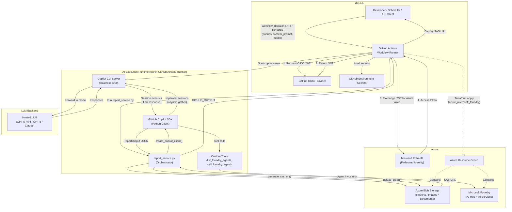
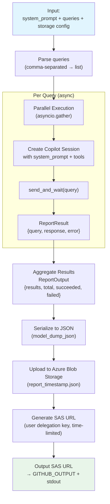
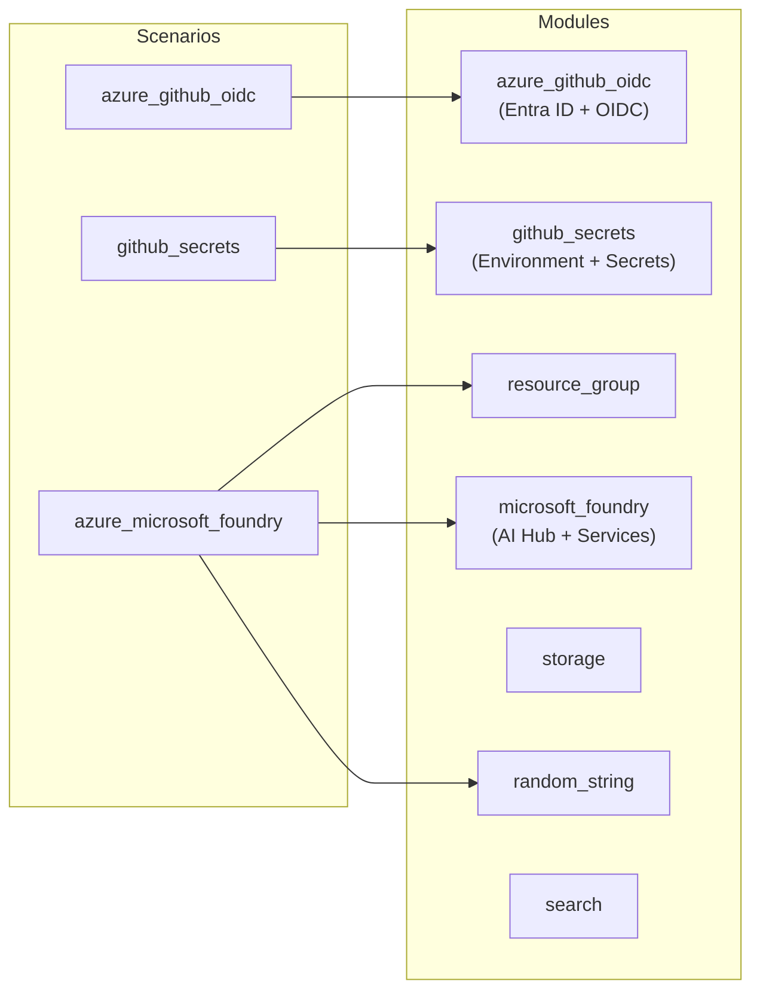
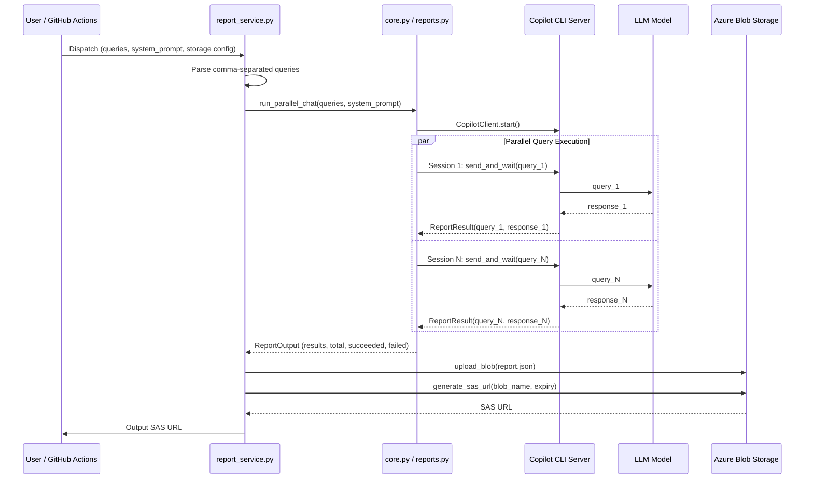
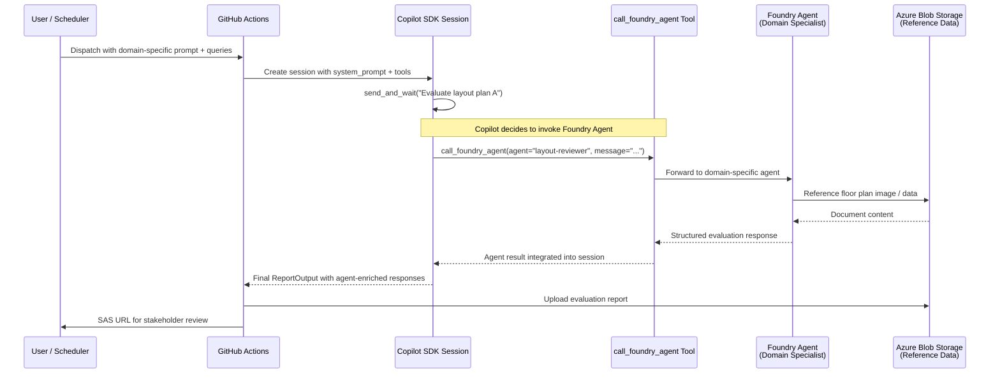
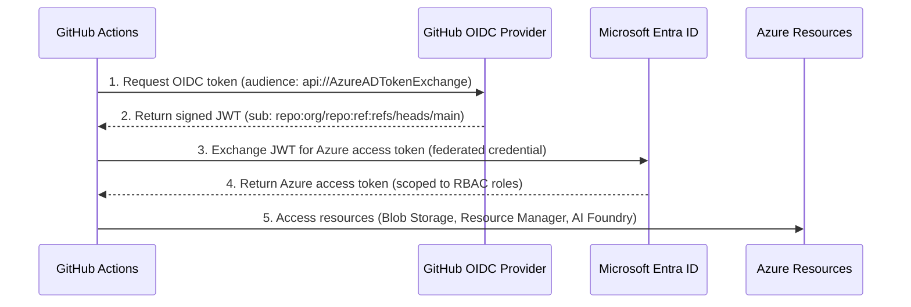

# Architecture

> **Navigation:** [README](../../README.md) > **Architecture**
>
> **See also:** [Problem & Solution](problem_and_solution.md) · [Deployment](deployment.md) · [Responsible AI](responsible_ai.md)

---

## Design Philosophy

CopilotReportForge is built on three architectural principles:

1. **Composability** — Every component (LLM query, Foundry Agent, Blob Storage, Slack) is independent and composable. Swap system prompts to change domains; swap tools to change capabilities.
2. **Zero-Infrastructure AI** — The Copilot CLI serves as a runtime proxy to hosted LLMs. No GPU provisioning, no model management, no inference servers.
3. **Security by Default** — OIDC federation, user-delegation SAS keys, and RBAC-scoped access eliminate long-lived secrets entirely.

---

## High-Level Architecture



---

## Component Details

### 1. GitHub Actions Workflows

| Workflow | Trigger | Purpose |
|---|---|---|
| `test.yaml` | Push / PR to `main` | Lint, format check, unit tests |
| `infra.yaml` | Push to `main`, weekly, manual | Terraform lint, validate, plan |
| `github-copilot-cli.yaml` | Manual dispatch | Run a single Copilot CLI prompt |
| `github-copilot-sdk.yaml` | Manual dispatch | Run Copilot SDK chat app with tool-calling support |
| `report-service.yaml` | Manual dispatch | Parallel queries → JSON report → Blob Storage → SAS URL |

### 2. Copilot CLI Server

The Copilot CLI (`copilot serve`) runs as a local HTTP server on `localhost:3000` within the GitHub Actions runner. It:

- Authenticates with GitHub using `COPILOT_GITHUB_TOKEN`
- Routes requests to the selected LLM model (GPT-5-mini, GPT-5, Claude)
- Handles rate limiting and retries transparently
- Exposes a local API consumed by the Python SDK client

### 3. Package Structure

The Python package follows a layered architecture with clear separation of concerns:

```
template_github_copilot/
├── core.py                    # Copilot SDK wrappers (client, session, events)
├── loggers.py                 # Logging utilities
├── providers.py               # LLM provider factory (Copilot, API Key, Entra ID)
├── internals/                 # Azure service integrations
│   ├── agents.py              # Azure AI Foundry agent CRUD + run
│   └── azure_blob_storages.py # Azure Blob Storage client
├── services/                  # Business logic layer
│   ├── __init__.py            # Re-exports (ChatResult, ReportOutput, etc.)
│   ├── chat.py                # Chat Pydantic models (ChatResult, ChatParallelOutput)
│   └── reports.py             # Report generation (ReportResult, ReportOutput, run_parallel_chat)
├── settings/                  # Configuration (pydantic-settings from .env)
│   ├── __init__.py            # Re-exports all settings + factory functions
│   ├── azure_blob_storage.py  # AzureBlobStorageSettings
│   ├── byok.py                # ByokSettings (BYOK provider type, URL, key, model, wire API)
│   ├── microsoft_foundry.py   # MicrosoftFoundrySettings
│   └── project.py             # Settings (name, log level)
└── tools/                     # Copilot custom tools (@define_tool)
    ├── __init__.py             # get_custom_tools() registry
    └── foundry_agent.py        # list_foundry_agents, call_foundry_agent
```

| Layer | Responsibility |
|---|---|
| `core` | Copilot SDK session lifecycle (client, config, events, permissions) |
| `providers` | Unified LLM provider factory — supports default Copilot, static API key, and Entra ID bearer-token authentication |
| `internals` | Direct integrations with Azure services (Blob Storage, AI Foundry agents) |
| `services` | Business logic and data models for chat and report workflows |
| `settings` | Environment-based configuration via `pydantic-settings` |
| `tools` | Custom tools registered with the Copilot SDK for tool-calling |

### 4. Python SDK Client (`core.py`)

The core module provides factory functions for creating Copilot sessions with tool-calling capabilities:

```
CopilotClient → SessionConfig (+ tools, system_message) → Session → send_and_wait() → Response
```

| Function / Type | Responsibility |
|---|---|
| `create_copilot_client()` | Instantiate and configure the SDK client |
| `create_session_config()` | Build session config with system message, custom tools, permissions |
| `create_event_handler()` | Factory for session event callbacks (turn start, tool execution, progress, errors) |
| `create_message_options()` | Wrap a user prompt into SDK-compatible `MessageOptions` |
| `approve_all()` | Default permission handler (replace with restrictive policy in production) |
| `write_status()` | Write a colored status message using a writer function |
| `WriterFunc` | Type alias (`Callable[[str], Any]`) for pluggable output writers |

**Key extensibility point:** `create_session_config()` accepts a `tools` parameter populated by `get_custom_tools()`, which currently registers `list_foundry_agents` and `call_foundry_agent`. Adding new tools automatically extends the Copilot session's capabilities.

### 4a. LLM Provider Factory (`providers.py`)

The `providers` module provides a unified interface for selecting the LLM backend authentication method, enabling **Bring Your Own Key (BYOK)** scenarios alongside the default Copilot backend:

| Component | Responsibility |
|---|---|
| `AuthMethod` | Enum (`copilot`, `api_key`, `entra_id`) selecting the authentication strategy |
| `ProviderResult` | Frozen dataclass returning the `ProviderConfig` (if any) and target `model` name |
| `create_provider()` | Main factory — returns a `ProviderResult` based on the chosen `AuthMethod` |
| `register_provider()` | Plugin point — register custom provider builders for new auth methods |
| `_build_api_key_provider()` | Internal builder for static API key authentication |
| `_build_entra_id_provider()` | Internal builder for Azure Entra ID bearer-token authentication via `DefaultAzureCredential` |

```
create_provider(AuthMethod.API_KEY) → ProviderResult(provider=ProviderConfig(...), model="gpt-5")
create_provider(AuthMethod.ENTRA_ID) → ProviderResult(provider=ProviderConfig(..., bearer_token=...), model="gpt-5")
create_provider(AuthMethod.COPILOT) → ProviderResult(provider=None, model=None)  # default backend
```

This factory is consumed by `scripts/report_service.py`, `scripts/byok.py`, and `scripts/chat.py` to support multiple LLM backends without code changes — only the `--auth-method` flag or `AuthMethod` enum value needs to change.

### 5. Report Service (`services/reports.py` + `scripts/report_service.py`)

The report generation pipeline is the primary orchestration layer:



**Steps:**

1. **Parse** — Comma-separated queries → `list[str]`
2. **Execute** — `run_parallel_chat()` sends all queries concurrently via `asyncio.gather`, each in its own session with the configured system prompt
3. **Aggregate** — Results collected into `ReportOutput` (Pydantic model with `succeeded`/`failed` counters)
4. **Upload** — JSON serialized and uploaded to Azure Blob Storage
5. **Share** — User delegation SAS URL generated with configurable expiry

**Cross-industry note:** By changing only the `system_prompt` and `queries` parameters, this same pipeline produces product evaluations, clinical summaries, risk assessments, or creative briefs — no code changes needed.

### 6. Azure Blob Storage Client (`internals/azure_blob_storages.py`)

Wraps the `azure-storage-blob` SDK with:

- `DefaultAzureCredential` for OIDC-based auth (no account keys)
- Container management (create, list)
- Blob CRUD operations (upload, download, list, delete, exists)
- **User delegation key–based SAS URL generation** — time-bounded, revocable, scoped to individual blobs

The Blob Storage layer also serves as a **reference data store** for Foundry Agents. Floor plans, product images, brand guidelines, or any document can be uploaded and referenced by agents during evaluation workflows.

### 7. Microsoft Foundry Agents (`internals/agents.py` + `tools/foundry_agent.py`)

For agentic AI workflows, the platform integrates Azure AI Foundry through two mechanisms:

**Direct CLI (`scripts/agents.py`):**

- Create agents with custom instructions and model configurations
- List, inspect, and delete agents
- Run agents in conversational threads with multi-turn support
- Uses `PromptAgentDefinition` for declarative agent setup

**Copilot Tool Integration (`tools/foundry_agent.py`):**

- `list_foundry_agents` — Discover available agents at runtime
- `call_foundry_agent` — Invoke a named agent with a user message and optional conversation context

When registered as Copilot tools, these enable **agentic delegation**: the Copilot session can autonomously decide which Foundry Agent to invoke based on the user's query, enabling multi-agent orchestration within a single session.

### 8. BYOK CLI (`scripts/byok.py`)

A dedicated CLI for **Bring Your Own Key** workflows, providing both API-key and Entra ID authentication variants:

| Command | Auth Method | Description |
|---|---|---|
| `chat-api-key` | API Key | Send a single prompt using a static API key |
| `chat-loop-api-key` | API Key | Interactive chat REPL with API key auth |
| `chat-parallel-api-key` | API Key | Parallel prompts with API key auth |
| `chat-entra-id` | Entra ID | Send a single prompt using Azure Entra ID bearer token |
| `chat-loop-entra-id` | Entra ID | Interactive chat REPL with Entra ID auth |
| `chat-parallel-entra-id` | Entra ID | Parallel prompts with Entra ID auth |

This script mirrors the interface of `scripts/chat.py` but uses `providers.create_provider()` to configure a BYOK backend instead of the default Copilot backend.

### 9. Slack Notification (`scripts/slacks.py`)

A lightweight CLI for sending results to Slack via incoming webhooks — enabling real-time notification when reports are generated or agents complete tasks.

### 10. Terraform Infrastructure



---

## Data Flow: Report Generation



---

## Data Flow: Agentic Evaluation (Cross-Industry)

This flow illustrates how the platform supports domain-specific evaluation workflows — such as real estate layout assessment, product sensory evaluation, or clinical document review — by combining Copilot sessions with Foundry Agent tool calls.



---

## Authentication Flow



### RBAC Roles Assigned

| Role | Scope | Purpose |
|---|---|---|
| Contributor | Subscription | Manage Azure resources via Terraform |
| Storage Blob Data Contributor | Subscription | Read/write blob data (reports, reference documents) |
| Storage Blob Delegator | Subscription | Generate user delegation keys for SAS URLs |

---

## Extensibility Points

| Extension | How | Example |
|---|---|---|
| **New AI persona** | Change `system_prompt` parameter | `"You are a real estate appraiser specializing in commercial properties."` |
| **New evaluation dimension** | Add entries to `queries` | `"Assess fire safety compliance,Assess ADA accessibility"` |
| **New Foundry Agent** | `scripts/agents.py create` + register in tool list | Domain-specific agent with custom instructions |
| **New Copilot tool** | Implement with `@define_tool` + add to `get_custom_tools()` | Web scraper, database lookup, calculation engine |
| **New output channel** | Post-process `ReportOutput` | Slack webhook, email, dashboard API, PowerBI |
| **New data source** | Upload to Blob Storage + reference from Agent | Floor plans, product specs, clinical data, financial models |

---

## Test Structure

Tests reside in `src/python/tests/`, mirroring the package layout:

```
tests/
├── test_core.py                      # 27 tests — Copilot SDK wrappers
├── test_loggers.py                   # 6 tests — Logger configuration
├── test_providers.py                 # 9 tests — LLM provider factory
├── internals/
│   ├── test_agents.py                # 16 tests — Foundry agent CRUD & run
│   └── test_azure_blob_storages.py   # 16 tests — Blob Storage client
├── services/
│   ├── test_chat.py                  # Chat model tests (placeholder)
│   └── test_reports.py              # 5 tests — Parallel report generation
├── settings/
│   ├── test_azure_blob_storage.py    # 3 tests — BlobStorage settings
│   ├── test_byok.py                  # 3 tests — BYOK settings
│   ├── test_microsoft_foundry.py     # 3 tests — Foundry settings
│   └── test_project.py              # 3 tests — Project settings
└── tools/
    └── test_foundry_agent.py         # 9 tests — Copilot custom tools
```

pytest is configured in `pyproject.toml` with coverage reporting, `tests/` as the test path, and `.` as the Python path:

```toml
[tool.pytest.ini_options]
addopts = "-ra --cov"
testpaths = ["tests"]
pythonpath = ['.']
```

---

## Technology Stack

| Layer | Technology |
|---|---|
| Language | Python 3.13+ |
| Package Manager | uv |
| CLI Framework | Typer |
| Data Validation | Pydantic |
| AI SDK | GitHub Copilot SDK, Azure AI Projects SDK |
| Cloud Storage | Azure Blob Storage (azure-storage-blob) |
| Authentication | Azure Identity (DefaultAzureCredential, OIDC) |
| Infrastructure | Terraform 1.6+ |
| CI/CD | GitHub Actions |
| Notifications | Slack Incoming Webhooks (httpx) |
| Linting | Ruff, ty, Pyrefly, actionlint, TFLint, Trivy |
| Testing | pytest, pytest-cov |
