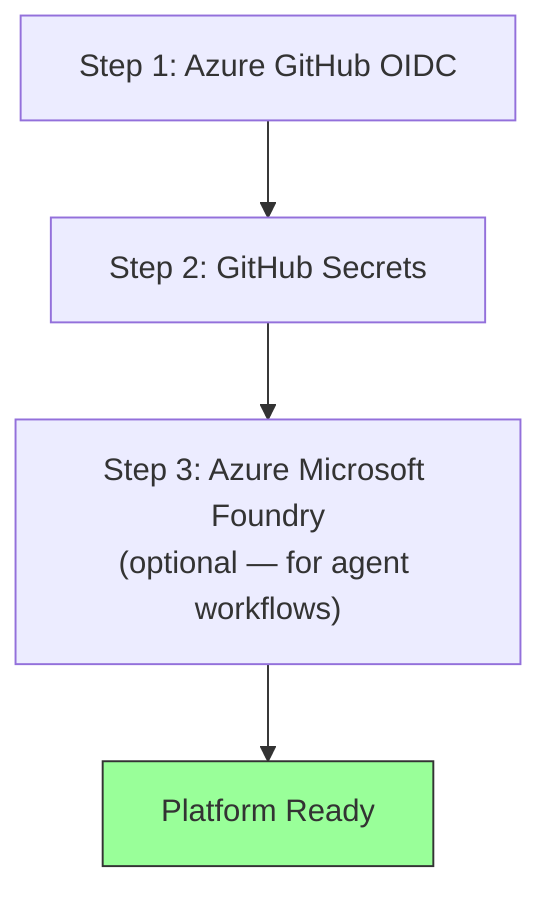

# Deployment

> **Navigation:** [README](../../README.md) > **Deployment**
>
> **See also:** [Getting Started](getting_started.md) · [Architecture](architecture.md) · [Problem & Solution](problem_and_solution.md)

---

## Prerequisites

### Required Tools

| Tool | Version | Installation |
|---|---|---|
| Python | >= 3.13 | [python.org](https://www.python.org/downloads/) |
| Node.js | >= 22.12.0 | [nodejs.org](https://nodejs.org/) |
| [uv](https://docs.astral.sh/uv/) | latest | `curl -LsSf https://astral.sh/uv/install.sh \| sh` |
| Terraform | >= 1.6.0 | [terraform.io](https://developer.hashicorp.com/terraform/install) |
| Azure CLI (`az`) | latest | [Install Azure CLI](https://learn.microsoft.com/cli/azure/install-azure-cli) |
| GitHub CLI (`gh`) | latest | [cli.github.com](https://cli.github.com/) |
| GitHub Copilot CLI | latest | `curl -fsSL https://gh.io/copilot-install \| bash` |

### Required Accounts & Permissions

| Requirement | Details |
|---|---|
| Azure Subscription | With permissions to create Entra ID applications and RBAC role assignments |
| GitHub Repository | With Actions enabled and ability to create environments and secrets |
| GitHub Copilot License | Personal or organization license with CLI and SDK access |
| `COPILOT_GITHUB_TOKEN` | GitHub PAT with Copilot scope (for local dev and GitHub Actions) |

---

## Local Development Setup

### 1. Clone the Repository

```shell
git clone https://github.com/ks6088ts/template-github-copilot.git
cd template-github-copilot
```

### 2. Install Python Dependencies

```shell
cd src/python
make install-deps-dev
```

This uses `uv sync --all-groups` to install all production and dev dependencies, and sets up `pre-commit` hooks.

### 3. Configure Environment

```shell
cp .env.template .env
```

Edit `.env` with your settings:

```shell
# Project Settings
PROJECT_NAME=adhoc
PROJECT_LOG_LEVEL=INFO

# Azure Blob Storage (required for report service)
AZURE_BLOB_STORAGE_ACCOUNT_URL=https://<account>.blob.core.windows.net
AZURE_BLOB_STORAGE_CONTAINER_NAME=adhoc

# Microsoft Foundry (required for agent commands)
MICROSOFT_FOUNDRY_PROJECT_ENDPOINT=https://<endpoint>.services.ai.azure.com/api/projects/<project>

# BYOK Settings (for Bring Your Own Key workflows)
BYOK_PROVIDER_TYPE=openai
BYOK_BASE_URL=https://<your-resource>.openai.azure.com/openai/v1/
BYOK_API_KEY=<your-api-key>
BYOK_MODEL=gpt-5
BYOK_WIRE_API=responses
```

### 4. Verify Setup

```shell
# Run CI tests (format check + lint + tests)
make ci-test
```

### 5. Start Copilot CLI Server

```shell
export COPILOT_GITHUB_TOKEN="your-github-pat"
make copilot
```

This starts the Copilot CLI server on `localhost:3000`.

### 6. Run the Chat App

In a separate terminal:

```shell
cd src/python
make copilot-app
```

---

## Infrastructure Deployment

Infrastructure deployment follows a three-step process. Each step must be completed before the next.



### Step 1: Azure Service Principal with OIDC

Creates the Azure identity that GitHub Actions will use for passwordless authentication.

```shell
cd infra/scenarios/azure_github_oidc

# Login to Azure
az login

# Initialize Terraform
terraform init

# Review the plan
terraform plan -var="github_repository_name=template-github-copilot" \
               -var="github_repository_owner=ks6088ts"

# Apply
terraform apply -var="github_repository_name=template-github-copilot" \
                -var="github_repository_owner=ks6088ts"
```

**Outputs:** `ARM_CLIENT_ID`, `ARM_SUBSCRIPTION_ID`, `ARM_TENANT_ID`

> See [azure_github_oidc/README.md](../../infra/scenarios/azure_github_oidc/README.md) for full variable reference.

### Step 2: Register GitHub Secrets

Stores the Azure credentials and Copilot token in the GitHub repository environment.

```shell
cd infra/scenarios/github_secrets

# Copy and edit tfvars
cp terraform.tfvars.example terraform.tfvars
# Edit terraform.tfvars with the outputs from Step 1

# Login to GitHub
export GITHUB_TOKEN="your-github-pat"

# Initialize and apply
terraform init
terraform plan
terraform apply
```

**Creates:** GitHub environment `dev` with secrets for OIDC auth and Copilot access.

> See [github_secrets/README.md](../../infra/scenarios/github_secrets/README.md) for full variable reference.

### Step 3: Azure Microsoft Foundry (Optional)

Deploy Microsoft Foundry for AI agent capabilities — required for Foundry Agent workflows such as domain-specific evaluation, layout assessment, and multi-agent orchestration.

```shell
cd infra/scenarios/azure_microsoft_foundry

# Initialize and apply
terraform init
terraform plan
terraform apply
```

**Creates:** Resource group, AI Foundry account, project, and model deployments.

> See [azure_microsoft_foundry/README.md](../../infra/scenarios/azure_microsoft_foundry/README.md) for full variable reference.

---

## GitHub Actions Deployment

Once infrastructure is provisioned and secrets are registered, GitHub Actions workflows are ready to use.

### Running Workflows

All dispatch-able workflows are triggered via **`workflow_dispatch`** from the GitHub Actions UI:

1. Navigate to **Actions** tab in the repository
2. Select the desired workflow
3. Click **Run workflow**
4. Fill in the input parameters
5. Click **Run workflow** to start

### Available Workflows

| Workflow | Purpose | Required Secrets |
|---|---|---|
| `github-copilot-cli.yaml` | Run a single Copilot CLI prompt | `COPILOT_GITHUB_TOKEN` |
| `github-copilot-sdk.yaml` | Run Copilot SDK chat app with tool-calling | `COPILOT_GITHUB_TOKEN` |
| `report-service.yaml` | Generate report → upload to Blob Storage | `COPILOT_GITHUB_TOKEN`, Azure OIDC secrets |

### Report Service Workflow Inputs

| Input | Required | Default | Description |
|---|---|---|---|
| `system_prompt` | Yes | `"You are a helpful assistant."` | System prompt (persona) for the assistant |
| `queries` | Yes | — | Comma-separated queries (evaluation dimensions) |
| `auth_method` | Yes | `copilot` | LLM provider authentication method (`copilot`, `entra_id`) |
| `model` | No | `gpt-5-mini` | LLM model selection (used when `auth_method` is `copilot`) |
| `byok_provider_type` | No | `openai` | BYOK provider type (`openai`, `azure`, `anthropic`; used when `auth_method` is `entra_id`) |
| `byok_base_url` | No | `https://api.openai.com/v1/` | BYOK provider base URL (used when `auth_method` is `entra_id`) |
| `byok_model` | No | `gpt-5` | Model identifier for the BYOK provider (used when `auth_method` is `entra_id`) |
| `byok_wire_api` | No | `responses` | Wire API format (`completions`, `responses`; used when `auth_method` is `entra_id`) |
| `azure_blob_storage_account_url` | Yes | — | Storage account URL |
| `azure_blob_storage_container_name` | Yes | — | Container name |
| `sas_expiry_hours` | No | `1` | SAS URL expiry in hours |

**Domain adaptation tip:** Change `system_prompt` to a domain-specific persona (e.g., "You are a real estate layout evaluator") and `queries` to evaluation dimensions (e.g., "Assess accessibility,Assess traffic flow") to repurpose the workflow for any industry.

---

## Verifying the Deployment

### 1. Check CI Workflows

Push a commit or open a PR to `main` and verify that `test.yaml` passes.

### 2. Check Infrastructure CI

Trigger the `infra.yaml` workflow manually or wait for the weekly schedule. Verify that all Terraform lint, validate, and plan steps succeed.

### 3. Run a Test Report

Trigger `report-service.yaml` with a simple query:

- **system_prompt:** `"You are a product evaluation specialist."`
- **queries:** `"Evaluate product durability,Evaluate usability"`
- **azure_blob_storage_account_url:** Your storage account URL
- **azure_blob_storage_container_name:** Your container name

Verify that the workflow outputs a SAS URL and the report JSON is accessible.

### 4. Test Foundry Agents (Optional)

If Step 3 infrastructure was deployed:

```shell
# Create and run a test agent
uv run python scripts/agents.py create --name "test-agent" --instructions "You are a helpful assistant."
uv run python scripts/agents.py run --agent-name "test-agent" --prompt "Hello, can you help me?"
uv run python scripts/agents.py delete --agent-name "test-agent"
```

---

## Troubleshooting

| Issue | Cause | Resolution |
|---|---|---|
| `OIDC token request failed` | Federated credential not configured or environment mismatch | Verify `azure_github_oidc` Terraform output and GitHub environment name |
| `Copilot CLI server not starting` | Invalid `COPILOT_GITHUB_TOKEN` | Verify PAT has Copilot scope; regenerate if expired |
| `Blob upload 403 Forbidden` | Missing RBAC role assignment | Ensure `Storage Blob Data Contributor` role is assigned to the service principal |
| `SAS URL returns 403` | Missing delegator role or expired SAS | Ensure `Storage Blob Delegator` role is assigned; check expiry hours |
| `Terraform state lock` | Concurrent Terraform runs | Wait for the other run to complete, or force-unlock with `terraform force-unlock <ID>` |
| `Agent creation fails` | Foundry endpoint not configured | Set `MICROSOFT_FOUNDRY_PROJECT_ENDPOINT` in `.env` or pass `--endpoint` flag |
