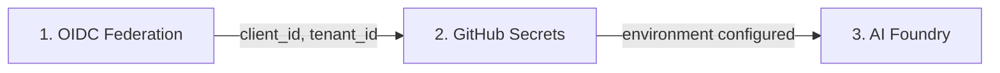
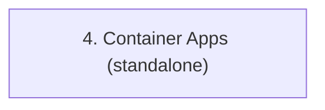

# Deployment

> **Navigation:** [CopilotReportForge](index.md) > **Deployment**
>
> **See also:** [Getting Started](getting_started.md) · [Architecture](architecture.md)

---

## Overview

CopilotReportForge is deployed through a combination of **Terraform** (for Azure and GitHub infrastructure) and **GitHub Actions** (for AI workflow execution). The deployment creates a fully automated pipeline where GitHub Actions workflows authenticate to Azure via OIDC, execute AI evaluations, and store results in Azure Blob Storage.

---

## Prerequisites

| Requirement | Purpose |
|---|---|
| Azure subscription | Host AI services, storage, and identity |
| GitHub repository | Host code, Actions workflows, and environments |
| Terraform 1.0+ | Provision infrastructure |
| Azure CLI (`az`) | Authenticate Terraform with Azure |
| GitHub CLI (`gh`) | Configure GitHub environments and secrets |

---

## Infrastructure Deployment

### Deployment Sequence

The three Terraform scenarios must be deployed in order because each depends on the outputs of the previous step:



An additional standalone scenario is available for deploying the application to Azure Container Apps:



### Step 1: OIDC Federation (`azure_github_oidc`)

Creates a trust relationship between your GitHub repository and Azure. After this step, GitHub Actions can authenticate to Azure without stored credentials.

```bash
cd infra/scenarios/azure_github_oidc
terraform init
terraform plan -out=tfplan
terraform apply tfplan
```

**Key outputs:** `client_id`, `tenant_id`, `subscription_id`

### Step 2: GitHub Secrets (`github_secrets`)

Takes the OIDC outputs and injects them as encrypted environment secrets in your GitHub repository. Also configures runtime secrets like the Copilot token and Slack webhook URL.

```bash
cd infra/scenarios/github_secrets
# Edit terraform.tfvars with your values
terraform init
terraform plan -out=tfplan
terraform apply tfplan
```

### Step 3: AI Foundry (`azure_microsoft_foundry`)

Deploys the Azure AI Hub, model endpoints, Storage Account, and optional AI Search index. This step is **optional** — you only need it if you want domain-specific AI agents with reference data access.

```bash
cd infra/scenarios/azure_microsoft_foundry
terraform init
terraform plan -out=tfplan
terraform apply tfplan
```

### Step 4 (Standalone): Container Apps (`azure_container_apps`)

Deploys a monolith container (Copilot CLI + API server in a single image) as an Azure Container App, equivalent to running the `monolith` service from `compose.docker.yaml` in the cloud. The container uses supervisord to manage both processes internally. This step is **independent** of the other three scenarios.

```bash
cd infra/scenarios/azure_container_apps
export ARM_SUBSCRIPTION_ID=$(az account show --query id --output tsv)
terraform init
terraform plan -out=tfplan
terraform apply tfplan
```

**Key outputs:** `app_url`, `app_fqdn`

See [azure_container_apps/README.md](../../infra/scenarios/azure_container_apps/README.md) for full configuration details including environment variables.

---

## GitHub Actions Workflows

Once infrastructure is deployed, AI evaluations run as GitHub Actions workflows. These can be triggered by:

| Trigger | Example |
|---|---|
| **Manual dispatch** | Click "Run workflow" in the Actions tab |
| **Schedule** | Cron expression for recurring evaluations |
| **Push/PR** | Run evaluations as part of CI/CD |
| **API call** | Programmatic triggering from external systems |

### Workflow Execution

Each workflow run:
1. Authenticates to Azure via OIDC (no credentials stored)
2. Executes parallel LLM queries using the Copilot SDK
3. Aggregates results into a structured report
4. Uploads the report to Azure Blob Storage
5. Optionally notifies via Slack

### `report-service` Workflow

The main report generation workflow (`report-service.yaml`) is triggered via **manual dispatch** (`workflow_dispatch`). Infrastructure-related settings (storage account, BYOK config, etc.) are read from **GitHub environment secrets** — only task-specific inputs are required at runtime:

| Input | Type | Description |
|---|---|---|
| `system_prompt` | string | System prompt defining the AI persona |
| `queries` | string | Comma-separated evaluation queries |
| `auth_method` | choice | `github_copilot` or `foundry_entra_id` |
| `model` | choice | Model for Copilot CLI (e.g. `gpt-5-mini`) |
| `sas_expiry_hours` | number | Hours until the report download URL expires |
| `save_artifacts` | boolean | Whether to save workflow artifacts |
| `retention_days` | number | Days to retain artifacts |

The following values are sourced from **environment secrets** (configured via the `github_secrets` Terraform scenario) and do not need to be provided at runtime:

`ARM_CLIENT_ID`, `ARM_SUBSCRIPTION_ID`, `ARM_TENANT_ID`, `COPILOT_GITHUB_TOKEN`, `SLACK_WEBHOOK_URL`, `AZURE_BLOB_STORAGE_ACCOUNT_URL`, `AZURE_BLOB_STORAGE_CONTAINER_NAME`, `MICROSOFT_FOUNDRY_PROJECT_ENDPOINT`, `BYOK_PROVIDER_TYPE`, `BYOK_BASE_URL`, `BYOK_API_KEY`, `BYOK_MODEL`, `BYOK_WIRE_API`

---

## Domain Adaptation

To adapt the platform for a new domain, you only need to change configuration — no code changes required:

1. **Update system prompt** — Define the AI persona for your domain
2. **Update queries** — Define the evaluation criteria
3. **Deploy AI agent** (optional) — Create a Foundry Agent with domain-specific reference data

Example: switching from product evaluation to clinical guideline review:

```bash
uv run python scripts/report_service.py generate \
  --system-prompt "You are an expert clinical guideline reviewer." \
  --queries "Evaluate evidence quality,Check recommendation consistency,Assess applicability" \
  --account-url "https://<account>.blob.core.windows.net" \
  --container-name "reports"
```

---

## Local Development Setup

For local development and testing before deploying to GitHub Actions:

```bash
cd src/python

# Install dependencies
make install-deps-dev

# Set environment variables
cp .env.template .env  # Edit with your settings
export COPILOT_GITHUB_TOKEN="your-github-pat"

# Start the Copilot CLI server
make copilot

# In another terminal: run interactive chat
make copilot-app

# Or: generate a report
uv run python scripts/report_service.py generate \
  --system-prompt "You are a product evaluator." \
  --queries "Evaluate durability,Evaluate usability" \
  --account-url "https://<account>.blob.core.windows.net" \
  --container-name "reports"
```

See [Getting Started](getting_started.md) for detailed local setup instructions.

---

## Verification

| Check | How to Verify |
|---|---|
| OIDC trust established | GitHub Actions workflow authenticates without secrets |
| Secrets configured | GitHub environment shows all expected secrets |
| AI models deployed | Azure AI Hub shows model endpoints |
| Report generation works | Workflow completes and outputs a blob URL |
| Notifications work | Slack channel receives the report summary |

---

## Troubleshooting

| Issue | Likely Cause | Resolution |
|---|---|---|
| OIDC authentication fails | Federated credential mismatch | Verify `subject` claim matches branch/environment |
| Terraform state conflict | Multiple users applying simultaneously | Use remote state backend (Azure Storage) |
| Model endpoint unavailable | Model not yet deployed or quota exceeded | Check AI Hub deployments and subscription quotas |
| Blob upload permission denied | Missing RBAC role | Ensure `Storage Blob Data Contributor` role is assigned |
| Workflow times out | Too many parallel queries | Reduce query count or increase timeout |
