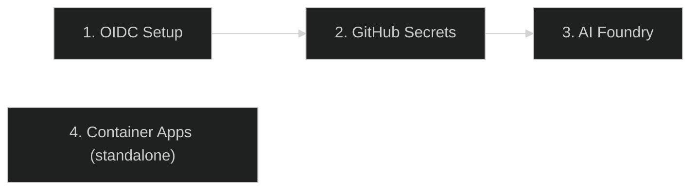

# Getting Started

> **Navigation:** [CopilotReportForge](index.md) > **Getting Started**
>
> **See also:** [Architecture](architecture.md) · [Deployment](deployment.md) · [GitHub OAuth App](github_oauth_app.md)

---

## What Is CopilotReportForge?

CopilotReportForge is an AI automation platform that executes multiple LLM queries in parallel, aggregates the results into structured reports, and distributes those reports through secure channels. It is designed for enterprise teams that need **reproducible, governed AI evaluations** across any domain — from product development to healthcare to real estate.

For a deeper look at the problems this solves and why the architecture is designed this way, see [Problem & Solution](problem_and_solution.md).

---

## Prerequisites

| Requirement | Minimum Version | Purpose |
|---|---|---|
| Python | 3.13+ | Runtime |
| uv | latest | Package management |
| Terraform | 1.0+ | Infrastructure provisioning |
| GitHub CLI (`gh`) | latest | Copilot token acquisition |
| Azure CLI (`az`) | latest | Azure authentication |
| Docker | latest | Container execution (optional) |
| Make | any | Build automation |

---

## Quick Start (Local Development)

### 1. Clone and Install

```bash
git clone https://github.com/ks6088ts/template-github-copilot.git
cd template-github-copilot/src/python

# Install dependencies (includes dev tools)
make install-deps-dev
```

### 2. Configure Environment

```bash
cp .env.template .env  # Edit with your settings
```

### 3. Authenticate with GitHub Copilot

```bash
# Set your GitHub PAT with Copilot scope
export COPILOT_GITHUB_TOKEN="your-github-pat"
```

### 4. Start the Copilot CLI Server

```bash
make copilot
```

This starts the Copilot CLI server on port 3000.

### 5. Run Your First Chat (in another terminal)

```bash
make copilot-app
```

This launches an interactive chat loop with a hosted LLM via the Copilot SDK.

### 6. Generate a Report

```bash
uv run python scripts/report_service.py generate \
  --system-prompt "You are a product evaluation specialist." \
  --queries "Evaluate durability,Evaluate usability,Evaluate aesthetics" \
  --account-url "https://<account>.blob.core.windows.net" \
  --container-name "reports"
```

The platform executes all queries in parallel (comma-separated), aggregates the results, and uploads a structured JSON report to Azure Blob Storage.

---

## Infrastructure Setup

CopilotReportForge uses three Terraform scenarios, deployed in sequence. Each scenario builds on the outputs of the previous one. A fourth standalone scenario deploys the application to Azure Container Apps.



### Step 1: OIDC Federation

Establishes passwordless trust between GitHub Actions and Azure. After this step, workflows can authenticate without stored credentials.

```bash
cd infra/scenarios/azure_github_oidc
terraform init && terraform apply
```

See [Azure GitHub OIDC README](../../infra/scenarios/azure_github_oidc/README.md) for details.

### Step 2: GitHub Secrets

Injects the OIDC credentials and runtime secrets into a GitHub environment. Workflows running in that environment will automatically have access.

```bash
cd infra/scenarios/github_secrets
terraform init && terraform apply
```

See [GitHub Secrets README](../../infra/scenarios/github_secrets/README.md) for details.

### Step 3: AI Foundry (Optional)

Deploys Azure AI Hub, model endpoints, Storage Account, and optional AI Search. Required only if you need domain-specific AI agents with reference data access.

```bash
cd infra/scenarios/azure_microsoft_foundry
terraform init && terraform apply
```

See [Azure Microsoft Foundry README](../../infra/scenarios/azure_microsoft_foundry/README.md) for details.

### Step 4: Container Apps (Standalone)

Deploys a monolith container (Copilot CLI + API server in a single image) as an Azure Container App, equivalent to running the `monolith` service from `compose.docker.yaml` in the cloud. This step is **independent** of the other three scenarios.

```bash
cd infra/scenarios/azure_container_apps
export ARM_SUBSCRIPTION_ID=$(az account show --query id --output tsv)
terraform init && terraform apply
```

See [Azure Container Apps README](../../infra/scenarios/azure_container_apps/README.md) for details.

---

## CLI Reference

All tools are invoked from `src/python/`.

### Make Targets

#### Project

| Command | What It Does |
|---|---|
| `make copilot` | Start the Copilot CLI server (port 3000) |
| `make copilot-app` | Interactive chat loop with Copilot SDK |
| `make copilot-api` | Start the web API server with Copilot SDK |

#### Development

| Command | What It Does |
|---|---|
| `make help` | Show all available Make targets with descriptions |
| `make info` | Show current Git revision and tag |
| `make install-deps-dev` | Install all dependencies including dev tools |
| `make install-deps` | Install production dependencies only |
| `make format-check` | Check code formatting (ruff) |
| `make format` | Auto-format code (ruff) |
| `make fix` | Apply auto-fixes (format + lint fixes) |
| `make lint` | Run all linters (ruff, ty, pyrefly, actionlint) |
| `make test` | Run unit tests with pytest |
| `make ci-test` | Full CI pipeline: install, format-check, lint, test |
| `make update` | Update all package versions in `uv.lock` |
| `make jupyterlab` | Launch Jupyter Lab for interactive development |

#### Docker

| Command | What It Does |
|---|---|
| `make docker-build` | Build all Docker images (monolith, api, copilot) |
| `make docker-run` | Run the monolith Docker container |
| `make docker-lint` | Lint all Dockerfiles with hadolint |
| `make docker-scan` | Scan Docker images for vulnerabilities (trivy) |
| `make ci-test-docker` | Full Docker CI: lint, build, scan, run |

#### Docker Compose

| Command | What It Does |
|---|---|
| `make compose-build` | Build Docker Compose services |
| `make compose-up` | Start all services via Docker Compose (foreground) |
| `make compose-up-d` | Start all services via Docker Compose (background) |
| `make compose-down` | Stop Docker Compose services |
| `make compose-logs` | Show Docker Compose logs |

### Script Commands

| Script | What It Does |
|---|---|
| `uv run python scripts/chat.py chat-loop` | Interactive chat with a hosted LLM |
| `uv run python scripts/chat.py chat --prompt "Hello"` | Single-prompt chat with a hosted LLM |
| `uv run python scripts/chat.py chat-parallel -p "Q1" -p "Q2"` | Send multiple prompts in parallel sessions |
| `uv run python scripts/report_service.py generate` | Parallel multi-query report generation |
| `uv run python scripts/agents.py list` | List AI Foundry agents |
| `uv run python scripts/agents.py run` | Run an AI Foundry agent with a query |
| `uv run python scripts/api_server.py serve` | Start the Copilot Chat API server (FastAPI + OAuth) |
| `uv run python scripts/blob.py list-blobs` | List blobs in Azure Blob Storage |
| `uv run python scripts/blob.py upload-blob` | Upload a string as a blob to Azure Blob Storage |
| `uv run python scripts/blob.py generate-sas-url` | Generate a SAS URL for a blob |
| `uv run python scripts/byok.py chat-loop-api-key` | Interactive chat using Bring-Your-Own-Key (API key) |
| `uv run python scripts/byok.py chat-loop-entra-id` | Interactive chat using Bring-Your-Own-Key (Entra ID) |
| `uv run python scripts/slacks.py send` | Post a message to Slack via webhook |

### Example: Multi-Persona Evaluation

```bash
export COPILOT_GITHUB_TOKEN="your-github-pat"
uv run python scripts/report_service.py generate \
  --system-prompt "You are a senior product evaluator." \
  --queries "Evaluate usability,Evaluate accessibility,Evaluate performance" \
  --account-url "https://<account>.blob.core.windows.net" \
  --container-name "reports"
```

Each comma-separated query runs in an independent LLM session. Results are aggregated into a single report with per-query success/failure tracking.

---

## Configuration

All configuration is done through environment variables. The platform uses structured settings classes to validate configuration at startup — if a required variable is missing, the application fails fast with a clear error message rather than producing silent failures.

### Key Environment Variables

| Variable | Purpose |
|---|---|
| `PROJECT_NAME` | Project name (used for logging and blob path prefix) |
| `PROJECT_LOG_LEVEL` | Log level (`INFO`, `DEBUG`, etc.) |
| `COPILOT_GITHUB_TOKEN` | GitHub PAT with Copilot scope |
| `COPILOT_MODEL` | Model used by the Copilot CLI server (e.g. `gpt-5-mini`) |
| `COPILOT_CLI_URL` | Copilot CLI server URL (leave empty to spawn subprocess) |
| `AZURE_BLOB_STORAGE_ACCOUNT_URL` | Azure Blob Storage account URL |
| `AZURE_BLOB_STORAGE_CONTAINER_NAME` | Blob container name |
| `MICROSOFT_FOUNDRY_PROJECT_ENDPOINT` | Microsoft Foundry project endpoint URL |

### OAuth Settings (Web UI)

| Variable | Purpose |
|---|---|
| `GITHUB_CLIENT_ID` | GitHub OAuth App client ID |
| `GITHUB_CLIENT_SECRET` | GitHub OAuth App client secret |
| `SESSION_SECRET` | Random secret for cookie signing (generate with `openssl rand -hex 32`) |
| `API_HOST` | Web server host (default: `127.0.0.1`) |
| `API_PORT` | Web server port (default: `8000`) |

### Provider Configuration (BYOK)

| Variable | Purpose |
|---|---|
| `BYOK_PROVIDER_TYPE` | Provider type: `openai`, `azure`, or `anthropic` |
| `BYOK_BASE_URL` | Base URL for the model endpoint |
| `BYOK_API_KEY` | API key for the provider |
| `BYOK_MODEL` | Model name to use (e.g. `gpt-5`) |
| `BYOK_WIRE_API` | Wire API format: `completions` (standard Chat Completions API) or `responses` (OpenAI Responses API) |

For a complete list, see the settings files in `template_github_copilot/settings/`.

---

## Web Application

CopilotReportForge includes a browser-based UI for interactive use. See [Web UI Guide](web_ui_guide.md) for a full walkthrough.

To start the web server locally:

```bash
make copilot-api
```

Then open `http://localhost:8000` in your browser. The web application provides:
- GitHub OAuth login
- Interactive chat interface
- Parallel report generation panel
- Dark/light theme toggle

See [GitHub OAuth App Setup](github_oauth_app.md) for authentication configuration.

---

## Running with Docker

For containerized deployment, see [Running Containers Locally](container_local_run.md).

Quick start with Docker Compose:

```bash
cd src/python
docker compose up --build
```

---

## Next Steps

| Goal | Document |
|---|---|
| Understand the system design | [Architecture](architecture.md) |
| Deploy to production | [Deployment](deployment.md) |
| Set up GitHub OAuth | [GitHub OAuth App](github_oauth_app.md) |
| Run in containers | [Running Containers Locally](container_local_run.md) |
| Understand AI safety considerations | [Responsible AI](responsible_ai.md) |
