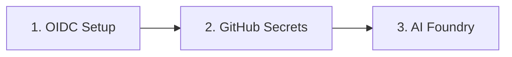

# Getting Started

> **Navigation:** [CopilotReportForge](index.md) > **Getting Started**
>
> **See also:** [Architecture](architecture.md) · [Deployment](deployment.md) · [GitHub OAuth App](github_oauth_app.md)

---

## What Is CopilotReportForge?

CopilotReportForge is an AI automation platform that executes multiple LLM queries in parallel, aggregates the results into structured reports, and distributes those reports through secure channels. It is designed for enterprise teams that need **reproducible, governed AI evaluations** across any domain — from product development to healthcare to real estate.

For a deeper look at the problems this solves and why the architecture is designed this way, see [Problem & Solution](problem_and_solution.md).

---

## Prerequisites

| Requirement | Minimum Version | Purpose |
|---|---|---|
| Python | 3.13+ | Runtime |
| uv | latest | Package management |
| Terraform | 1.0+ | Infrastructure provisioning |
| GitHub CLI (`gh`) | latest | Copilot token acquisition |
| Azure CLI (`az`) | latest | Azure authentication |
| Docker | latest | Container execution (optional) |
| Make | any | Build automation |

---

## Quick Start (Local Development)

### 1. Clone and Install

```bash
git clone https://github.com/ks6088ts/template-github-copilot.git
cd template-github-copilot/src/python

# Install dependencies
make install
```

### 2. Authenticate with GitHub Copilot

```bash
# Start Copilot authentication and set the token
export COPILOT_GITHUB_TOKEN=$(gh copilot token)
```

### 3. Run Your First Chat

```bash
make chat
```

This sends a prompt to a hosted LLM via the Copilot SDK and prints the response.

### 4. Generate a Report

```bash
make report
```

The platform executes all configured queries in parallel, aggregates the results, and outputs a structured JSON report.

---

## Infrastructure Setup

CopilotReportForge uses three Terraform scenarios, deployed in sequence. Each scenario builds on the outputs of the previous one.



### Step 1: OIDC Federation

Establishes passwordless trust between GitHub Actions and Azure. After this step, workflows can authenticate without stored credentials.

```bash
cd infra/scenarios/azure_github_oidc
terraform init && terraform apply
```

See [Azure GitHub OIDC README](../../infra/scenarios/azure_github_oidc/README.md) for details.

### Step 2: GitHub Secrets

Injects the OIDC credentials and runtime secrets into a GitHub environment. Workflows running in that environment will automatically have access.

```bash
cd infra/scenarios/github_secrets
terraform init && terraform apply
```

See [GitHub Secrets README](../../infra/scenarios/github_secrets/README.md) for details.

### Step 3: AI Foundry (Optional)

Deploys Azure AI Hub, model endpoints, Storage Account, and optional AI Search. Required only if you need domain-specific AI agents with reference data access.

```bash
cd infra/scenarios/azure_microsoft_foundry
terraform init && terraform apply
```

See [Azure Microsoft Foundry README](../../infra/scenarios/azure_microsoft_foundry/README.md) for details.

---

## CLI Reference

All CLI tools are invoked via `make` targets from `src/python/`. Each tool reads its configuration from environment variables.

| Command | What It Does |
|---|---|
| `make chat` | Interactive chat with a hosted LLM |
| `make report` | Parallel multi-query report generation |
| `make agent` | Agentic workflow with AI Foundry tools |
| `make blob` | Upload/download blobs to Azure Storage |
| `make byok` | Chat using Bring-Your-Own-Key (API key or Entra ID) |
| `make slack` | Post a message to Slack via webhook |

### Example: Multi-Persona Evaluation

```bash
export COPILOT_GITHUB_TOKEN=$(gh copilot token)
export REPORT_SERVICE_SYSTEM_PROMPT="You are a senior product evaluator."
export REPORT_SERVICE_QUERIES="Evaluate usability;Evaluate accessibility;Evaluate performance"
make report
```

Each semicolon-separated query runs in an independent LLM session. Results are aggregated into a single report with per-query success/failure tracking.

---

## Configuration

All configuration is done through environment variables. The platform uses structured settings classes to validate configuration at startup — if a required variable is missing, the application fails fast with a clear error message rather than producing silent failures.

### Key Environment Variables

| Variable | Purpose |
|---|---|
| `COPILOT_GITHUB_TOKEN` | Authentication token for Copilot SDK |
| `REPORT_SERVICE_SYSTEM_PROMPT` | System prompt defining the AI persona |
| `REPORT_SERVICE_QUERIES` | Semicolon-separated list of queries to execute |
| `REPORT_SERVICE_MODEL` | LLM model to use (e.g. `gpt-4o`) |
| `AZURE_STORAGE_ACCOUNT_NAME` | Azure Storage account for report upload |
| `AZURE_STORAGE_CONTAINER_NAME` | Blob container name |
| `SLACK_WEBHOOK_URL` | Slack webhook for notifications |

### Provider Configuration (BYOK)

| Variable | Purpose |
|---|---|
| `BYOK_PROVIDER` | Provider type: `copilot`, `api_key`, or `azure_entra_id` |
| `BYOK_API_KEY` | API key (when using `api_key` provider) |
| `BYOK_AZURE_ENDPOINT` | Azure endpoint URL (when using `azure_entra_id` provider) |
| `BYOK_MODEL` | Model name to use |

For a complete list, see the settings files in the source code.

---

## Web Application

CopilotReportForge includes a browser-based UI for interactive use. See [Web UI Guide](web_ui_guide.md) for a full walkthrough.

To start the web server locally:

```bash
make api-server
```

Then open `http://localhost:8000` in your browser. The web application provides:
- GitHub OAuth login
- Interactive chat interface
- Parallel report generation panel
- Dark/light theme toggle

See [GitHub OAuth App Setup](github_oauth_app.md) for authentication configuration.

---

## Running with Docker

For containerized deployment, see [Running Containers Locally](container_local_run.md).

Quick start with Docker Compose:

```bash
cd src/python
docker compose up --build
```

---

## Next Steps

| Goal | Document |
|---|---|
| Understand the system design | [Architecture](architecture.md) |
| Deploy to production | [Deployment](deployment.md) |
| Set up GitHub OAuth | [GitHub OAuth App](github_oauth_app.md) |
| Run in containers | [Running Containers Locally](container_local_run.md) |
| Understand AI safety considerations | [Responsible AI](responsible_ai.md) |
