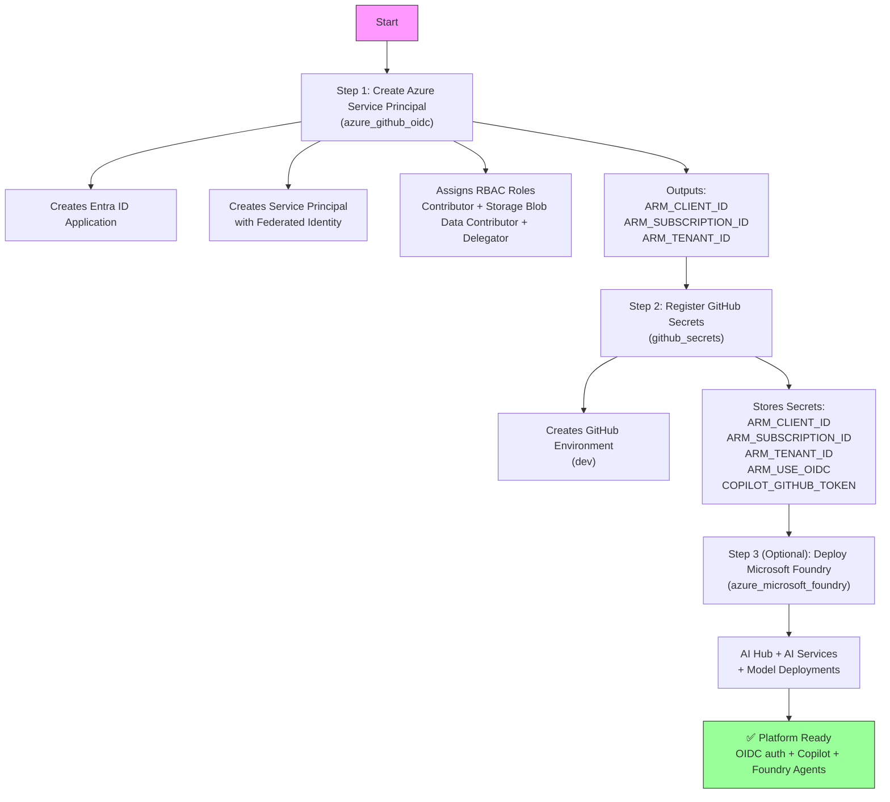
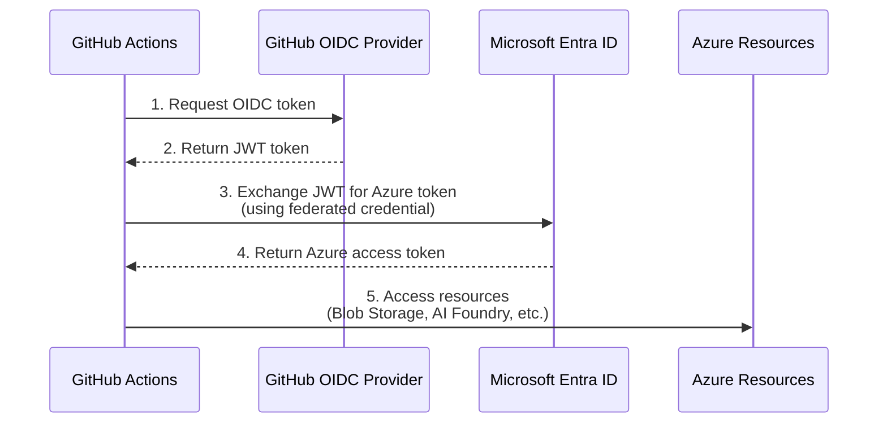
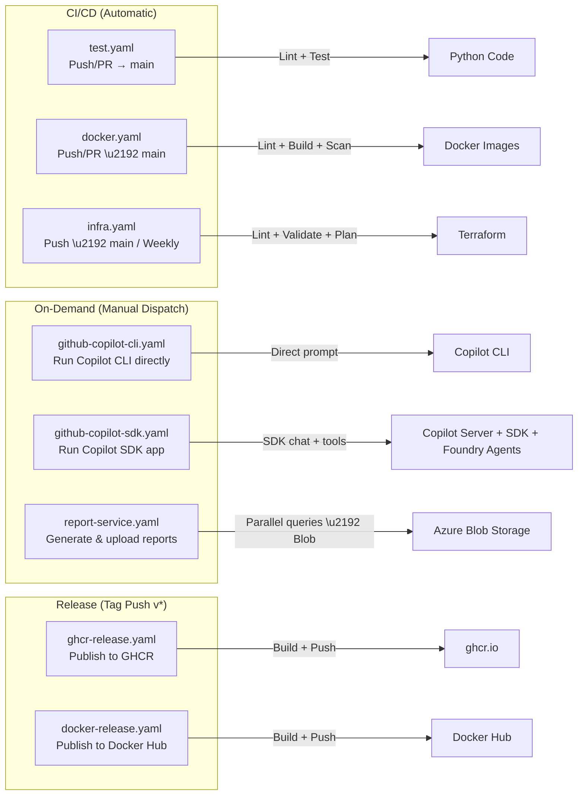

# Getting Started

> **Navigation:** [README](../../README.md) > **Getting Started**
>
> **See also:** [Architecture](architecture.md) · [Deployment](deployment.md) · [GitHub OAuth App](github_oauth_app.md) · [Running Containers](container_local_run.md) · [References](references.md)

---

CopilotReportForge is an extensible AI automation platform built on the GitHub Copilot SDK, Azure AI Foundry, and GitHub Actions. This guide covers everything you need to get from zero to a running instance — whether your goal is AI-driven report generation, multi-persona product evaluation, real estate layout assessment, or any other domain-specific workflow.

## Table of Contents

- [Prerequisites](#prerequisites)
- [Quick Start (Local Development)](#quick-start-local-development)
- [Infrastructure Setup](#infrastructure-setup)
- [GitHub Actions Workflows](#github-actions-workflows)
- [CLI Scripts Reference](#cli-scripts-reference)
- [Configuration](#configuration)
- [Example: Multi-Persona Product Evaluation](#example-multi-persona-product-evaluation)

## Prerequisites

| Tool | Version | Notes |
|---|---|---|
| Python | >= 3.13 | |
| Node.js | >= 22.12.0 | |
| [uv](https://docs.astral.sh/uv/) | latest | Python package manager |
| Terraform | >= 1.6.0 | For infrastructure management |
| Azure CLI (`az`) | latest | For Azure authentication |
| GitHub Copilot CLI | latest | `curl -fsSL https://gh.io/copilot-install \| bash` |

---

## Quick Start (Local Development)

```shell
# 1. Clone the repository
git clone https://github.com/ks6088ts/template-github-copilot.git
cd template-github-copilot/src/python

# 2. Install dependencies (including dev tools)
make install-deps-dev

# 3. Copy environment template and configure
cp .env.template .env
# Edit .env with your settings (see Configuration section below)

# 4. Run CI tests locally
make ci-test

# 5. Start the Copilot CLI server (requires COPILOT_GITHUB_TOKEN)
export COPILOT_GITHUB_TOKEN="your-github-pat"
make copilot

# 6. In another terminal, run the chat app
make copilot-app
```

---

## Infrastructure Setup

The infrastructure is managed via Terraform and consists of scenarios that must be set up in order.



### Step 1: Azure Service Principal with OIDC (`azure_github_oidc`)

Creates an Azure Service Principal with federated identity credentials, enabling GitHub Actions to authenticate with Azure via OIDC (no stored secrets needed).

**What it creates:**

| Resource | Purpose |
|---|---|
| Entra ID Application | App registration for GitHub Actions |
| Service Principal | Identity for RBAC-based access |
| Federated Identity Credential | OIDC trust with GitHub Actions |
| Role Assignment (Contributor) | Manage Azure resources |
| Role Assignment (Storage Blob Data Contributor) | Read/write blob data |
| Role Assignment (Storage Blob Delegator) | Generate user delegation keys for SAS URLs |
| Role Assignment (Cognitive Services OpenAI User) | Access OpenAI models deployed in AI Foundry |

> **Detailed setup instructions:** See [azure_github_oidc/README.md](../../infra/scenarios/azure_github_oidc/README.md)

### Step 2: GitHub Secrets Registration (`github_secrets`)

Registers Azure credentials and other secrets into the GitHub repository environment.

> **Detailed setup instructions:** See [github_secrets/README.md](../../infra/scenarios/github_secrets/README.md)

### Step 3 (Optional): Microsoft Foundry (`azure_microsoft_foundry`)

Deploys a Microsoft Foundry environment on Azure for agentic AI workflows. Provisions an AI Hub with AI Services and configures model deployments.

**What it creates:**

| Resource | Purpose |
|---|---|
| Resource Group | Container for all Foundry resources |
| Microsoft Foundry Account (AI Services) | Cognitive Services account with AI Foundry capabilities |
| Microsoft Foundry Project | Project workspace within the Foundry account |
| Model Deployments | OpenAI model deployments (configurable via `model_deployments` variable) |
| Storage Account | Azure Storage Account (with HNS enabled and queue) for artifact storage |
| Azure AI Search (optional) | AI Search service for vector/hybrid search (deploy via `deploy_search = true`) |

**Default model deployments:**

| Model | Version | SKU | Capacity |
|---|---|---|---|
| `gpt-5.1` | `2025-11-13` | GlobalStandard | 450 |
| `gpt-5` | `2025-08-07` | GlobalStandard | 450 |
| `gpt-4o` | `2024-11-20` | GlobalStandard | 450 |
| `text-embedding-3-large` | `1` | GlobalStandard | 450 |
| `text-embedding-3-small` | `1` | GlobalStandard | 450 |

> **Detailed setup instructions:** See [azure_microsoft_foundry/README.md](../../infra/scenarios/azure_microsoft_foundry/README.md)

### OIDC Authentication Flow



---

## GitHub Actions Workflows

All dispatch-able workflows are triggered via **`workflow_dispatch`** from the GitHub Actions UI or API.



### `docker.yaml` — Docker CI

- **Trigger:** Push to `main`, `feature/**` branches; PRs to `main`
- **Actions:** Runs `make ci-test-docker` (Dockerfile lint, image build, Trivy scan)
- **No secrets required**

### `test.yaml` — CI Tests

- **Trigger:** Push to `main`, `feature/**`, `copilot/**` branches; PRs to `main`
- **Actions:** Installs dependencies, runs `make ci-test` (format check, lint, tests)
- **No secrets required**

### `infra.yaml` — Infrastructure CI

- **Trigger:** Push to `main`, weekly schedule (Wednesday 00:00 UTC), manual dispatch
- **Jobs:**
  - `lint`: TFLint + Trivy security scan (no auth)
  - `test-azure`: `terraform init/validate/test/plan` for `azure_github_oidc` (requires `dev` environment)
  - `test-github`: `terraform init/validate/test/plan` for `github_secrets` (requires `dev` environment)
- **Requires:** `dev` environment secrets for Azure OIDC

### `github-copilot-cli.yaml` — Direct Copilot CLI

- **Trigger:** Manual dispatch
- **Inputs:**

| Input | Type | Default | Description |
|---|---|---|---|
| `prompt` | string | `"Hello"` | The prompt to send |
| `model` | choice | `gpt-5-mini` | Model: `gpt-5-mini`, `claude-sonnet-4.6`, `claude-opus-4.6`, `claude-opus-4.6-fast` |
| `save_artifacts` | boolean | `false` | Whether to save artifacts as workflow outputs |
| `retention_days` | number | `1` | Number of days to retain artifacts |

### `github-copilot-sdk.yaml` — Copilot SDK App

- **Trigger:** Manual dispatch
- **Inputs:**

| Input | Type | Default | Description |
|---|---|---|---|
| `prompt` | string | `"Hello"` | The prompt to send |
| `model` | choice | `gpt-5-mini` | Model: `gpt-5-mini`, `claude-sonnet-4.6`, `claude-opus-4.6`, `claude-opus-4.6-fast` |
| `save_artifacts` | boolean | `false` | Whether to save artifacts as workflow outputs |
| `retention_days` | number | `1` | Number of days to retain artifacts |

- **What it does:** Starts Copilot CLI as a server, then runs the Python SDK chat app with tool-calling support (including Foundry Agent tools)

### `report-service.yaml` — Report Generation Service

- **Trigger:** Manual dispatch
- **Inputs:**

| Input | Type | Default | Description |
|---|---|---|---|
| `system_prompt` | string | `"You are a helpful assistant."` | System prompt (persona) for the assistant |
| `queries` | string | *(required)* | Comma-separated queries (evaluation dimensions) |
| `auth_method` | choice | `copilot` | LLM provider authentication method (`copilot`, `entra_id`) |
| `model` | choice | `gpt-5-mini` | Model selection (used when `auth_method` is `copilot`): `gpt-5-mini`, `claude-sonnet-4.6`, `claude-opus-4.6`, `claude-opus-4.6-fast` |
| `byok_provider_type` | choice | `openai` | BYOK provider type (`openai`, `azure`, `anthropic`; used when `auth_method` is `entra_id`) |
| `byok_base_url` | string | `https://api.openai.com/v1/` | BYOK provider base URL (used when `auth_method` is `entra_id`) |
| `byok_model` | string | `gpt-5` | Model identifier for the BYOK provider (used when `auth_method` is `entra_id`) |
| `byok_wire_api` | choice | `responses` | Wire API format (`completions`, `responses`; used when `auth_method` is `entra_id`) |
| `azure_blob_storage_account_url` | string | *(required)* | Storage account URL |
| `azure_blob_storage_container_name` | string | *(required)* | Container name |
| `sas_expiry_hours` | number | `1` | SAS URL expiry in hours |
| `microsoft_foundry_project_endpoint` | string | *(optional)* | Microsoft Foundry project endpoint URL |
| `save_artifacts` | boolean | `false` | Whether to save artifacts as workflow outputs |
| `retention_days` | number | `1` | Number of days to retain artifacts |

**Tip:** By changing `system_prompt` to a domain-specific persona and `queries` to evaluation dimensions, this same workflow serves as a product evaluation tool, compliance checker, or creative review pipeline.

### `ghcr-release.yaml` — GitHub Container Registry Release

- **Trigger:** Tag push matching `v*`
- **Actions:** Builds and publishes `copilot` and `api` Docker images to `ghcr.io`
- **Requires:** `packages: write` permission (automatic via `GITHUB_TOKEN`)

### `docker-release.yaml` — Docker Hub Release

- **Trigger:** Tag push matching `v*`
- **Actions:** Builds and publishes `copilot` and `api` Docker images to Docker Hub
- **Requires:** `DOCKERHUB_USERNAME` and `DOCKERHUB_TOKEN` repository secrets

---

## CLI Scripts Reference

All scripts are located under `src/python/scripts/` and use [Typer](https://typer.tiangolo.com/) for CLI argument parsing.

### `scripts/chat.py` — Chat CLI

A multi-command CLI for interacting with the Copilot SDK.

| Command | Description |
|---|---|
| `hello` | Greet and print current settings from `.env` |
| `chat` | Send a single prompt and get a response |
| `chat-loop` | Interactive chat REPL (Ctrl+C to exit) |
| `chat-parallel` | Send multiple prompts in parallel sessions |

#### Usage Examples

```shell
# Simple greeting (test settings)
uv run python scripts/chat.py hello --name "World" --verbose

# Single chat prompt
uv run python scripts/chat.py chat --prompt "Explain Python decorators" --cli-url localhost:3000

# Interactive chat loop
uv run python scripts/chat.py chat-loop --cli-url localhost:3000

# Parallel prompts (structured JSON output)
uv run python scripts/chat.py chat-parallel \
  -p "What is Python?" \
  -p "What is Rust?" \
  -p "What is Go?" \
  --cli-url localhost:3000
```

#### `chat-parallel` Output Schema

```json
{
  "results": [
    { "prompt": "What is Python?", "response": "...", "error": null },
    { "prompt": "What is Rust?", "response": "...", "error": null }
  ],
  "total": 2,
  "succeeded": 2,
  "failed": 0
}
```

### `scripts/report_service.py` — Report Generation CLI

Generates reports by sending multiple queries to Copilot in parallel, uploads results to Azure Blob Storage, and returns a SAS URL for sharing.

| Command | Description |
|---|---|
| `generate` | Generate report, upload to blob, and output SAS URL |

#### Usage Example

```shell
uv run python scripts/report_service.py generate \
  --system-prompt "You are a product quality evaluator." \
  --queries "Evaluate durability,Evaluate usability,Evaluate aesthetics" \
  --account-url "https://myaccount.blob.core.windows.net" \
  --container-name "evaluations" \
  --blob-name "product_eval_2026.json" \
  --sas-expiry-hours 2 \
  --verbose
```

#### Options

| Option | Short | Required | Default | Description |
|---|---|---|---|---|
| `--system-prompt` | `-s` | Yes | — | System prompt (persona) for the assistant |
| `--queries` | `-q` | Yes | — | Comma-separated queries |
| `--account-url` | `-a` | Yes | — | Azure Blob Storage account URL |
| `--container-name` | `-n` | Yes | — | Azure Blob Storage container name |
| `--blob-name` | `-b` | No | `report_<timestamp>.json` | Blob name |
| `--cli-url` | `-c` | No | `localhost:3000` | Copilot CLI server URL |
| `--sas-expiry-hours` | — | No | `1` | SAS URL expiry hours |
| `--auth-method` | `-m` | No | `copilot` | LLM provider auth method (`copilot`, `api_key`, `entra_id`) |
| `--byok-provider-type` | — | No | `openai` | BYOK provider type (`openai`, `azure`, `anthropic`) |
| `--byok-base-url` | — | No | `https://api.openai.com/v1/` | BYOK provider base URL |
| `--byok-api-key` | — | No | `""` | BYOK provider API key |
| `--byok-model` | — | No | `gpt-4o` | Model identifier for the BYOK provider |
| `--byok-wire-api` | — | No | `responses` | Wire API format (`completions` or `responses`) |
| `--verbose` | `-v` | No | `false` | Enable debug logging |

#### Output Schema (ReportOutput)

```json
{
  "system_prompt": "You are a product quality evaluator.",
  "results": [
    { "query": "Evaluate durability", "response": "...", "error": null },
    { "query": "Evaluate usability", "response": "...", "error": null }
  ],
  "total": 2,
  "succeeded": 2,
  "failed": 0
}
```

### `scripts/agents.py` — Microsoft Foundry Agents CLI

A CLI for managing and running AI agents on Azure AI Foundry.

| Command | Description |
|---|---|
| `create` | Create a new agent with custom instructions and model |
| `get` | Get an agent by name |
| `list` | List all agents |
| `delete` | Delete an agent by name |
| `run` | Run an agent with a user message (supports multi-turn) |

#### Usage Examples

```shell
# Create a domain-specific agent
uv run python scripts/agents.py create \
  --name "layout-reviewer" \
  --model gpt-4o \
  --instructions "You are a real estate layout evaluator. Assess floor plans for accessibility, traffic flow, and space utilization."

# List all agents
uv run python scripts/agents.py list

# Run an agent
uv run python scripts/agents.py run \
  --agent-name "layout-reviewer" \
  --prompt "Evaluate the open-plan layout for a 200sqm office space"

# Multi-turn conversation
uv run python scripts/agents.py run \
  --agent-name "layout-reviewer" \
  --prompt "Now consider adding a wheelchair ramp" \
  --conversation-id "<previous-conversation-id>"

# Delete an agent
uv run python scripts/agents.py delete --agent-name "layout-reviewer"
```

### `scripts/blob.py` — Azure Blob Storage CLI

A CLI for Azure Blob Storage operations. Uses settings from `.env` or environment variables.

| Command | Description |
|---|---|
| `list-blobs` | List all blobs in the configured container |
| `upload-blob` | Upload a string as a blob |
| `generate-sas-url` | Generate a time-limited SAS URL for a blob |

#### Usage Examples

```shell
# List blobs (e.g., uploaded reports, floor plans, reference documents)
uv run python scripts/blob.py list-blobs --verbose

# Upload reference data for agent evaluation
uv run python scripts/blob.py upload-blob \
  --data '{"layout": "open-plan", "sqm": 200}' \
  --blob-name "layouts/office-a.json"

# Generate SAS URL for secure sharing
uv run python scripts/blob.py generate-sas-url \
  --blob-name "layouts/office-a.json" \
  --expiry-hours 24
```

### `scripts/slacks.py` — Slack Notification CLI

Send messages to Slack via incoming webhooks — useful for notifying teams when reports are generated.

| Command | Description |
|---|---|
| `send` | Send a message to Slack via incoming webhook |

```shell
uv run python scripts/slacks.py send \
  --webhook-url "$SLACK_WEBHOOK_URL" \
  --message "Report generated: https://..."
```

### `scripts/byok.py` — BYOK (Bring Your Own Key) CLI

A dedicated CLI for interacting with LLMs using your own API keys or Azure Entra ID authentication instead of the default Copilot backend.

| Command | Auth Method | Description |
|---|---|---|
| `chat-api-key` | API Key | Send a single prompt using a static API key |
| `chat-loop-api-key` | API Key | Interactive chat REPL with API key auth |
| `chat-parallel-api-key` | API Key | Send multiple prompts in parallel with API key auth |
| `chat-entra-id` | Entra ID | Send a single prompt using Azure Entra ID bearer token |
| `chat-loop-entra-id` | Entra ID | Interactive chat REPL with Entra ID auth |
| `chat-parallel-entra-id` | Entra ID | Send multiple prompts in parallel with Entra ID auth |

#### Usage Examples

```shell
# Single chat with API key
uv run python scripts/byok.py chat-api-key \
  --prompt "What is Python?" \
  --cli-url localhost:3000 --verbose

# Interactive chat loop with API key
uv run python scripts/byok.py chat-loop-api-key --cli-url localhost:3000

# Parallel prompts with API key
uv run python scripts/byok.py chat-parallel-api-key \
  -p "What is Python?" \
  -p "What is Rust?" \
  --cli-url localhost:3000

# Single chat with Entra ID
uv run python scripts/byok.py chat-entra-id \
  --prompt "Summarize Azure AI services" \
  --cli-url localhost:3000

# Interactive chat loop with Entra ID
uv run python scripts/byok.py chat-loop-entra-id --cli-url localhost:3000

# Parallel prompts with Entra ID
uv run python scripts/byok.py chat-parallel-entra-id \
  -p "Explain OIDC" \
  -p "Explain RBAC" \
  --cli-url localhost:3000
```

> **Note:** BYOK settings (`BYOK_PROVIDER_TYPE`, `BYOK_BASE_URL`, `BYOK_API_KEY`, `BYOK_MODEL`, `BYOK_WIRE_API`) are read from `.env` or environment variables. See the [Configuration](#configuration) section.

### `scripts/api_server.py` — Copilot Chat API Server

A Typer CLI to launch the FastAPI-based Copilot Chat API server with GitHub OAuth App authentication. Users authenticate via GitHub OAuth and interact with Copilot through a web UI.

| Command | Description |
|---|---|
| `serve` | Start the Copilot Chat API server |

#### Usage Examples

```shell
# Start the API server (defaults from .env)
uv run python scripts/api_server.py serve

# With auto-reload for development
uv run python scripts/api_server.py serve --reload

# Custom host and port
uv run python scripts/api_server.py serve --host 0.0.0.0 --port 9000 --verbose
```

#### Options

| Option | Short | Required | Default | Description |
|---|---|---|---|---|
| `--host` | `-h` | No | From `.env` (`API_HOST`) | Server bind address |
| `--port` | `-p` | No | From `.env` (`API_PORT`) | Server bind port |
| `--copilot-cli-url` | `-c` | No | From `.env` (`COPILOT_CLI_URL`) | Copilot CLI server URL |
| `--reload` | `-r` | No | `false` | Enable auto-reload for development |
| `--verbose` | `-v` | No | `false` | Enable debug logging |

> **Setup guide:** See [GitHub OAuth App Setup](github_oauth_app.md) for creating the OAuth App and configuring environment variables.

---

## Configuration

### Environment Variables (`.env`)

Copy `.env.template` to `.env` and configure:

```shell
# Project Settings
PROJECT_NAME=adhoc                    # Project identifier
PROJECT_LOG_LEVEL=INFO                # Logging level (DEBUG, INFO, WARNING, ERROR)

# Azure Blob Storage Settings
AZURE_BLOB_STORAGE_ACCOUNT_URL=https://<account>.blob.core.windows.net
AZURE_BLOB_STORAGE_CONTAINER_NAME=adhoc

# Microsoft Foundry Settings (for agent commands)
MICROSOFT_FOUNDRY_PROJECT_ENDPOINT=https://<endpoint>.services.ai.azure.com/api/projects/<project>

# BYOK Settings (for Bring Your Own Key workflows)
BYOK_PROVIDER_TYPE=openai              # Provider type: openai, azure, anthropic
BYOK_BASE_URL=https://<your-resource>.openai.azure.com/openai/v1/
BYOK_API_KEY=<your-api-key>            # Static API key (for api_key auth method)
BYOK_MODEL=gpt-5                       # Model identifier for the BYOK provider
BYOK_WIRE_API=responses                # Wire API format: completions, responses

# OAuth GitHub App Settings (for API server)
GITHUB_CLIENT_ID=Ov23liXXXXXXXXXXXXXX # OAuth App Client ID
GITHUB_CLIENT_SECRET=<your-secret>     # OAuth App Client Secret
SESSION_SECRET=<random-string>         # Secret for signing session cookies
API_HOST=127.0.0.1                     # Server bind address
API_PORT=8000                          # Server bind port
COPILOT_CLI_URL=localhost:3000         # Copilot CLI server URL
```

> **OAuth setup:** See [GitHub OAuth App Setup](github_oauth_app.md) for creating the OAuth App and generating these values.

### Makefile Targets

Run `make help` in `src/python/` to see all available targets:

| Target | Description |
|---|---|
| `info` | Show Git revision and tag information |
| `install-deps-dev` | Install all dependencies including dev tools |
| `install-deps` | Install production dependencies only |
| `format` | Format code with ruff |
| `format-check` | Check formatting without changes |
| `lint` | Run ruff, ty, pyrefly, and actionlint |
| `test` | Run pytest |
| `ci-test` | Full CI pipeline (install + format-check + lint + test) |
| `fix` | Auto-fix linting issues |
| `update` | Update all packages |
| `copilot` | Start Copilot CLI server on port 3000 |
| `copilot-app` | Run interactive chat loop |
| `copilot-api` | Run API server with GitHub Copilot SDK |
| `jupyterlab` | Run Jupyter Lab |
| `docker-build` | Build Docker image |
| `docker-run` | Run Docker container |
| `docker-lint` | Lint Dockerfile with hadolint |
| `docker-scan` | Scan Docker image with Trivy |
| `ci-test-docker` | Full Docker CI pipeline (lint + build + scan + run) |
| `compose-build` | Build Docker Compose services |
| `compose-up` | Start Docker Compose services |
| `compose-up-d` | Start Docker Compose services in background |
| `compose-down` | Stop Docker Compose services |
| `compose-logs` | Show Docker Compose logs |

---

## Example: Multi-Persona Product Evaluation

This example demonstrates how to use CopilotReportForge as a **multi-persona sensory evaluation tool** for product development — a use case common in food & beverage, cosmetics, and consumer electronics.

### Step 1: Define Personas and Evaluation Dimensions

```shell
# Persona: Quality Engineer
uv run python scripts/report_service.py generate \
  --system-prompt "You are a quality engineer. Evaluate the product strictly against ISO 9001 criteria. Return structured findings with severity levels." \
  --queries "Evaluate material durability,Evaluate manufacturing tolerances,Evaluate surface finish quality" \
  --account-url "https://myaccount.blob.core.windows.net" \
  --container-name "evaluations"
```

### Step 2: Run a Different Persona

```shell
# Persona: Consumer Researcher
uv run python scripts/report_service.py generate \
  --system-prompt "You are a consumer researcher. Evaluate the product from a typical consumer's perspective, focusing on first impressions, ease of use, and perceived value." \
  --queries "First impression assessment,Unboxing experience,Day-1 usability,Perceived value vs price point" \
  --account-url "https://myaccount.blob.core.windows.net" \
  --container-name "evaluations"
```

### Step 3: Use Foundry Agents for Domain-Specific Evaluation

```shell
# Create a specialized Foundry Agent
uv run python scripts/agents.py create \
  --name "sensory-panelist" \
  --model gpt-4o \
  --instructions "You are a trained sensory panelist. Evaluate products using standardized sensory evaluation scales (1-9). Provide scores and detailed justifications for each attribute."

# Run the agent
uv run python scripts/agents.py run \
  --agent-name "sensory-panelist" \
  --prompt "Evaluate Product X: texture=smooth, aroma=citrus, color=amber. Rate each attribute on a 1-9 scale."
```

All reports are uploaded to Azure Blob Storage with secure SAS URLs, ready for stakeholder distribution.
