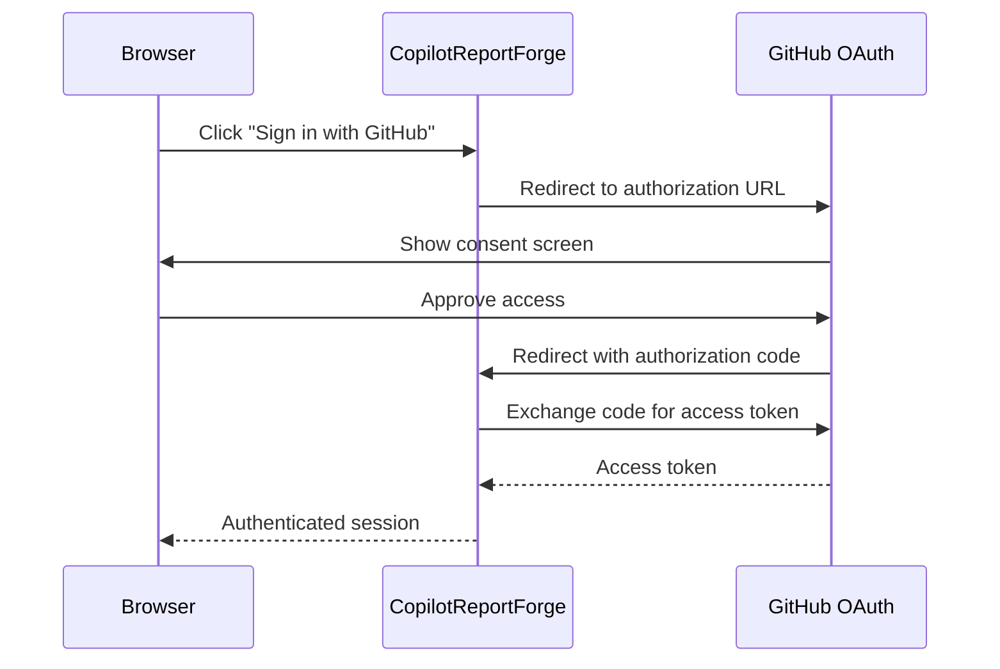

# GitHub OAuth App Setup

> **Navigation:** [CopilotReportForge](index.md) > **GitHub OAuth App Setup**
>
> **See also:** [Getting Started](getting_started.md) · [Web UI Guide](web_ui_guide.md) · [Architecture](architecture.md)

---

## Why OAuth?

The CopilotReportForge web application uses the GitHub Copilot SDK to send LLM queries on behalf of authenticated users. The Copilot SDK requires a user identity to authorize API access — this is provided through the [OAuth GitHub App flow](https://github.com/github/copilot-sdk/blob/main/docs/auth/index.md#oauth-github-app).

By authenticating via GitHub OAuth:
- **Users don't need API keys** — their GitHub identity is sufficient.
- **Access is scoped** — the OAuth app requests only the permissions it needs.
- **Sessions are time-limited** — tokens expire and must be refreshed.

---

## Authentication Flow



---

## Setup Steps

### Step 1: Create a GitHub OAuth App

1. Go to [GitHub Developer Settings → OAuth Apps](https://github.com/settings/developers)
2. Click **New OAuth App**
3. Fill in the required fields:

| Field | Value |
|---|---|
| Application name | `CopilotReportForge` (or any name) |
| Homepage URL | `http://localhost:8000` (or your production URL) |
| Authorization callback URL | `http://localhost:8000/auth/callback` |

4. Click **Register application**
5. Note the **Client ID**
6. Click **Generate a new client secret** and note the **Client Secret**

> **Security:** The client secret is shown only once. Store it securely.

### Step 2: Configure Environment Variables

Set the following environment variables before starting the server:

| Variable | Value |
|---|---|
| `GITHUB_CLIENT_ID` | Your OAuth App's Client ID |
| `GITHUB_CLIENT_SECRET` | Your OAuth App's Client Secret |
| `SESSION_SECRET` | A random secret string for cookie signing |

```bash
export GITHUB_CLIENT_ID="your-client-id"
export GITHUB_CLIENT_SECRET="your-client-secret"
export SESSION_SECRET="a-random-secret-string"
```

Alternatively, add these to your `.env` file (see `.env.template`).

### Step 3: Start the Server

```bash
cd src/python
make copilot-api
```

The server starts at `http://localhost:8000`.

### Step 4: Test the Flow

1. Open `http://localhost:8000` in your browser
2. Click **Sign in with GitHub**
3. Authorize the application on GitHub's consent screen
4. You should be redirected back to the app and see the chat interface

---

## Production Configuration

For production deployments, update the OAuth App settings in GitHub Developer Settings:

| Setting | Development | Production |
|---|---|---|
| Homepage URL | `http://localhost:8000` | `https://your-domain.com` |
| Callback URL | `http://localhost:8000/auth/callback` | `https://your-domain.com/auth/callback` |

> **Important:** The callback URL in the OAuth App settings must match the URL where the server is running.

### Deploying to Azure Container Apps

When deploying to Azure Container Apps, the callback URL must include the `/auth/callback` path. Set the **Authorization callback URL** in your GitHub OAuth App using the following format:

```
https://<app-name>.<unique-id>.<region>.azurecontainerapps.io/auth/callback
```

Example:

```
https://app-azurecontainerapps.grayocean-38a4ba3f.japaneast.azurecontainerapps.io/auth/callback
```

> **Note:** After deploying to Container Apps, append `/auth/callback` to the `app_url` output and set this as the **Authorization callback URL** in GitHub Developer Settings. If this is not configured correctly, you will encounter a `redirect_uri mismatch` error.

---

## Troubleshooting

| Issue | Cause | Resolution |
|---|---|---|
| "redirect_uri mismatch" error | Callback URL doesn't match | Ensure the callback URL in GitHub OAuth App settings matches the server's actual URL |
| "Bad credentials" error | Invalid or expired client secret | Regenerate the client secret in GitHub Developer Settings |
| Login redirects to blank page | Server not running or wrong port | Verify the server is running at the expected URL |
| "access_denied" error | User declined authorization | User must approve the OAuth consent screen |

---

## Security Considerations

- **Never commit client secrets** to version control. Use environment variables or a secrets manager.
- **Use HTTPS in production** to protect tokens in transit.
- **Rotate client secrets** periodically via GitHub Developer Settings.
- **Review OAuth scopes** — the application should request only the minimum permissions needed.
