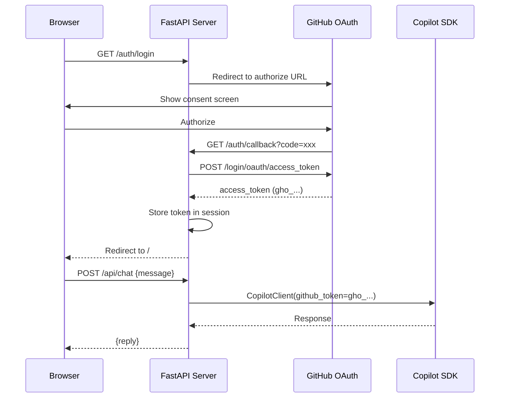

# GitHub OAuth App Setup

> **Navigation:** [README](../../README.md) > **GitHub OAuth App Setup**
>
> **See also:** [Getting Started](getting_started.md) · [Architecture](architecture.md) · [Deployment](deployment.md)

---

This guide walks you through creating a GitHub OAuth App and configuring the Copilot Chat API server to authenticate users via the [OAuth GitHub App flow](https://github.com/github/copilot-sdk/blob/main/docs/auth/index.md#oauth-github-app).

## Table of Contents

- [Overview](#overview)
- [Prerequisites](#prerequisites)
- [Step 1: Create a GitHub OAuth App](#step-1-create-a-github-oauth-app)
- [Step 2: Configure Environment Variables](#step-2-configure-environment-variables)
- [Step 3: Start the Server](#step-3-start-the-server)
- [Step 4: Test the Flow](#step-4-test-the-flow)
- [Architecture](#architecture)
- [Troubleshooting](#troubleshooting)

---

## Overview

The Copilot Chat API server uses a **GitHub OAuth App** to authenticate users. Once a user authorizes the app, the server receives a user access token (`gho_` prefix) and passes it to the Copilot SDK via `CopilotClient(github_token=...)`. This allows the server to make Copilot API requests **on behalf of each authenticated user**.



---

## Prerequisites

| Requirement | Notes |
|---|---|
| GitHub account | With an active [GitHub Copilot](https://github.com/features/copilot) subscription |
| Python >= 3.13 | |
| Copilot CLI | `curl -fsSL https://gh.io/copilot-install \| bash` |
| uv | Python package manager |

---

## Step 1: Create a GitHub OAuth App

1. Go to **[GitHub Settings → Developer settings → OAuth Apps → New OAuth App](https://github.com/settings/applications/new)**

2. Fill in the form:

   | Field | Value |
   |---|---|
   | **Application name** | `Copilot Chat (dev)` (or any name) |
   | **Homepage URL** | `http://127.0.0.1:8000` |
   | **Authorization callback URL** | `http://127.0.0.1:8000/auth/callback` |

3. Click **Register application**

4. On the next page:
   - Copy the **Client ID** (starts with `Ov23li...`)
   - Click **Generate a new client secret** and copy the secret immediately

> **Important:** The callback URL must exactly match `http://<API_HOST>:<API_PORT>/auth/callback`. If you change the host or port, update the OAuth App settings accordingly.

---

## Step 2: Configure Environment Variables

Copy the template and fill in the OAuth values:

```shell
cd src/python
cp .env.template .env
```

Edit `.env` and set the following variables:

```dotenv
# OAuth GitHub App Settings
GITHUB_CLIENT_ID=Ov23liXXXXXXXXXXXXXX
GITHUB_CLIENT_SECRET=your-client-secret-here
SESSION_SECRET=<generate-a-random-string>

# Server configuration (optional, defaults shown)
API_HOST=127.0.0.1
API_PORT=8000

# Copilot CLI server URL
COPILOT_CLI_URL=localhost:3000
```

To generate a random session secret:

```shell
python -c "import secrets; print(secrets.token_urlsafe(32))"
```

### Environment Variable Reference

| Variable | Required | Default | Description |
|---|---|---|---|
| `GITHUB_CLIENT_ID` | Yes | `""` | OAuth App Client ID |
| `GITHUB_CLIENT_SECRET` | Yes | `""` | OAuth App Client Secret |
| `SESSION_SECRET` | Yes | `"change-me-in-production"` | Secret for signing session cookies |
| `API_HOST` | No | `127.0.0.1` | Server bind address |
| `API_PORT` | No | `8000` | Server bind port |
| `COPILOT_CLI_URL` | No | `localhost:3000` | URL of the Copilot CLI server |

---

## Step 3: Start the Server

### 1. Start the Copilot CLI server

In a separate terminal:

```shell
copilot
```

This starts the Copilot CLI server on `localhost:3000` by default.

### 2. Start the API server

```shell
cd src/python

# Using the CLI script
uv run python scripts/api_server.py serve

# With auto-reload for development
uv run python scripts/api_server.py serve --reload

# With verbose logging
uv run python scripts/api_server.py serve --verbose

# Custom host/port
uv run python scripts/api_server.py serve --host 0.0.0.0 --port 9000
```

---

## Step 4: Test the Flow

1. Open `http://127.0.0.1:8000` in your browser
2. Click **"Login with GitHub"**
3. Authorize the OAuth App on GitHub's consent screen
4. You are redirected back to the chat UI
5. Type a message and receive a response from Copilot

### API Endpoints

| Method | Path | Auth | Description |
|---|---|---|---|
| `GET` | `/` | No | HTML chat frontend |
| `GET` | `/auth/login` | No | Start OAuth flow |
| `GET` | `/auth/callback` | No | OAuth callback (GitHub redirects here) |
| `GET` | `/auth/logout` | No | Clear session |
| `GET` | `/api/me` | Yes | Current user info |
| `POST` | `/api/chat` | Yes | Send message to Copilot |
| `POST` | `/api/report` | Yes | Run parallel queries and return structured report |

### Example: `/api/chat`

```shell
# After authenticating (use the session cookie from your browser)
curl -X POST http://127.0.0.1:8000/api/chat \
  -H "Content-Type: application/json" \
  -H "Cookie: session_id=<your-session-cookie>" \
  -d '{"message": "What is GitHub Copilot?"}'
```

### Example: `/api/report`

```shell
# Generate a parallel report (requires authentication)
curl -X POST http://127.0.0.1:8000/api/report \
  -H "Content-Type: application/json" \
  -H "Cookie: session_id=<your-session-cookie>" \
  -d '{
    "queries": ["Evaluate durability", "Evaluate usability"],
    "system_prompt": "You are a product evaluation specialist."
  }'
```

**Response schema (`ReportOutput`):**

```json
{
  "system_prompt": "You are a product evaluation specialist.",
  "results": [
    { "query": "Evaluate durability", "response": "...", "error": null },
    { "query": "Evaluate usability", "response": "...", "error": null }
  ],
  "total": 2,
  "succeeded": 2,
  "failed": 0
}
```

---

## Architecture

### Project Structure

```
template_github_copilot/
├── settings/
│   └── oauth.py              # OAuthSettings (pydantic-settings)
├── services/
│   └── apis/
│       ├── __init__.py        # Re-exports create_app, OAuthSettings
│       ├── app.py             # FastAPI app factory (create_app)
│       └── templates/
│           └── index.html     # Plain HTML chat + report frontend
scripts/
└── api_server.py              # Typer CLI to launch the server
```

### Authentication Flow

1. **Login** (`/auth/login`): Generates a random `state`, stores it in an in-memory session, and redirects to GitHub's OAuth authorize page with `scope=copilot`.

2. **Callback** (`/auth/callback`): Exchanges the authorization `code` for an access token via `POST https://github.com/login/oauth/access_token`. Fetches user info from `GET https://api.github.com/user`. Stores the token and user info in a signed-cookie session.

3. **Chat** (`/api/chat`): Reads the `github_token` from the session, creates a `CopilotClient` with `github_token=<token>` and `use_logged_in_user=False`, then sends the user's message to the Copilot SDK.

### Supported Token Types

Per the [Copilot SDK auth docs](https://github.com/github/copilot-sdk/blob/main/docs/auth/index.md#oauth-github-app):

| Prefix | Type | Supported |
|---|---|---|
| `gho_` | OAuth user access tokens | Yes |
| `ghu_` | GitHub App user access tokens | Yes |
| `github_pat_` | Fine-grained personal access tokens | Yes |
| `ghp_` | Classic personal access tokens | No (deprecated) |

---

## Troubleshooting

| Problem | Cause | Solution |
|---|---|---|
| "OAuth login will fail" warning on startup | `GITHUB_CLIENT_ID` or `GITHUB_CLIENT_SECRET` not set | Set them in `.env` or as environment variables |
| Redirect mismatch error from GitHub | Callback URL in OAuth App settings doesn't match | Ensure it is `http://<API_HOST>:<API_PORT>/auth/callback` |
| 502 on callback | GitHub rejected the token exchange | Verify client secret is correct and not expired |
| 401 on `/api/chat` | User not authenticated or session expired | Login again via `/auth/login` |
| 500 on `/api/chat` | Copilot CLI not running or unreachable | Start `copilot` CLI and verify `COPILOT_CLI_URL` |
| "No Copilot subscription" error | The authenticated user lacks Copilot access | Ensure the GitHub account has an active Copilot subscription |

---

## References

- [Copilot SDK — OAuth GitHub App Auth](https://github.com/github/copilot-sdk/blob/main/docs/auth/index.md#oauth-github-app)
- [GitHub Docs — Creating an OAuth App](https://docs.github.com/en/apps/oauth-apps/building-oauth-apps/creating-an-oauth-app)
- [GitHub Docs — Authorizing OAuth Apps](https://docs.github.com/en/apps/oauth-apps/building-oauth-apps/authorizing-oauth-apps)
