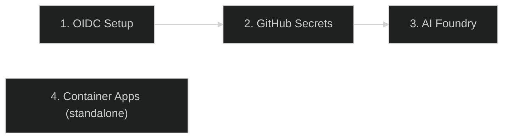

# はじめに

---

## CopilotReportForge とは?

CopilotReportForge は、複数の LLM クエリを並列実行し、結果を構造化レポートに集約し、安全なチャネルを通じてレポートを配信する AI 自動化プラットフォームです。製品開発から医療、不動産まで、あらゆるドメインで**再現可能で管理された AI 評価**を必要とするエンタープライズチーム向けに設計されています。

これが解決する課題とアーキテクチャがそのように設計されている理由の詳細については、[課題と解決策](../overview/problem_and_solution.md) を参照してください。

---

## 前提条件

| 要件 | 最小バージョン | 目的 |
|---|---|---|
| Python | 3.13+ | ランタイム |
| uv | 最新 | パッケージ管理 |
| Terraform | 1.0+ | インフラプロビジョニング |
| GitHub CLI (`gh`) | 最新 | Copilot トークンの取得 |
| Azure CLI (`az`) | 最新 | Azure 認証 |
| Docker | 最新 | コンテナ実行（オプション） |
| Make | 任意 | ビルド自動化 |

---

## クイックスタート（ローカル開発）

### 1. クローンとインストール

```bash
git clone https://github.com/ks6088ts/template-github-copilot.git
cd template-github-copilot/src/python

# 依存関係のインストール（開発ツールを含む）
make install-deps-dev
```

### 2. 環境設定

```bash
cp .env.template .env  # 設定を編集
```

### 3. GitHub Copilot で認証

```bash
# Copilot スコープ付きの GitHub PAT を設定
export COPILOT_GITHUB_TOKEN="your-github-pat"
```

### 4. Copilot CLI サーバーを起動

```bash
make copilot
```

ポート 3000 で Copilot CLI サーバーが起動します。

### 5. 最初のチャットを実行（別ターミナルで）

```bash
make copilot-app
```

Copilot SDK を介してホストされた LLM とのインタラクティブなチャットループが起動します。

### 6. レポートを生成

```bash
uv run python scripts/report_service.py generate \
  --system-prompt "You are a product evaluation specialist." \
  --queries "Evaluate durability,Evaluate usability,Evaluate aesthetics" \
  --account-url "https://<account>.blob.core.windows.net" \
  --container-name "reports"
```

プラットフォームはすべてのクエリを並列実行（カンマ区切り）し、結果を集約し、構造化 JSON レポートを Azure Blob Storage にアップロードします。

---

## インフラストラクチャセットアップ

CopilotReportForge は 3 つの Terraform シナリオを使用し、順番にデプロイします。各シナリオは前のシナリオの出力に基づいています。4 番目のスタンドアロンシナリオは、アプリケーションを Azure Container Apps にデプロイします。



### ステップ 1: OIDC フェデレーション

GitHub Actions と Azure 間のパスワードレス信頼を確立します。このステップの後、ワークフローは保存された認証情報なしで認証できます。

```bash
cd infra/scenarios/azure_github_oidc
terraform init && terraform apply
```

詳細は [Azure GitHub OIDC README](https://github.com/ks6088ts/template-github-copilot/blob/main/infra/scenarios/azure_github_oidc/README.md) を参照してください。

### ステップ 2: GitHub Secrets

OIDC 認証情報とランタイムシークレットを GitHub 環境に注入します。その環境で実行されるワークフローは自動的にアクセスできます。

```bash
cd infra/scenarios/github_secrets
terraform init && terraform apply
```

詳細は [GitHub Secrets README](https://github.com/ks6088ts/template-github-copilot/blob/main/infra/scenarios/github_secrets/README.md) を参照してください。

### ステップ 3: AI Foundry（オプション）

Azure AI Hub、モデルエンドポイント、Storage Account、オプションの AI Search をデプロイします。参照データアクセス付きのドメイン固有 AI エージェントが必要な場合にのみ必要です。

```bash
cd infra/scenarios/azure_microsoft_foundry
terraform init && terraform apply
```

詳細は [Azure Microsoft Foundry README](https://github.com/ks6088ts/template-github-copilot/blob/main/infra/scenarios/azure_microsoft_foundry/README.md) を参照してください。

### ステップ 4: Container Apps（スタンドアロン）

モノリスコンテナ（単一イメージに Copilot CLI + API サーバー）を Azure Container App としてデプロイします。`compose.docker.yaml` の `monolith` サービスをクラウドで実行するのと同等です。このステップは他の 3 つのシナリオから**独立**しています。

```bash
cd infra/scenarios/azure_container_apps
export ARM_SUBSCRIPTION_ID=$(az account show --query id --output tsv)
terraform init && terraform apply
```

詳細は [Azure Container Apps README](https://github.com/ks6088ts/template-github-copilot/blob/main/infra/scenarios/azure_container_apps/README.md) を参照してください。

---

## CLI リファレンス

すべてのツールは `src/python/` から呼び出します。

### Make ターゲット

#### プロジェクト

| コマンド | 機能 |
|---|---|
| `make copilot` | Copilot CLI サーバーを起動（ポート 3000） |
| `make copilot-app` | Copilot SDK でインタラクティブチャットループ |
| `make copilot-api` | Copilot SDK で Web API サーバーを起動 |

#### 開発

| コマンド | 機能 |
|---|---|
| `make help` | すべての利用可能な Make ターゲットと説明を表示 |
| `make info` | 現在の Git リビジョンとタグを表示 |
| `make install-deps-dev` | 開発ツールを含むすべての依存関係をインストール |
| `make install-deps` | 本番用依存関係のみインストール |
| `make format-check` | コードフォーマットチェック（ruff） |
| `make format` | コード自動フォーマット（ruff） |
| `make fix` | 自動修正を適用（フォーマット + lint 修正） |
| `make lint` | すべてのリンターを実行（ruff、ty、pyrefly、actionlint） |
| `make test` | pytest でユニットテストを実行 |
| `make ci-test` | 完全な CI パイプライン: インストール、フォーマットチェック、lint、テスト |
| `make update` | `uv.lock` のすべてのパッケージバージョンを更新 |
| `make jupyterlab` | インタラクティブ開発のために Jupyter Lab を起動 |

#### Docker

| コマンド | 機能 |
|---|---|
| `make docker-build` | すべての Docker イメージをビルド（monolith、api、copilot） |
| `make docker-run` | monolith Docker コンテナを実行 |
| `make docker-lint` | hadolint ですべての Dockerfile を lint |
| `make docker-scan` | Docker イメージの脆弱性スキャン（trivy） |
| `make ci-test-docker` | 完全な Docker CI: lint、ビルド、スキャン、実行 |

#### Docker Compose

| コマンド | 機能 |
|---|---|
| `make compose-build` | Docker Compose サービスをビルド |
| `make compose-up` | Docker Compose ですべてのサービスを起動（フォアグラウンド） |
| `make compose-up-d` | Docker Compose ですべてのサービスを起動（バックグラウンド） |
| `make compose-down` | Docker Compose サービスを停止 |
| `make compose-logs` | Docker Compose ログを表示 |

### スクリプトコマンド

| スクリプト | 機能 |
|---|---|
| `uv run python scripts/chat.py chat-loop` | ホストされた LLM とのインタラクティブチャット |
| `uv run python scripts/chat.py chat --prompt "Hello"` | ホストされた LLM との単一プロンプトチャット |
| `uv run python scripts/chat.py chat-parallel -p "Q1" -p "Q2"` | 並列セッションで複数プロンプトを送信 |
| `uv run python scripts/report_service.py generate` | 並列マルチクエリレポート生成 |
| `uv run python scripts/agents.py list` | AI Foundry エージェントの一覧表示 |
| `uv run python scripts/agents.py run` | クエリで AI Foundry エージェントを実行 |
| `uv run python scripts/api_server.py serve` | Copilot Chat API サーバーを起動（FastAPI + OAuth） |
| `uv run python scripts/blob.py list-blobs` | Azure Blob Storage の blob を一覧表示 |
| `uv run python scripts/blob.py upload-blob` | 文字列を blob として Azure Blob Storage にアップロード |
| `uv run python scripts/blob.py generate-sas-url` | blob の SAS URL を生成 |
| `uv run python scripts/byok.py chat-loop-api-key` | Bring-Your-Own-Key（API キー）でインタラクティブチャット |
| `uv run python scripts/byok.py chat-loop-entra-id` | Bring-Your-Own-Key（Entra ID）でインタラクティブチャット |
| `uv run python scripts/slacks.py send` | Webhook 経由で Slack にメッセージを送信 |

### 例: マルチペルソナ評価

```bash
export COPILOT_GITHUB_TOKEN="your-github-pat"
uv run python scripts/report_service.py generate \
  --system-prompt "You are a senior product evaluator." \
  --queries "Evaluate usability,Evaluate accessibility,Evaluate performance" \
  --account-url "https://<account>.blob.core.windows.net" \
  --container-name "reports"
```

各カンマ区切りのクエリは独立した LLM セッションで実行されます。結果はクエリごとの成功/失敗追跡付きの単一レポートに集約されます。

---

## 設定

すべての設定は環境変数を通じて行われます。プラットフォームは構造化された設定クラスを使用して起動時に設定を検証します — 必要な変数が欠落している場合、サイレント障害ではなく明確なエラーメッセージで即座に失敗します。

### 主要環境変数

| 変数 | 目的 |
|---|---|
| `PROJECT_NAME` | プロジェクト名（ログと blob パスプレフィックスに使用） |
| `PROJECT_LOG_LEVEL` | ログレベル（`INFO`、`DEBUG` など） |
| `COPILOT_GITHUB_TOKEN` | Copilot スコープ付き GitHub PAT |
| `COPILOT_MODEL` | Copilot CLI サーバーが使用するモデル（例: `gpt-5-mini`） |
| `COPILOT_CLI_URL` | Copilot CLI サーバー URL（空でサブプロセスを起動） |
| `AZURE_BLOB_STORAGE_ACCOUNT_URL` | Azure Blob Storage アカウント URL |
| `AZURE_BLOB_STORAGE_CONTAINER_NAME` | Blob コンテナ名 |
| `MICROSOFT_FOUNDRY_PROJECT_ENDPOINT` | Microsoft Foundry プロジェクトエンドポイント URL |

### OAuth 設定（Web UI）

| 変数 | 目的 |
|---|---|
| `GITHUB_CLIENT_ID` | GitHub OAuth App クライアント ID |
| `GITHUB_CLIENT_SECRET` | GitHub OAuth App クライアントシークレット |
| `SESSION_SECRET` | Cookie 署名用のランダムシークレット（`openssl rand -hex 32` で生成） |
| `API_HOST` | Web サーバーホスト（デフォルト: `127.0.0.1`） |
| `API_PORT` | Web サーバーポート（デフォルト: `8000`） |

### プロバイダー設定（BYOK）

| 変数 | 目的 |
|---|---|
| `BYOK_PROVIDER_TYPE` | プロバイダータイプ: `openai`、`azure`、`anthropic` |
| `BYOK_BASE_URL` | モデルエンドポイントのベース URL |
| `BYOK_API_KEY` | プロバイダーの API キー |
| `BYOK_MODEL` | 使用するモデル名（例: `gpt-5`） |
| `BYOK_WIRE_API` | Wire API フォーマット: `completions`（標準 Chat Completions API）または `responses`（OpenAI Responses API） |

完全なリストについては、`template_github_copilot/settings/` の設定ファイルを参照してください。

---

## Web アプリケーション

CopilotReportForge にはインタラクティブ利用のためのブラウザベース UI が含まれています。完全なウォークスルーについては、[Web UI ガイド](web_ui_guide.md) を参照してください。

ローカルで Web サーバーを起動するには:

```bash
make copilot-api
```

次にブラウザで `http://localhost:8000` を開きます。Web アプリケーションは以下を提供します:
- GitHub OAuth ログイン
- インタラクティブチャットインターフェース
- 並列レポート生成パネル
- ダーク/ライトテーマ切り替え

認証設定については、[GitHub OAuth App セットアップ](github_oauth_app.md) を参照してください。

---

## Docker での実行

コンテナ化されたデプロイメントについては、[コンテナのローカル実行](../operations/container_local_run.md) を参照してください。

Docker Compose でのクイックスタート:

```bash
cd src/python
docker compose up --build
```

---

## 次のステップ

| 目的 | ドキュメント |
|---|---|
| システム設計を理解する | [アーキテクチャ](../overview/architecture.md) |
| 本番環境にデプロイする | [デプロイ](../operations/deployment.md) |
| GitHub OAuth をセットアップする | [GitHub OAuth App](github_oauth_app.md) |
| コンテナで実行する | [コンテナのローカル実行](../operations/container_local_run.md) |
| AI の安全性に関する考慮事項を理解する | [責任ある AI](../appendix/responsible_ai.md) |
