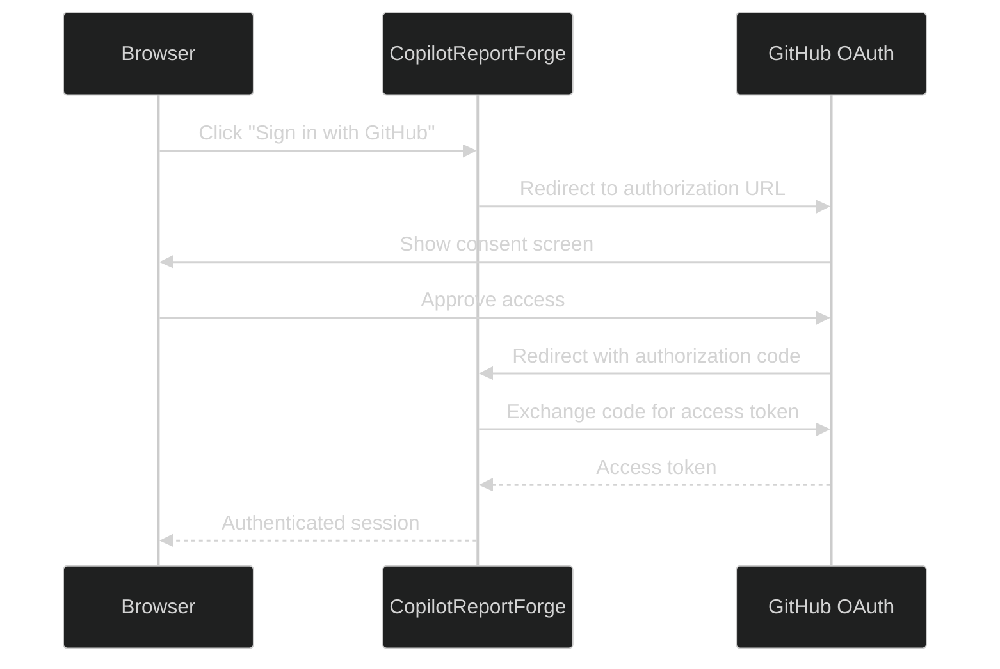

# GitHub OAuth App セットアップ

---

## なぜ OAuth か?

CopilotReportForge Web アプリケーションは、認証済みユーザーに代わって LLM クエリを送信するために GitHub Copilot SDK を使用します。Copilot SDK は API アクセスを認可するためにユーザー ID を必要とします — これは [OAuth GitHub App フロー](https://github.com/github/copilot-sdk/blob/main/docs/auth/index.md#oauth-github-app) を通じて提供されます。

GitHub OAuth による認証のメリット:
- **ユーザーは API キー不要** — GitHub ID で十分です。
- **アクセスがスコープされる** — OAuth アプリは必要な権限のみを要求します。
- **セッションが期限付き** — トークンは期限切れとなり、更新が必要です。

---

## 認証フロー



---

## セットアップ手順

### ステップ 1: GitHub OAuth App を作成

1. [GitHub Developer Settings → OAuth Apps](https://github.com/settings/developers) にアクセス
2. **New OAuth App** をクリック
3. 必要なフィールドを入力:

| フィールド | 値 |
|---|---|
| Application name | `CopilotReportForge`（または任意の名前） |
| Homepage URL | `http://localhost:8000`（または本番 URL） |
| Authorization callback URL | `http://localhost:8000/auth/callback` |

4. **Register application** をクリック
5. **Client ID** をメモ
6. **Generate a new client secret** をクリックし、**Client Secret** をメモ

> **セキュリティ:** クライアントシークレットは一度だけ表示されます。安全に保管してください。

### ステップ 2: 環境変数を設定

サーバー起動前に以下の環境変数を設定します:

| 変数 | 値 |
|---|---|
| `GITHUB_CLIENT_ID` | OAuth App のクライアント ID |
| `GITHUB_CLIENT_SECRET` | OAuth App のクライアントシークレット |
| `SESSION_SECRET` | Cookie 署名用のランダムシークレット文字列 |

安全な `SESSION_SECRET` 値を生成:

```bash
openssl rand -hex 32
```

変数を設定:
export GITHUB_CLIENT_ID="your-client-id"
export GITHUB_CLIENT_SECRET="your-client-secret"
export SESSION_SECRET="a-random-secret-string"
```

または、`.env` ファイルに追加してください（`.env.template` を参照）。

### ステップ 3: サーバーを起動

```bash
cd src/python
make copilot-api
```

サーバーが `http://localhost:8000` で起動します。

### ステップ 4: フローをテスト

1. ブラウザで `http://localhost:8000` を開く
2. **Sign in with GitHub** をクリック
3. GitHub の同意画面でアプリケーションを認可
4. アプリにリダイレクトされ、チャットインターフェースが表示されるはず

---

## 本番設定

本番デプロイメントでは、GitHub Developer Settings で OAuth App の設定を更新します:

| 設定 | 開発 | 本番 |
|---|---|---|
| Homepage URL | `http://localhost:8000` | `https://your-domain.com` |
| Callback URL | `http://localhost:8000/auth/callback` | `https://your-domain.com/auth/callback` |

> **重要:** OAuth App 設定のコールバック URL は、サーバーが実行されている URL と一致する必要があります。

<a id="deploying-to-azure-container-apps"></a>

### Azure Container Apps へのデプロイ

Azure Container Apps にデプロイする場合、コールバック URL に `/auth/callback` パスを含める必要があります。GitHub OAuth App で以下の形式で **Authorization callback URL** を設定します:

```
https://<app-name>.<unique-id>.<region>.azurecontainerapps.io/auth/callback
```

例:

```
https://app-azurecontainerapps.grayocean-38a4ba3f.japaneast.azurecontainerapps.io/auth/callback
```

> **注意:** Container Apps にデプロイした後、`app_url` 出力に `/auth/callback` を追加し、GitHub Developer Settings で **Authorization callback URL** として設定してください。正しく設定されていない場合、`redirect_uri mismatch` エラーが発生します。

---

## トラブルシューティング

| 問題 | 原因 | 解決方法 |
|---|---|---|
| "redirect_uri mismatch" エラー | コールバック URL が一致しない | GitHub OAuth App 設定のコールバック URL がサーバーの実際の URL と一致していることを確認 |
| "Bad credentials" エラー | 無効または期限切れのクライアントシークレット | GitHub Developer Settings でクライアントシークレットを再生成 |
| ログインで空白ページにリダイレクト | サーバーが動作していないか、ポートが間違っている | サーバーが期待される URL で動作していることを確認 |
| "access_denied" エラー | ユーザーが認可を拒否 | ユーザーは OAuth 同意画面を承認する必要がある |

---

## セキュリティに関する考慮事項

- **クライアントシークレットをバージョン管理にコミットしない。** 環境変数またはシークレットマネージャーを使用してください。
- **本番では HTTPS を使用して**トークンの転送を保護してください。
- GitHub Developer Settings で定期的に**クライアントシークレットをローテーション**してください。
- **OAuth スコープをレビュー** — アプリケーションは必要最小限の権限のみを要求すべきです。
