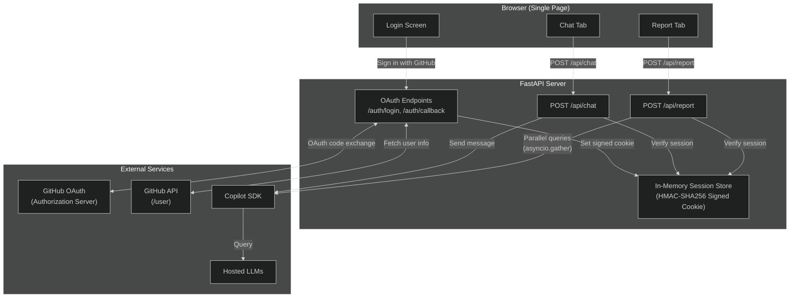
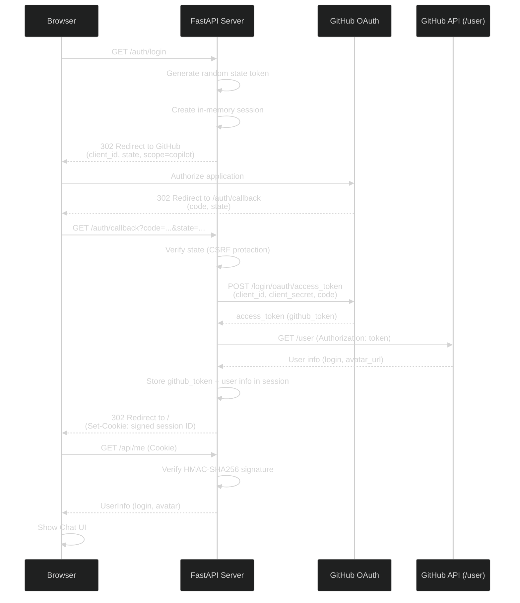
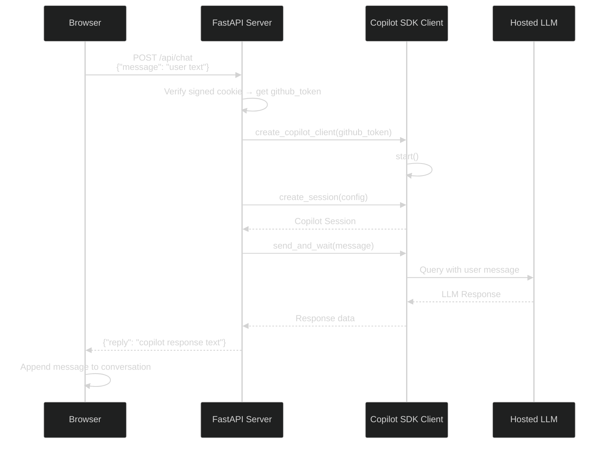
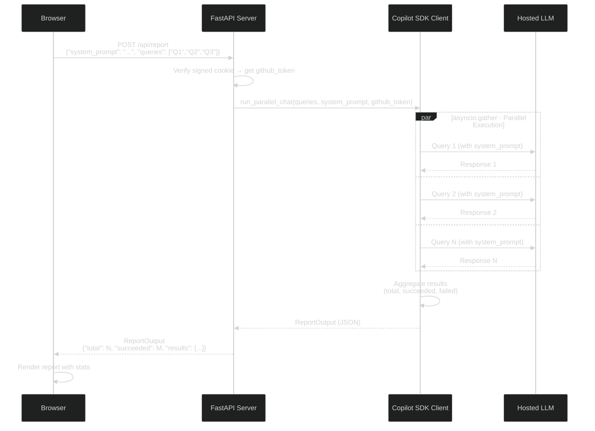

# Web UI ガイド

---

## 概要

CopilotReportForge には、インタラクティブな AI チャットと並列レポート生成のためのブラウザベースインターフェースが含まれています。Web UI は CLI や GitHub Actions ワークフローで使用されるのと同じ Copilot SDK を利用し、すべてのインターフェースで一貫した体験を提供します。

### Web UI アーキテクチャ



### 主要機能

| 機能 | 説明 |
|---|---|
| **GitHub OAuth ログイン** | GitHub ID で認証 — API キー不要 |
| **インタラクティブチャット** | ホストされた LLM とのリアルタイム会話インターフェース |
| **レポートパネル** | 並列マルチクエリ評価の設定と実行 |
| **テーマ切り替え** | ライトテーマとダークテーマの切り替え |
| **Swagger UI** | `/docs` に組み込み API ドキュメント |

---

## ログイン画面

アプリケーションを開くと、**「Sign in with GitHub」** ボタン付きのログインページが表示されます。クリックすると GitHub OAuth フローが開始されます（[GitHub OAuth App セットアップ](github_oauth_app.md) を参照）。


### GitHub OAuth 認証フロー



認証が成功すると、チャットインターフェースにリダイレクトされます。

---

## チャットインターフェース

チャットインターフェースは、ホストされた LLM との会話体験を提供します。


| 要素 | 説明 |
|---|---|
| **メッセージ入力** | プロンプトを入力して Enter を押すか 送信 をクリック |
| **会話履歴** | メッセージが時系列順に表示されます |
| **モデルインジケーター** | 使用中の LLM モデルを表示 |
| **クリアボタン** | 会話をリセット |

各メッセージは独立した Copilot SDK セッションを作成します。レスポンスはリアルタイムでストリーミングされます。

### チャット通信フロー



---

## レポートパネル

レポートパネルは、設定可能なシステムプロンプトで複数の LLM クエリの並列実行を可能にします。


### 使い方

1. **システムプロンプトを設定** — AI ペルソナを定義します（例: 「あなたはシステム設計をレビューするシニアアーキテクトです」）
2. **クエリを入力** — 1 行に 1 つ、各クエリは別々の LLM セッションで実行されます
3. **生成をクリック** — すべてのクエリが並列実行されます
4. **結果をレビュー** — 各クエリのレスポンスと成功/失敗ステータスが表示されます

### レポート出力

生成されたレポートには以下が含まれます:
- 実行されたクエリの総数
- 成功/失敗インジケーター付きのクエリごとの結果
- 集約サマリー
- JSON としてダウンロードするオプション

### レポート生成フロー



---

## テーマ切り替え

ナビゲーションバーのテーマ切り替えボタン（太陽/月アイコン）をクリックして、ライトモードとダークモードを切り替えます。設定はブラウザの localStorage に保存されます。

---

## API ドキュメント

アプリケーションには以下でアクセスできる自動生成 API ドキュメントが含まれています:

| URL | インターフェース |
|---|---|
| `/docs` | Swagger UI — インタラクティブ API エクスプローラー |
| `/redoc` | ReDoc — 代替 API ドキュメント |

### 主要 API エンドポイント

| メソッド | エンドポイント | 説明 |
|---|---|---|
| `GET` | `/` | ログインページ |
| `GET` | `/auth/login` | GitHub OAuth フローを開始 |
| `GET` | `/auth/callback` | OAuth コールバックハンドラー |
| `GET` | `/auth/logout` | セッションをクリアしてログインにリダイレクト |
| `GET` | `/api/me` | 認証済みユーザー情報を返す（login、avatar） |
| `POST` | `/api/chat` | チャットメッセージを送信 |
| `POST` | `/api/report` | 並列レポートを生成 |
| `POST` | `/api/report/generate` | レポートを生成し、Azure Blob Storage にアップロードして SAS URL を返す |
| `POST` | `/api/report/upload` | 既存のレポートを Azure Blob Storage にアップロードして SAS URL を返す |

---

## Web UI の実行

### ローカル開発

```bash
cd src/python
export GITHUB_CLIENT_ID="your-client-id"
export GITHUB_CLIENT_SECRET="your-client-secret"
export SESSION_SECRET="a-random-secret-string"
make copilot-api
```

次に `http://localhost:8000` を開きます。

### Docker

```bash
cd src/python
docker compose up --build
```

詳細なコンテナ使用法については、[コンテナのローカル実行](../operations/container_local_run.md) を参照してください。
